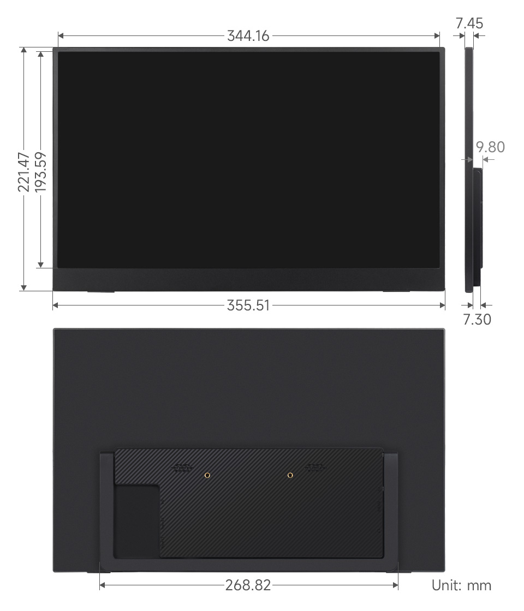

## 1. Introduction

The 15.6″ Portable Monitor features a 1920×1080 IPS panel with 100% sRGB color gamut and supports an ultra-wide 178° viewing angle. It comes with 75mm fixed M4 VESA mounting holes, saving installation space, and is compatible with most standard HDMI devices, making it suitable for various applications.

## 2. Product Specifications

| **Item**          | **Description**         | **Unit** |
| ----------------- | ----------------------- | -------- |
| Model             | 15.6″ Portable Monitor  | /        |
| Size              | 15.6                    | Inch     |
| Viewing Angle     | 178                     | Deg      |
| Resolution        | 1920×1080               | Pixels   |
| Dimensions        | 355.51 (H) × 221.47 (V) | mm       |
| Display Area      | 344.16 (H) × 193.59 (V) | mm       |
| Color Gamut       | 100%                    | sRGB     |
| Max Brightness    | 300                     | cd/m²    |
| Contrast          | 1000:1                  | /        |
| Backlight Adj.    | OSD Menu                | /        |
| Refresh Rate      | 60                      | Hz       |
| Display Ports     | mini HDMI/Type-C        | /        |
| Power input       | 5V                      | /        |
| Power Consumption | 6.3                     | Watt     |

## 3.Interface<br/>

## 4. Menu Button Description
### 4.1 Button Functions
**Menu Adjustment Button (Rotary Knob)**

> * Scroll up: Adjust volume
> * Scroll down: Adjust brightness
> * Press down: Open OSD main menu / Confirm selection
> * Scroll within menu: Navigate menu items or adjust values

**Power Button**

> * Short press (outside menu): Open input source selection panel (Auto / Type-C / HDMI)
> * Short press (inside menu): Exit menu interface
> * Long press: Turn backlight on/off

🔴 **Note: **Normally, the screen will automatically turn on when a valid signal is detected after power on, no manual button press required.

### 4.2 OSD Main Menu Overview
> * Pressing down the rotary knob enters the OSD main menu, where you can adjust the following:
> * Picture: Brightness, Contrast, Shadow Balance, Game Mode
> * Advanced: Ultra HDR Mode, Eye Protection Mode, 3D Sound, Crosshair
> * Settings: Signal Selection, Language, Aspect Ratio, Volume
> * Color Temperature: 6500K / 9300K / Custom
> * OSD Settings: Position, Transparency, Menu Timeout
> * Color Effects: Saturation, Hue, Sharpness Enhancement
> * Information Display: Current Input Source, Resolution, Horizontal Frequency, Pixel Clock
> * Reset: Restore factory defaults

## 5. Using with Raspberry Pi

### 5.1 Software Configuration
Supports Raspberry Pi OS, Ubuntu, Kali, and Retropie systems.

1. Connect the TF card to your computer.
2. Download and install the Raspberry Pi Imager from the [official Raspberry Pi website](https://www.raspberrypi.com/software/).
3. Open the imager, select the TF card to write the image to (ensure other USB devices are removed to avoid accidental data loss).
4. Preconfigure the system by pressing **CTRL+SHIFT+X** (or clicking the gear icon in the bottom right corner). Save the settings.
5. Click the "Write" button to flash the image onto the TF card.
6. After flashing, open the `/boot/firmware/` directory on the TF card, edit the `config.txt` file, and add the following lines at the end:

```bash
hdmi_group=2
hdmi_mode=82
hdmi_cvt 1920 1080 60 6 0 0 0
```

7. Insert the TF card into the Raspberry Pi.

### 5.2 Hardware Connection
1. Connect the 5V 3A power adapter to the power port of the LCD.
2. Connect the HDMI interface of the LCD to the HDMI interface of the Raspberry Pi, power on the Raspberry Pi. After waiting for a few seconds, the LCD will display normally.

## 6. Using with PC
Supports PC version of Windows 11 / 10 / 8.1 / 8 / 7 system.

1. Connect the 5V 3A power adapter to the power port of the LCD.
2. Connect the HDMI interface of the LCD to the HDMI interface of the PC. After waiting for a few seconds, the LCD will display normally.

## 7. Using with One-Cable Connection Devices

1. Connect the 5V 3A power adapter to the power port of the LCD.
2. Connect the full-function Type-C interface of the LCD to the Type-C interface of the device. Wait for a while and it will display normally.

**Note:** Your device must support full-featured Type-C wired screen mirroring for this function to work.

## 8. Dimensions<br/>

