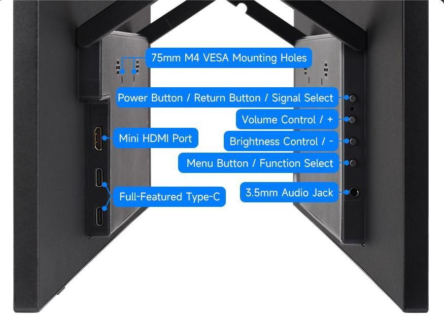

## 1. Introduction

​     The 18.5″ portable monitor features a 3840×2160 resolution IPS panel with 100% NTSC wide color gamut, supporting a 178° ultra-wide viewing angle and up to a 60Hz refresh rate. It comes with 75mm fixed M4 VESA mounting holes and a foldable stand to save installation space. Compatible with most standard HDMI devices, it suits a wide range of application needs.

## 2. Product Specifications

| **Item**       | **Description**            | **Unit** |
| -------------- | -------------------------- | -------- |
| Model          | 18.5″ 4K Portable Monitor | /        |
| Size           | 18.5                    | Inch     |
| Viewing Angle  | 178                        | Deg      |
| Resolution     | 3840×2160         | Pixels   |
| Dimensions     | 433.32 (H) × 250.88 (V) | mm       |
| Display Area   | 408.96 (H) × 230.04 (V) | mm       |
| Color Gamut    | 100%                       | NTSC  |
| Brightness     | 250                      | cd/m²    |
| Contrast Ratio | 1000:1                     | /        |
| Backlight Adj. | OSD Menu Adjustment        | /        |
| Refresh Rate   | 60                       | Hz       |
| Display Ports  | mini HDMI/Type-C           | /        |
| Power Input    | USB-C (PD 20V⎓810mA) | /        |
| Power Consumption | 16.2               | Watt     |

## 3.Interface and Button Function Descriptions<br/>

## 4. Using with Raspberry Pi

### 4.1 Software Configuration

Supports Raspberry Pi OS / Ubuntu / Kali / Retropie systems.

1. Connect the TF card to your PC.

2. Download and install Raspberry Pi Imager from the [official Raspberry Pi website](https://www.raspberrypi.com/software/).

3. Open the imager, select the TF card to write the image to (ensure other USB devices are removed to avoid accidental data loss).

4. Configure the system in advance by pressing CTRL+SHIFT+X (or clicking the gear icon in the lower-right corner), then save your settings.

5. Click the "Write" button to flash the image onto the TF card.

6. After flashing, open the `/boot/firmware/` directory on the TF card, edit the `config.txt` file, and add the following lines at the end:

   ```bash
   hdmi_enable_4kp60=1
   hdmi_force_hotplug=1
   hdmi_group=2
   hdmi_mode=87
   hdmi_timings=3840 0 48 32 80 2160 0 3 5 54 0 0 0 60 0 300000000 3
   hdmi_drive=2
   config_hdmi_boost=10
   ```

   **Note:** The actual output resolution depends on the performance of the main controller. On devices such as Raspberry Pi 3 and Zero, the default maximum resolution is 1080P@60Hz.

7. Insert the TF card into the Raspberry Pi.

### 4.2 Hardware Connection

1. Connect the 20W power adapter to the LCD’s power port.
2. Connect the LCD's HDMI port to the Raspberry Pi's HDMI port. Power on the Raspberry Pi. After a few seconds, the display should work normally.

## 5. Using with a PC
Supports Windows 11 / 10 / 8.1 / 8 / 7 operating systems.

1. Connect the 20W power adapter to the LCD’s power port.

2. Connect the HDMI interface of the LCD to the HDMI interface of the Raspberry Pi, power on the Raspberry Pi. After waiting for a few seconds, the LCD will display normally.

## 6. Using with One-Cable Connection Devices

1. Connect the 20W power adapter to the LCD’s power port.

2. Connect the full-function Type-C interface of the LCD to the Type-C interface of the device. Wait for a while and it will display normally.

**Note: Your device must support full-featured Type-C wired screen mirroring for this function to work.**

## 7. Dimensions<br/>

