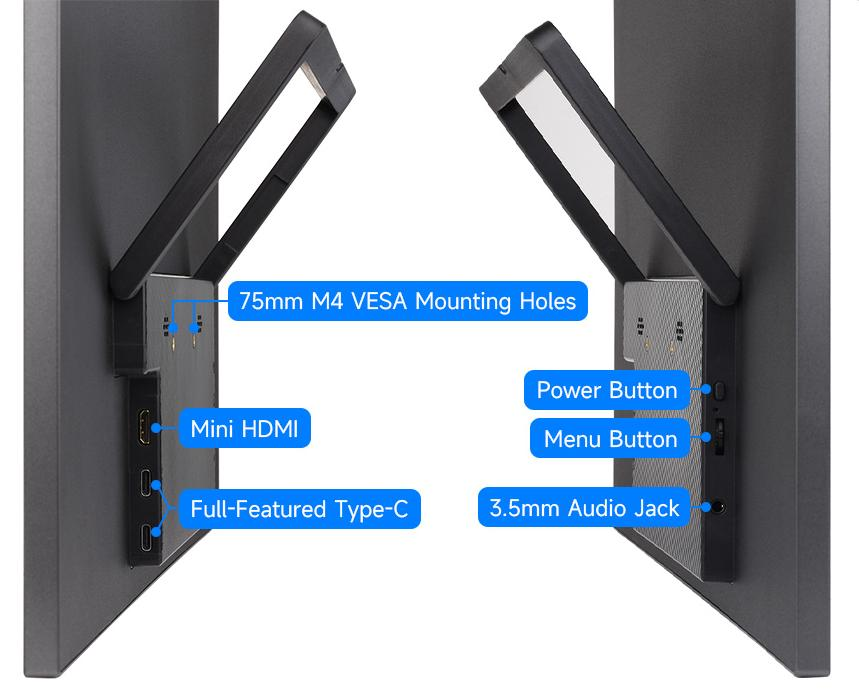
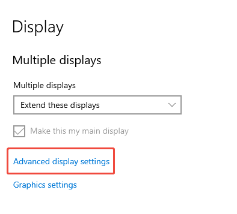
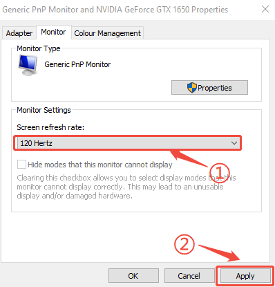

## 1. Introduction

The 21.5″ portable monitor features a 1920×1080 resolution IPS panel supporting a 178° ultra-wide viewing angle and up to a 120Hz refresh rate. It comes with 75mm fixed M4 VESA mounting holes and a foldable stand to save installation space. Compatible with most standard HDMI devices, it suits a wide range of application needs.

## 2. Product Specifications

| **Item**       | **Description**            | **Unit** |
| -------------- | -------------------------- | -------- |
| Model          | 21.5″ Portable Monitor   | /        |
| Size           | 21.5                       | Inch     |
| Viewing Angle  | 178                        | Deg      |
| Resolution     | 1920x1080          | Pixels   |
| Dimensions     | 494.90 (H) × 286.65 (V) | mm       |
| Display Area   | 476.064 (H) × 267.786 (V) | mm       |
| Color Gamut    | 56%                      | NTSC  |
| Brightness     | 380                        | cd/m²    |
| Contrast Ratio | 1300:1                     | /        |
| Backlight Adj. | OSD Menu Adjustment        | /        |
| Refresh Rate   | 120                       | Hz       |
| Display Ports  | mini HDMI/Type-C           | /        |
| Power Input    | USB-C (PD 20V⎓680mA) | /        |
| Power Consumption | 13.6               | Watt     |

## 3. Interface <br/>
## 4. Menu Button Description
### 4.1 Button Functions
**Menu Adjustment Button (Rotary Knob)**

> * Scroll up: Adjust volume
> * Scroll down: Adjust brightness
> * Press down: Open OSD main menu / Confirm selection
> * Scroll within menu: Navigate menu items or adjust values

**Power Button**

> * Short press (outside menu): Open input source selection panel (Auto / Type-C / HDMI)
> * Short press (inside menu): Exit menu interface
> * Long press: Turn backlight on/off

🔴 **Note: **Normally, the screen will automatically turn on when a valid signal is detected after power on, no manual button press required.

### 4.2 OSD Main Menu Overview
> * Pressing down the rotary knob enters the OSD main menu, where you can adjust the following:
> * Picture: Brightness, Contrast, Shadow Balance, Game Mode
> * Advanced: Ultra HDR Mode, Eye Protection Mode, 3D Sound, Crosshair
> * Settings: Signal Selection, Language, Aspect Ratio, Volume
> * Color Temperature: 6500K / 9300K / Custom
> * OSD Settings: Position, Transparency, Menu Timeout
> * Color Effects: Saturation, Hue, Sharpness Enhancement
> * Information Display: Current Input Source, Resolution, Horizontal Frequency, Pixel Clock
> * Reset: Restore factory defaults

## 5. Using with Raspberry Pi

### 5.1 Software Configuration

Supports Raspberry Pi OS / Ubuntu / Kali / Retropie systems.

1. Connect the TF card to your PC.

2. Download and install Raspberry Pi Imager from the [official Raspberry Pi website](https://www.raspberrypi.com/software/).

3. Open the imager, select the TF card to write the image to (ensure other USB devices are removed to avoid accidental data loss).

4. Configure the system in advance by pressing CTRL+SHIFT+X (or clicking the gear icon in the lower-right corner), then save your settings.

5. Click the "Write" button to flash the image onto the TF card.

6. After flashing, open the `/boot/firmware/` directory on the TF card, edit the `config.txt` file, and add the following lines at the end:

   ```bash
   hdmi_force_hotplug=1
   hdmi_group=2
   hdmi_mode=87
   hdmi_timings=1920 0 88 44 148 1080 0 4 5 36 0 0 0 120 0 297000000 3
   hdmi_drive=2
   ```
   

**Note:** The actual output resolution depends on the performance of the main controller. On devices such as Raspberry Pi 3 and Zero, the default maximum resolution is 1080P@60Hz.

7. Insert the TF card into the Raspberry Pi.

### 5.2 Hardware Connection

1. Connect the 35W power adapter to the LCD’s power port.
2. Connect the LCD's HDMI port to the Raspberry Pi's HDMI port. Power on the Raspberry Pi. After a few seconds, the display should work normally.

## 6. Using with a PC
Supports Windows 11 / 10 / 8.1 / 8 / 7 operating systems.

1. Connect the 35W power adapter to the LCD’s power port.

2. Connect the HDMI interface of the LCD to the HDMI interface of the Raspberry Pi, power on the Raspberry Pi. After waiting for a few seconds, the LCD will display normally.

## 7.  Using with One-Cable Connection Devices

1. Connect the 35W power adapter to the LCD’s power port.

2. Connect the full-function Type-C interface of the LCD to the Type-C interface of the device. Wait for a while and it will display normally.

**Note: Your device must support full-featured Type-C wired screen mirroring for this function to work.**

## 8.  Dimensions<br/>

## FAQ
**Q: How to enable 120Hz refresh rate in Windows?<br/>**
💡: Generally, Windows will automatically detect and set the optimal resolution and refresh rate for your monitor. If it does not automatically set to 120Hz, please follow the steps below to adjust manually:

**Adjust Windows Display Settings:**

- Go to Windows Display Settings, then select Advanced display settings.<br/>
- In the Choose display dropdown menu, select the 18.5" Portable Monitor, then click Display adapter properties.<br/>
- In the pop-up window, switch to the Monitor tab, select 120Hz from the Screen refresh rate dropdown menu. Click Apply and confirm the change.<br/>

Note: If the 120Hz option does not appear in advanced display settings, please check the following:
> **Ensure your device supports 120Hz refresh rate:**
>    - Your graphics card must support 120Hz output; verify your device configuration meets the requirements. If the issue persists, try updating the graphics driver.
>
> **Confirm the cables and interface version support 120Hz:**
>
>    - Use cables that support high refresh rates (e.g., HDMI 1.4 or above, or Type-C with DisplayPort support)
>
> **Provide stable power supply to the monitor:**
>
>    - To ensure proper operation at 120Hz, use the provided 20W external power adapter.

