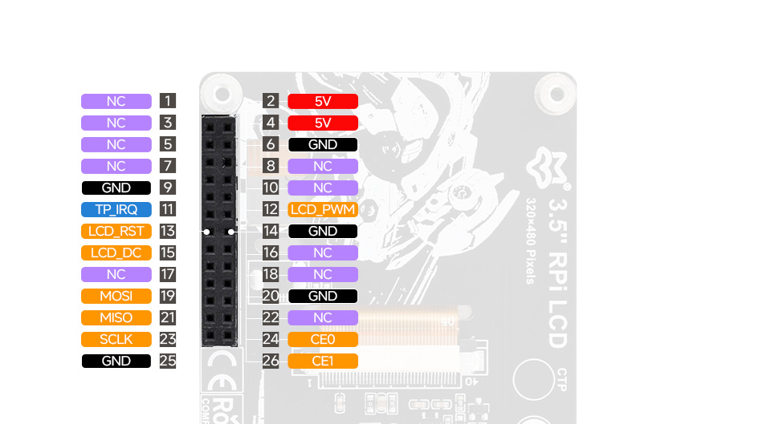
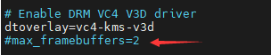
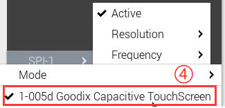

## 1. Introduction

The 3.5″ RPi LCD RTP is a resistive touch display that supports the SPI interface. It features the ST7796S display driver and XPT2046 touch controller, offering a resolution of 320×480 and 262K colors. The screen delivers clear visuals and responsive touch performance.

## 2. Product Specifications

### 📋 Specification Table

| **Item**     | **Description**                        |
| ------------ | --------------------------------- |
| **Model** | 3.5″ RPi LCD RTP                  |
| **Cover Size** | 54.86 × 83.79 (mm)           |
| **Display Area** | 49.56 × 74.04 (mm)         |
| **Resolution**   | 320 (H) x 480 (V)                 |
| **Panel Type** | IPS                               |
| **Touch Type** | Resistive                             |
| **Viewing Angle** | 170°                              |
| **Color Gamut**     | 65% NTSC                          |
| **Brightness** | 150cd/m²                          |
| **Contrast Ratio**   | 1000:1                            |
| **Backlight Control** | PWM dimming                          |
| **Refresh Rate**   | 60Hz                              |
| **Power Consumption**     | 0.5W                          |
| **Power Supply Voltage** | 5V                                |
| **Logic Voltage** | 3.3V                              |
| **Interfaces** | Display：SPI       |
| **Controller ICs** | Display：ST7796S <br/>Touch：XPT2046 |

## 3.  Pin Definition <br/>

| **Pin No.**       | **Label** | **Description**                |
| --------------------------------- | --------- | -------------------- |
| 1, 3, 5, 7, 8, 10, 16, 17, 18, 22 | NC        | No Connection |
| 2, 4              | 5V        | Power Supply Positive (5V) |
| 6, 9, 14, 20, 25  | GND       | Ground   |
| 11                | TP_IRQ   | Touch Interrupt Pin       |
| 12                | LCD_PWM  | Backlight PWM Control Pin |
| 13                | LCD_RST  | Display Chip Reset Pin (Active Low)|
| 15                | LCD_DC   | Data/Command Control Pin (High = Data, Low = Command) |
| 19                | MOSI      | SPI Master Out / Slave In         |
| 21                | MISO      | SPI Master In / Slave Out  |
| 23                | SCLK      | SPI Clock Pin   |
| 24                | CE0       | LCD Chip Select (Active Low)|
| 26                | CE1       | Touch Chip Select Pin|

## 4. Product Dimensions<br/>
## 5. Hardware Connection
1.  Align and connect the module's 26-pin female header to the Raspberry Pi's 40-pin GPIO header.
2.  It is recommended to use copper standoffs for secure mounting to prevent looseness.<br/>

## 6.  Software Setup
### 6.1. Enable SPI  Interfaces
Open the terminal and execute the following commands to enable the required interfaces:
```
sudo raspi-config nonint do_spi 0
```
### 6.2   Install Dependencies
```
sudo apt-get update
sudo apt-get install python3-pip
sudo apt-get install python3-pil
sudo apt-get install python3-numpy
sudo apt-get install python3-spidev
sudo apt install python3-smbus2
```
### 6.3 Example Program
```
wget https://files.luckfox.com/wiki/Luckfox/Display/3inch5-RPi-LCD-RTP/3inch5_RPi_LCD_RTP_RPI_Demo.zip
unzip 3inch5_RPi_LCD_RTP_RPI_Demo.zip
cd 3inch5_RPi_LCD_RTP_RPI_Demo
sudo python ./main.py
```
## 7. Desktop Display Configuration for Bookworm System
### Method 1: Configure Device Tree Driver (Recommended)
```
wget https://files.luckfox.com/wiki/Luckfox/Display/3inch5-RPi-LCD-CTP/St7796s.zip
unzip St7796s.zip
sudo cp st7796s.bin /lib/firmware/
```
Edit config.txt:
```
sudo nano /boot/firmware/config.txt
```
Add the following lines at the end of the**[all]** section: 
```
dtparam=spi=on
dtoverlay=mipi-dbi-spi,speed=48000000
dtparam=compatible=st7796s\0panel-mipi-dbi-spi
dtparam=width=320,height=480,width-mm=49,height-mm=79
dtparam=reset-gpio=27,dc-gpio=22,backlight-gpio=18
dtoverlay=goodix,addr=0x5d
```
To apply changes, reboot:
```
sudo reboot
```
### Method 2: Install Kernel Module and DTBO Driver
>📌 Note: Bookworm system requires the official kernel version 6.6.51 or higher.

#### Install Driver Module
1. Check the current kernel version:
```
uname -a
```
Sample Output（Raspberry Pi 5）：

```
Linux raspberrypi 6.12.25+rpt-rpi-2712 #1 SMP PREEMPT Debian 1:6.12.25-1+rpt1 (2025-04-30) aarch64
```
Explanation:
* Kernel Version: **6.12.25+rpt-rpi-2712**

* Architecture: **64bit ARM（AArch64）**
2. Download and install the st7796 driver module:
```
# Download and unzip driver files
wget https://files.luckfox.com/wiki/Luckfox/Display/3inch5-RPi-LCD-CTP/Luckfox-st7796s.zip
unzip Luckfox-st7796s.zip
cd Luckfox-st7796s

# Enter the folder for the corresponding kernel version (as in the example)
cd 6.12.25/64/rpi-2712-RPi5

# Copy the kernel module
sudo cp st7796s.ko /lib/modules/$(uname -r)/kernel/drivers

# Add the module to auto-load on boot
sudo nano /etc/modules
# Add the following line at the end of the file:
st7796s
```
As shown below:<br/><br/>
Resolve kernel module dependencies:
```
sudo depmod -a
```
3. Configure the device tree overlay:
```
cd
wget https://files.luckfox.com/wiki/Luckfox/Display/3inch5-RPi-LCD-RTP/Luckfox35RTP.dtbo
sudo cp Luckfox35RTP.dtbo /boot/overlays/
```
#### For RPi4 & RPi5
1. Follow the steps above to install the driver module
2. Edit the config.txt file:
```
sudo nano /boot/firmware/config.txt
```
Comment out dual-screen related configurations.<br/>)<br/>

Add the following lines at the end of the **[all]** section:
```
dtparam=i2c_arm=on
dtparam=i2c_arm_baudrate=50000
dtparam=spi=on
dtoverlay=Luckfox35RTP,fps=60,speed=48000000,rotate=90,penirq=17
hdmi_force_hotplug=1
max_usb_current=1
hdmi_group=2
hdmi_mode=87
hdmi_cvt 480 320 60 6 0 0 0
hdmi_drive=2
```
3. Create X11 Configuration File
```
sudo nano /etc/X11/xorg.conf.d/98-spi-screen.conf
```

Add the following content:
```
Section "Device"
    Identifier "SPI Screen"
    Driver "fbdev"
    Option "fbdev" "/dev/fb0"
EndSection
```
> 🔧 After completing the entire process, if there is no display, try changing /dev/fb0 to /dev/fb1 and rebooting.)<br/>

4. Switch to the X11 Display System
```
sudo raspi-config nonint do_wayland W1
sudo reboot
```

#### For All Raspberry Pi Versions (Requires Bookworm Lite)
>⚠️ Only applicable to the following versions:<br/>
>[64bitLite](https://downloads.raspberrypi.com/raspios_lite_arm64/images/raspios_lite_arm64-2024-11-19/2024-11-19-raspios-bookworm-arm64-lite.img.xz)<br/>
>[32bit Lite](https://downloads.raspberrypi.com/raspios_lite_armhf/images/raspios_lite_armhf-2024-11-19/2024-11-19-raspios-bookworm-armhf-lite.img.xz)<br/>
1. Edit the config.txt File

```
sudo nano /boot/firmware/config.txt
```
Comment out KMS and dual-display settings.<br/><br/>
At the end of the  **[all]** section, add the following lines:

```
dtparam=i2c_arm=on
dtparam=i2c_arm_baudrate=50000
dtparam=spi=on
dtoverlay=Luckfox35RTP,fps=60,speed=48000000,rotate=90,ts_rotate_90
hdmi_force_hotplug=1
max_usb_current=1
hdmi_group=2
hdmi_mode=87
hdmi_cvt 480 320 60 6 0 0 0
hdmi_drive=2
```
2. Install Required Software
```
# X11 Services
sudo apt-get install --no-install-recommends xserver-xorg -y
sudo apt-get install --no-install-recommends xinit -y

# Desktop Manager and GUI
sudo apt install lightdm -y
sudo apt install raspberrypi-ui-mods -y

# Git and Browser (Optional)
sudo apt install git -y
sudo apt install chromium-browser -y

# VLC Media Player (Optional)
sudo apt install vlc -y
```
3. Download and Run the Driver
```
sudo apt install libraspberrypi-dev -y
sudo apt-get install unzip -y
sudo apt-get install cmake -y

# Download and build fbcp
wget https://files.luckfox.com/wiki/Luckfox/Display/3inch5-RPi-LCD-CTP/Rpi-fbcp.zip
unzip ./Rpi-fbcp.zip
cd rpi-fbcp/
sudo rm -rf build
sudo mkdir -m 777 ./build
cd ./build
sudo cmake ..
sudo make -j4
sudo install fbcp /usr/local/bin/fbcp
```
4. Configure Auto-Start for startx and fbcp
* Edit the Bash Shell file:
```
sudo nano ~/.bashrc
```
Add the following to the end of the file:
```
if [ "$(cat /proc/device-tree/model | cut -d ' ' -f 3)" = "5" ]; then
    # Configuration for RPi 5B
    export FRAMEBUFFER=/dev/fb1
    startx  2> /tmp/xorg_errors
else
    # Configuration for non-RPi 5
    export FRAMEBUFFER=/dev/fb0
    startx  2> /tmp/xorg_errors
fi
```
* Create fbcp systemd Service
```
sudo nano /etc/systemd/system/fbcp.service
```
Add the following content:
```
[Unit]
Description=Framebuffer Copy for Raspberry Pi
After=network.target

[Service]
ExecStartPre=/bin/sleep 20
ExecStart=/usr/local/bin/fbcp
Restart=always
User=root
Group=root

[Install]
WantedBy=multi-user.target
```
Then execute the following commands:
```
sudo systemctl daemon-reload
sudo systemctl enable fbcp.service
sudo systemctl start fbcp.service
```
5. Enable CLI Auto-login
```
sudo raspi-config nonint do_boot_behaviour B2
sudo raspi-config nonint do_wayland W1
sudo reboot
```
> **Notes**<br/>
> ⚠️ The username must be **pi**, otherwise auto-login will not work properly.<br/>
> 🚀 Each reboot will result in a longer startup time, and SSH availability will be delayed accordingly.

## 8. Screen Rotation Settings
### GUI Rotation

1. Open the **Screen Configuration** application  <br/>

2. Check  "Touchscreen"  <br/><br/>

3. Go to Orientation and select the desired rotation angle.<br/>

### Command Line Rotation
>💡  It is recommended to use this command in the Wayland environment. Applicable to Raspberry Pi OS Bookworm and above.
1. Install the 'wlr-randr'' tool:
```
sudo apt install wlr-randr
```
2. View available output names:
```
wlr-randr
```
Sample output (e.g., SPI-1):<br/><br/>
3. Execute the rotation command:
```
wlr-randr --output SPI-1 --transform 90
```
> 📝  Supported rotation parameters:<br/>
> normal<br/>
> 90<br/>
> 180<br/>
> 270<br/>

## 9. Adjust the backlight
### PWM dimming
- Install WiringPi
```
cd ~
git clone https://github.com/WiringPi/WiringPi.git
cd WiringPi
./build
gpio -v
```
A successful installation will output the gpio version as shown below:<br/>)<br/>
- Manually adjust the display PWM backlight
```
gpio -g mode 18 pwm # Occupied pins are PWM pins
gpio pwmc 100 # Set PWM clock divider
gpio -g pwm 18 0 # Darkest
gpio -g pwm 18 1023 # Brightest
gpio -g mode 18 out # Release as output
```
### pinctrl dimming
- Set bright screen
```
sudo pinctrl set 18 op dh
```
- Set the screen off
```
sudo pinctrl set 18 op dl
```
## 10. Resources
### Schematics
* [Schematics](/PDF/3inch5-RPi-LCD-RTP/3.5inch-RPi-LCD-luckfox.pdf)
### Demo Program
* [Demo Program](https://files.luckfox.com/wiki/Luckfox/Display/3inch5-RPi-LCD-RTP/3inch5_RPi_LCD_RTP_RPI_Demo.zip)
### Datasheets
* [ST7796S Datasheet](/PDF/3inch5-RPi-LCD-RTP/ST7796S_Datasheet.pdf)
* [XPT2046 Datasheet](/PDF/3inch5-RPi-LCD-RTP/XPT2046_Datasheet.pdf)
### Drawings
* [3D Drawing-STP](https://files.luckfox.com/wiki/Luckfox/Display/3inch5-RPi-LCD-RTP/3.5inch-RPI-LCD_RTP-20250523.stp)
* [2D Drawing-DXF](https://files.luckfox.com/wiki/Luckfox/Display/3inch5-RPi-LCD-RTP/3.5inch-RPI-LCD_RTP-20250523.dxf)
* [2D Drawing-PDF](/PDF/3inch5-RPi-LCD-RTP/3.5inch-RPI-LCD_RTP-20250523.pdf)