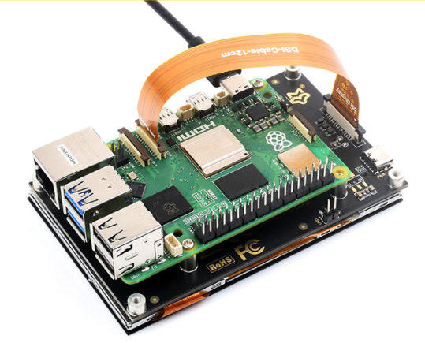

## 1. Introduce

4.3" DSI Touchscreen is a capacitive touch screen with a resolution of 800x480 and a wide 160° viewing angle. It supports multiple operating systems without the need for driver installation, meeting various application requirements.

## 2. Product parameters

| **Project**        | **Describe**          | **Unit** |
| ------------------ | --------------------- | -------- |
| Model              | 4.3'' DSI Touchscreen | /        |
| Size               | 4.3                   | Inch     |
| Viewing Angle      | 160                  | Deg      |
| Resolution         | 800x480               | Pixels   |
| Product Size       | 106.10(H)×67.80(V)   | mm       |
| Display Area       | 95.54(H)×54.36(V)     | mm       |
| Color Gamut        | 52% | NTSC     |
| Maximum Brightness | 350                   | cd/m²    |
| Constrast          | 1200:1                | /        |
| Backlight Control  | Software Dimming      | /        |
| Refresh Rate       | 60                    | Hz       |
| Power              | 1.2                  | Watt     |

## 3. Use with Raspberry Pi

### 3.1 Hardware Connection

1. Use an FFC cable to connect the 4.3-inch DSI LCD to the 15-pin DSI interface on the Raspberry Pi board.<br/>
2. For convenience, you can secure the Raspberry Pi board to the back of the 4.3inch DSI LCD using screws and assemble the standoffs, as shown in the image below:<br/>

### 3.2 Software Setting

Support Raspberry Pi OS/Ubuntu/Kali and Retropie systems.

1. Connect TF card to PC

2. Please click [Raspberry Pi official website](https://www.raspberrypi.com/software) to download the newest image. 

3. Open the Raspberry Pi Imager, select the TF card where the image will be written (Note: It is best to remove other USB devices to prevent accidental erasure of their files).

4. Pre-configure the system, hold down CTRL+SHIFT+X (or click the small gear icon in the bottom right corner), then click save after settings are completed

5. Click the burn button to write data to the TF card.

6. After burning is complete, open the 'config.txt' file under the '/boot/firmware/' directory, add the following statement to the end of the 'config.txt' file, then save and exit.

   **Note: Due to the Pi5/CM4/CM3+/CM3 having two MIPI DSI interfaces, please ensure to use the correct DSI interface and command. DSI1 is recommended by default.**

   ```bash
   dtoverlay=vc4-kms-v3d
   #DSI1 Use
   dtoverlay=vc4-kms-dsi-7inch
   #DSI0 Use (Only Pi5/CM4)
   #dtoverlay=vc4-kms-dsi-7inch,dsi0
   ```

7. Insert the TF card into the Raspberry Pi, power it on, and after waiting for a few seconds, the screen should display normally.

### 3.3 Backlight Control

You can input the following commands to control the backlight brightness:

```
echo X | sudo tee /sys/class/backlight/*/brightness
```

Where X indicates any number from 0 to 255. 0 means the backlight is the darkest, and 255 means the backlight is the brightest. <br/>

For example:

```
echo 100 | sudo tee /sys/class/backlight/*/brightness
echo 0 | sudo tee /sys/class/backlight/*/brightness
echo 255 | sudo tee /sys/class/backlight/*/brightness
```

### 3.4 Touchscreen Rotation

#### Bookworm system

##### GUI interface rotation

1. Open "Screen Configuration" application:<br/>

2. Go to "Screen"->"DSI-1"->"Touchscreen", check "6-0038 generic ft5x06(79)"<br/>

3. Click “Apply” and close the current window. Reboot according to the pop-up prompts, then the touchscreen selection is complete.<br/><br/>

4. Go to "Screen" -> "DSI-1" -> "Orientation," check the direction you want to rotate, and finally click "Apply" to complete the synchronized rotation of the display and touch.<br/>


##### Lite version rotation

1. Open cmdline.txt file

   ```
   sudo nano /boot/firmware/cmdline.txt
   ```

2. To add the display rotation command at the beginning of the `cmdline.txt` file on a Raspberry Pi, simply add `display_rotate=<angle>`.（ Note that the command needs to be placed on the same line, with each command separated by a space.）

   ```
   video=DSI-1:800x480M@60,rotate=90
   ```

 Modify the transform value (which can be changed to normal, 90, 180, or 270) to change the rotation angle. 

3. Save and Reboot

   ```
   sudo reboot
   ```

### Bullseye/Buster system

##### GUI interface rotation

1. Open "Screen Configuration" application:<br/>

2. Go to "Screen"->"DSI-1"->"Orientation", select the rotation direction, and then click on "Apply".<br/><br/>

##### Lite version rotation

1. Open cmdline.txt file

   ```
   sudo nano /boot/cmdline.txt
   ```

2. At the beginning of the cmdline.txt file, add the command corresponding to the angle of “display rotation”（ Note that the command needs to be placed on the same line, with each command separated by a space.）

   ```
   video=DSI-1:800x480M@60,rotate=90
   ```

   Change the angle of Display Rotation by changing the transform values to 90, 180, or 270.

3. Save and reboot

   ```
   sudo reboot
   ```

#### Stretch/Jessie system

**For some older systems, which do not use the vc4-kms-v3d or vc4-fkms-v3d driver modes, the display rotation method is as follows:**

1. Add statements to the config.txt file (the config file is located in the root directory of the TF card, i.e. /boot)：

```
display_rotate=1 #1：90；2: 180； 3: 270
```

2. Save and reboot 

```
sudo reboot
```

### 3.5 Touch Rotation

#### **Bookworm touch rotation**

If you use the graphical interface for rotation, you can check "Touchscreen" in the Screen Layout Editor window to synchronize the touch rotation. Refer to the earlier methods for display rotation. For the command-line rotation method, refer to the following text:

1. Create a new file named `99-waveshare-touch.rules`

   ```
   sudo nano /etc/udev/rules.d/99-waveshare-touch.rules
   ```

4. Edit the file:

   ```
   #90°：
   ENV{ID_INPUT_TOUCHSCREEN}=="1", ENV{LIBINPUT_CALIBRATION_MATRIX}="0 -1 1 1 0 0"
   
   #180°：
   #ENV{ID_INPUT_TOUCHSCREEN}=="1", ENV{LIBINPUT_CALIBRATION_MATRIX}="-1 0 1 0 -1 1"
   
   #270°：
   #ENV{ID_INPUT_TOUCHSCREEN}=="1", ENV{LIBINPUT_CALIBRATION_MATRIX}="0 1 0 -1 0 1"
   ```
   
5. Save and reboot

   ```
   sudo reboot
   ```

#### Bullseye/Buster touch rotation

 After display rotation in Bullseye/Buster and some other systems, the touch direction may not be consistent. You need to follow the steps below to rotate the touch accordingly:

   1. Install libinput
   
      ```
      sudo apt-get install xserver-xorg-input-libinput
      ```
   
      If you are using an Ubuntu system or Jetson Nano, the installation command is:
   
      ```
      sudo apt install xserver-xorg-input-synaptics
      ```
   
   2. Create the `xorg.conf.d` directory under `/etc/X11/` (if the directory already exists, proceed directly to step 3).
   
      ```
      sudo mkdir /etc/X11/xorg.conf.d
      ```
   
   3. Copy the `40-libinput.conf` file to the directory you just created.
   
      ```
      sudo cp /usr/share/X11/xorg.conf.d/40-libinput.conf /etc/X11/xorg.conf.d/
      ```
   
   4. Edit this file
   
      ```
      sudo nano /etc/X11/xorg.conf.d/40-libinput.conf
      #Locate the touchscreen section, add the corresponding rotation angle command inside, and then save it.
      #90°Right touch rotation：
      Option "CalibrationMatrix" "0 1 0 -1 0 1 0 0 1"
      #180° Inverted touch rotation： 
      #Option "CalibrationMatrix" "-1 0 1 0 -1 1 0 0 1"
      #270° Left touch rotation： 
      #Option "CalibrationMatrix" "0 -1 1 1 0 0 0 0 1"
      ```
      In a location similar to the one shown in the image:<br/>

5. Save and reboot
   ```
     sudo reboot
   ```
After completing the above steps, touch to rotate.
## Resource
### Drawing
- [4.3' DSI Touchscreen Drawing](https://files.luckfox.com/wiki/Display/draw/4.3inch%20DSI%20Touchscreen.rar)

## FAQ

**Q: Does this screen turn off automatically, or do I need to execute a command to do so?**

```
A: It depends on the system. If the system has hibernation, the screen will be black. If it is the latest official system Bookworm for Raspberry Pi, it does not have hibernation by default. 
```

