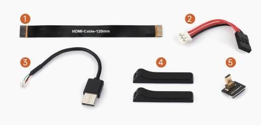
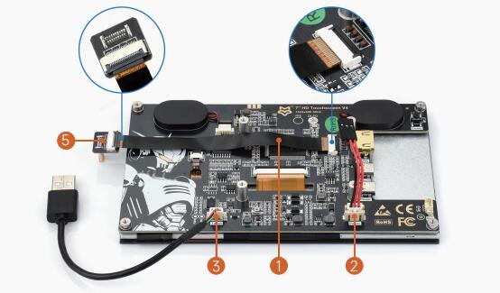
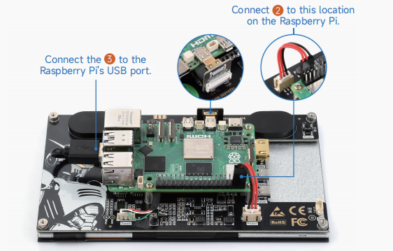
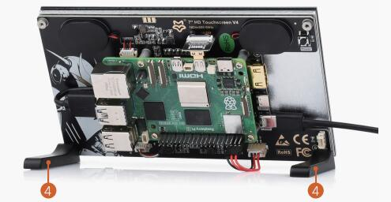

## 1. Introduction

7'' HD Touchscreen V4 is a display with a native resolution of 1024×600 (software configurable up to 1920×1080), featuring 5-point capacitive touch and a tempered glass panel. It supports multiple operating systems, comes with dual 2W speakers, and offers a multilingual OSD menu, making it compatible with Raspberry Pi as well as various standard HDMI devices.

## 2. Product Specifications

| **Item**             | **Description**         | **Unit** |
| -------------------- | ----------------------- | -------- |
| Model                | 7'' HD Touchscreen V4   | /        |
| Size                 | 7.0                     | Inch     |
| Viewing Angle        | 170                     | Deg      |
| Resolution           | 1024×600                | Pixels   |
| Dimensions           | 164.28 (H) × 99.17 (V)  | mm       |
| Display Area         | 154.58 (H) × 86.42 (V)  | mm       |
| Color Gamut          | 50% (IPS) / 72% (QLED)  | NTSC     |
| Maximum Brightness   | 380                     | cd/m²    |
| Contrast Ratio       | 800:1                   | /        |
| Backlight Adjustment | OSD menu dimming        | /        |
| Refresh Rate         | 60                      | Hz       |
| Display Interface    | Standard HDMI interface | /        |
| Power Interface      | 5V power supply         | /        |
| Power Consumption    | 3.25                    | Watt     |

## 3. Using with Raspberry Pi

### 3.1 Hardware Connection:

1. Prepare the cables as shown in the image below. The following will use the Raspberry Pi 5 as a demonstration for the connection.<br/>

2. Connect cables ①, ② and ③ to their corresponding positions as shown in the image below. Connect cable ① to the LCD  adapter ⑤ and connect it to the Raspberry Pi's micro HDMI port.<br/>

3.Connect cable ③ to the Raspberry Pi’s USB port, and cable ② to the Raspberry Pi’s 5V and GND pin headers.<br/>

4.After all cables are connected, ensure everything is properly connected and power the system with a 5V power supply to use it.<br/>

### 3.2 Software Setup

Supports Raspberry Pi OS, Ubuntu, Kali, and Retropie systems.

1. Connect the TF card to the PC.

2. Download and install the Raspberry Pi Imager from the [Raspberry Pi official website](https://www.raspberrypi.com/software/).

3. Launch the imager, select the TF card you wish to write the image to (Note: It's best to remove any other USB storage devices to prevent accidental erasure of data).

4. Preconfigure the system settings by holding CTRL+SHIFT+X (or clicking the small gear icon in the bottom-right corner) and then save.

5. Click the write button to write the data to the TF card.

6. After writing is complete, open the /boot/firmware/ directory and append the following lines to the end of the config.txt file, then save and exit:

   ```bash
   hdmi_force_hotplug=1
   config_hdmi_boost=10
   hdmi_group=2
   hdmi_mode=87
   hdmi_cvt 1024 600 60 6 0 0 0
   ```

7.  Insert the TF card into the Raspberry Pi, power it up, and wait a few seconds for the display to initialize properly.

## 4. Using with Windows PC
### 4.1 Software Setting

**Supports Windows 11 / 10 / 8.1 / 8 / 7 on PC.**

1. Connect the LCD's touch interface to the USB port of the PC. After a moment, Windows will automatically recognize the touch functionality.
2. Connect the LCD's HDMI interface to the HDMI port of the PC. After a few seconds, you should see the LCD display normally.

**Note 1: When the computer is connected to multiple displays, the cursor can only be controlled on the main display using this LCD, so it is recommended to set the LCD as the primary display.**

**Note 2: Some PC USB ports may provide insufficient power due to aging; in this case, you can use a USB port on the back of the PC or connect an external 5V 2A power adapter.**

### 4.2 Calibration Touch on Win 10 PC
#### Windows11

1. Go to Windows settings of the system, enter in the search bar and click on "Control Panel" (as shown in the figure below)<br/>
2. In the pop-up "Control Panel" interface, select "Hardware and Sound"<br/>
3. Select "Calibrate the screen for pen or touch input", then click "Settings" in the pop-up tablet settings<br/>
4. The text prompt shown below will appear on the screen. Please click on the touchpad with your finger and the computer will recognize it as a touch screen.<br/>
  ```bash
【Note】If the touch screen is blank, press the "Enter" key, and the text prompt will switch to the touch screen. (The screen which displays the text prompt will be used as a touch screen!)
  ```
#### Windows10

1. Enter the Windows settings of the system, type in the search bar, and click "Calibrate the screen for pen or touch input" (as shown in the picture below):<br/>

2. Click "Setup" in the pop-up "Tablet PC Settings" interface:<br/>

3. The following text prompt will appear on the screen. Please tap the touch screen with your finger, and the computer will recognize it as a touch screen.<br/>

  ```bash
【Note】If the touch screen is blank, press the "Enter" key, and the text prompt will switch to the touch screen. (The screen which displays the text prompt will be used as a touch screen!)
  ```
