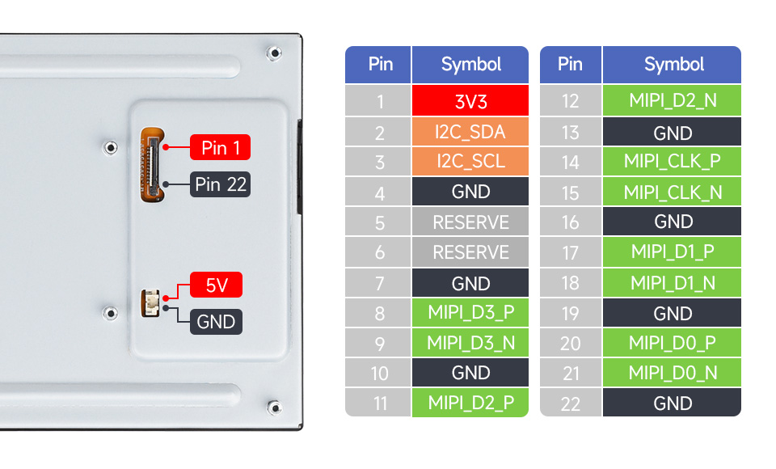
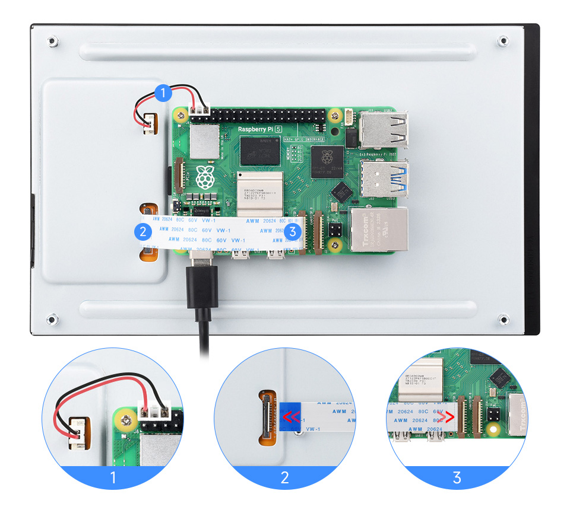
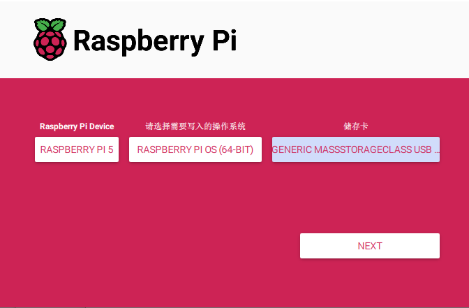
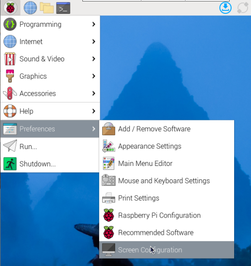
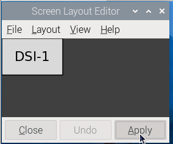
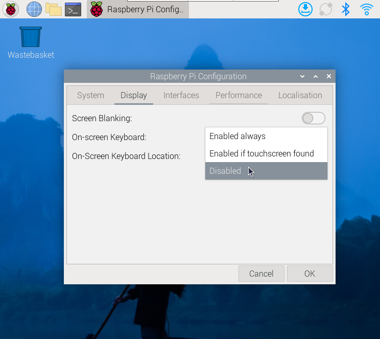
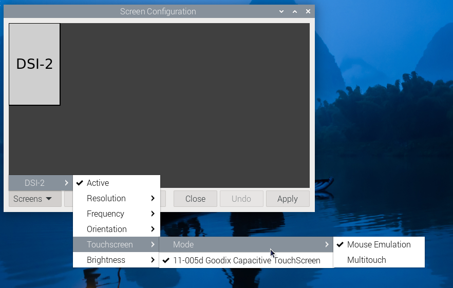
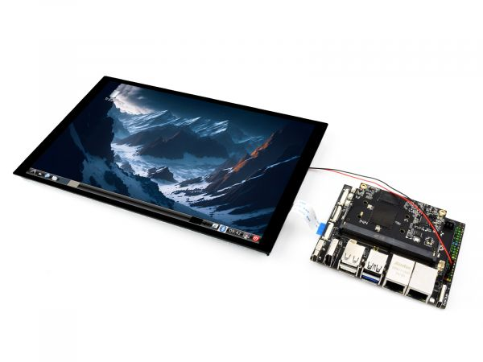
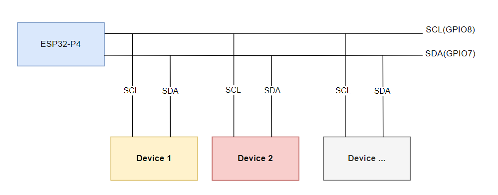

## Product Features  
- 8-inch DSI touch screen, capacitive 10-point touch control  
- IPS display panel with a hardware resolution of 800×1280  
- Fully laminated technology for clearer image quality  
- Tempered glass touch cover with hardness up to 6H  
- DSI interface drives the LCD, refresh rate up to 60Hz  
- Backlight brightness controllable via software  
- Aluminum alloy back cover with passive heat dissipation design  

## Electrical Specifications  

| Parameter     | Min. | Typ. | Max. | Unit | Note   |
| ------------- | ---- | ---- | ---- | ---- | ------ |
| Input Voltage | 4.75 | 5.00 | 5.30 | V    | Note 1 |
| Input Current | -    | 0.8  | TBD  | A    | Note 2 |
| Working Temp. | 0    | 25   | 60   | ℃    | Note 3 |
| Storage Temp. | -10  | 25   | 70   | ℃    | Note 3 |

**Note 1**: Input voltage exceeding the maximum or improper operation may cause permanent damage to the device.<br/>  
**Note 2**: Input current must be ≥0.8A, otherwise it may cause boot failure or abnormal display. Long-term abnormal operation may cause permanent damage to the device.<br/>  
**Note 3**: Do not store the screen in high-temperature or high-humidity environments for long periods. Operate within the rated limits to avoid screen damage.  


## Interface Introduction <br/>

## Working with Raspberry Pi
### Pi5/CM5/CM4/CM3+/CM3 Hardware Connection
1. Use the "FFC cable 22PIN 200mm (different direction)" cable to connect the DSI port of the display to the 22PIN DSI port of the Raspberry Pi motherboard.
2. Use the "GPIO cable" to connect the power connector of the display to the 5V GND pin header of the Raspberry Pi motherboard. <br/> 
3. Secure the Raspberry Pi to the display with M2.5 screws.
**Installation Effect:**  <br/> 

>**Note**: Ensure the DSI cable is connected in the correct direction, and power is supplied via GPIO 5V.  

### Pi4B/3B+/3B/3A+ Hardware Connection  
1. Use the "DSI-Cable-12cm" to connect the screen's DSI interface to the 15PIN DSI port on the Raspberry Pi mainboard.  
2. Use the "GPIO cable" to connect the screen's power interface to the 5V and GND pins on the Raspberry Pi.  
3. Secure the Raspberry Pi to the screen using M2.5 screws.  

**Installation Effect:**  <br/>

**Note**: Ensure the DSI cable is connected in the correct direction, and power is supplied via GPIO 5V.  

### Software Setup  
#### Method 1: Flash Latest Bookworm System
1. Connect the TF card to a PC, and use the [Raspberry Pi Imager](https://www.raspberrypi.com/software) to flash the system image.  <br/>
2. After the image flashing is completed, open the config.txt file in the root directory of the TF card, add the following code at the end of the config.txt, save and safely eject the TF card.
> Note: Since Pi5/CM5/CM4/CM3+/CM3 has two mipi DSI interfaces, please note that the correct DSI interfaces and commands are used, DSI1 is recommended by default.
```
dtoverlay=vc4-kms-v3d
#DSI1 Use
dtoverlay=vc4-kms-dsi-waveshare-panel-v2,8_0_inch_a
#DSI0 Use
#dtoverlay=vc4-kms-dsi-waveshare-panel-v2,8_0_inch_a,dsi0
```
3. Insert the TF card into the Raspberry Pi, power on the Raspberry Pi, and generally wait for about 30 seconds to enter the display state. The touch function can be used normally after the system boots.

#### Method 2: Flash Pre-installed Image
1. Download and extract the pre-installed image as a .img file  
[8-DSI-TOUCH-A Pre-installed Image](https://drive.google.com/file/d/1GQwFqEuMQK9owmGxhZCxGgAjlk3K8Dsx/view?usp=sharing) 
2. After flashing, insert the TF card into the Raspberry Pi and boot it. The display and touch will function normally after about 30 seconds.  
   
### Adjust Backlight Brightness
**GUI interface dimming**
* 1.Open the "Screen Configuration" application;<br/>

* 2.Go to "Screen" -> "DSI-2" -> "Brightness", check the backlight brightness you need to set, and finally click "Apply" to complete the backlight setting.<br/>

**Command line dimming**
```
 echo X | sudo tee /sys/class/backlight/*/brightness
```
Where X represents any number from 0 to 255. 0 means the darkest backlight, and 255 means the brightest backlight. For example:
```
echo 100 | sudo tee /sys/class/backlight/*/brightness
echo 0 | sudo tee /sys/class/backlight/*/brightness
echo 255 | sudo tee /sys/class/backlight/*/brightness
```
### Touchscreen Rotation on Bookworm OS
1. Open the "Screen Configuration" application.  <br/>
2. Navigate to "Screen" -> "DSI-1" -> "Touchscreen", and check the option "10-0014 Goodix Capacitive TouchScreen".  <br/>
3. Click "Apply", then close the window. Follow the popup prompt to reboot the system. This completes the touchscreen assignment.<br/><br/>
4. Navigate to "Screen" -> "DSI-1" -> "Orientation", select the desired rotation direction, then click "Apply". Both display and touch orientation will now be synchronized.<br/>

**Note:** The synchronization method above is supported only on Bookworm OS. For Bullseye and Buster systems, after rotating the display, you must manually configure the touchscreen rotation.

#### lite Version Display Rotation
```sh
sudo nano /boot/firmware/cmdline.txt
```
Add a command to display the rotation angle at the beginning of the cmdline.txt file, and save it to take effect after restarting

```sh
#Display rotation 90 degrees
video=DSI-1:800x1280M@60,rotate=90

#Display rotation 180 degrees
video=DSI-1:800x1280M@60,rotate=180

#Display rotation 270 degrees
video=DSI-1:800x1280M@60,rotate=270
```
> Note:
> - 1. If you are using Pi5/CM5, the actually recognized DSI display number will prevail, for example DSI-2.
> - 2. Unable to rotate DSI monitor and HDMI monitor separately using cmdline.txt. When you use both DSI and HDMI simultaneously, they share the same rotation value.

#### Touch Rotation

```sh
sudo nano /etc/udev/rules.d/99-waveshare-touch.rules
```

Set the command of touch rotation angle within the file, and it will take effect after the restart

```sh
#90°:
ENV{ID_INPUT_TOUCHSCREEN}=="1", ENV{LIBINPUT_CALIBRATION_MATRIX}="0 -1 1 1 0 0"

#180°:
#ENV{ID_INPUT_TOUCHSCREEN}=="1", ENV{LIBINPUT_CALIBRATION_MATRIX}="-1 0 1 0 -1 1"

#270°:
#ENV{ID_INPUT_TOUCHSCREEN}=="1", ENV{LIBINPUT_CALIBRATION_MATRIX}="0 1 0 -1 0 1"

#Save, exit, and reboot
sudo reboot
```
### Use Touchscreen Virtual Keyboard
Raspberry Pi OS Bookworm and later versions include Squeekboard on-screen keyboard by default.

When connecting to the touch display, the on-screen keyboard will automatically appear if text input is possible, and it will automatically hide if text input is not possible.

For applications that do not support automatic text input detection, you can manually display or hide the on-screen keyboard by clicking the keyboard icon at the far right of the task bar.<br/><br/>
You can also permanently set the display or hide the screen keyboard through the "Display" option under "Raspberry Pi Configuration" or through the "Display" section in raspi-config.<br/>

> Note:
> For versions of Raspberry Pi OS before Bookworm, use matchbox-keyboard. If you are using the wayfire desktop compositor, use wvkbd.

### Touch Mode Selection
The Bookworm system supports two touch modes, which can be switched in the Screen Configuration > Touchscreen menu:<br/>
```
*1.Mouse Emulation (default)
 Click = Left mouse button function
 Long press = Right mouse button function
 Supports double-click
 Does not support swipe page and multi-touch functions
```
**Note:** This mode is suitable for scenarios that require mouse operation, such as double clicking to open the file manager and long pressing to achieve right-click functionality.<br/>

```
*2.Multitouch
 Supports multi-touch functionality
 Supports swiping pages
Does not support double-click and right-click long press functions
```
**Note:** This mode is suitable for touch-optimized scenarios, such as web browsing and scrolling lists.This mode is suitable for touch-optimized scenarios, such as web browsing and scrolling lists.


## Working with Luckfox-Omni3576 
### Hardware Connection
1. Use a 22PIN FPC cable to connect the DSI interface of the display to the DSI interface of the Omni3576 mainboard.

2. Use a 2PIN power cable to connect the power port of the display to the 40PIN GPIO interface of the Omni3576 mainboard, as shown in the figure below:<br/>

### Software Configuration
1. Download and flash the image file from the official [Luckfox website](https://wiki.luckfox.com/luckfox-Omni3576/Burn-image/).
2. Connect a 5V power supply. Once the system boots, the screen should light up.

### View Display Information

- To check the available screen IDs in the current system, run the following command:

```sh
sudo cat /sys/kernel/debug/dri/0/summary
```
- Expected output：
```sh
Video Port0: DISABLED
Video Port1: ACTIVE
    Connector:DSI-1     Encoder: DSI-203
        bus_format[100a]: RGB888_1X24
        overlay_mode[0] output_mode[0] SDR[0] color-encoding[BT.709] color-range[Full]
    Display mode: 800x1280p60
        clk[70000] real_clk[69883] type[48] flag[a]
        H: 800 840 860 880
        V: 1280 1300 1304 1324
        Fixed H: 800 840 860 880
        Fixed V: 1280 1300 1304 1324
    Esmart1-win0: ACTIVE
        win_id: 1
        format: XR24 little-endian (0x34325258) pixel_blend_mode[0] glb_alpha[0xff]
        color: SDR[0] color-encoding[BT.601] color-range[Limited]
        rotate: xmirror: 0 ymirror: 0 rotate_90: 0 rotate_270: 0
        csc: y2r[0] r2y[0] csc mode[0]
        zpos: 1
        src: pos[0, 0] rect[800 x 1280]
        dst: pos[0, 0] rect[800 x 1280]
        buf[0]: addr: 0x00000000fe44e000 pitch: 3200 offset: 0
Video Port2: DISABLED
```
### Display Rotation
- Rotation commands:
```sh
# Rotate 90 degrees
xrandr -o left

# Rotate 270 degrees
xrandr -o right

# Rotate 180 degrees
xrandr -o inverted

# Rotate 0 degrees (normal)
xrandr -o normal
```
- These changes are temporary and will reset after reboot. To set rotation at startup, edit the config file:
```sh
sudo vim  /etc/X11/xorg.conf.d/10-monitor.conf
```
- Add the following command：
```sh
### Valid values for rotation are "normal", "left", "right"
Section "Monitor"
#    Identifier "Default Monitor"
    Identifier  "DSI-1"
    Option      "Rotate" "left"
EndSection
```
### Touchscreen Rotation
- If the display is rotated, but the touch input does not match the orientation, modify the following configuration:
```sh
sudo vim  /etc/udev/rules.d/99-luckfox-touch.rules
```
- Add the corresponding line based on your rotation direction, then reboot the device:
```sh
90 degrees：
ENV{ID_INPUT_TOUCHSCREEN}=="1", ENV{LIBINPUT_CALIBRATION_MATRIX}="0 -1 1 1 0 0"

180 egrees：
ENV{ID_INPUT_TOUCHSCREEN}=="1", ENV{LIBINPUT_CALIBRATION_MATRIX}="-1 0 1 0 -1 1"

270 degrees：
ENV{ID_INPUT_TOUCHSCREEN}=="1", ENV{LIBINPUT_CALIBRATION_MATRIX}="0 1 0 -1 0 1"
```
## Working with Luckfox-Lyra

### Hardware Connection
1. Use a 22PIN FPC cable to connect the DSI interface of the display to the DSI interface on the Luckfox-Lyra board.
2. Use an MX1.25 2PIN to 4PIN cable to connect the display’s power interface to the USB MX1.25 4P interface on the Luckfox-Lyra board. As shown in the figure below:<br/>

### Software Setup
1. Download and flash the image from the [official Luckfox website.](https://wiki.luckfox.com/Luckfox-Lyra/Image-flashing/)
2. Connect a 5V power supply. Once the system boots, the screen will light up.

### Check Screen Information

- You can check the available screen ID in the current system with the following command:
```sh
cat /sys/kernel/debug/dri/0/summary
```
- A normal output would look like this:
```sh
VOP [ff600000.vop]: ACTIVE
    Connector: DSI-1
        bus_format[100a]: RGB888_1X24
        overlay_mode[0] output_mode[0]color-encoding[1] color-range[1]
    Display mode: 800x1280p60
        dclk[70000 kHz] real_dclk[69475 kHz] aclk[294912 kHz] type[48] flag[a]
        H: 800 840 860 880
        V: 1280 1310 1314 1324
    win1-0: ACTIVE
        format: XR24 little-endian (0x34325258) SDR[0] color-encoding[0] color-range[0]
        csc: y2r[0] r2r[0] r2y[0] csc mode[0]
        zpos: 0
        src: pos[0x0] rect[800x1280]
        dst: pos[0x0] rect[800x1280]
        buf[0]: addr: 0x06100000 pitch: 3200 offset: 0
    post: sdr2hdr[0] hdr2sdr[0]
    pre : sdr2hdr[0]
    post CSC: r2y[0] y2r[0] CSC mode[2]
```
### Display Test
- Color bar test commands:
```sh
# Vertical stripes test
modetest -M rockchip -s 74@71:800x1280

# Diagonal tiles test
modetest -M rockchip -s 74@71:800x1280 -Ftiles
```
### Touch Test
- Touch test command:
```sh
evtest
```
- A normal output will be:
```sh
No device specified, trying to scan all of /dev/input/event*
Available devices:
/dev/input/event0:      2-005d Goodix Capacitive TouchScreen
Select the device event number [0-0]:
```
- Enter “0” and press Enter, then touch the screen to start testing. The terminal will print values triggered by touch events.

## Working with ESP32-P4 
### Display Driver<br/>

The ESP32-P4-NANO drives the screen via MIPI 2-lane.<br/> 

1. The screen driver has been packaged as a component, available on the [ESP Component Registry](https://components.espressif.com/components/waveshare/esp_lcd_jd9365_8)
   Add it to your ESP-IDF project using:
 ```sh
 idf.py add-dependency "waveshare/esp_lcd_jd9365_8
 ```
2. You can also refer to the Wiki for how ESP32-P4-NANO drives the screen：[ESP32-P4-NANO_MIPI-DSI](https://www.waveshare.com/wiki/ESP32-P4-Nano-StartPage#MIPI-DSI_display_driver_demo)

### Backlight Control

After connecting the ESP32-P4-NANO using the included FPC cable and power cable, the backlight can be controlled via I2C.
Write 0x00~0xFF to register 0x86 of device address 0x45.

If you are using the[ESP32-P4-NANO BSP Components](https://components.espressif.com/components/waveshare/esp32_p4_nano), you can use the following functions:

```c
bsp_display_brightness_init();   // Initialize backlight
bsp_display_backlight_on();      // Turn on backlight (default full brightness)
bsp_display_backlight_off();     // Turn off backlight
bsp_display_brightness_set(95);  // Set brightness level (0~100)
```
as shown below.<br/>  


## Safety Instructions
To avoid malfunction or damage to this product, please observe the following precautions:

- Before connecting devices, turn off your Raspberry Pi computer and disconnect the external power supply.
- If the cable becomes loose, pull the locking tab on the connector forward, insert the ribbon cable with the metal contacts facing you, then push the locking tab back into place.
- This device should operate in a dry environment within a temperature range of 0–60°C.
- Do not expose the device to water or a humid environment during operation, and do not place it on conductive surfaces.
- Do not expose it to any source of excessive heat.
- Take care not to fold or overstretch the ribbon cable.
- Be cautious when tightening parts. Cross-threading may cause irreparable damage and void the warranty.
- Handle with care to avoid mechanical or electrical damage to the PCB and connectors.
- Store in a cool, dry place.
- Avoid sudden temperature changes, as this may cause moisture buildup inside the device.
- The display surface is fragile and may break.