This tutorial uses QT to enable the 86 development board to control hardware and read/write registers via the Modbus protocol. The aim is to create a complete example for interfacing with hardware through a user interface.
## 1.Modbus
Before the project design, we need to have an understanding of Modbus in order to facilitate the subsequent development and design of the logic.
### Overview of the Modbus Protocol
The Modbus protocol adopts a master-slave architecture. Communication is always initiated by the master device and responded to by the slave device. The master device can communicate with a specific slave device individually or broadcast messages to all slave devices. The slave device responds to the requests from the master device but does not initiate communication on its own.
Modbus has two transmission modes:
1. **ASCII mode**: Each 8-bit byte is split into two ASCII characters and sent, using LRC (Linear Redundancy Check) for verification.
2. **RTU mode**: Each byte is sent as an 8-bit binary value, using CRC (Cyclic Redundancy Check) for verification. RTU mode is more commonly used. 

In addition, there is the Modbus TCP protocol based on TCP/IP, which operates on the Ethernet network and uses TCP port 502.

### Modbus Data Model
Modbus organizes data into four separate data blocks:
- **Coils**: Readable and writable, 1-bit data, typically used for controlling digital outputs. Function code: Read (01), Write Single (05), Write Multiple (15).
- **Discrete Inputs**: Read-only, 1-bit data, typically used for reading digital inputs. Function code: Read (02).
- **Input Registers**: Read-only, 16-bit (word) data, typically used for reading analog inputs. Function code: Read (04).
- **Holding Registers**: Readable and writable, 16-bit data, typically used for storing parameters or controlling analog outputs. Function code: Read (03), Write Single (06), Write Multiple (16).

### Modbus RTU Message Structure
A Modbus RTU message consists of the following components:
1. **Address Field**: 1 byte, representing the device address (0-247), with 0 being the broadcast address.
2. **Function Code**: 1 byte, indicating the operation type (such as reading coils, writing registers, etc.).
3. **Data Field**: Variable length, depending on the function code.
4. **Checksum**: 2 bytes, CRC check.

### Modbus TCP Message Structure
Modbus TCP adds an MBAP (Modbus Application Protocol) header on top of the RTU protocol: 
```plaintext
[Transaction Identifier] [2 bytes]: Used for transaction matching, generated by the client and copied by the server in response.
[Protocol Identifier] [2 bytes]: 0 indicates the Modbus protocol.
[Length] [2 bytes]: Number of subsequent bytes (including unit identifier and data field).
[Unit Identifier] [1 byte]: Slave station address (typically used for routing to the backend device in TCP; set to 0 if not needed).
[Function Code] [1 byte]: Same as in RTU mode.
[Data Field] [Variable]: Same as in RTU mode. 
```

### Summary
The Modbus protocol is simple, open, and easy to implement, and thus is widely adopted. It supports serial and Ethernet communication and is suitable for various industrial automation scenarios. When using it, pay attention to the master-slave architecture, data model, function code definitions, and error handling.

## 2. Project Overview
### 2.1 Interface Overview

| Interface         | Function                  | Description                                                                                              |
| :--------------- | :----------------------- | :------------------------------------------------------------------------------------------------ |
Main interface | Display sub-interfaces and labels | Display link interface and control interface, and design the switching between the two.
Link interface | Display link configuration interface | Display RTU and TCP configuration information, provide users with the function of modifying configuration and establishing link.
Control interface | Display command interface and function sub-interfaces | Provide selection of Modbus data model, function buttons, and switching of function sub-interfaces.
Function sub-interface | Display coil, discrete input, input register, and hold register function interfaces | Provide coil control, reading of discrete input and input register, as well as reading and writing of hold register functions.

### 2.2 Required Hardware and Connections
#### 2.2.1 86-Box Development Board
The 86 development board serves as the control core of our entire project. Besides requiring the display interface on the touch panel, we also need it to be connected with other hardware components, as follows:<br/>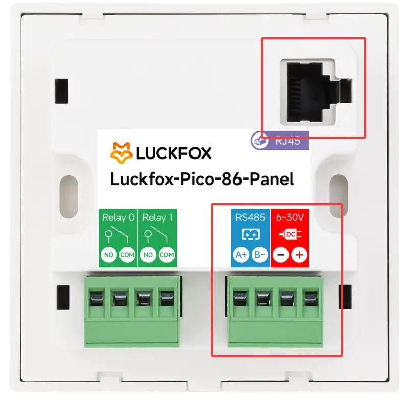
- **RJ45 interface**: Connects to the corresponding hardware via network cable to enable Modbus TCP communication.
- **RS485 interface**: Links to the corresponding hardware to achieve Modbus RTU communication. **Note**: Due to the isolation between the main control power supply and the wide-voltage power supply, even after powering the development panel with type-C, the power supply for the power interface in the above figure is still required.

#### 2.2 Modbus RTU Relay
The 86 development board is linked to the Modbus RTU Relay via the RS485 interface, as shown below:<br/>
After the connection is established, the 8 relay channels are controlled via RS485. The success of the instruction transmission is determined based on the relay status.

#### 2.3RS485 to RJ45 Ethernet Module
In order to test Modbus TCP, we need to connect the RJ45 network interface of the 86 development board to the following module:<br/>
Connect the RJ45 network interface to the development board, and link the RS485 interface to the Modbus RTU Relay. Through this module, convert the two interfaces and also use the relay status to determine whether the instruction has been sent successfully.

## 3. Preparation and Project Creation
### Environment Configuration
Since the project requires the Modbus-related library functions, it is necessary to select the corresponding options in the SDK and burn the image onto the development board. Add the Modbus library:<br/>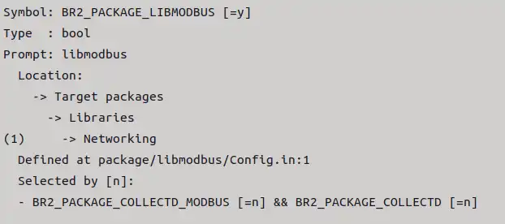
Compile the SDK and burn the files in the "output/image/" directory onto the development board.

### Create Project
Open QT and create a new project:<br/>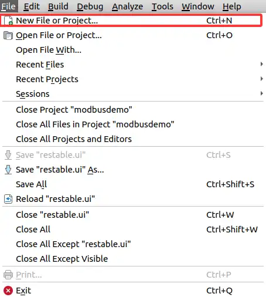<br/>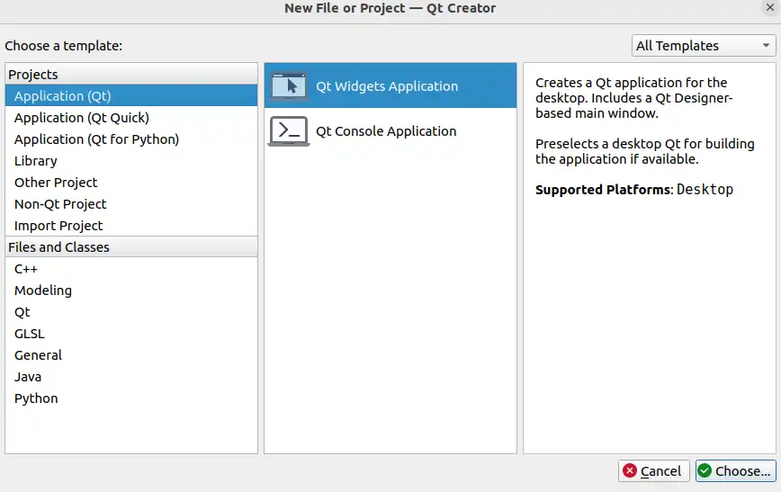<br/>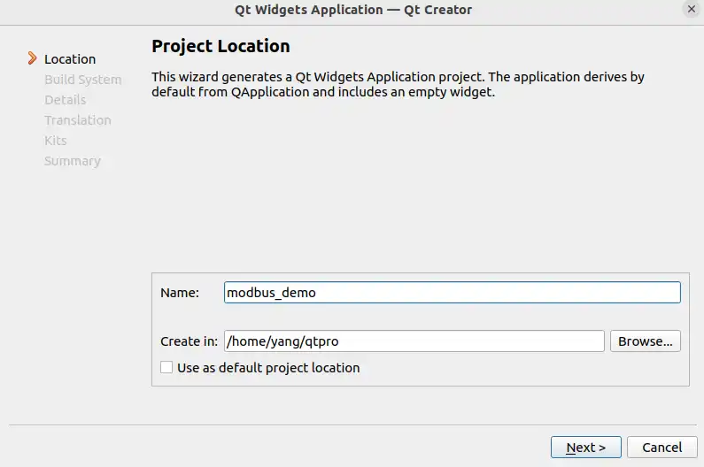<br/><br/>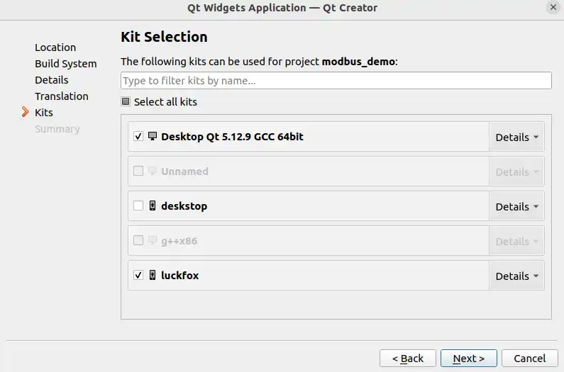
Select the 64-bit kit (for easy preview), as well as the 86 development board SDK cross-compilation environment kit.
After the completion of the new project, the overall project details are as follows:<br/>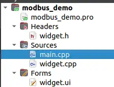

"Widget" serves as the overall main interface of the project, used to display sub-interfaces and other functions. The specific design will be introduced later. For now, we are focusing on the design of the sub-interfaces.

## 4. Link Interface
### 4.1 Interface Class for Adding Links
1. Right-click on the project, then select "Add New File".<br/>
2. Selection of file class.<br/>
3. Fill in the class name as "conncrtion" and select "inherit from QWidget"<br/>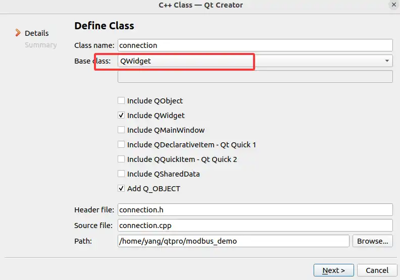
After the addition is completed, corresponding source files and header files will be generated in the project.

### 4.2Specific Design of the Interface 

#### 4.2.1 Create RTU Group
```cpp
QGroupBox *connection::createRtuGroup()
{
    QGroupBox *groupBox = new QGroupBox("RTU (Serial) Configuration");
    QVBoxLayout *layout = new QVBoxLayout(groupBox);
    layout->setSpacing(15);
    // Serial port
    serialPortCombo = new QComboBox();
    serialPortCombo->addItems({"/dev/ttyS0", "/dev/ttyS1", "/dev/ttyS2", "/dev/ttyS3", "/dev/ttyS4"});
    serialPortCombo->setCurrentIndex(4);
    // Baud rate
    baudEdit = new QLineEdit("9600");
    // Data bits
    dataBitsCombo = new QComboBox();
    dataBitsCombo->addItems({"8 Data bits", "7 Data bits"});
    // Parity
    parityCombo = new QComboBox();
    parityCombo->addItems({"No Parity", "Odd Parity", "Even Parity"});
    // Stop bits
    stopBitsCombo = new QComboBox();
    stopBitsCombo->addItems({"1 Stop Bit", "2 Stop Bits"});
    // Connect button
    serialConnectBtn = new QPushButton("Disconnected");
    connect(serialConnectBtn, &QPushButton::clicked, this, &connection::onSerialConnectClicked);
    // Form layout
    QFormLayout *formLayout = new QFormLayout();
    formLayout->setSpacing(18);
    formLayout->addRow(serialPortCombo);
    formLayout->addRow(baudEdit);
    formLayout->addRow(dataBitsCombo);
    formLayout->addRow(parityCombo);
    formLayout->addRow(stopBitsCombo);
    layout->addLayout(formLayout);
    layout->addStretch();
    layout->addWidget(serialConnectBtn);
    return groupBox;
}
```

**Code Function Analysis:**

| Configuration Item | Control Type | Initial Value/Options                              | Default Value/Selected Item | 
|--------------|--------------|--------------------------------------------------|---------------------|
| Serial Port Name | QComboBox | "/dev/ttyS0", "/dev/ttyS1", "/dev/ttyS2", "/dev/ttyS3", "/dev/ttyS4" | "/dev/ttyS4" (Index 4) |
| Baud Rate       | QLineEdit | "9600"                                        |             |
| Data Bits       | QComboBox | "8 Data bits", "7 Data bits"                     | The first item (8 bits)       |
| Parity Bit      | QComboBox | "No Parity", "Odd Parity", "Even Parity"         | The first item (No parity)    |
| Stop Bits       | QComboBox | "1 Stop Bit", "2 Stop Bits"                      | The first item (1 bit)       |
| Connect Button  | QPushButton | "Disconnected"                                   |                     |

Layout structure:
- The frame uses a vertical layout (QVBoxLayout).
- First, add a form layout (QFormLayout), which contains 5 rows, each row having a configuration item.
- Then add an expand item (addStretch) so that the subsequent buttons will be placed at the bottom.
- Finally, add the connecting buttons.

Signal connection:
- When the connection button is clicked, the `connection::onSerialConnectClicked` slot function will be triggered.

#### 4.2.2 Create TCP Group
```cpp
QGroupBox *connection::createTcpGroup()
{
    QGroupBox *groupBox = new QGroupBox("TCP Configuration");
    QVBoxLayout *layout = new QVBoxLayout(groupBox);
    layout->setSpacing(15);
    // Mode selection
    modeCombo = new QComboBox();
    modeCombo->addItems({"Slave", "Master"});
    modeCombo->setCurrentIndex(0);
    // IP address
    ipEdit = new QLineEdit("192.168.1.200");
    // Port
    portEdit = new QLineEdit("502");
    // Connect button
    tcpConnectBtn = new QPushButton("Disconnected");
    connect(tcpConnectBtn, &QPushButton::clicked, this, &connection::onTcpConnectClicked);
    // Form layout
    QFormLayout *formLayout = new QFormLayout();
    formLayout->setSpacing(18);
    formLayout->addRow(modeCombo);
    formLayout->addRow(ipEdit);
    formLayout->addRow(portEdit);
    layout->addLayout(formLayout);
    layout->addStretch();
    layout->addWidget(tcpConnectBtn);
    return groupBox;
}
```
**Code Function Analysis:**

| Configuration Item | Control Type | Initial Value/Options                              | Default Value/Selected Item | 
|--------------|--------------|--------------------------------------------------|---------------------|
| Working Mode	 | QComboBox	 | "Slave", "Master"	 "Slave" (index 0)	 | Select device as the master or slave |
| IP Address	 | QLineEdit	 | "192.168.1.200"	 | Target IP address for TCP communication |
| Port Number	 | QLineEdit	    | "502"   	     | Modbus TCP standard port |
| Connect Button	 | QPushButton	 | "Disconnected"		| Button to control TCP connection |


Layout structure:
- The frame uses a vertical layout (QVBoxLayout).
    - First, add a form layout (QFormLayout), which contains 3 rows, each row having a configuration item.
    - Then add an expand item (addStretch) so that the subsequent buttons will be placed at the bottom.
    - Add the link button.

Signal Link:
- When the connection button is clicked, the `connection::onTcpConnectClicked` slot function will be triggered.

#### 4.2.3 Overall Layout
```cpp
void connection::setupUI()
{
    QVBoxLayout *mainLayout = new QVBoxLayout(this);
    mainLayout->setSpacing(20);
    mainLayout->setContentsMargins(25, 25, 105, 25);
    // Horizontal layout for RTU and TCP sections
    QHBoxLayout *contentLayout = new QHBoxLayout();
    contentLayout->setSpacing(30);
    // RTU Section (left)
    QGroupBox *rtuGroup = createRtuGroup();
    contentLayout->addWidget(rtuGroup);
    // TCP Section (right)
    QGroupBox *tcpGroup = createTcpGroup();
    contentLayout->addWidget(tcpGroup);
    mainLayout->addLayout(contentLayout,2);

    // Status bar
    statusLabel = new QLabel(""); 
    statusLabel->setFrameShape(QFrame::NoFrame); 
    statusLabel->setStyleSheet("background-color: transparent;");
    statusLabel->setMinimumHeight(30);
    mainLayout->addWidget(statusLabel,1);
}
```
**Code Function Analysis:**
-   A horizontal layout (QHBoxLayout) is set up to position the RTU group and the TCP group on the left and right sides of the overall interface respectively.

At this point, the UI design of the link interface is complete. The setupUI() function is called in the constructor of the link interface class, and the link interface object is instantiated in the main interface Widget. The show() function is used to display the link interface object. The preview effect is as follows:<br/>

### 4.3 Link Function Implementation
#### 4.3.1 RTU Link Function Implementation
```cpp
void connection::serialModbusInit()
{
    QString port = serialPortCombo->currentText();
    if (port.isEmpty()) {
        qWarning() << "Serial port not selected";
        return;
    }
    bool baudOk;
    int baud = baudEdit->text().toInt(&baudOk);
    if (!baudOk || baud <= 0) {
        qWarning() << "Invalid baud rate, using default 9600";
        baud = 9600;
    }
    char parity = 'N'; 
    QString parityText = parityCombo->currentText();
    if (parityText.contains("Odd", Qt::CaseInsensitive)) {
        parity = 'O';
    } else if (parityText.contains("Even", Qt::CaseInsensitive)) {
        parity = 'E';
    }
    int dataBits = 8;
    QString dataBitsText = dataBitsCombo->currentText();
    QRegularExpression re("\\d+");
    QRegularExpressionMatch match = re.match(dataBitsText);
    if (match.hasMatch()) {
        dataBits = match.captured(0).toInt();
    }
    if (dataBits != 7 && dataBits != 8) {
        qWarning() << "Invalid data bits, using 8";
        dataBits = 8;
    }
    int stopbits = 1;
    QString stopBitsText = stopBitsCombo->currentText();
    if (stopBitsText.contains("2") ||
            stopBitsText.contains("Two", Qt::CaseInsensitive)) {
        stopbits = 2;
    }
    serial_mb = modbus_new_rtu(
                port.toUtf8().constData(),
                baud,
                parity,
                dataBits,
                stopbits
                );
    if (!serial_mb) {
        qCritical() << "Unable to create Modbus RTU context";
        return;
    }
    modbus_set_debug(serial_mb, 1);
}

int connection::serialModbusConnect(void){
    return  modbus_connect(serial_mb);
}

void connection::serialModbusDisconnect(void){
    modbus_close(serial_mb);
    modbus_free(serial_mb);
}

void connection::onSerialConnectClicked()
{
    serialModbusInit();

    if (serialConnectBtn->isChecked()) {
        if (serialModbusConnect() == 0) {
            serialConnectBtn->setText("Connected");
            emit modbusConnectionEstablished(static_cast<void*>(serial_mb));
        } else {
            qDebug() << "serial failed";
            serialConnectBtn->setChecked(false);
        }
    } else {
        serialModbusDisconnect();
        serialConnectBtn->setText("Disconnected");
        emit modbusDisconnected(static_cast<void*>(serial_mb));
    }
}
```

**Code Function Analysis:**
-   Retrieve the RTU configuration of the user, including serial port number, baud rate, parity, data bits, and stop bits.
-   `modbus_new_rtu` uses the obtained parameters to create a Modbus RTU context and sets the debug mode.
-   Handle the click event of the serial port connection button to implement the functions of establishing and disconnecting the connection. Through `serialModbusConnect`, it determines whether the creation is successful. If successful, update the text of the link button to "Connected" indicating that it is linked; otherwise, keep the original state, and send the corresponding signal.
  
#### 4.3.2 Implementation of TCP Link Function
```cpp

int connection::tcpModbusConnect() {
    return modbus_connect(mb);
}

void connection::tcpModbusDisconnect() {
    modbus_close(mb);
}

void connection::onTcpConnectClicked()
{
    mb = modbus_new_tcp(ipEdit->text().toUtf8(), portEdit->text().toInt());
    modbus_set_debug(mb, 1);

    if (tcpConnectBtn->isChecked()) {
        if (tcpModbusConnect() == 0) {
            tcpConnectBtn->setText("Connected");
            emit modbusConnectionEstablished(static_cast<void*>(mb));
        } else {
            qDebug() << "connect tcp failed";
            tcpConnectBtn->setChecked(false); 
        }
    } else {
        tcpModbusDisconnect();
        tcpConnectBtn->setText("Disconnected");
        emit modbusDisconnected(static_cast<void*>(mb));
    }
}
```
**Code Function Analysis:**
- Obtain IP and port, create Modbus Tcp context.
- Call `tcpModbusConnect` to check if the connection is established. If successful, send the `modbusConnectionEstablished` signal. On clicking again, trigger the link disconnection processing.


## 5. Control Interface
### 5.1 Adding Control Interface Class
Similar to the link interface, in the project, add a class named mcontrol as the control interface, and generate the corresponding source file and header file.
### 5.2 Control Interface Design
Since the control interface and the functional interface it contains involve a large number of controls, in order to facilitate access, the UI design of the control interface adopts the method of combining QT Designer with code, as follows:<br/><br/>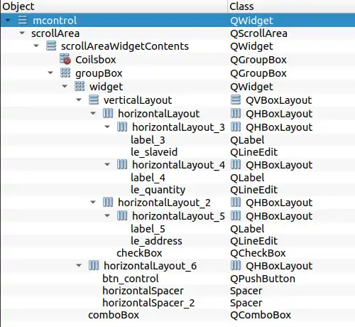

```cpp
mcontrol::mcontrol(QWidget *parent) :
    QWidget(parent),
    ui(new Ui::mcontrol),
    gridLayout(nullptr)
{
    ui->setupUi(this);

    ui->btn_control->setStyleSheet(
                "QPushButton {"
                "   background: qlineargradient(x1:0, y1:0, x2:0, y2:1,"
                "                   stop:0 rgba(255, 119, 0, 0.3),"
                "                   stop:1 rgba(255, 119, 0, 0.1));"
                "   border: 2px solid #FF7700;"
                "   border-radius: 10px;"
                "   color: white;"
                "   padding: 8px 16px;"
                "   font-weight: bold;"
                "   text-shadow: 1px 1px 2px rgba(0, 0, 0, 0.7);"
                "}"
                "QPushButton:hover {"
                "   background: qlineargradient(x1:0, y1:0, x2:0, y2:1,"
                "                   stop:0 rgba(255, 119, 0, 0.4),"
                "                   stop:1 rgba(255, 119, 0, 0.2));"
                "   border: 2px solid #FF9900;"
                "}"
                "QPushButton:pressed {"
                "   background: qlineargradient(x1:0, y1:0, x2:0, y2:1,"
                "                   stop:0 rgba(255, 85, 0, 0.5),"
                "                   stop:1 rgba(255, 85, 0, 0.3));"
                "   border: 2px solid #FF5500;"
                "}"
                );
    ui->btn_control->setText("Read Coils");
    ui->btn_control->setCheckable(true);
    ui->le_quantity->setText("0");
    ui->le_address->setText("0");
    ui->le_slaveid->setText("0");

    gridLayout = new QGridLayout(ui->Coilsbox);
    gridLayout->setSpacing(5);
    ui->Coilsbox->setLayout(gridLayout);
    resgistertable.tableWidget->hide();

    ....
}
```

**Code Function Analysis:**
-   Initialize the display styles of various controls and the contents of text boxes, including the display of buttons, the styles when pressed and released, the default display of address and other text boxes, and the setting of the display area for functions.

The preview interface is as follows:<br/>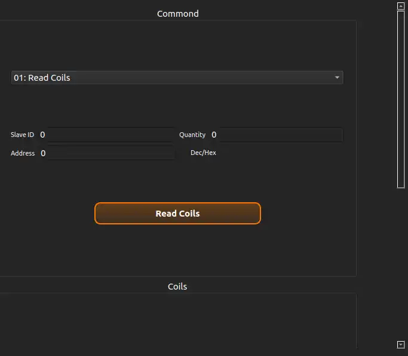

### 5.3 Function Sub-Interface Design
#### 5.3.1 Coil Interface
##### Create Coil Interface Class

In the project, a class named "coilswidget" is added as the interface for the coils.

```cpp
    CoilsContainer::CoilsContainer(QWidget *parent)
    : QWidget(parent), gridLayout(new QGridLayout(this))
{
    setLayout(gridLayout);
    gridLayout->setSpacing(10);
    gridLayout->setContentsMargins(5, 5, 5, 5);

    styleNormal = "QPushButton {"
                  "  border: 2px solid #FF8C00;"
                  "  border-radius: 10px;"
                  "  background-color: transparent;"
                  "}"
                  "QPushButton:hover {"
                  "  background-color: rgba(255, 140, 0, 0.1);"
                  "}";

    stylePressed = "QPushButton {"
                   "  border: 2px solid #FF8C00;"
                   "  border-radius: 10px;"
                   "  background-color: #FF8C00;"
                   "  color: white;"
                   "}";
 
    readOnlyOnStyle = "QPushButton {"
                      "  background-color: white;"
                      "  border: 2px solid #FF8C00;"
                      "  border-radius: 10px;"
                      "}";

    readOnlyOffStyle = "QPushButton {"
                       "  background-color: transparent;"
                       "  border: 2px solid #FF8C00;"
                       "  border-radius: 10px;"
                       "}";
}
```
**Code Function Analysis:**
- **Description of Coil Interface Design**
    - Constructor Functionality
    - Only performs **basic layout design**
    - Sets **string style type**
    - **Not implemented** specific display content configuration
- **Reason for Design**
    - The coil interface serves as a **functional sub-interface**
    - The specific display content needs to be dynamically configured by the **control interface**
- **Interface Requirements**
    - The coil interface class must **provide a configuration interface**
    - For the control interface to call to achieve:
    - Passing display parameters
    - Dynamic content update

##### Implement the configuration interface

```cpp
void CoilsContainer::setQuantity(int quantity) {
    if (quantity == buttons.size()) return;

    for (QPushButton *btn : buttons) {
        gridLayout->removeWidget(btn);
        delete btn;
    }
    buttons.clear();
    coilStates.clear();

    if (quantity <= 0) return;

    int cols = qMin(4, quantity);
    int rows = (quantity + cols - 1) / cols;

    for (int i = 0; i < quantity; ++i) {
        QPushButton *btn = new QPushButton(textFormat.arg(i + 1), this);
        btn->setCheckable(true);
        btn->setMinimumSize(80, 30);
        btn->setStyleSheet(styleNormal);

        int row = i / cols;
        int col = i % cols;
        gridLayout->addWidget(btn, row, col);

        connect(btn, &QPushButton::clicked, [this, btn]() {
            bool isChecked = btn->isChecked();
            coilStates[btn] = isChecked;
            if (isChecked) {
                btn->setStyleSheet(stylePressed);
            } else {
                btn->setStyleSheet(styleNormal);
            }
            int index = buttons.indexOf(btn);
            if (index != -1) {
                emit coilClicked(index, isChecked);
            }
        });
        buttons.append(btn);
        coilStates[btn] = false;
    }
}

//mcontrol.cpp
connect(ui->le_quantity, &QLineEdit::textChanged, [this](const QString &text) {
        bool ok;
        int quantity = text.toInt(&ok);
        if (ok && quantity > 0) {
            coilsContainer->setQuantity(quantity);
        }
});
```
**Code Function Analysis:**
Based on the specified number of coils, dynamically create and arrange buttons, with each button representing the status of one coil.
- Logical Steps
    1. **Check if quantity has changed**: If the new quantity is the same as the current number of buttons, simply return.
    2. **Remove existing buttons**: Remove and delete all existing buttons from the layout, clearing the button list and state mapping.
    3. **Handle invalid quantity**: If the quantity is less than or equal to 0, simply return (the interface has been cleared at this point).
    4. **Calculate grid layout**:
        -  The number of columns (cols) is the smaller value of 4 and the quantity.
        - The number of rows (rows) is calculated based on the quantity and columns (rounded up).
    5. **Create new buttons**:
        - Create `quantity` buttons in a loop.
        - The button text is formatted according to `textFormat` (e.g., "Coil %1"), with the parameter being the index + 1 (starting from 1).
        - Set the button as selectable (checkable), with the minimum size, and the initial style (`styleNormal`).
        - Add the buttons to the grid layout based on the calculated row and column positions.
        - Connect the click signal for each button: toggle the button state (including style changes) and emit the `coilClicked` signal, passing the coil index and state.
        - Add the buttons to the button list (buttons) and initialize the state mapping (coilStates) as false.
- Link the signal with the control interface
    - Bind the signal and slot to ui->le_quantity. When the value changes, call setQuantity to display the current button quantity.

##### Bind the "coilClicked" signal to achieve control.
```cpp
connect(coilsContainer, &CoilsContainer::coilClicked,
            this, &mcontrol::onCoilButtonClicked1);

void mcontrol::onCoilButtonClicked1(int index, bool state)
{
    if (ui->comboBox->currentIndex() == 0) {
        return;
    }
    qDebug() << index << state;
    if(state)
    {
        if(ui->comboBox->currentIndex() == 4)
        {
            if(modbusContext != nullptr)
            {
                modbus_set_slave(modbusContext, ui->le_slaveid->text().toInt());
                modbus_write_bit(modbusContext,index,1);
            }
        }
    }else
    {
        if(ui->comboBox->currentIndex() == 4)
        {
            if(modbusContext != nullptr)
            {
                modbus_set_slave(modbusContext, ui->le_slaveid->text().toInt());
                modbus_write_bit(modbusContext,index,0);
            }
        }
    }
}
```
**Code Function Analysis:**
- Firstly, check if the current index of the combo box is 0. If it is 0, return directly (it might be in an enabled state).
- Print debugging information (coil index and status).
- If the status is true (set):
    - Check if the current index of the combo box is 4, which means writing to a single coil interface.
    - If the conditions are met and modbusContext is not empty (connected), set the slave station ID and execute the write single coil operation (write 1).
- If the status is false (reset):
    - Similarly, check if the combo box index is 4 and modbusContext is not empty, and then execute the write single coil operation (write 0).

And in the slot function bound to the currentIndexChanged(int) signal of the combo box ui->comboBox, add the following code to display the coil interface:
```cpp
void mcontrol::on_comboBox_currentIndexChanged(int index)
{
    ...
    else if(index == 4 || index == 6)
    {

        resgistertable.tableWidget->hide();
        registersContainer->hide();
        diTable->hide();
        coilsContainer->setReadOnlyMode(false);
        coilsContainer->resetToNormalStyles();
        ui->btn_control->setText("Write coils");
        ui->Coilsbox->setMinimumHeight(200);
        ui->Coilsbox->setMaximumHeight(200);
        coilsContainer->show();
    }
    ...
}
```
**Code Function Analysis:**
-   When the combo box is selected for the interface of writing a single coil or the interface of writing multiple coils, the coil control interface is displayed to facilitate user control.

Currently, there is an issue where the newly created Modbus context in the link interface has not been passed to the control interface. Previously, after the link interface was successfully created, it would send the modbusConnectionEstablished signal. Therefore, we can align the bindings and achieve the acquisition of the corresponding Modbus context.

- Binding signals and slots in the main interface window:
```cpp
connect(connectionWidget,&connection::modbusConnectionEstablished,
            controlwidget, &mcontrol::setModbusConnection);
```
- Obtain Modbus context
```cpp
void mcontrol::setModbusConnection(void *mb)
{
    if (modbusContext) {
        modbus_close(modbusContext);
        modbus_free(modbusContext);
    }
    modbusContext = static_cast<modbus_t*>(mb);
}
```
Connect the development board to the RS485 to RJ45 Ethernet converter, and then connect the RS485 to RJ45 Ethernet converter to the Modbus RTU Relay. The operation effect is as follows:<br/>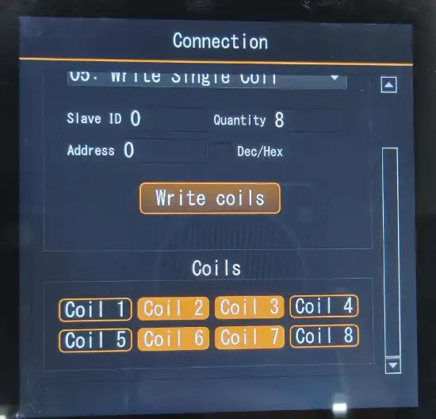
Output message:<br/>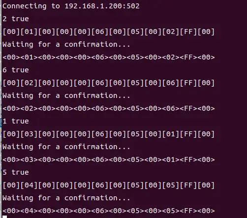
**Message Analysis:**
- Sample Message 1 (Sent): 
    - `[00][01][00][00][00][06][00][05][00][02][FF][00]`
    Disassembly:
    Transaction ID: 00 01 (increases with each communication, the first one is 0001)
    Protocol ID: 00 00 (fixed at 0 for Modbus protocol)
    Length: 00 06 (following 6 bytes)
    Unit ID: 00 (slave station address, here it is 0, but in Modbus TCP, this field is usually ignored or used as the device address)
Function Code: 05 (write single coil)
Data: 00 02 FF 00 (coil address is 00 02 -> 2, value is FF 00 -> indicates ON)
- Example message 1 (response): 
    - ` <00><01><00><00><00><06><00><05><00><02><FF><00>`
With the same structure and the same transaction identifier, it indicates a response to the request.
Similarly, for other messages.

At this point, the function of controlling the writing of a single coil has been completed.

##### The function of writing to multiple coils is realized.
```cpp
QVector<bool> CoilsContainer::getCoilStates() const {
    QVector<bool> states;
    for (QPushButton *btn : buttons) {
        states.append(coilStates.value(btn, false));
    }
    return states;
}

void mcontrol::on_btn_control_clicked()
{
    ...
    int quantity = ui->le_quantity->text().toInt();
    int startaddress = ui->le_address->text().toInt();
    QVector<bool> coilStates = coilsContainer->getCoilStates();
    uint8_t *writeData = new uint8_t[quantity];

    for(int i = 0;i < quantity;i++)
    {
        writeData[i] = coilStates.value(i,false) ? 1 : 0;
        if(coilStates.value(i,false)) coilCount++;
    }

    int res = -1;
    if(ui->comboBox->currentIndex() == 6)
    {
        res = modbus_write_bits(modbusContext, actualaddresss, quantity, writeData);
    }
    ...
}
```

**Code Function Analysis:**
-   The coil button states are traversed and recorded through the function getCoilStates. When the function button in the control interface is clicked (i.e., ui->btn_control is clicked) and the current index of ui->comboBox is selected as the "Write Multiple Coils" function, the modbus_write_bits function is called to write all the coils at once, thereby achieving the function of controlling multiple coils.

###### Read the status of the coil
```cpp
void CoilsContainer::setReadOnlyMode(bool readOnly)
{
    for (QPushButton *btn : buttons) {
        btn->setEnabled(!readOnly);
    }
}

void CoilsContainer::updateVisualState(const QVector<bool> &states)
{
    for (int i = 0; i < qMin(buttons.size(), states.size()); i++) {
        if (states[i]) {
            buttons[i]->setStyleSheet(readOnlyOnStyle);
        } else {
            buttons[i]->setStyleSheet(readOnlyOffStyle);
        }
    }
}

void mcontrol::on_btn_control_clicked()
{
    ...
    uint8_t *readData = new uint8_t[quantity];
    else if(ui->comboBox->currentIndex() == 0)
    {
        res = modbus_read_bits(modbusContext, actualaddresss, quantity, readData);
    }
    if(res == quantity)
    {
        ...
        else if(ui->comboBox->currentIndex() == 0)
        {
            for (int i = 0; i < quantity; i++) {
                states.append(readData[i] == 1);
            }          
            coilsContainer->setCoilStates(states);         
            if (ui->comboBox->currentIndex() == 0) {
                coilsContainer->setReadOnlyMode(true);
                coilsContainer->updateVisualState(states);
            }
        }
        ...
    }
    ...
}
```

**Code Function Analysis:**
- At the same time, when the function button on the page is clicked, the slot function is triggered. It also checks whether the current index of ui->comboBox is for the read coil function. Then, it displays the coil interface and sets the button as unclickable, and also sets the style to indicate the read result.

The operation effect is as follows:<br/>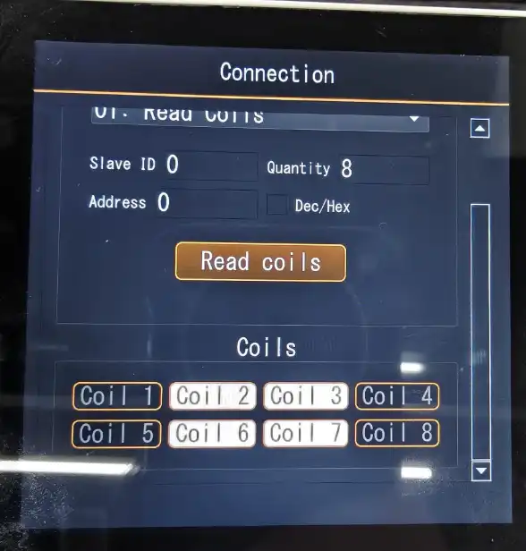

#### 5.3.2 Register Interface

##### Create the register information group class
Add a class named RegisterGroup in the project to display a group of register information and function buttons.
And initialize its layout and controls:
```cpp
RegisterGroup::RegisterGroup(QWidget *parent) : QWidget(parent),
    currentAddress(0)
{
    QVBoxLayout *layout = new QVBoxLayout(this);
    layout->setSpacing(5);
    layout->setContentsMargins(2, 2, 2, 2);

    labelAddress = new QLabel(this);
    labelAddress->setAlignment(Qt::AlignCenter);
    labelAddress->setStyleSheet("QLabel { font-weight: bold; }");
    layout->addWidget(labelAddress);

    lineEditValue = new QLineEdit(this);
    lineEditValue->setAlignment(Qt::AlignCenter);
    lineEditValue->setValidator(new QIntValidator(0, 65535, this));
    layout->addWidget(lineEditValue);

    btnSend = new QPushButton("Send", this);
    btnSend->setStyleSheet(
                "QPushButton {"
                "  background-color: #4CAF50;"
                "  color: white;"
                "  border-radius: 5px;"
                "  padding: 3px;"
                "}"
                "QPushButton:hover {"
                "  background-color: #45a049;"
                "}"
                "QPushButton:pressed {"
                "  background-color: #3d8b40;"
                "}"
                );
    layout->addWidget(btnSend);

     connect(btnSend, &QPushButton::clicked, this, &RegisterGroup::onSendClicked);

}
```
**Code Function Analysis:**
- Add QVBoxLayout for layout.
- Set the address label as labelAddress.
- Set the numeric input box as lineEditValue.
- Link the send button btnSend with the signal and slot.

##### Create a register interface class
In the project, add a class named "registercontainer" to serve as the functional interface for displaying the register information group.

```cpp
void RegistersContainer::setQuantity(int quantity, int startAddress,bool hexMode)
{
    for (RegisterGroup *group : registerGroups) {
        gridLayout->removeWidget(group);
        delete group;
    }
    registerGroups.clear();

    if (quantity <= 0) return;

    int cols = qMin(4, quantity);
    int rows = (quantity + cols - 1) / cols;

    for (int i = 0; i < quantity; i++) {
        RegisterGroup *group = new RegisterGroup(this);

        int addr = startAddress + i;
        group->setAddress(addr, hexMode);
        group->setValue(4);

        connect(group, &RegisterGroup::sendClicked,
                this, &RegistersContainer::registerSendClicked);

        int row = i / cols;
        int col = i % cols;
        gridLayout->addWidget(group, row, col);
        registerGroups.append(group);
    }
}

```
**Code Function Analysis:**
- Similar to the coil interface, obtain the value of the control interface ui->le_quantity and create the corresponding register information group.
- Calculate the rows and columns, and place the corresponding register information group in the corresponding layout.

##### Implement the function of writing to the register
```cpp
connect(registersContainer, &RegistersContainer::registerSendClicked,
            this, &mcontrol::onRegisterSendClicked);

void mcontrol::onRegisterSendClicked(int address, uint16_t value)
{
    if (!modbusContext) {
        qDebug() << "Modbus connection not established";
        return;
    }

    bool hexmode = ui->checkBox->isChecked();

    int actualaddresss = address;
    if(hexmode)
    {
        QString addstr = QString::number(address);
        bool ok;
        actualaddresss = addstr.toInt(&ok,16);
    }

    qDebug() << address << " is "<< value;
    modbus_set_slave(modbusContext, ui->le_slaveid->text().toInt());

    int result = modbus_write_register(modbusContext, actualaddresss, value);
}
```
**Code Function Analysis:**
-   Link signals and slots. When the "Send" button is pressed, it checks whether the "Base Conversion" checkbox in the control interface is selected, and performs the corresponding base conversion for the address. Then, it calls the `modbus_set_slave` function to write the operation to the register.

Achieved effect:<br/>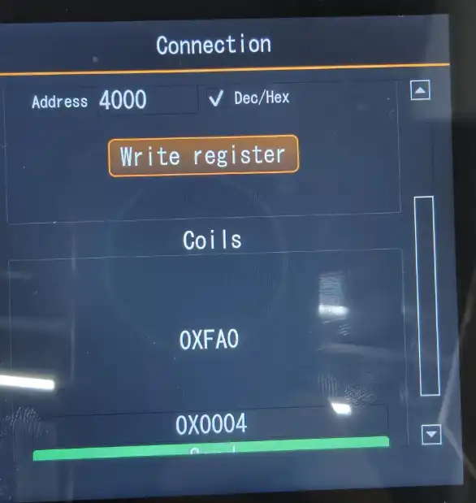
-   Set ui->quantity to 1, with the address set to 4000, check the checkbox, and convert it to hexadecimal. (Currently, only support keeping the register successfully writable and readable), then click the "send" button.

Observation message:<br/>
**Message Analysis:**

Sent message: 00 01 00 00 00 06 00 06 40 00 00 04
- Transaction Identifier: 00 01 (0x0001)
- Protocol Identifier: 00 00 (0x0000, indicating Modbus protocol)
- Length: 00 06 (0x0006, indicating there are 6 bytes following)
- Unit Identifier: 00 (0x00)
- Function Code: 06 (0x06, indicating writing a single holding register)
- Data: 40 00 00 04 (a total of 4 bytes)
- Register Address: 40 00 (0x4000)
- Register Value: 00 04 (0x0004)
Response message: 00 01 00 00 00 06 00 06 40 00 00 04
- Completely consistent with the request message, indicating success.

##### Reading and writing of the retention register implementation
```cpp
void mcontrol::on_btn_control_clicked()
{
    ...
    uint16_t *readDatas = new uint16_t[quantity];
    else if(ui->comboBox->currentIndex() == 2)
    {
        res = modbus_read_registers(modbusContext,actualaddresss,quantity,readDatas);
    }
    ...

    if(res == quantity)
    {
        ...
        else if(ui->comboBox->currentIndex() == 2)
        {
            QVector<uint16_t> values;
            for (int i = 0; i < quantity; i++) {
                values.append(readDatas[i]);
            }

            registersContainer->setValues(values);
        }
        ...
    }
}
```
**Code Function Analysis:**
-   When the read hold register is selected, click the control page function button to call the modbus_read_registers function to read and save the data into the readDatas variable. Also, make sure to add it to the corresponding register value box.

Message Analysis:<br/>
- Request message analysis (Function code 03: Read holding register)
    - Transaction Identifier: 00 02 (2 bytes) -> Transaction ID is 2
    - Protocol Identifier: 00 00 (2 bytes) -> Modbus protocol
    - Length: 00 06 (2 bytes) -> The following unit identifier + function code + data total 6 bytes
    - Unit Identifier: 00 (1 byte) -> Slave station address 0
    - Function Code: 03 (1 byte) -> Read holding register
    - Starting Address: 40 00 (2 bytes) -> 0x4000 (corresponding to register address 40001, because Modbus register addresses start from 0, but people usually use 40001 to represent)
    - Quantity of Registers: 00 01 (2 bytes) -> Read 1 register
    - Response message analysis
    - Corresponding response to the request message, and finally sending the register value (Register Value): 00 04 -> Indicates that the read register value is 0x0004.

##### Reading discrete inputs and input registers implementation
Since the Modbus RTU Relay does not support the reading of discrete inputs and input registers, we can only analyze from the output log whether the transmission was correct. Taking the reading of discrete inputs as an example:
```cpp
bool DITable::readFromDevice(modbus_t *ctx, int slaveId, int startAddress, int count)
{
    if (!ctx) {
        qWarning() << "No Modbus context available";
        return false;
    }

    if (count > m_maxPoints) {
        qDebug() << "Limiting DI read to max points:" << m_maxPoints;
        count = m_maxPoints;
    }

    uint8_t *data = new uint8_t[count];

    modbus_set_slave(ctx, slaveId);

    int result = modbus_read_input_bits(ctx, startAddress, count, data);

    if (result == count) {
        updateData(startAddress, data, count, m_hexMode);
        delete[] data;
        return true;
    } else {
        qWarning() << "Failed to read discrete inputs:" << modbus_strerror(errno);
        delete[] data;
        return false;
    }
}
```
**Code Function Analysis:**
- Create a DITable to display discrete inputs in tabular form.
- Obtain the Modbus context and use modbus_read_input_bits to read the discrete inputs.

Message analysis: <br/>
- Request message (12 bytes in total):
    - 00 01: Transaction Identifier (0x0001)
00 00: Protocol Identifier - 0x0000 (Modbus)
00 06: Length field - 0x0006 (indicating there are 6 bytes following)
00: Unit Identifier - 0x00 (can be considered as Slave ID)
02: Function Code - 0x02 (Read Discrete Inputs)
40 00: Start Address - 0x4000 (Note: Modbus register addresses start from 0, but here it is represented as 0x4000?)
00 08: Quantity - 0x0008 (8 discrete inputs)
- The response message is an error message:
    - 00 01: Transaction Identifier - 0x0001 (matches the request)
00 00: Protocol Identifier - 0x0000
00 03: Length field - 0x0003 (followed by 3 bytes)
00: Unit Identifier - 0x00
82: Function Code - 0x82 (which is 0x80 | 0x02, indicating an abnormal response to function code 02)
01: Exception Code - 0x01 (Illegal Function)

## 6. Virtual Keyboard Implementation
In the project, add a class named "virtualkeyboard" as the implementation of the virtual keyboard. This class is used to record user input, set link configuration in the link configuration section, set addresses, register values, and other settings in the control interface.

### 6.1Keyboard interface
```cpp
void virtualkeyboard::setupUI()
{
    QGridLayout *layout = new QGridLayout(this);
    layout->setSpacing(5);
    layout->setContentsMargins(10, 10, 10, 10);

    for (int i = 0; i < 10; ++i) {
        QString text = QString::number(i);
        QPushButton *btn = new QPushButton(text);
        btn->setMinimumSize(60, 60);
        connect(btn, &QPushButton::clicked, this, &virtualkeyboard::handleButtonClick);
        m_buttons[text] = btn;
    }

    for (char c = 'A'; c <= 'F'; ++c) {
        QString text = QString(c);
        QPushButton *btn = new QPushButton(text);
        btn->setMinimumSize(60, 60);
        connect(btn, &QPushButton::clicked, this, &virtualkeyboard::handleButtonClick);
        m_buttons[text] = btn;
    }

    QPushButton *decimalBtn = new QPushButton(".");
    decimalBtn->setMinimumSize(60, 60);
    connect(decimalBtn, &QPushButton::clicked, this, &virtualkeyboard::handleButtonClick);
    m_buttons["."] = decimalBtn;

    QPushButton *delBtn = new QPushButton("DEL");
    delBtn->setMinimumSize(60, 60);
    connect(delBtn, &QPushButton::clicked, this, &virtualkeyboard::handleButtonClick);
    m_buttons["DEL"] = delBtn;

    QPushButton *closeBtn = new QPushButton("Close");
    closeBtn->setMinimumSize(60, 60);
    connect(closeBtn, &QPushButton::clicked, this, &virtualkeyboard::hideKeyboard);

    layout->addWidget(m_buttons["7"], 0, 0);
    layout->addWidget(m_buttons["8"], 0, 1);
    layout->addWidget(m_buttons["9"], 0, 2);

    layout->addWidget(m_buttons["4"], 1, 0);
    layout->addWidget(m_buttons["5"], 1, 1);
    layout->addWidget(m_buttons["6"], 1, 2);

    layout->addWidget(m_buttons["1"], 2, 0);
    layout->addWidget(m_buttons["2"], 2, 1);
    layout->addWidget(m_buttons["3"], 2, 2);

    layout->addWidget(m_buttons["0"], 3, 0);
    layout->addWidget(m_buttons["."], 3, 1);
    layout->addWidget(m_buttons["DEL"], 3, 2);

    layout->addWidget(m_buttons["A"], 0, 3);
    layout->addWidget(m_buttons["B"], 0, 4);
    layout->addWidget(m_buttons["C"], 1, 3);
    layout->addWidget(m_buttons["D"], 1, 4);
    layout->addWidget(m_buttons["E"], 2, 3);
    layout->addWidget(m_buttons["F"], 2, 4);
    layout->addWidget(closeBtn, 3, 3, 1, 2);
    updateButtonVisibility();
}

void virtualkeyboard::updateButtonVisibility()
{
    for (char c = 'A'; c <= 'F'; ++c) {
        m_buttons[QString(c)]->setVisible(m_hexMode);
    }
    m_buttons["."]->setVisible(!m_hexMode);
}
```
**Code Function Analysis:**
- Create the keyboard UI interface and add the layout.
- Add basic decimal and hexadecimal digits, and switch the display status through the updateButtonVisibility function.
- Link the buttons to the slot functions.
- Add function buttons, including the decimal point and the delete button.

### 6.2Keyboard input function implementation
```cpp
void virtualkeyboard::handleButtonClick()
{
    if (!m_currentLineEdit) return;

    QPushButton *btn = qobject_cast<QPushButton*>(sender());
    if (!btn) return;

    QString text = btn->text();

    if (text == "DEL") {
        m_currentLineEdit->backspace();
    } else {
        m_currentLineEdit->insert(text);
    }
}
```

**Code Function Analysis:**
- `qobject_cast<QPushButton*>(sender())` retrieves the object that triggered the signal.
- It checks whether it is a deletion button press. If so, it deletes one character from the target m_currentLineEdit; otherwise, it inserts a character.

### 6.3 Locking Input Object with Keyboard
In the input function, we operate on the m_currentLineEdit member. Additionally, we need to add an interface for it and bind it to the Lineedit components in the project that require virtual keyboard input:
```cpp
void virtualkeyboard::registerLineEdit(QLineEdit *lineEdit)
{
    connect(lineEdit, &QLineEdit::selectionChanged, [this, lineEdit]() {
        m_currentLineEdit = lineEdit;
        show();
    });
}
```
**Code Function Analysis:**
- Connect the selection change signal of the line edit for parameter binding (selectionChanged), assign the corresponding line edit to the member m_currentLineEdit, and display it.
- Add a virtual keyboard member to the required interface and bind it to the Lineedit for the required input.

The operation effect is as follows:<br/><br/>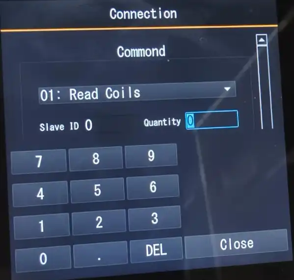


## 7. Main Interface
### 7.1 Main Interface Display Framework
```cpp
void Widget::setupUI()
{
    QVBoxLayout *mainLayout = new QVBoxLayout(this);
    mainLayout->setSpacing(0);
    mainLayout->setContentsMargins(0, 0, 0, 0);

    QLabel *headerLabel = new QLabel("Connection");
    headerLabel->setAlignment(Qt::AlignCenter);
    headerLabel->setStyleSheet(
                "font-size: 35px;"
                "font-weight: bold;"
                "color: #ffffff;"
                "background-color: #1E1E1E;"  
                "padding: 20px 0;" 
                );
    mainLayout->addWidget(headerLabel,1);

    QFrame *separator = new QFrame();
    separator->setFixedHeight(3);
    separator->setStyleSheet("background-color: #FF8C00;");
    mainLayout->addWidget(separator);

    containerWidget = new QWidget(this);
    containerWidget->setObjectName("containerWidget");
    containerWidget->setSizePolicy(QSizePolicy::Expanding, QSizePolicy::Expanding);\


    QVBoxLayout *containerLayout = new QVBoxLayout(containerWidget);
    containerLayout->setContentsMargins(0, 0, 0, 0);

    connectionWidget = new connection(containerWidget);
    controlwidget = new mcontrol(containerWidget);

    connect(connectionWidget,&connection::modbusConnectionEstablished,
            controlwidget, &mcontrol::setModbusConnection);

    connect(connectionWidget, &connection::modbusDisconnected, [this](){
           controlwidget->setModbusConnection(nullptr);
       });

    connectionWidget->move(0, 0);
    controlwidget->move(width(), 0); 
    connectionWidget->move(0, 0);
    controlwidget->move(width(), 0); 

    mainLayout->addWidget(containerWidget,9); 

    setMaximumSize(720, 720);
}
```
**Code Function Analysis:**
- Use a divider to separate the sub-interface areas and the main interface title.
- Create interface objects for the linked and control interfaces, and move the control interface to the screen edge to facilitate subsequent switching.
- Link the signals of the Modbus context of the sub-interface with the slot functions.
- Set the size of the main interface.

### 7.2 Implementation of Sliding Switch Function
```cpp
void Widget::mousePressEvent(QMouseEvent *event)
{
    m_startPosX = event->x();
    QWidget::mousePressEvent(event);
}

void Widget::mouseMoveEvent(QMouseEvent *event)
{
    m_curPosX = event->x();
    int delta = m_curPosX - m_startPosX;
    if (delta > 30)
    {
        QPropertyAnimation *animation = new QPropertyAnimation(controlwidget, "pos");
        animation->setDuration(500);
        animation->setStartValue(QPoint(0, 0));
        animation->setEndValue(QPoint(width(), 0));
        animation->start(QAbstractAnimation::DeleteWhenStopped);
        QPropertyAnimation *animation2 = new QPropertyAnimation(connectionWidget, "pos");
        animation2->setDuration(500);
        animation2->setStartValue(QPoint(-width(), 0));
        animation2->setEndValue(QPoint(0, 0));
        animation2->start(QAbstractAnimation::DeleteWhenStopped);
    }
    else if (delta < -30)
    {
        QPropertyAnimation *animation = new QPropertyAnimation(connectionWidget, "pos");
        animation->setDuration(500);
        animation->setStartValue(QPoint(0, 0));
        animation->setEndValue(QPoint(-width(), 0));
        animation->start(QAbstractAnimation::DeleteWhenStopped);
        QPropertyAnimation *animation2 = new QPropertyAnimation(controlwidget, "pos");
        animation2->setDuration(500);
        animation2->setStartValue(QPoint(width(), 0));
        animation2->setEndValue(QPoint(0, 0));
        animation2->start(QAbstractAnimation::DeleteWhenStopped);
    }
    m_startPosX = m_curPosX;
    QWidget::mouseMoveEvent(event);
}

void Widget::mouseReleaseEvent(QMouseEvent *event)
{
    m_startPosX = 0;
    m_curPosX = 0;
    QWidget::mouseReleaseEvent(event);
}
```
**Code Function Analysis:**
- Rewrite the mouse click, release, and movement events of the main interface.
- **Click Event**: Record the current x-coordinate of the mouse, and handle it by default later.
- **Movement Event**:
- Obtain the coordinates after movement, calculate the displacement difference.
- Set two animations, one for sliding left to switch the control interface, and the other for sliding right to return to the link page.
- **Release Event**: Clear the new and old coordinates to prepare for the next sliding. 

The final main interface is displayed as follows:<br/>

At this point, the design of the Modbus demo project has been completed.
