In this tutorial, we will provide a detailed introduction on how to implement simple controls using QT and transplant and run the reference program on the Luckfox-Pico-86-Panel development board to demonstrate the effect.
## 1. Qt Introduction
Qt: a cross-platform C++ development library, mainly used for developing graphical user interface applications.

**Meaning of the name**：
The letter `Q` is used as the prefix for all classes because Haavard thought this letter was particularly aesthetically
The letter `t` stands for "toolkit", inspired by toolkits such as Xt (X Toolkit).

### Advantages:
- **Cross-platform**：
  Qt supports mainstream operating systems, including Windows and Linux.
  
- **Open-source**：
  Provides complete source code, facilitating developers' learning and customization.

- **Rich AP**：
  - Qt includes over 500 C++ classes, covering the following areas: 
  - Template-based collections
  - Files and I/O devices
  - Directory management
  - Date/time processing
  - Regular expression functionality

- **Graphics rendering:**：
  Supports 2D/3D graphics rendering and integrates OpenGL technology.

- **Object-oriented design**：
  - Highly modular encapsulation mechanism to improve code reusability 
  - Original **Signals/Slots** mechanism：
    A type-safe callback alternative that simplifies collaboration between components.

- **QML script development**：
  - **QML module**：Provides a declarative scripting language 
  - **Qt Quick module**：  
    - Offers a library of visual components
    - Supports model-view architecture
    - Built-in animation framework
    - Focuses on dynamic user interface construction


### 1.1Parsing of Qt project files：

- The .pro file：<br/>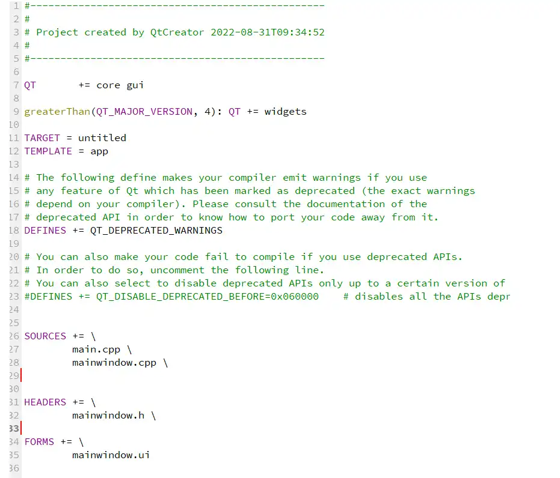
  - **QT**：Indicate the modules used by Qt
  - **TARGET**：     Generate the names of applications or libraries
  - **TEMPLATE**： Generate engineering type, application/library file
  - **DEFINES**：    Macro definition
  - **SOURCES**：  The C++ files involved in the compilation
  - **HEADERS**：   Required header files
  - **FORMS**：  UI file list, UI files are used to describe the program interface

Note: If you modify the .pro file, you must first execute qmake to make the .pro file take effect.


- The widget.h and widget.cpp files：<br/><br/>
  - **Q_OBJECT macro:**
    It must be placed in the private section of the class definition. This class definition declares its own signals and slots, and acquires other services provided by the QT meta-object system.
  - **Defined the construction and destruction functions for the main interface:**
    The "explicit" keyword is used to modify the constructor of a class. The constructor modified by this keyword cannot undergo implicit conversions; it can only perform type conversions in a visible manner.
  - **widget.cpp:**
    To implement the specific logic of the constructor and destructor functions, and set the ui pointer.

- The main.cpp file<br/>
  - **QApplication:**
   Manage the control flow and main settings of the graphical user interface application, including the main event loop, in which all events from the window system and other resources are processed and scheduled.
  - **a.exec():**
    Start the event loop.

## 2.Installation of QT (PC with Ubuntu 22.04 environment)

### 2.1Download the QT installation package
- Official website download: https://download.qt.io/archive/qt/5.12/5.12.9/

- If you cannot access the official website, you can download it from the cloud drive.
  - Baidu Netdisk: https://pan.baidu.com/s/1x2IIuymDogUaKXrKeNsNgg?pwd=ihim
  - Google Drive: https://drive.google.com/drive/folders/1ycihPEtzDTh_rEFOhBa2HAxp5zxQ7NXX?usp=drive_link

### 2.2Run the installation package
Transfer the downloaded installation package to the Ubuntu host or virtual machine. If you haven't registered a Qt login account, you can disconnect from the network to install without logging in with the account.

```shell
chmod +x qt-opensource-linux-x64-5.12.9
./qt-opensource-linux-x64-5.12.9
```

### 2.3Select Components<br/>

After the installation is completed, open QT

### 2.4Build kits<br/>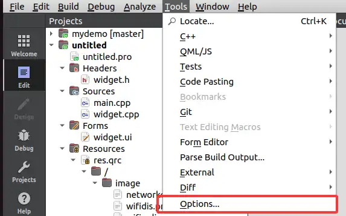<br/>
Ensure that the gcc and g++ compilers are 64-bit compilers, and the QT version is also 64-bit.

### 2.5Construction project<br/><br/>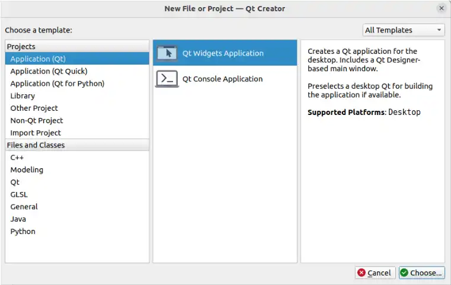<br/><br/><br/><br/>

Click "Complete" and the construction project is finished.<br/>

- **Project Outline Explanation**
  - **Headers**:Header file of the storage class
  - **Sources**:Implementation of the main function and classes
  - **Forms**:The UI files of Qt Designer can be used for graphical interface design.

Click to run<br/>

Display window<br/>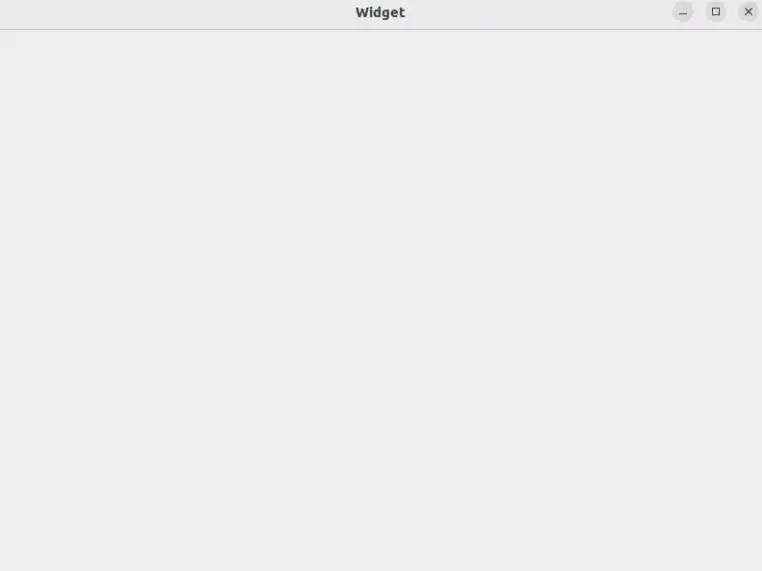

At present, the basic QT project has been set up. Next, we need to understand the most core signals and slots in QT, and get familiar with the basic controls.

## 3.Signals and Slots
The signal-slot mechanism of Qt is a sophisticated event handling system used for communication between objects. It replaces the traditional callback mechanism and offers a more flexible and type-safe way of object-to-object communication.
### 3.1Basic Concepts
- **Signal**：When the state of the object changes, it can emit a signal. A signal is a function declaration, which only needs to be declared and does not require implementation (generated by moc). Signals can have parameters.
- **Slot**：A slot is a common member function that can be called to respond to the emission of a specific signal. Slot functions can have parameters and can be called just like ordinary functions. Slots can be public, protected or private, and they can also be declared as virtual functions.
- **Connect**：Use the `QObject::connect()` function to associate signals with slots. When a signal is emitted, the slot function connected to it will be automatically called.

### 3.2Characteristics of Signals and Slots
- **Type safety**：The parameter types of the signal and slot must match; otherwise, errors will occur during compilation or at runtime (when using the new connection syntax).
- **Loose coupling**：The signal sender doesn't need to know who receives the signal, and the slot doesn't need to know who sent the signal. Through the connect connection, the dependency between objects is minimized to the greatest extent.
- **Support many-to-many relationship**：A signal can connect to multiple slots, and a slot can also respond to multiple signals.
- **Automatic disconnection**：When an object is deleted, QT will automatically disconnect all the connections related to that object to avoid the problem of dangling pointers.
  
### 3.3Declaration of Signals and Slots
In a class definition, the `signals` and `slots` keywords need to be used in the header file to declare signals and slots. Note: This class must directly or indirectly inherit from `QObject`, and the `Q_OBJECT` macro must be declared in the class definition.

### 3.4Summary
Signals and slots mechanism is a powerful tool for object communication in QT. It provides a type-safe and loosely-coupled communication method through the meta-object system. Mastering the use of signals and slots is the foundation for efficient development of QT applications.

## 4.Basic controls and layouts

### 4.1QWidget
The QWidget class is the base class for most user interface objects. In QT, most of the basic controls are derived from the QWidget class. In the QT design, QWidget is basically used as a window control for display, serving as the basic carrier for display effects. Its geometric properties are as follows:<br/>
frameGeometry, frameSize, x, y, pos represent the geometric area and size of the frame, where the frame refers to the outermost layer of the window. geometry, width, height, size, rect are the related attributes of the internal drawing area.

### 4.2QLabel
QLabel is used to display text or images and does not provide user interaction functionality.
Drag QLabel onto the main window:<br/>
Add the following code to the constructor：
```
Widget::Widget(QWidget *parent)
    : QWidget(parent)
    , ui(new Ui::Widget)
{
    ui->setupUi(this);
    ui->label->setText("this is label");
}
```
The operation effect is as follows:<br/>

### Code Function Description
  - The "setText" function sets the current displayed text of the QLabel. QLabel can not only display text, but also display images through "setPixmap", and gif files through "setMovie". These operations require us to add resource files. More details will be introduced in the subsequent comprehensive example.

### 4.3QPushButton
Buttons or command buttons are perhaps the most commonly used widgets in any graphical user interface. Pressing (clicking) a button enables the computer to perform certain operations or answer questions, such as the buttons we often see: "OK", "Apply", "Cancel", "Close", "Yes", "No", and "Help", etc.

Drag the Push Button component onto the main interface:<br/>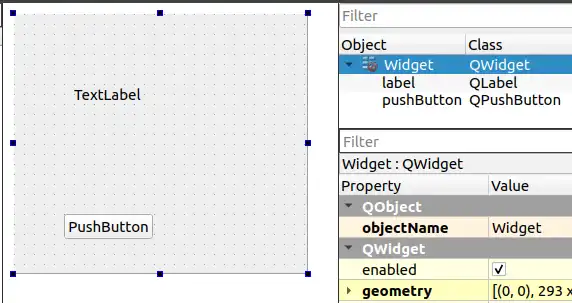
Right-click the object, then select "Go to Slot"：<br/>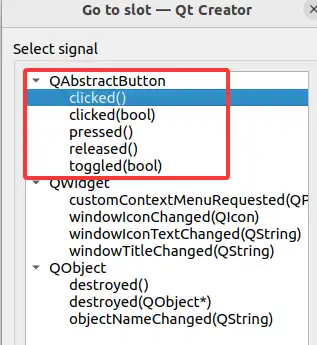

QPushButton inherits from QAbstractButton and mainly provides the following signals:

| Signal prototype                               | Trigger conditions                                    |
|------------------------------------------|---------------------------------------------|
| `clicked(bool checked = false)`          | Triggered when the mouse button is released (common practice)                 |
| `pressed()`                              | The button is triggered when it is pressed.                           |
| `released()`                             | The button is triggered when it is released.                        |
| `toggled(bool checked)`                  | Triggered when the button status changes (only when checkable is true) |
| `clicked()`                              | Qt 5.15 introduces a clicked signal without parameters           |

Select the "clicked()" signal without parameters. This will automatically generate the declaration and definition of the slot function in widget.h and widget.cpp. Then, add the following code in the slot function:
```cpp
void Widget::on_pushButton_clicked()
{
    
    int red = QRandomGenerator::global()->bounded(256);
    int green = QRandomGenerator::global()->bounded(256);
    int blue = QRandomGenerator::global()->bounded(256);

    
    QString style = QString("background-color: rgb(%1, %2, %3);")
            .arg(red).arg(green).arg(blue);
    ui->label->setStyleSheet(style);
}
```
The operation effect is as follows：<br/>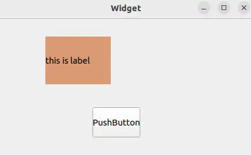

### Code Function Description
- In the slot function, a random color is generated each time it is triggered. The background-color of the label is set using setStyleSheet, thereby changing the background color of the label.

### 4.4QLineEdit
The line editing feature enables users to input and edit a single line of plain text using a set of useful editing functions, including undo and redo, cut and paste, as well as drag and drop.

Drag the LineEdit component onto the main window:<br/>
Right-click on this component and select "Go to Slot"<br/>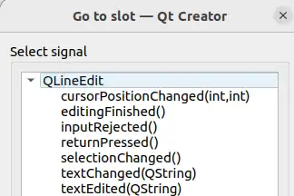

QLineEdit mainly provides the following signals:

| signals | triggering condition |
|------|----------|
| `textChanged(const QString &)` | Any change triggers the process. |
| `textEdited(const QString &)` | The user triggers the editing of the text (the program sets that editing of the text will not be triggered) |
| `returnPressed()` | It is triggered when the user presses the Enter/Return key. |
| `editingFinished()` | Triggered when the editing is completed (the focus moves out or Enter is pressed) |
| `selectionChanged()` | Triggered when the selected text is changed |
| `cursorPositionChanged(int, int)` | Triggered when the cursor position changes |

When we are editing text in our daily work, in most cases we use the Enter key to indicate the end of the current editing. We choose to use "returnPressed()" and add the following code in the slot function:
```cpp
void Widget::on_lineEdit_returnPressed()
{
    QString ret = ui->lineEdit->text();
    ui->label->setText(ret);
}
```
The operation effect is as follows:<br/>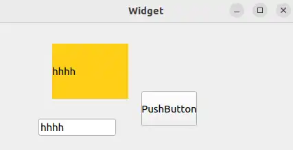

### Code Function Description
- In the slot function, when the enter condition is triggered, the current text of the lineEdit is obtained through the "text" method, and then it is displayed on the label using the "setText" method.

### 4.5QSlider
The slider is a classic widget used to control bounded values. It enables users to move the slider handle along the horizontal or vertical groove and convert the position of the handle into an integer value within the valid range.

Drag the horizontal Slider component to the bottom of the main interface:<br/>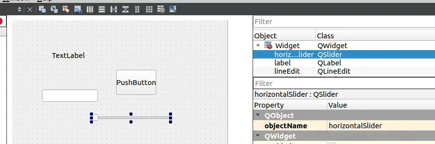
Right-click on this component and select "Go to Slot":<br/>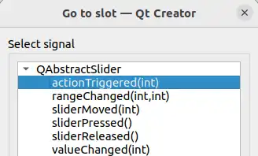

The QSlider mainly provides the following signals:

| signals | triggering condition | parameter specification |
|------|----------|----------|
| `valueChanged(int)` | Triggered when the slider value changes | Pass the current slider value |
| `sliderMoved(int)` | When the user drags the slider, it triggers **real-time**. | Transmit the value of the slider during dragging|
| `sliderPressed()` | The user triggers the function when they press the slider. | parameter-free|
| `sliderReleased()` | The event is triggered when the user releases the slider. | parameter-free |
| `rangeChanged(int, int)` | Triggered when the slider range changes | (minimum value, maximum value) |
| `actionTriggered(int)` | When the slider is interactively triggered | Trigger action type |

We chose the valueChanged(int) signal, and added the following code in the slot function:
```cpp
void Widget::on_horizontalSlider_valueChanged(int value)
{
    int alpha = static_cast<int>(value * 2.55);

    QColor newColor = ui->label->palette().color(QPalette::Window);
    newColor.setAlpha(alpha);

    QString styleSheet = QString("background-color: rgba(%1, %2, %3, %4);"
                                 "color: %5;"
                                 "font-size: 15px;"
                                 "padding: 0px;")
            .arg(newColor.red())
            .arg(newColor.green())
            .arg(newColor.blue())
            .arg(alpha)
            .arg(alpha > 127 ? "white" : "black");

    ui->label->setStyleSheet(styleSheet);

}
```
The operation effect is as follows:<br/>

### Code Function Description
- In the slot function, the valueChanged event of the sliding module is triggered. The current color of the label is obtained from the palette, and the style sheet is set to change the transparency of the current color of the label.


### 4.6Layout Management
In Qt Designer, there are various window layouts available: Vertical Layout, Horizontal Layout, Grid Layout, Form Layout, etc. Among them, QHBoxLayout and QVBoxLayout inherit from QBoxLayout, QBoxLayout and QGridLayout inherit from QLayout, and QLayout inherits from QObject and QLayoutItem.<br/>

- **Vertical Layout**
  Select the desired control and click on the vertical layout (UI designer toolbar) at the top.）<br/>
  The controls within the vertical layout will automatically be distributed in the vertical direction.
- **Horizontal Layout**
  Select the desired control and click on the horizontal layout (UI designer toolbar) at the top.<br/>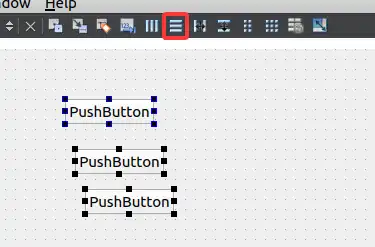
  The controls within the horizontal layout will automatically be distributed horizontally.
- **Grid Layout**
  Select the desired control and click on the grid layout (UI designer toolbar) at the top.<br/>
  The controls within the grid layout will automatically be distributed (divided into rows and columns) in the grid direction.
- **Form Layout**
  Select the desired control and click on the form layout (UI designer toolbar) at the top.<br/>
  Similar to the grid layout, only the rightmost column of the grid will change size.
## 5.Comprehensive routine
After learning about the basic controls and layouts in the previous chapter, we will complete a comprehensive example to further enhance our understanding. Here is the final implementation result of the comprehensive example.<br/>

### 5.1Analysis page
- **Time display interface**
  - Two vertically arranged QLabel widgets.
- **network interface**
  - The background window is a QWidget, which contains a QPushButton with an icon and two QLabel. The QWidget needs to implement horizontal layout for the QPushButton and QLabel, as well as a grid layout.
- **Overall interface**
  - The main interface also requires a grid layout to ensure that the components scale the same as the main window.

After analyzing the page, we know exactly which controls are needed for the comprehensive routine. In QT designer, we drag the corresponding components and arrange them, and the result is as follows:<br/>
Controls and layout are as follows:<br/>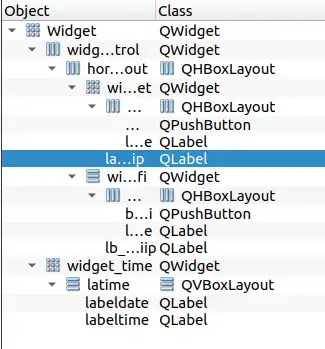

### 5.2Add resource file
When designing the QT interface, we always need to design some icon controls or place icon displays. Therefore, we need to add resource files to the project.
Create a new folder named "image" in the project directory. Return to the QT and right-click on the project, select "Add New", and choose the resource file from the QT template.<br/>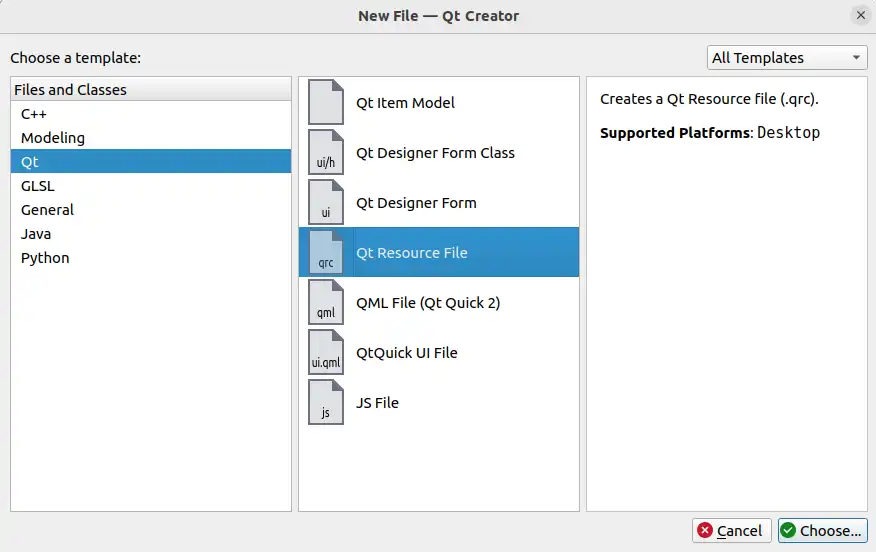<br/>

To search for icon resources, usually we can find the icons we need in the Alibaba Vector Icons Library. The website address is:https://www.iconfont.cn/
Download the icon in the .png format and copy it to the "image" folder under the QT project in the virtual machine.<br/>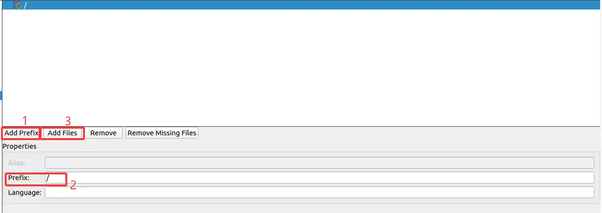

Add the resource file and save it.
In this way, we obtain the resource file of the icon. We can use the code to set the style sheet of the control. In the constructor, we add the following code:
```cpp

    ui->btn_wifi->setStyleSheet(R"(
                                QPushButton {
                                border-radius: 30px;
                                background-color: #515151;
                                color: white;
                                font-size: 14px;
                                border: none; 
                                outline: none; 
                                }
                                QPushButton:hover {
                                background-color: #515151;
                                }
                                QPushButton:pressed {
                                background-color: #515151;
                                }
                                )");
    QPixmap pixmap(":/image/wifidis.png");

    QPixmap scaledPixmap = pixmap.scaled(35, 35, Qt::KeepAspectRatio, Qt::SmoothTransformation);
    ui->btn_wifi->setIcon(QIcon(scaledPixmap));
    ui->btn_wifi->setIconSize(QSize(35, 35)); 
```

- **Code Function Description**
  - ui->btn_wifi refers to the button located in our UI file. The style sheet is used to set its style, including the border curvature, background color, font color and size, without a border, and to set the hover state when selected and the pressed state when pressed. 
  - `QPixmap pixmap(":/image/wifidis.png"); `, For the icon files under the resource file, we use the method of setting the icon through the 'setIcon' function, and set the display size of the icon using the 'setIconSize' function.

### 5.Overall page design
The other components are also designed in a similar way. The styles, icons, etc. are all set. The complete code in the constructor is as follows:
```cpp
Widget::Widget(QWidget *parent)
    : QWidget(parent)
    , ui(new Ui::Widget)
{
    ui->setupUi(this);


    ui->labeltime->setFrameShape(QFrame::NoFrame);

    //ui_init
    QPalette palette = ui->labeltime->palette();
    palette.setColor(QPalette::WindowText,Qt::white);
    ui->labeltime->setPalette(palette);
    ui->lb_wifiname->setPalette(palette);
    ui->lb_wifiip->setPalette(palette);
    ui->label_netname->setPalette(palette);
    ui->label_netip->setPalette(palette);


    QFont font = ui->labeltime->font();
    font.setPointSize(60);
    font.setWeight(QFont::Black);
    ui->labeltime->setFont(font);

    ui->labeltime->setAlignment(Qt::AlignCenter);

    ui->labeldate->setFrameShape(QFrame::NoFrame);

    palette = ui->labeldate->palette();
    palette.setColor(QPalette::WindowText,Qt::white);
    ui->labeldate->setPalette(palette);

    font = ui->labeldate->font();
    font.setPointSize(12);
    font.setBold(false);
    ui->labeldate->setFont(font);
    ui->labeldate->setAlignment(Qt::AlignCenter);
    ui->btn_wifi->setFixedSize(60, 60);

    ui->btn_wifi->setStyleSheet(R"(
                                QPushButton {
                                border-radius: 30px;
                                background-color: #515151;
                                color: white;
                                font-size: 14px;
                                border: none; 
                                outline: none; 
                                }
                                QPushButton:hover {
                                background-color: #515151;
                                }
                                QPushButton:pressed {
                                background-color: #515151;
                                }
                                )");
    QPixmap pixmap(":/image/wifidis.png");
    QPixmap scaledPixmap = pixmap.scaled(35, 35, Qt::KeepAspectRatio, Qt::SmoothTransformation);
    ui->btn_wifi->setIcon(QIcon(scaledPixmap));
    ui->btn_wifi->setIconSize(QSize(35, 35));

    ui->btn_net->setStyleSheet(R"(
                               QPushButton {
                               border-radius: 30px;
                               background-color: #515151;
                               color: white;
                               font-size: 14px;
                               border: none;
                               outline: none; 
                               }
                               QPushButton:hover {
                               background-color: #0b7dda;
                               }
                               QPushButton:pressed {
                               background-color: #0a69b7;
                               }
                               )");

    QPixmap pixmap2(":/image/internet-error-solid.png");
    QPixmap scaledPixmap2 = pixmap2.scaled(35, 35, Qt::KeepAspectRatio, Qt::SmoothTransformation);
    ui->btn_net->setIcon(QIcon(scaledPixmap2));
    ui->btn_net->setIconSize(QSize(35, 35)); 

    ui->lb_wifiname->setText("----");
    ui->lb_wifiname->setStyleSheet("color: #ffffff; background: transparent; border: none;");
    ui->lb_wifiip->setText("No IP");
    ui->lb_wifiip->setStyleSheet("color: #ffffff; background: transparent; border: none;");

    ui->label_netname->setText("----");
    ui->label_netip->setText("No IP");

    this->setWindowFlags(Qt::FramelessWindowHint);

    this->setStyleSheet("background-color: black;");

}
```
By designing the styles and beautifying each control, the desired effect can be achieved.<br/>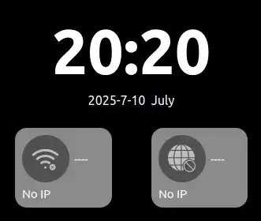

### 4.Control interaction logic
#### Display the current time
In the two QLabel elements on the time display interface, the current time and date need to be displayed. The following member functions are available:
```cpp
void Widget::updatetimedisplay()
{
    QDateTime utcDateTime = QDateTime::currentDateTimeUtc();

    QDateTime beijingDateTime = utcDateTime.addSecs(8 * 3600);

    QTime currenttime = beijingDateTime.time();
    QString timeStr = QString("%1:%2")
            .arg(currenttime.hour(), 2, 10, QChar('0'))
            .arg(currenttime.minute(), 2, 10, QChar('0'));

    ui->labeltime->setText(timeStr);

    QDate currentdate = beijingDateTime.date();
    QString dateStr = currentdate.toString("yyyy-MM-dd dddd");
    ui->labeldate->setText(dateStr);
}
```
- **Code Function Description**
- Use `QDateTime::currentDateTimeUtc()` to obtain the current UTC time.
- Use `addSecs(8 * 3600)` to add 8 hours (i.e., 28800 seconds) to the UTC time to get Beijing time.
- Use `QDateTime::time()` to obtain the time part, and then use `QString::arg` to format the hour and minute into two digits (padding 0 if less than two digits).
- Use `QDateTime::date()` to obtain the date part, and then use `QDate::toString` to output the string in the specified format. Here, "yyyy" represents the four-digit year, "MM" represents the two-digit month, "dd" represents the two-digit day, and "dddd" represents the full name of the day of the week (such as Monday).
- Finally, set the formatted string to the corresponding UI label.

In the constructor, call this member function. When the program runs, the time display interface will show the current time (Beijing time). However, we need to refresh it in real time. This can be achieved by using a timer:
```cpp
    timer = new QTimer(this);
    connect(timer,&QTimer::timeout,this,&Widget::updatetimedisplay);
    timer->start(1000);
    updatetimedisplay();
```
- **Code Function Description**
  - The QTimer timer links the timing signal with the member function of the refresh time interface through the connect function, and is set to refresh every 1 second.

#### Key-switching function
We aim to achieve the effect of switching icons through button clicks. By using the signal-slot mechanism described in our routine, right-click on the btn_wifi component, go to the slot, select the clicked(bool checked) signal, and add the following code in the generated slot function:

```cpp
void Widget::on_btn_wifi_clicked(bool checked)
{
    if(checked)
    {
        QPixmap pixmap(":/image/wifionline.png");

        QPixmap scaledPixmap = pixmap.scaled(35, 35, Qt::KeepAspectRatio, Qt::SmoothTransformation);
        ui->btn_wifi->setIcon(QIcon(scaledPixmap));
        ui->btn_wifi->setIconSize(QSize(35, 35));
    }
    else
    {
        QPixmap pixmap(":/image/wifidis.png");
        QPixmap scaledPixmap = pixmap.scaled(35, 35, Qt::KeepAspectRatio, Qt::SmoothTransformation);
        ui->btn_wifi->setIcon(QIcon(scaledPixmap));
        ui->btn_wifi->setIconSize(QSize(35, 35)); 
    }

}
```
And the following code needs to be added in the constructor to ensure the toggleable state of the button btn_wifi:

```cpp
ui->btn_wifi->setCheckable(true); 
```

- **Code Function Description**
  - The function "clicked(bool checked)" indicates that the button component has a toggle state signal. The different logic for repeated clicking of the button is achieved through the flag "checked".
  - ":/image/wifionline.png" is a newly added resource file, which implements the function of switching icons. - `ui->btn_wifi->setCheckable(true); The purpose is to initialize the toggle state of the button. Otherwise, the checked flag will not automatically change after the signal is triggered.

Achieved effect
- First click:<br/>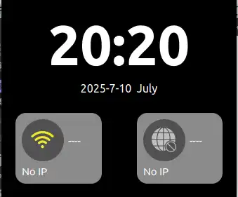
- Click again:<br/>


## 6.Transplant the routine to the development board

### 6.1 SDK environment
1. Configuring the environment under Ubuntu 22.04

To obtain the latest SDK.
```shell
git clone https://gitee.com/LuckfoxTECH/luckfox-pico.git
git clone https://github.com/LuckfoxTECH/luckfox-pico.git
```
Regarding the configuration of the SDK-related environment, please refer to the official tutorial: [SDK Environment Deployment](https://wiki.luckfox.com/zh/Luckfox-Pico/Luckfox-Pico-SDK)

### 6.Configure the QT image

1. Configure Qt, then press `\` to search for Qt 5

```shell
cd luckfox-pico
./build.sh lunch
./build.sh buildrootconfig
```
Search using the keyword "Qt5"<br/>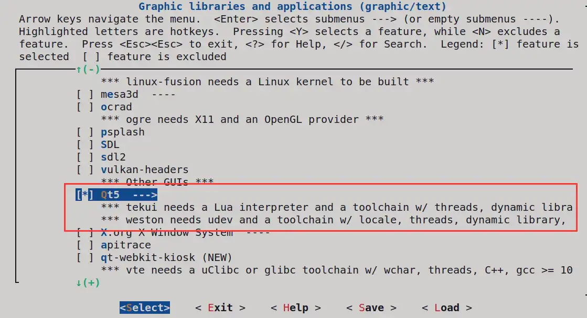<br/>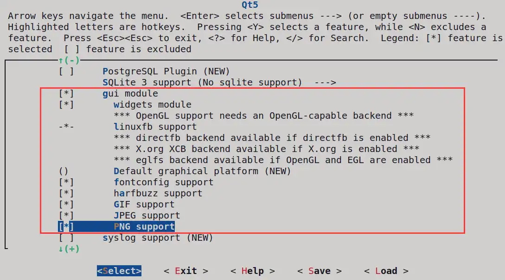

1. Install OpenGL
```shell
Target packages
　　->Libraries
　　　　->Graphics
　　　　　　->libdrm
　　　　　　　　->etnaviv
　　　　　　　　->Install test programs
    -> Graphic libraries and applications (graphic/text)
　　　　->mesa3d
　　　　　　->Gallium Etnaviv driver 
　　　　　　->Gallium swrast driver
　　　　　　->gbm
　　　　　　->OpenGL 
　　　　　　->OpenGL ES--OpenGL ES (OpenGL for Embedded Systems)。
```
select<br/>

1. Save configuration, compile and burn

```
echo 10 | ./build.sh lunch
./build.sh
```

Use the official tool to burn the "output/image" onto the development board.

### 6.3QT Kit Configuration


1. Add the font library to the development board's /usr/share/fonts directory.
Link: https://pan.baidu.com/s/1MorzYf0-3IT9byPAxWXCrg?pwd=ynwu
Extract code: ynwu
as follow:<br/>

2. Configuration kit
When installing QT, we selected the option for the QT source code components. Now, we need to configure the cross-compilation environment for it so that QT can run on the 86 development board.

g++ path:
```
luckfox-pico/sysdrv/source/buildroot/buildroot-2023.02.6/output/host/bin/arm-rockchip830-linux-uclibcgnueabihf-g++
```
gcc path：
```
luckfox-pico/sysdrv/source/buildroot/buildroot-2023.02.6/output/host/bin/arm-rockchip830-linux-uclibcgnueabihf-gcc
```
g++ path: Add compiler, modify name:<br/>
Configure the path of the SDK compiler:<br/>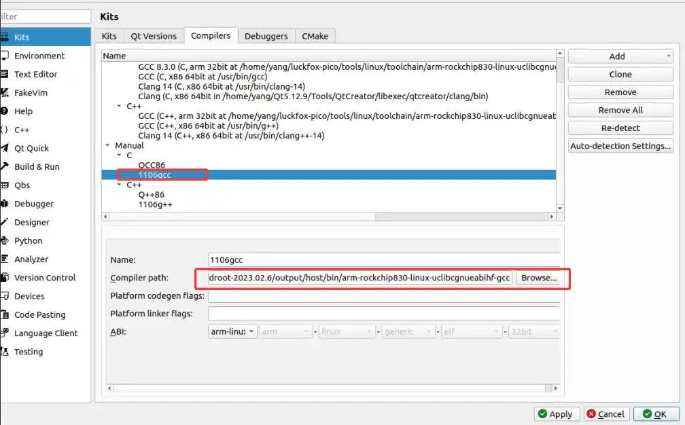

The path of the qmake for the SDK:
```
luckfox-pico/sysdrv/source/buildroot/buildroot-2023.02.6/output/host/bin/qmake
```
Add the QT version:
<br/>
Select the pre-configured cross-compiler and the corresponding version of qmake for QT:<br/>


select kit<br/>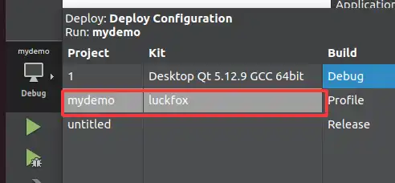

Build the comprehensive sample program. Execute `qmake && make` in the project directory. The generated executable file will be uploaded to the development board and then run.
```shell
./mydemo -platform linuxfb
```

### 6.4The operation effect of the development board<br/>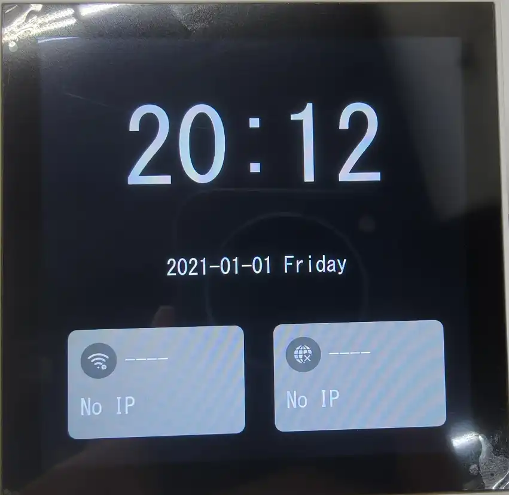
