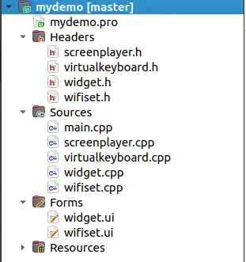
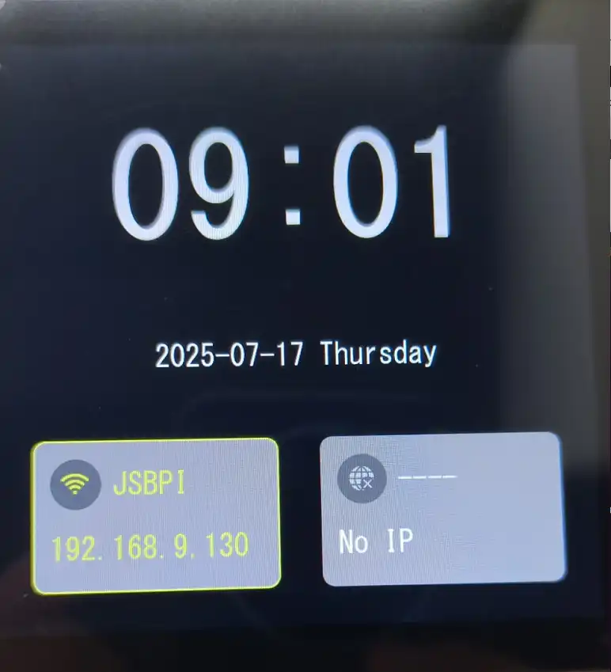
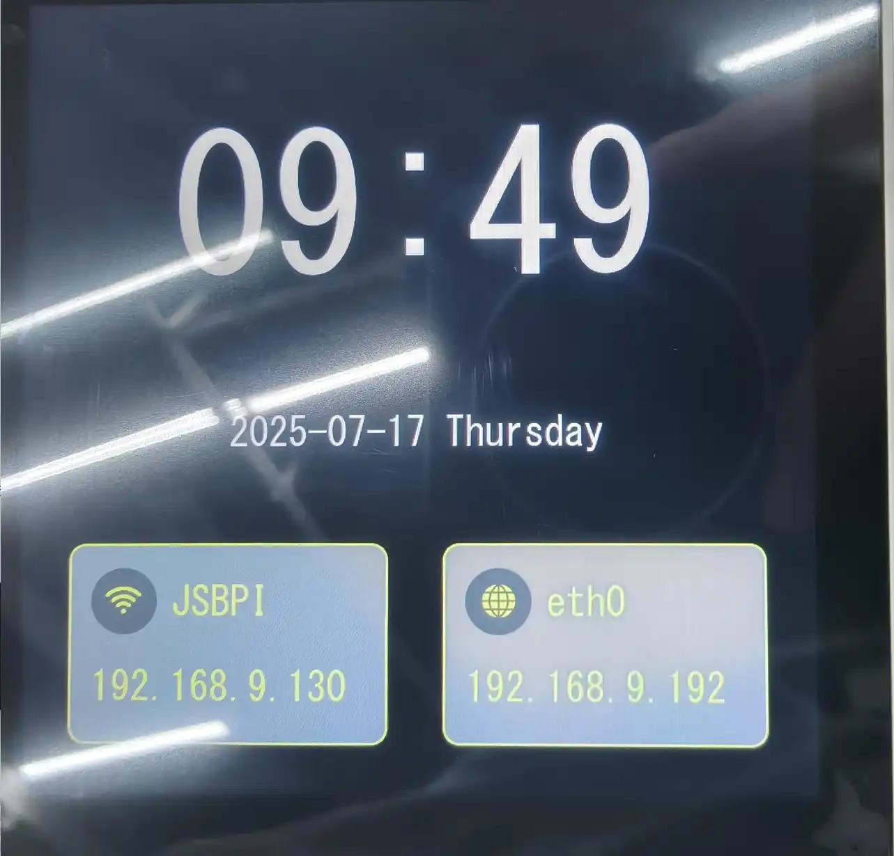
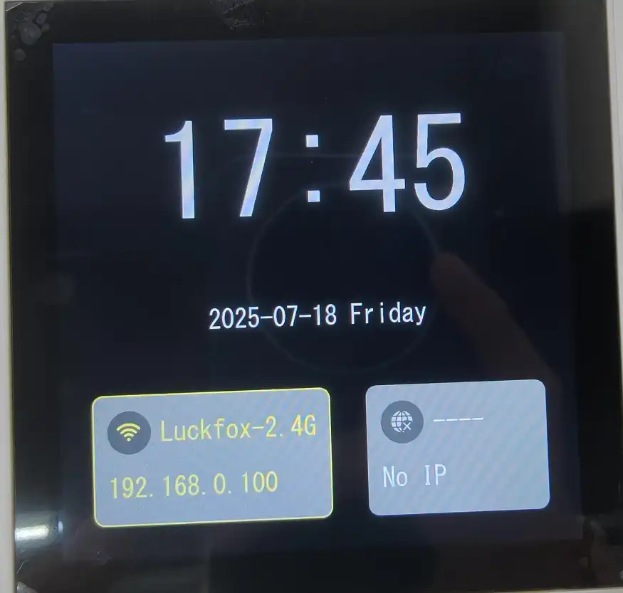
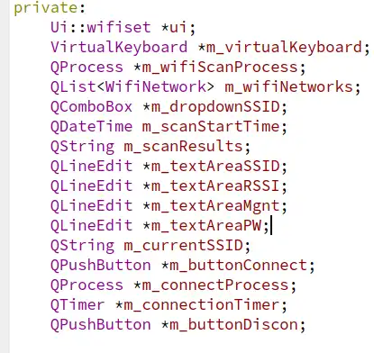
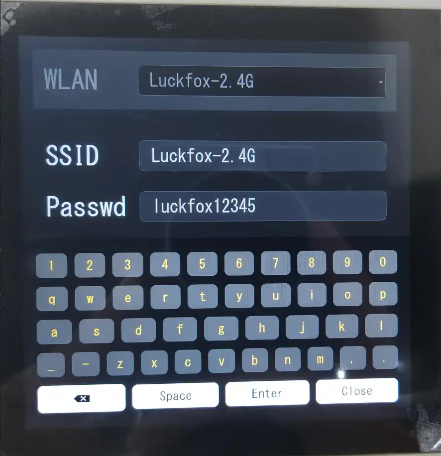
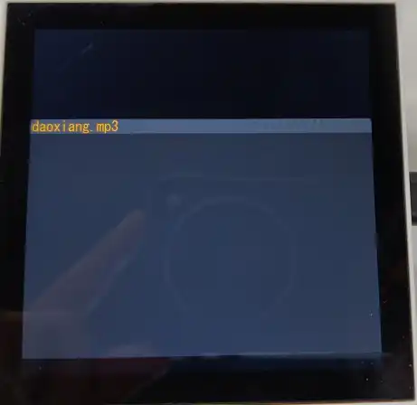
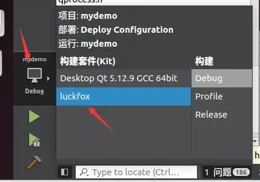
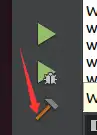

This tutorial uses QT 5.12.9 to implement the screen interface design and control interaction logic for the 86 panel, aiming to build a complete embedded GUI application.

## 1. Introduction
The 86-panel can be applied in the control layer scenarios of smart furniture. This designed intelligent terminal consists of a total of three interfaces, namely the main interface, the WiFi configuration interface, and the secondary interface. The list of its functions is as follows:

| Interface     | Function              | Description                                                                                          |
| :----------- | :-------------------- | :------------------------------------------------------------------------------------------------ |
| Main Interface | Display WIFI and ETH connection status | Displays the current network connection status, including IP address information of WIFI and ETH. If there is no network connection, displays the default "--". |
| Main Interface | Display time            | Displays the current time, obtained from QDateTime of the current system time                                   |
| Secondary Interface | Relay Switches      | Provides two relay switches. Users can control the opening and closing of the relays by sliding the switches. | |
| Sub-interface  | Audio Player          | Offers volume adjustment function and supports play/pause control.                                                |
| WIFI Configuration Interface | Configure WIFI | Users can input the SSID and password of WIFI, and the system supports saving and connection operations. |
| WIFI Configuration Interface | WIFI Control Interface | Users can control the connection or disconnection of WIFI, and scan for attached WIFI.  |

## 2. Configure Environment
For the installation of QT and the setup of the QT environment on the development board, you can refer to another tutorial titled "QT Migration Tutorial".

This project is developed based on Ubuntu 22.04 Linux. The design of this project is carried out accordingly. Open the .pro file in the project folder, and use the corresponding kits to build the project. After successful construction, the project architecture is as follows：<br/>

The files of the instantiated classes are stored in the "Headers" directory. The "Sources" directory contains the main functions and the specific implementations of the instantiated classes. The "Forms" directory stores the ui files designed through the Qt graphical interface. The "Resources" directory contains the resource files, mainly including icons (ICON).
## 3. Main Interface
### 3.1 UI Design of the Main Interface
The main interface adopts a graphical interface combined with code design styles to achieve UI design. In Widget.ui, the following components can be seen:<br/>
The preview UI interface is as follows<br/>
- **Interface Optimization Direction**
It can be seen that although I simply created some interface effects in QT Designer, the current designed interface is still rather rudimentary. We can change the display effect by setting the style sheet of the components. In this project, the style of the components is set through code in the constructor.
- **Specific Component Analysis (Taking widget_wifi as an example)**
  Taking widget_wifi as an example, this QWidget contains the component that displays the Wi-Fi status on the main interface. Specifically:
  - QLabel: Used to display the Wi-Fi name and IP.
  - Buttons: Implement custom functions. In this design, it is used to jump to the Wi-Fi configuration interface.
- **Other Component Situations**
The other components are similar to widget_wifi.

The following code can be found in the constructor of Widget.cpp
````CPP
Widget::Widget(QWidget *parent)
    : QWidget(parent)
    , ui(new Ui::Widget),
      scrplayer(nullptr)
{
    ...
    ui->btn_wifi->setStyleSheet(R"(
                                QPushButton {
                                border-radius: 30px;
                                background-color: #515151;
                                color: white;
                                font-size: 14px;
                                border: none;
                                outline: none;
                                }
                                QPushButton:hover {
                                background-color: #515151;
                                }
                                QPushButton:pressed {
                                background-color: #515151;
                                }
                                )");
    QPixmap pixmap(":/image/wifidis.png");）
    QPixmap scaledPixmap = pixmap.scaled(35, 35, Qt::KeepAspectRatio, Qt::SmoothTransformation);
    ui->btn_wifi->setIcon(QIcon(scaledPixmap));
    ui->btn_wifi->setIconSize(QSize(35, 35));
    ...   
}
````

- **Code Explanation:**
  - **Setting Style Sheet:** A circular button was set using setStyleSheet, with a background color of gray (#515151), no border (border: none), no focus outline (outline: none), hover state for pressed and released states (QPushButton:hover), etc.
  - **Setting Button Icon:** The icon was obtained using QPixmap, saved in the image folder under the project folder, added to the resource folder, and this method can be used to add icon resources later. Then, the icon was set usingsetIcon.

The design of other main interface components is similar to this example.
### 3.2 Display WIFI Status
1. In the Widget.ui file of the main interface, there are the following controls: widget_wifi, btn_wifi, lb_wifiname, lb_wifiip, which are used to display the WIFI status. Their styles are initialized in the constructor and settings are also made. They serve as the display container for the ETH status of the main interface. The status components are updated through the member function updateWifiStatus in the class, and the code is as follows:

```CPP
void Widget::updateWifiStatus(QLabel* lb_wifiname, QLabel* lb_wifiip)
{

    QProcess process;
    process.start("wpa_cli", QStringList() << "status");
    if (!process.waitForStarted() || !process.waitForFinished(3000)) {
        qWarning() << "Failed to run wpa_cli command";
        return;
    }

    QString output = process.readAllStandardOutput();
    QStringList lines = output.split('\n');

    QString ssid;
    QString ip;
    bool scanning = false;

    for (const QString& line : lines) {
        if (line.contains("wpa_state=SCANNING")) {
            scanning = true;
            break;
        }
        else if (line.startsWith("ssid=")) {
            ssid = line.section('=', 1).trimmed();
        }
        else if (line.startsWith("ip_address=")) {
            ip = line.section('=', 1).trimmed();
        }
    }
  
    QFont normalFont = lb_wifiname->font();
    if (scanning || ssid.isEmpty()) {
        
        lb_wifiname->setText("----");

        lb_wifiname->setStyleSheet("color: #ffffff; background: transparent; border: none;");

        lb_wifiip->setText("No IP");

        lb_wifiip->setStyleSheet("color: #ffffff; background: transparent; border: none;");
        ui->btn_wifi->setIcon(QIcon(":/image/wifidis.png"));
        ui->widget_wifi->setStyleSheet(
                    "QWidget#widget_wifi {"
                    "   background-color: #8a8a8a;"
                    "   border: 2px solid #8a8a8a;"
                    "   border-radius: 15px;"
                    "}");
    } else {
    
        lb_wifiname->setText(ssid);
        lb_wifiname->setStyleSheet("color: #f4ea2a; background: transparent; border: none;");
        ui->btn_wifi->setIcon(QIcon(":/image/wifionline.png"));
        if (ip.isEmpty()) {
            lb_wifiip->setText("No IP");
            lb_wifiip->setStyleSheet("color: #f4ea2a; background: transparent; border: none;");
        } else {
            lb_wifiip->setText(ip);
            lb_wifiip->setFont(normalFont);
            lb_wifiip->setStyleSheet("color: #f4ea2a; background: transparent; border: none;");
        }
        ui->widget_wifi->setStyleSheet(
                    "QWidget#widget_wifi {"
                    "   background-color: #8a8a8a;"
                    "   border: 2px solid #f4ea2a;"
                    "   border-radius: 15px;"
                    "}");
    }
}
```
The updateWifiStatus function is responsible for obtaining the current status of the Wi-Fi connection (SSID and IP address) and updating the WIFI status component.
- **Code step description**
  - **Execute the wpa_cli status command:** Construct the "wpa_cli status" string, execute the command through QProcess, and handle errors for incorrect execution and timeouts
  - **Parse command output:**
    -    If a line containing "wpa_state=SCANNING" is found, it indicates that the device is scanning for available networks. In this case, exit the loop directly.
    -    If a line containing "ssid=" is found, extract the SSID name.
    -    If a line containing "ip_address=" is found, extract the IP address.
  - **Update status component:** Handle the UI display identifiers for Wi-Fi connected and disconnected states.

2. The WIFI status update should be updated in real time. This design employs the QTimer timer for timed refreshing. In the Widget.hpp file, there are the following member variables:
```cpp
    QTimer *networkTimer;
```
In the constructor, initialize it and link the timing-triggered functions
```cpp
    networkTimer = new QTimer(this);
    connect(networkTimer, &QTimer::timeout, this, &Widget::checkNetworkStatus);
    networkTimer->start(3000); 
    update_eth_status();
```

By calling the "updateWifiStatus" function within the timed trigger function, the main interface's WIFI status can be refreshed at regular intervals.

From then on, the part showing the WIFI status is almost completed. The running image is as follows:<br/>

### 3.3 Display ETH Status
1. In the Widget.ui file of the main interface, there are the following controls: widget_net, btn_net, lb_netname, lb_netip, which are used to display the Wi-Fi status. Their initialization styles are also set in the constructor. They serve as the display container for the main interface's Wi-Fi status. The status components are updated through the member function updateWifiStatus in the class, and the code is as follows:
````cpp
/*****eth******/
void Widget::update_eth_status(void)
{
    static int last_carrier_state = -1;
    int current_carrier_state = 0;


    FILE *carrier_file = fopen("/sys/class/net/eth0/carrier", "r");
    if (carrier_file != NULL) {
        fscanf(carrier_file, "%d", &current_carrier_state);
        fclose(carrier_file);
    }

    if (current_carrier_state != last_carrier_state) {
        if (current_carrier_state == 1) {  
 
            if (system("pgrep udhcpc") == 0) {
                system("killall udhcpc");
            }

            system("udhcpc -i eth0 > /tmp/udhcpc.log 2>&1 &");
        }else if (last_carrier_state == 1) { 
            qDebug() << "Ethernet disconnected. Stopping DHCP...";

            if (system("pgrep udhcpc") == 0) {
                system("killall udhcpc");
            }

            ui->label_netname->setText("----");
            ui->label_netip->setText("Disconnected");
        }

        last_carrier_state = current_carrier_state;
    }

    if (current_carrier_state == 0) {
        ui->btn_net->setIcon(QIcon(":/image/internet-error-solid.png"));
        ui->label_netname->setText("----");
        ui->label_netip->setText("No IP");
        ui->label_netname->setStyleSheet("color: #ffffff; background: transparent; border: none;");
        ui->label_netip->setStyleSheet("color: #ffffff; background: transparent; border: none;");
        ui->widget_net->setStyleSheet(
                    "QWidget#widget_net {"
                    "   background-color: #8a8a8a;"
                    "   border: 2px solid #8a8a8a;"
                    "   border-radius: 15px;"
                    "}");
        return; 
    }

    FILE *fp;
    char command[MAX_LINE_LEN];
    char result[MAX_LINE_LEN];
    char eth_name[MAX_LINE_LEN] = {0};
    char eth_ip_address[MAX_LINE_LEN] = {0};
    strcpy(command, "ifconfig");

    fp = popen(command, "r");
    if (fp == NULL) {
        printf("Failed to run command\n");
        return;
    }

    int in_eth_block = 0;
    static int has_ip = 0;
    while (fgets(result, sizeof(result) - 1, fp) != NULL)
    {

        if (strstr(result, "eth0")) {
            in_eth_block = 1;
            sscanf(result, "%s", eth_name);
            //lv_label_set_text(ui_LabelEth, eth_name);
            ui->label_netname->setText(QString(eth_name));
            qDebug() << "ethname " << eth_name;
            continue;
        }

        if (in_eth_block && result[0] == '\n') {
            in_eth_block = 0;
            break;
        }

        if (in_eth_block && strstr(result, "inet addr:")) {
            char *ip_start = strstr(result, "inet addr:");
            if (ip_start) {
                ip_start += 10; 
                char *ip_end = strchr(ip_start, ' ');
                if (ip_end) {
                    *ip_end = '\0';
                }
                strncpy(eth_ip_address, ip_start, MAX_LINE_LEN - 1);
                eth_ip_address[MAX_LINE_LEN - 1] = '\0';
                has_ip = 1;
            }
            break;
        }
    }
    pclose(fp);
    if(has_ip)
    {
        ui->btn_net->setIcon(QIcon(":/image/neton.png"));
        ui->label_netip->setText(QString(eth_ip_address));
        ui->label_netname->setStyleSheet("color: #f4ea2a; background: transparent; border: none;");
        ui->label_netip->setStyleSheet("color: #f4ea2a; background: transparent; border: none;");
        ui->widget_net->setStyleSheet(
                    "QWidget#widget_net {"
                    "   background-color: #8a8a8a;"
                    "   border: 2px solid #f4ea2a;"
                    "   border-radius: 15px;"
                    "}");
    }
    else
    {
        ui->label_netname->setText("-------");
        ui->label_netip->setText("No IP");
        ui->label_netname->setStyleSheet("color: #ffffff; background: transparent; border: none;");
        ui->label_netip->setStyleSheet("color: #ffffff; background: transparent; border: none;");
        ui->widget_net->setStyleSheet(
                    "QWidget#widget_net {"
                    "   background-color: #8a8a8a;"
                    "   border: 2px solid #8a8a8a;"
                    "   border-radius: 15px;"
                    "}");
    }
}
````
- **Code Step Explanation:**
  - **Physical Connection Detection:**
    - Read the `/sys/class/net/eth0/carrier` file to determine the physical connection status (0 = disconnected, 1 = connected)
    - Use the static variable `last_carrier_state` to track state changes
  - **DHCP Client Management:**
    - When the physical connection is established: Kill the existing `udhcpc` process and start a new one
    - When the physical connection is disconnected: Kill the `udhcpc` process
    - Use `system("pgrep udhcpc")` to detect the existence of the process
  - **UI State Update:**
    - When the connection is disconnected: Display a gray disconnected status
    - When the connection is established: Parse the `ifconfig` output to obtain the IP address
    - If a line containing "eth0" is found, set `in_eth_block` to 1 and attempt to extract the name of the `eth0` interface from that line.
    - If an empty line is encountered within the `eth0` information block, consider that the information for the `eth0` interface has ended and exit the loop.
    - If there is an information block for `eth0` and a line containing "inet addr:" is present, further parse out the IP address and set `has_ip` to 1.
    - Update the interface style based on the IP result (yellow connected / gray disconnected)
  
2. Just like updating the display of the WiFi status, updating the display of the ETH status also requires a timer to periodically refresh the status. In this design, the same timer is used for both ETH and WiFi, allowing for the simultaneous update of their statuses. The trigger function of the timer is as follows:

```cpp
void Widget::checkNetworkStatus()
{
    update_eth_status();
    updateWifiStatus(ui->lb_wifiname, ui->lb_wifiip);
}
```

At this point, the display of ETH status is partially completed. The running image is as follows:<br/>

### 3.4 Display Time

1. In the main interface Widget.ui, there are the following controls: widget_time, labeltime, and labeldate, which are used to display the current time. Their styles are initialized in the constructor and settings are also made. They serve as the display container for the current time on the main interface. The following is the code for updating the current time status:
2. 
```cpp
void Widget::updatetimedisplay()
{
    QDateTime utcDateTime = QDateTime::currentDateTimeUtc();

    QDateTime beijingDateTime = utcDateTime.addSecs(8 * 3600);

    QTime currenttime = beijingDateTime.time();
    QString timeStr = QString("%1:%2")
            .arg(currenttime.hour(), 2, 10, QChar('0'))
            .arg(currenttime.minute(), 2, 10, QChar('0'));

    ui->labeltime->setText(timeStr);

    QDate currentdate = beijingDateTime.date();
    QString dateStr = currentdate.toString("yyyy-MM-dd dddd");
    ui->labeldate->setText(dateStr);
}
```

- **Code Function Description**
  - Use `QDateTime::currentDateTimeUtc()` to obtain the current UTC time.
  - Use `addSecs(8 * 3600)` to add 8 hours (i.e., 28800 seconds) to the UTC time to get Beijing time.
  - Use `QDateTime::time()` to obtain the time part, and then use `QString::arg` to format the hour and minute into two digits (padding 0 if less than two digits).
  - Use `QDateTime::date()` to obtain the date part, and then use `QDate::toString` to output the string in the specified format. Here, "yyyy" represents the four-digit year, "MM" represents the two-digit month, "dd" represents the two-digit date, and "dddd" represents the full name of the day of the week (such as Monday).
  - Finally, set the formatted string to the corresponding UI label.

2. Updating the current time requires timeliness. Therefore, the update time is not synchronized with the Wi-Fi and Ethernet updates. Instead, a separate timer has been defined to specifically measure the update time:
```cpp
//widget.h
    QTimer *timer;
//widget.cpp
    Widget::Widget(QWidget *parent)
    : QWidget(parent)
    , ui(new Ui::Widget),
      scrplayer(nullptr)
{
    ...
    //time
    timer = new QTimer(this);
    connect(timer,&QTimer::timeout,this,&Widget::updatetimedisplay);
    timer->start(1000);
    updatetimedisplay();
    ...
}
```
The timer checks the current time every second and updates the UI status.
At this point, the time display part is completed. The running image is as follows：<br/>

### 3.5 Page Switching Function
In this project, there are a total of three interfaces. The main interface has two ways of switching pages designed: triggering page switching through buttons and emitting signals, and handling events through sliding to switch pages. The following are detailed explanations of these two methods.
#### 3.5.1 Switching Wi-Fi Interface
In this project, the switching between the main interface and the Wi-Fi configuration interface is achieved through the click event of btn_wifi. Right-click btn_wifi in widget.ui, select "Go to slot", and choose "clicked()". As shown in the figure:<br/>
Then, the slot function will be declared in the wiget.h file:
```cpp
private slots:
    void on_btn_wifi_clicked();
```
Implement the slot function:
```cpp
void Widget::on_btn_wifi_clicked()
{
    wifi.show();
    this->hide();
}
```
Among them, "wifi" is an instance of the wifi configuration interface class. By calling the display function "show()" and hiding the main interface, the page switching function is achieved.

#### 3.5.2 Switching Secondary Interface
In this project, the switching between the main interface and the secondary interface is achieved through a sliding screen to trigger a switching animation effect. The principle involves rewriting the mouse click and movement events. The following are the implementation steps:
1. Declare three event functions in widget.h:
```cpp
protected:
    void mousePressEvent(QMouseEvent *event);
    void mouseMoveEvent(QMouseEvent *event);
    void mouseReleaseEvent(QMouseEvent *event);
```
These three events are respectively the mouse press, move, and release events.
2. In widget.cpp, the three events are rewritten as follows:
Mouse press event:
```cpp
void Widget::mousePressEvent(QMouseEvent *event)
{
    m_startcoly = event->y();
    //qDebug() << "old y is " << m_startcoly;
    QWidget::mousePressEvent(event);
}
```
When the mouse button-down event is triggered, obtain the y-coordinate value of the current mouse position.
Mouse release event:
```cpp
void Widget::mouseReleaseEvent(QMouseEvent *event)
{
    m_curcoly = event->y();
    //qDebug() << "new y is " << m_curcoly;
    QWidget::mousePressEvent(event);
}
```
Similarly, when the mouse release event is triggered, obtain the y-coordinate value of the current mouse position. 

Mouse movement event:

```cpp
void Widget::cancelAnimations()
{
    QList<QPropertyAnimation*> anims = findChildren<QPropertyAnimation*>();
    foreach(QPropertyAnimation* anim, anims) {
        if(anim->state() == QPropertyAnimation::Running) {
            anim->stop();
            anim->deleteLater();
        }
    }
    m_isAnimating = false;
}
void Widget::mouseMoveEvent(QMouseEvent *event)
{
    if (m_isAnimating)
    {
        int reverseDelta = event->y() - m_curcoly;
        if (reverseDelta < -10) { 
            cancelAnimations();
        }
        return;
    }
    m_curcoly = event->y();
    int delta = m_curcoly - m_startcoly;
    if(delta > 30)
    {
        m_isAnimating = true;
        setEnabled(false); 
        if (!scrplayer) {
            scrplayer = new ScreenPlayer(this,nullptr);
        }
        
        scrplayer->move(0, -height());
        if (!scrplayer->isVisible()) {
            scrplayer->setWindowModality(Qt::ApplicationModal);
            scrplayer->show();
        }
        QPropertyAnimation *animation = new QPropertyAnimation(this, "pos");
        animation->setDuration(500);
        animation->setStartValue(pos());
        animation->setEndValue(QPoint(0, height()));
        QPropertyAnimation *animation2 = new QPropertyAnimation(scrplayer, "pos");
        animation2->setDuration(500);
        animation2->setStartValue(scrplayer->pos());
        animation2->setEndValue(QPoint(0, 0));
        
        connect(animation, &QPropertyAnimation::finished, this, [=](){
            animation->deleteLater();
            onAnimationFinished();
        });
        connect(animation2, &QPropertyAnimation::finished, this, [=](){
            animation2->deleteLater();
        });
        animation->start();
        animation2->start();
    }
    m_startcoly = m_curcoly;
    QWidget::mouseMoveEvent(event);
}
```
- **Code Step Description:**
  - The 'delta' variable records the difference between the final position y-value and the starting position y-value. Once the delta is greater than 30, it indicates a descent operation, triggering the switching logic.
  - **Animation Creation:**
    - The QPropertyAnimation is used to implement the switching animation. There are a total of two animations: the main interface moves to the bottom of the screen, and the secondary interface object moves to the top of the screen, achieving the switching animation.
  - **Animation Lifecycle Management:**
    - The finish signal of the animation is utilized to delete the completed animation objects.
  - **Reverse Sliding Detection**
    - When the user suddenly reversely slides while switching interfaces, this situation pauses the current animation and plays the reverse sliding animation logic.

At this point, the logic for switching pages has been fully implemented.

## 4.WIFI configuration interface

### 4.1 WIFI Configuration Page UI
In this project, the WIFI configuration interface is not implemented in the same way as the main interface using Qt Designer and code. Instead, it is mainly implemented through pure code. As can be seen in wifiset.h:<br/>

Most of them are display components of the WIFI configuration interface. Unlike Qt Designer, we can see the declaration of the components in the header file, and the instantiation and styling of the components also need to be implemented by ourselves. In the constructor of the WIFI configuration interface, there is a call to the uiinit member function, which is the initialization function of the configuration interface. The code is as follows:

```cpp
void wifiset::uiinit()
{
    
    setStyleSheet("background-color: #0D0D0D;");
    
    QVBoxLayout *mainLayout = new QVBoxLayout(this);
    
    QWidget *panelList = new QWidget(this);
    panelList->setStyleSheet("background-color: #1F1F1F;");
    QHBoxLayout *listLayout = new QHBoxLayout(panelList);
    
    QLabel *labelWLAN = new QLabel("WLAN", panelList);
    labelWLAN->setStyleSheet("color: #545454; font-size: 48px;");
    listLayout->addWidget(labelWLAN,1);
    
    m_dropdownSSID = new QComboBox(panelList);
    m_dropdownSSID->addItems({"---", "---", "---", "---", "---", "---"});
    m_dropdownSSID->setStyleSheet("color: #545454; font-size: 32px; background-color: #000000; border: 1px solid #333333; padding: 10px 20px;border-radius: 10px;");
    connect(m_dropdownSSID, SIGNAL(currentIndexChanged(int)), this, SLOT(onDropdownSSIDChanged(int)));
    listLayout->addWidget(m_dropdownSSID,3);
    mainLayout->addWidget(panelList,1);
    
    QWidget *infoWidget = new QWidget(this);
    QVBoxLayout *infoLayout = new QVBoxLayout(infoWidget);
    
    QHBoxLayout *ssidLayout = new QHBoxLayout();
    QLabel *labelSSID = new QLabel("SSID", infoWidget);
    labelSSID->setStyleSheet("color: #FFFFFF; font-size: 48px;");
    m_textAreaSSID = new QLineEdit("---", infoWidget);
    m_textAreaSSID->setFocusPolicy(Qt::NoFocus);
    m_textAreaSSID->setStyleSheet("color: #A9A8A8; font-size: 32px; background-color: rgba(255, 255, 255, 15); border: 1px solid rgba(255, 255, 255, 25); padding: 10px 20px;border-radius: 10px;");
    ssidLayout->addWidget(labelSSID, 1); 
    ssidLayout->addWidget(m_textAreaSSID, 3); 
    infoLayout->addLayout(ssidLayout);
    
    QHBoxLayout *pwLayout = new QHBoxLayout();
    QLabel *labelPW = new QLabel("Passwd", infoWidget);
    labelPW->setStyleSheet("color: #FFFFFF; font-size: 48px;");
    m_textAreaPW = new QLineEdit("waveshare0755", infoWidget);
    m_textAreaPW->setStyleSheet("color: #A9A8A8; font-size: 32px; background-color: rgba(255, 255, 255, 15); border: 1px solid rgba(255, 255, 255, 25); padding: 10px 20px;border-radius: 10px;");
    pwLayout->addWidget(labelPW,1);
    pwLayout->addWidget(m_textAreaPW,3);
    infoLayout->addLayout(pwLayout);
    connect(m_textAreaPW, &QLineEdit::selectionChanged, this, &wifiset::onLineEditClicked);
    
    QHBoxLayout *rssiLayout = new QHBoxLayout();
    QLabel *labelRSSI = new QLabel("RSSI", infoWidget);
    labelRSSI->setStyleSheet("color: #FFFFFF; font-size: 48px;");
    m_textAreaRSSI = new QLineEdit("--dbm", infoWidget);
    m_textAreaRSSI->setStyleSheet("color: #A9A8A8; font-size: 32px; background-color: rgba(255, 255, 255, 15); border: 1px solid rgba(255, 255, 255, 25); padding: 10px 20px;border-radius: 10px;");
    m_textAreaRSSI->setReadOnly(true);
    rssiLayout->addWidget(labelRSSI,1);
    rssiLayout->addWidget(m_textAreaRSSI,3);
    infoLayout->addLayout(rssiLayout);
    
    QHBoxLayout *mgmtLayout = new QHBoxLayout();
    QLabel *labelMGMT = new QLabel("PSK", infoWidget);
    labelMGMT->setStyleSheet("color: #FFFFFF; font-size: 48px;");
    m_textAreaMgnt = new QLineEdit("------", infoWidget);
    m_textAreaMgnt->setStyleSheet("color: #A9A8A8; font-size: 32px; background-color: rgba(255, 255, 255, 15); border: 1px solid rgba(255, 255, 255, 25);padding: 10px 20px;border-radius: 10px;");
    m_textAreaMgnt->setReadOnly(true);
    mgmtLayout->addWidget(labelMGMT,1);
    mgmtLayout->addWidget(m_textAreaMgnt,3);
    infoLayout->addLayout(mgmtLayout);
    mainLayout->addWidget(infoWidget,4);
    QString buttonStyle =
            "background-color: #404040;"
            "border-radius: 80px;"  
            "color: rgb(227, 181, 5);"  
            "font-size: 24px;"
            "padding: 10px 40px;";  


    QWidget *panelBtn = new QWidget(this);
    panelBtn->setStyleSheet("background-color: #1F1F1F;");
    QHBoxLayout *btnLayout = new QHBoxLayout(panelBtn);
    
    QPushButton *buttonScan = new QPushButton("Scan", panelBtn);
    buttonScan->setStyleSheet(buttonStyle);
    connect(buttonScan, SIGNAL(clicked()), this, SLOT(onButtonScanClicked()));
    btnLayout->addWidget(buttonScan);
    
    m_buttonConnect = new QPushButton("Connect", panelBtn);
    m_buttonConnect->setStyleSheet(buttonStyle);
    connect(m_buttonConnect, SIGNAL(clicked()), this, SLOT(onButtonConnectClicked()));
    btnLayout->addWidget(m_buttonConnect);
    
    QPushButton *m_buttonDiscon = new QPushButton("Discon", panelBtn);
    m_buttonDiscon->setStyleSheet(buttonStyle);
    connect(m_buttonDiscon, SIGNAL(clicked()), this, SLOT(onButtonDisconClicked()));
    btnLayout->addWidget(m_buttonDiscon);
    
    QPushButton *buttonBack = new QPushButton("Back", panelBtn);
    buttonBack->setStyleSheet(buttonStyle);
    connect(buttonBack, SIGNAL(clicked()), this, SLOT(on_btn_back_clicked()));
    btnLayout->addWidget(buttonBack);
    mainLayout->addWidget(panelBtn,1);
}
```
- **Code Structure Explanation**
  - **Overall Layout:**
    - Main Layout: Vertical Layout (QVBoxLayout)
    - The three components are proportionally distributed: Top Panel (1) + Middle Information Panel (4) + Bottom Button Panel (1)
  - **Top Panel:**
    - WLAN Label + SSID Dropdown Box
    - The dropdown box is initially filled with 6 "---" placeholders
    - The change signal of the dropdown box is connected to onDropdownSSIDChanged
  - **Middle Information Panel:**
    - Vertical Layout containing 4 information items (SSID, Passwd, RSSI, PSK)
    - Each information item uses a horizontal layout: Label (1) + Text Box (3)
    - The password box adds a click signal connection to onLineEditClicked
  - **Bottom Button Panel:**
    - Four function buttons: Scan, Connect, Disconnect, Back
    - The buttons use a unified custom style
    - Each button is connected to the corresponding slot function

Since then, the UI design code for the WiFi configuration page has been completed. The effect is as follows.<br/>

### 4.2 WIFI Search Function
1. Link the search button and implement the click slot function
```cpp
void wifiset::onButtonScanClicked()
{
    m_dropdownSSID->clear();
    m_dropdownSSID->addItem("Scanning...");

    
    m_scanStartTime = QDateTime::currentDateTime();

    m_wifiScanProcess = new QProcess(this);
    connect(m_wifiScanProcess, &QProcess::readyReadStandardOutput, this, &wifiset::onScanOutputReady);
    connect(m_wifiScanProcess, &QProcess::readyReadStandardError, this, &wifiset::onScanErrorReady);
    connect(m_wifiScanProcess, QOverload<int, QProcess::ExitStatus>::of(&QProcess::finished),this,&wifiset::scanFinished);

    m_wifiScanProcess->start("wpa_cli", QStringList() << "-i" << "wlan0" << "scan");
}
```
- **Code Function Description**
  - A WIFI search thread is established through QProcess, and the signals readyReadStandardOutput and readyReadStandardError, as well as the slot functions, are connected. The former two read the standard output and standard error to obtain the search information or errors. The finished signal indicates that the process is completed. The link is made with the logical processing function, and the start function is called to execute the "wpa_cli -i wlan0 scan" search command.

2. Implement the scanFinished processing function
```cpp
void wifiset::scanFinished(int exitCode, QProcess::ExitStatus exitStatus)
{
    if (exitStatus == QProcess::NormalExit && exitCode == 0) {
        
        QTimer::singleShot(3000, this, [this]() {
            
            QProcess *resultsProcess = new QProcess(this);
            connect(resultsProcess, QOverload<int, QProcess::ExitStatus>::of(&QProcess::finished),
                    this, &wifiset::onResultsFinished);
            connect(resultsProcess, &QProcess::readyReadStandardOutput, this, [resultsProcess, this]() {
                m_scanResults += resultsProcess->readAllStandardOutput();
            });

            resultsProcess->start("wpa_cli", QStringList() << "-i" << "wlan0" << "scan_results");
        });
    } else {
        
        m_dropdownSSID->clear();
        m_dropdownSSID->addItem("Scan failed (exit code: " + QString::number(exitCode) + ")");
    }
}
```
- **Code Function Description**
  - After the search process exits normally, wait for a period of time to obtain the results, create a new process to execute the command "wpa_cli -i wlan0 scan_results" to obtain the search results, and also link the process completion signal with the slot function, and append the search results to the member variable m_scanResults, which is convenient for subsequent parsing of the search results and display.
  - If the search fails, the text "Scan failed" will be displayed in the drop-down list.
  
3. Implement the function for parsing search results
```cpp

struct WifiNetwork {
    QString ssid;
    int signalLevel;
    QString flags;
};

void wifiset::onResultsFinished(int exitCode, QProcess::ExitStatus exitStatus)
{
    if (exitStatus == QProcess::NormalExit && exitCode == 0) {
        
        parseScanResults(m_scanResults);
    } else {
        m_dropdownSSID->clear();
        m_dropdownSSID->addItem("Failed to get results (exit code: " + QString::number(exitCode) + ")");
    }

    m_scanResults.clear();
}

void wifiset::parseScanResults(const QString &results)
{
    m_wifiNetworks.clear();

    
    QStringList lines = results.split('\n');

    
    if (lines.size() > 1) {
        for (int i = 1; i < lines.size(); i++) {
            QString line = lines[i].trimmed();
            if (line.isEmpty()) continue;

            
            QStringList fields = line.split('\t', QString::SkipEmptyParts);
            if (fields.size() >= 5) {
                WifiNetwork network;
                network.ssid = fields[4];
                network.signalLevel = fields[2].toInt();
                network.flags = fields[3];

                
                if (!network.ssid.isEmpty()) {
                    m_wifiNetworks.append(network);
                }
            }
        }
    }
}
```

- **Code Step Description**
  - Wait for the search result process to exit normally, then execute the function for parsing and scanning the results
  - Split the results by lines
  - Skip the header lines, separate the data with tab characters, save the data in the custom structure WifiNetwork, and append it to the dropdown list on the top panel to facilitate users' viewing of the search results

4. Update Information
Select the link dropdown list, and update the Wi-Fi display component to show the selected Wi-Fi information.
```cpp

connect(m_dropdownSSID, QOverload<int>::of(&QComboBox::currentIndexChanged),
            this, &wifiset::onDropdownSSIDChanged);

void wifiset::onDropdownSSIDChanged(int index)
{
    if (index >= 0 && index < m_wifiNetworks.size()) {
        
        const WifiNetwork &network = m_wifiNetworks[index];

        
        m_textAreaSSID->setText(network.ssid);
        m_textAreaRSSI->setText(QString::number(network.signalLevel) + " dBm");
        m_textAreaMgnt->setText(network.flags);
    } else {
        
        m_textAreaSSID->clear();
        m_textAreaRSSI->clear();
        m_textAreaMgnt->clear();
    }
}
```
- **Code Function Description**
  - Retrieve the selected WIFI information to update the UI. Clear the text box when no valid network is selected. 

At this point, the WIFI search function has been completed. The running image is as follows:<br/>

### 4.3 Virtual Keyboard Implementation
When configuring the Wi-Fi settings, it is necessary to obtain the user's input for the Wi-Fi password and SSID to configure the information. In this project, a custom class has been created to depict a virtual keyboard and to record the user's input and append it to the text box.

1.  Implement the constructor of the virtual keyboard class
```cpp
VirtualKeyboard::VirtualKeyboard(QWidget *parent) : QWidget(parent) {
    m_targetLineEdit = nullptr;

    
    setStyleSheet("background-color: #1F1F1F; border-radius: 10px;");
    setWindowFlags(Qt::Dialog | Qt::FramelessWindowHint);
    setAttribute(Qt::WA_TranslucentBackground);
    
    QVBoxLayout *mainLayout = new QVBoxLayout(this);

    QString keys = "1234567890qwertyuiopasdfghjklzxcvbnm";
    QList<QString> keyRows;
    keyRows << "1234567890" << "qwertyuiop" << "asdfghjkl" << "_-zxcvbnm,.";

    for (const QString &row : keyRows) {
        QHBoxLayout *rowLayout = new QHBoxLayout();
        for (QChar c : row) {
            QPushButton *button = new QPushButton(c, this);
            button->setStyleSheet(
                        "background-color: #404040;"
                        "border-radius: 10px;"
                        "color: rgb(227, 181, 5);"
                        "font-size: 24px;"
                        "padding: 10px;"
                        );
            button->setFocusPolicy(Qt::NoFocus); 
            connect(button, &QPushButton::clicked, this, &VirtualKeyboard::onKeyClicked);
            rowLayout->addWidget(button);
            m_keyButtons.append(button);
        }
        mainLayout->addLayout(rowLayout);
    }

    QHBoxLayout *funcLayout = new QHBoxLayout();

    QPushButton *backspaceBtn = new QPushButton("", this);
    backspaceBtn->setIcon(QIcon(":/image/DEL.png")); 
    backspaceBtn->setIconSize(QSize(30, 30)); 
    backspaceBtn->setStyleSheet(
                "background-color: #f0f0f0;"
                "border-radius: 10px;"
                "font-size: 24px;"
                "padding: 10px;"
                );
    backspaceBtn->setFocusPolicy(Qt::NoFocus); 
    connect(backspaceBtn, &QPushButton::clicked, this, &VirtualKeyboard::onBackspaceClicked);
    funcLayout->addWidget(backspaceBtn);

    QPushButton *spaceBtn = new QPushButton("Space", this);
    spaceBtn->setStyleSheet(
                "background-color: #f0f0f0;"
                "border-radius: 10px;"
                "color: rgb(0, 0, 0);"
                "font-size: 24px;"
                "padding: 10px;"
                );
    spaceBtn->setFocusPolicy(Qt::NoFocus); 
    connect(spaceBtn, &QPushButton::clicked, this, &VirtualKeyboard::onSpaceClicked);
    funcLayout->addWidget(spaceBtn);

    QPushButton *enterBtn = new QPushButton("Enter", this);
    enterBtn->setStyleSheet(
                "background-color: #f0f0f0;"
                "border-radius: 10px;"
                "color: rgb(0, 0, 0);"
                "font-size: 24px;"
                "padding: 10px;"
                );
    enterBtn->setFocusPolicy(Qt::NoFocus); 
    connect(enterBtn, &QPushButton::clicked, this, &VirtualKeyboard::onEnterClicked);
    funcLayout->addWidget(enterBtn);

    QPushButton *closeBtn = new QPushButton("Close", this);
    closeBtn->setStyleSheet(
                "background-color: #f0f0f0;"
                "border-radius: 10px;"
                "color: rgb(0, 0, 0);"
                "font-size: 24px;"
                "padding: 10px;"
                );
    closeBtn->setFocusPolicy(Qt::NoFocus); 
    connect(closeBtn, &QPushButton::clicked, this, &VirtualKeyboard::onCloseClicked);
    funcLayout->addWidget(closeBtn);

    mainLayout->addLayout(funcLayout);

    QScreen *screen = QGuiApplication::primaryScreen();

    QRect screenGeometry = screen->geometry();
    int keyboardWidth = screenGeometry.width();
    int keyboardHeight = 350; 
    setFixedSize(keyboardWidth, keyboardHeight);
}

void VirtualKeyboard::setTargetLineEdit(QLineEdit *target) {
    m_targetLineEdit = target;
}
```
- **Code Step Description**
  - Create the overall style and layout of the keyboard.
  - Create the styles for keyboard buttons, including numeric buttons and alphabetic buttons. Arrange them row by row and add them to the main layout.
  - Create the styles for function buttons, such as the delete, space, enter, and close buttons. Add them to the main layout.
  - Calculate the screen size and specify that the keyboard should occupy half of the screen.
  
2. Implement the basic logic functions of the virtual keyboard
```cpp
void VirtualKeyboard::setTargetLineEdit(QLineEdit *target) {
    m_targetLineEdit = target;
}
void VirtualKeyboard::onKeyClicked() {
    if (!m_targetLineEdit) return;

    QPushButton *button = qobject_cast<QPushButton*>(sender());
    if (button) {
        QString text = button->text();
        m_targetLineEdit->insert(text);
    }
}

void VirtualKeyboard::onBackspaceClicked() {
    if (m_targetLineEdit) {
        m_targetLineEdit->backspace();
    }
}

void VirtualKeyboard::onSpaceClicked() {
    if (m_targetLineEdit) {
        m_targetLineEdit->insert(" ");
    }
}

void VirtualKeyboard::onEnterClicked() {
    if (m_targetLineEdit) {
        m_targetLineEdit->returnPressed();
        emit closed();
    }
}

void VirtualKeyboard::onCloseClicked() {
    emit closed();
}
```
- **Code Function Description**
  - setTargetLineEdit focuses the input object QLineEdit with the virtual keyboard.
  - onKeyClicked: When the keyboard button is clicked, the corresponding text is input and appended to the input target m_targetLineEdit.
  - onBackspaceClicked: Deletes a character by pressing the delete key on the keyboard.
  - onSpaceClicked: Input a space.
  - onEnterClicked: Pressing Enter inputs the text and confirms the input, then sends the keyboard close signal.
  - onCloseClicked: Closes the keyboard.
  

3.Instantiate the virtual keyboard object in the WIFI configuration page
```cpp
m_virtualKeyboard = new VirtualKeyboard(this);
    m_virtualKeyboard->hide();
    connect(m_virtualKeyboard, &VirtualKeyboard::closed, m_virtualKeyboard, &QWidget::hide);
```
4.Clicking the WIFI configuration interface's m_textAreaPW triggers the display of the keyboard.
```cpp

connect(m_textAreaPW, &QLineEdit::selectionChanged, this, &wifiset::onLineEditClicked);

void wifiset::onLineEditClicked()
{
    QLineEdit *lineEdit = qobject_cast<QLineEdit*>(sender());
    if (lineEdit) {
        
        m_virtualKeyboard->setTargetLineEdit(lineEdit);

        
        QScreen *screen = QGuiApplication::primaryScreen();
        QRect screenGeometry = screen->geometry();

        
        int keyboardWidth = m_virtualKeyboard->width();
        int keyboardHeight = m_virtualKeyboard->height();
        int x = (screenGeometry.width() - keyboardWidth) / 2;
        int y = screenGeometry.height() - keyboardHeight;

        
        QPoint pos = mapFromGlobal(QPoint(x, y));
        m_virtualKeyboard->move(pos);

        
        m_virtualKeyboard->show();
    }
}
```
At this point, the virtual keyboard function has been realized. When the user clicks on the input box for the password, the virtual keyboard will appear and input the user's input. The effect is as follows:<br/>

### 4.4 WIFI Link Function
1. Implement the slot function when the Connect button is clicked
```cpp
void wifiset::onButtonConnectClicked()
{
    int index = m_dropdownSSID->currentIndex();
    if(index < 0 || index >= m_wifiNetworks.size())
    {
        qDebug() << "connect failed";
        return;
    }

    m_currentSSID = m_wifiNetworks[index].ssid;
    QString passwd = m_textAreaPW->text();

    if (passwd.isEmpty() && !m_wifiNetworks[index].flags.contains("open", Qt::CaseInsensitive)) {
        qDebug() << "input passwd";
        return;
    }

    if(!m_currentSSID.isEmpty() &&
            passwd.length() >= 8 &&
            passwd.length() < 64)
    {
        wifi_connect_info_t *wifi = (wifi_connect_info_t *)malloc(sizeof(wifi_connect_info_t));
        ::strcpy(wifi->ssid, m_currentSSID.toUtf8().constData());
        ::strcpy(wifi->passwd, passwd.toUtf8().constData());

        pthread_t wifi_connect_thread;
        pthread_create(&wifi_connect_thread, NULL, wifi_connect_thread_handler, wifi);
        pthread_detach(wifi_connect_thread);
        qDebug() << "passwd is" << passwd;
    }


}
```
After clicking the link button, obtain the currently selected WIFI and its SSID and password, verify the validity of the WIFI password, then create a thread and link the wifi_connect_thread_handler callback function to handle the WIFI connection logic.

2. Establish WIFI connection
```cpp
static void *wifi_connect_thread_handler(void *arg)
{
    wifi_connect_info_t *wifi = (wifi_connect_info_t *)arg;

    wificonnect(wifi->ssid, wifi->passwd);
    free(wifi);

    return NULL;
}

void wificonnect(const char* ssid, const char* password)
{
    qDebug() << "ssid" << ssid << " " << "password"<< password;
    FILE *wpa_supplicant_pipe;
    char buffer[MAX_CONF_LEN];

    // open wpa_supplicant pipe
    wpa_supplicant_pipe = popen("wpa_cli", "w");
    if (wpa_supplicant_pipe == NULL) {
        perror("popen");
        exit(1);
    }
    printf("connect test\n");
    // set network ssid adn psk
    memset(buffer,0,MAX_CONF_LEN);
    snprintf(buffer, MAX_CONF_LEN, "set_network 0 ssid \"%s\"\n", ssid);
    fputs(buffer, wpa_supplicant_pipe);

    memset(buffer,0,MAX_CONF_LEN);
    snprintf(buffer, MAX_CONF_LEN, "set_network 0 psk \"%s\"\n", password);
    fputs(buffer, wpa_supplicant_pipe);

    // save wifi conf
    fputs("save_config\n", wpa_supplicant_pipe);
    pclose(wpa_supplicant_pipe);

    // save wifi conf to /etc/wpa_supplicant.conf
    FILE *file = fopen(WPA_FILE_PATH, "r");
    if (file == NULL) {
        printf("Failed to open file.\n");
        return ;
    }

    FILE *temp_file = fopen("temp_wpa_supplicant.conf", "w");
    if (temp_file == NULL) {
        printf("Failed to create temporary file.\n");
        fclose(file);
        return ;
    }

    char line[MAX_LINE_LEN];
    int inside_network_block = 0;

    while (fgets(line, MAX_LINE_LEN, file)) {
        // Enter network={} block
        if (strstr(line, "network={")) {
            inside_network_block = 1;
            fputs(line, temp_file);
            continue;
        }
        // Exit network={} block
        if (strstr(line, "}")) {
            inside_network_block = 0;
        }
        // Inside network={} block
        if (inside_network_block) {
            if (strstr(line, "ssid=")) {
                memset(buffer,0,MAX_CONF_LEN);
                sprintf(buffer, "        ssid=\"%s\"\n",ssid);
                fputs(buffer, temp_file);
            }
            else if (strstr(line, "psk=")) {
                memset(buffer,0,MAX_CONF_LEN);
                sprintf(buffer, "        psk=\"%s\"\n",password);
                fputs(buffer, temp_file);
            }
            else {
                fputs(line, temp_file);
            }
        }
        else {
            fputs(line, temp_file);
        }
    }

    fclose(file);
    fclose(temp_file);

    remove(WPA_FILE_PATH);
    rename("temp_wpa_supplicant.conf", WPA_FILE_PATH);
    //printf("SSID and PSK replaced successfully.\n");

    // reconnect wifi
    // system("killall -9 wpa_cli");
    system("killall -9 wpa_supplicant");
    system("killall -9 udhcpc");

    QThread::sleep(1);
    system("wpa_supplicant -B -i wlan0 -c /etc/wpa_supplicant.conf");
    QThread::sleep(1);
    system("wpa_cli reconfigure &");
    QThread::sleep(5);
    system("udhcpc -i wlan0 &");
    return ;
}
```
- **Code Function Analysis**
  - **Configure wpa_supplicant:**
    - Set the SSID and PSK through the wpa_cli pipeline
    - Send the save_config command to save the configuration
  - **Update Configuration File:**
    - Manually edit /etc/wpa_supplicant.conf
    - Locate the first "network = {}" block, replace the SSID and PSK within it
    - Use a temporary file to achieve atomic update
  - **Restart Network Service:**
    - Kill the wpa_supplicant and udhcpc processes
    - Restart wpa_supplicant and udhcpc
    - Add a sleep wait service to ensure it starts up

### 4.5 WIFI Disconnection Function
1. Implement the function of the Discon button when clicked
```cpp
void wifiset::onButtonDisconClicked()
{
    char command[128];
    snprintf(command, sizeof(command), "wpa_cli -i %s disconnect", "wlan0");
    int ret = system(command);
    if (ret == -1) {
        perror("system");
        return;
    }

    snprintf(command, sizeof(command), "ifconfig %s 0.0.0.0", "wlan0");
    ret = system(command);
    if (ret == -1) {
        perror("system");
        return;
    }

    return;
}
```
- **Code Function Analysis**
  - Disconnect the WiFi connection and send the disconnection command to wpa_supplicant.
  - Clear the IP address and set the IP address of the network interface to 0, thereby clearing the network configuration.


### 4.6 Return to Main Interface Function
1. Implement the slot function for the "close" button click
```cpp
signals:
    void returnToMain();

void wifiset::on_btn_back_clicked()
{
    emit returnToMain();
}
```
Send a custom signal after clicking the close button.
2. Link the signal in the main interface.
```cpp
connect(&wifi,&wifiset::returnToMain,this,&Widget::onWifiWidgetClosed);
```

At this point, the configuration interface functions and design of WIFL have been completed. The overall operation effect is as follows:<br/>

## 5. Secondary Interface

5.1 Relay Control Function
1. Initialize the relay control panel
```cpp

void ScreenPlayer::initRelayPanels()
{
    
    auto initRelayPanel = [this](QFrame*& panel, QLabel*& label, int x, int y, const QString& text) {
        panel = new QFrame(this);
        panel->setGeometry(x, y, 320, 160); 
        panel->setStyleSheet(R"(
                             QFrame {
                             background-color: #1F1F1F; 
                             border-radius: 20px;      
                             border: none;             
                             }
                             )");

        
        label = new QLabel(text, panel);
        label->setGeometry(0, 0, 320, 160); 
        label->setAlignment(Qt::AlignCenter);
    
        QFont font("Montserrat", 16);
        label->setFont(font);
        label->setStyleSheet("color: #696969;");

        
        panel->setAttribute(Qt::WA_TransparentForMouseEvents, false);
        panel->setMouseTracking(true);

        
        panel->setProperty("isActive", false);

        
        panel->installEventFilter(this);
    };


    initRelayPanel(panelRelay0, labelRelay0, 30, 530, "Relay 0");

    initRelayPanel(panelRelay1, labelRelay1, 370, 530, "Relay 1");
}
```
- **Code Function Description**
  - A general template is defined using QLabel, where styles and labels are set. The panel is made clickable for subsequent implementation of click control functions and event filters are installed. 
  - Two relay templates, namely Relay0 and Relay1, are initialized using this template.

2. Regarding the implementation of event filtering logic
```cpp
bool ScreenPlayer::eventFilter(QObject *obj, QEvent *event)
{
    ...
    
    if (event->type() == QEvent::MouseButtonPress) {
        
        QFrame* panel = qobject_cast<QFrame*>(obj);
        if (panel && panel->property("isActive").isValid()) {
            
            bool isActive = panel->property("isActive").toBool();
        
            isActive = !isActive;
            panel->setProperty("isActive", isActive);
            
            QLabel* label = panel->findChild<QLabel*>();
            if (label) {
                if (isActive) {
                    
                    panel->setStyleSheet(R"(
                                         QFrame {
                                         background: qlineargradient(x1:0, y1:0, x2:1, y2:1,
                                         stop:0 #FFA500,
                                         stop:0.5 #FF8C00,
                                         stop:1 #FF4500);
                                         border-radius: 20px;
                                         border: none;
                                         }
                                         )");
                    label->setStyleSheet("color: #FFFFFF;"); 
                } else {
                    
                    panel->setStyleSheet(R"(
                                         QFrame {
                                         background-color: #1F1F1F;
                                         border-radius: 20px;
                                         border: none;
                                         }
                                         )");
                    label->setStyleSheet("color: #696969;"); 
                }
            }

            if(panel == panelRelay0)
            {
                if(isActive)
                {
                    set_gpio(32, 1);
                }
                else
                {
                    set_gpio(32, 0);
                }
            }
            else if(panel == panelRelay1)
            {
                if(isActive)
                {
                    set_gpio(33, 1);
                }
                else
                {
                    set_gpio(33, 0);
                }
            }
            
            return true;
        }
    }
    
    return QWidget::eventFilter(obj, event);
}
```
- **Code Step Description**
  - Check if it is a mouse press and the object is a relay control panel.
  - Obtain the current state and set the next reverse state. Set different styles for different relay panels based on the different states.
  - Determine which specific relay panel it is and call the set_gpio function to implement relay control. Set 1 if it is opened, and 0 if it is closed.
  - The rest are handled by default processing.

3. Implement GPIO control
```cpp
int ScreenPlayer::set_gpio(int gpio_pin, int val)
{
    int len;
    char buff[10];
    char filename[64];
    int ret = 0;
    int result = 0;

    memset(filename, 0x0, sizeof(filename));
    sprintf(filename, "/sys/class/gpio/gpio%d/value", gpio_pin);
    FILE *value_file = fopen(filename, "w");
    if (value_file == NULL)
    {
        ret = gpio_export(gpio_pin);
        if (ret < 0)
        {
            return ret;
        }
        else
        {
            result = gpio_out_direction(gpio_pin);
            if(result < 0)
                return result;
            if (value_file == NULL)
                return ret;
        }
    }
    memset(buff, 0x0, sizeof(buff));
    len = sprintf(buff, "%s", val ? "1" : "0");
    fprintf(value_file,"%s",buff);
    if (ret != len)
    {
        fclose(value_file);
        return ret;
    }
    fclose(value_file);
    return 0;
}
```
- **Code Function Description**
  - Build the sysfs path.
  - Attempt to open the "value" file:
  - If the file does not exist (indicating that the GPIO has not been exported), then call gpio_export() to export the GPIO and call gpio_out_direction() to set the output direction.
  - Write the level value.

At this point, the relay panel is used to control the relays, and the implementation effect is as follows:<br/>

### 5.2 Music Player UI
To play music, you need to place the.mp3 files in the /music directory.

1.初始化音乐播放器UI
```cpp

void ScreenPlayer::initMusicPlayerPanel()
{
    panelMusicPlayer = new QFrame(this);
    panelMusicPlayer->setGeometry(30, 30, 660, 480);
    panelMusicPlayer->setStyleSheet(R"(
                                    QFrame {
                                    background-color: rgba(255, 255, 255, 15); /* 白色透明度15 */
                                    border-radius: 20px;                      /* 圆角20 */
                                    border: 1px solid rgba(255, 255, 255, 30); /* 边框白色透明度30 */
                                    }
                                    )");
    ...
}
```
- **Code Function Description**
  - The function of `initMusicPlayerPanel` is to initialize the entire music player control, including the settings and styles of the pause button, volume slider module, and other controls.
  2.Initialize the music list UI
```cpp

void ScreenPlayer::initMusicListPanel()
{
    
    panelBoard = new QFrame(this);
    panelBoard->setGeometry(0, 0, 720, 720); 
    panelBoard->setStyleSheet("background-color: #0D0D0D;"); 
    panelBoard->setVisible(false); 

    /
    labelMusicList = new QLabel("Music List", panelBoard);
    labelMusicList->setGeometry(0, 50, 720, 180);
    labelMusicList->setAlignment(Qt::AlignCenter);
    QFont font = QFont("Montserrat", 30);
    labelMusicList->setFont(font);
    labelMusicList->setStyleSheet("color: #545454;"); 

    QWidget *musicListContainer = new QWidget(panelBoard);
    musicListContainer->setGeometry(0, 0, 720, 720); 

    
    blackBackground = new QWidget(musicListContainer);
    blackBackground->setGeometry(0, 0, 720, 200); 
    blackBackground->setStyleSheet("background-color: #000000;"); 

    
    blackBackground->installEventFilter(this);

    listMusic = new QListWidget(musicListContainer);
    listMusic->setGeometry(0, 200, 720, 520); 
    listMusic->setStyleSheet(R"(
                             QListWidget {
                             background-color: #1F1F1F; 
                             border-radius: 10px;
                             color: white; 
                             font-family: 'Montserrat';
                             font-size: 30px;
                             }
                             QListWidget::item:selected {
                             color: #FFA300; 
                             background-color: rgba(255, 255, 255, 25);  
                             }
                             )");

}
```
- **Code Function Description**
  - initMusicListPanel initializes the display of the music list, links the btnList button to the slot function, and displays the music list.
  - blackBackground is the black background area of the music list. It sets the style and installs an event filter.

3. Read music files and update the music list
```cpp
void ScreenPlayer::scanMusicFiles()
{
     
    listMusic->clear();
    musicFiles.clear();


    QDir musicDir(MUSIC_DIR_PATH);
    if (!musicDir.exists()) {
        listMusic->addItem("NOT FOUND");
        labelMusicList->setText("Music List(0)");
        return;
    }

    
    QStringList filters;
    filters << "*.mp3";
    QFileInfoList fileList = musicDir.entryInfoList(filters, QDir::Files | QDir::NoDotAndDotDot);

    
    if (fileList.isEmpty()) {
        listMusic->addItem("NOT FOUND");
        labelMusicList->setText("Music List(0)");
        return;
    }

    
    std::sort(fileList.begin(), fileList.end(), [](const QFileInfo &a, const QFileInfo &b) {
        return a.fileName().compare(b.fileName(), Qt::CaseInsensitive) < 0;
    });

    
    for (const QFileInfo &fileInfo : fileList) {
        QString fileName = fileInfo.fileName();
        musicFiles.append(fileInfo.absoluteFilePath());
        listMusic->addItem(fileName);
    }

    
    labelMusicList->setText(QString("Music List(%1)").arg(fileList.size()));


    if (listMusic->count() > 0) {
        listMusic->setCurrentRow(0);
    }
}
```
- **Code Function Description**
  - Cleanup Status: Clear the existing list and file path cache.
  - Directory Check: Verify the existence of the music directory.
  - File Scan: Search for all MP3 files in the directory.
  - Result Processing:
    - Empty Directory: Display "NOT FOUND".
    - Files Present: Add them to the list sorted by file name.
  - UI Update: Update the list title to show the number of files and automatically select the first file.

4. Event filtering, enabling the function of switching music in the music list and displaying the corresponding interface.
```cpp
bool ScreenPlayer::eventFilter(QObject *obj, QEvent *event)
{
    if (obj == blackBackground && event->type() == QEvent::MouseButtonPress) {
        updateMusicTitle();
        onBtnListClicked(); 

        return true;
    }
    ...
}

void ScreenPlayer::updateMusicTitle()
{
    
    QListWidgetItem *selectedItem = listMusic->currentItem();
    if (!selectedItem) {
        labelMusic->setText("---------");
        return;
    }
    
    int row = listMusic->currentRow();
    if (row < 0 || row >= musicFiles.size()) {
        labelMusic->setText("---------");
        return;
    }
    QString fileName = selectedItem->text();

    newFilePath = musicFiles.at(row);
    
    labelMusic->setText(fileName);

    if(currentFilePath != newFilePath)
    {
        currentFilePath = newFilePath;
        if(isfirsttime)
        {
            btnPlay->setEnabled(true);
            btnPrev->setEnabled(true);
            btnNext->setEnabled(true);
            isfirsttime = false;
            return;
        }
        playCurrentMusic();
    }
}

void ScreenPlayer::onBtnListClicked()
{
    bool wasVisible = panelBoard->isVisible();
    panelBoard->setVisible(!wasVisible);


    if (!wasVisible) {
        scanMusicFiles();

    
        QTimer::singleShot(50, this, [=]() {
            if (listMusic->count() > 0) {
                listMusic->setCurrentRow(0);
                //updateMusicTitle(); 
            }
        });
    }
}
```
- **Code Function Description**
  - Check if the clicked object has a black background. Trigger the function to close the music list and update the selected music to be displayed in the song name display control.
  - Update the selected music with the `updateMusicTitle` function and update it to the song name display control.
  - The `onBtnListClicked` button click slot function refreshes the music list and shows/hides the music list.

At this point, the logic of the music list has been completed. Place the.mp3 file in the `/music` directory of the development board, and the effect will be as follows:<br/>

### 5.3 Music Player Logical Function
1. Run MPV
```cpp
bool ScreenPlayer::initMusicPlayer()
{
    if (isPlayerInitialized) {
        return true;
    }

    music_pid = vfork();
    if (music_pid == 0) { 
        prctl(PR_SET_PDEATHSIG, SIGKILL);
        execlp("mpv", "mpv", "--quiet", "--no-terminal", "--no-video",
               "--idle=yes", "--term-status-msg=",
               "--input-ipc-server=/tmp/mpvsocket", NULL);
        _exit(EXIT_FAILURE); 
    }
    else if (music_pid > 0) { 
        
        QElapsedTimer timer;
        timer.start();

        
        struct sockaddr_un music_addr;
        music_addr.sun_family = AF_UNIX;
        strcpy(music_addr.sun_path, "/tmp/mpvsocket");

        fd_mpv = socket(AF_UNIX, SOCK_STREAM, 0);
        if (fd_mpv == -1) {
            perror("Create socket failed");
            return false;
        }

        
        bool connected = false;
        while (timer.elapsed() < 2000) {
            if (::connect(fd_mpv, (struct sockaddr *)&music_addr, sizeof(music_addr)) == 0) {
                connected = true;
                break;
            }
            usleep(100000); 
        }

        if (!connected) {
            perror("Cannot connect to socket");
            ::close(fd_mpv);
            fd_mpv = -1;
            return false;
        }

        isPlayerInitialized = true;
        return true;
    }
    else {
        perror("fork error");
        return false;
    }
}
```
- **Code Step Explanation**
  - Initialize the player, create an MPV child process using vfork(), and start the music player.
  - Enable IPC communication by setting --input-ipc-server.
  - The parent process connects to MPV via a Unix domain socket.
  - Set a timeout mechanism to ensure reliable startup.

2. Implement sending commands to mpv
```cpp
bool ScreenPlayer::sendMpvCommand(const QString &jsonCmd)
{
    if (fd_mpv < 0) {
        qWarning() << "MPV not initialized";
        return false;
    }

    QByteArray cmdData = jsonCmd.toUtf8() + '\n';
    ssize_t bytesWritten = write(fd_mpv, cmdData.constData(), cmdData.size());

    if (bytesWritten < 0) {
        perror("Failed to write to MPV");
        return false;
    }
    return true;
}
```

- **Code Function Description**
  - Send JSON-RPC commands via socket, with each command terminated by a newline character.

3. Play the current music
```cpp
void ScreenPlayer::playCurrentMusic()
{
    int currentIndex = listMusic->currentRow();
    if (currentIndex >= 0 && currentIndex < musicFiles.size()) {
        QString filePath = musicFiles.at(currentIndex);
        QString cmd = QString(
                    "{ \"command\": [\"loadfile\", \"%1\", \"replace\"] }"
                    ).arg(currentFilePath);

        if (sendMpvCommand(cmd)) {
            //updatePlaybackStatus(true);
        }
    }
}
```
Call the function "sendMpvCommand" to send the command and play the currently selected music.
4.Stop to play
```cpp

void ScreenPlayer::pauseMusic()
{

    QString cmd = "{ \"command\": [\"set_property\", \"pause\", true] }";

    if (sendMpvCommand(cmd)) {
        //updatePlaybackStatus(false);

        isPaused = true;
    }
}
```
5.Resume playback
```cpp

void ScreenPlayer::resumeMusic()
{
    
    QString cmd = "{ \"command\": [\"set_property\", \"pause\", false] }";

    if (sendMpvCommand(cmd)) {
        //updatePlaybackStatus(true);
    }
}
```
6.The function for the click event of the play button is implemented.
```cpp

void ScreenPlayer::onBtnPlayClicked()
{

    if (!isPlayerInitialized && !initMusicPlayer()) {
        qWarning() << "Failed to initialize music player";
        return;
    }

    isPlaying = !isPlaying;


    if (isPlaying) {

        btnPlay->setIcon(QIcon(":/image/pause.png"));

        if(isPaused)
        {
            resumeMusic();
            return;
        }
        playCurrentMusic();
    }
    else {
        btnPlay->setIcon(QIcon(":/image/play.png"));

        pauseMusic();
    }
}
```
Based on the playback status, switch the button icon. If the music is paused, call the "resumeMusic" function to resume the playback. 

7. Single song loop button implementation
```cpp

void ScreenPlayer::onBtnModeClicked()
{
    if (btnMode->isChecked()) {

        btnMode->setIcon(QIcon(":/image/cycle1.png"));
        cycleflag = true;
    } else {

        btnMode->setIcon(QIcon(":/image/cycle.png"));
        cycleflag = false;
    }
}
```
Click on the update icon and switch the member cycleflag status. 

8. Next song / Previous song function implementation
```cpp
void ScreenPlayer::onBtnNextClicked()
{
    int row = listMusic->currentRow();
    if(cycleflag)
    {

    }
    else
    {
        row++;
        if(row > musicFiles.size() - 1)
        {
            row = 0;
        }
    }
    currentFilePath = musicFiles.at(row);

    playCurrentMusic();
    listMusic->setCurrentRow(row);
    QListWidgetItem *selectedItem = listMusic->currentItem();

    QString fileName = selectedItem->text();
    labelMusic->setText(fileName);
}

void ScreenPlayer::onBtnPrevClicked()
{
    int row = listMusic->currentRow();
    if(cycleflag)
    {

    }
    else
    {
        row--;
        if(row < 0)
        {
            row = musicFiles.size() - 1;
        }
    }

    currentFilePath = musicFiles.at(row);

    playCurrentMusic();
    listMusic->setCurrentRow(row);
    QListWidgetItem *selectedItem = listMusic->currentItem();

    QString fileName = selectedItem->text();
    labelMusic->setText(fileName);
}
```
If it is a single-track loop, no processing is done to play the current song; otherwise, setCurrentRow selects the previous/next song and plays it. 

9. Volume Control

Link the value change signal of the volume slider module and implement the slot function
```cpp

connect(sliderVolume, &QSlider::valueChanged, this, &ScreenPlayer::onSliderVolumeValueChanged);


void ScreenPlayer::onSliderVolumeValueChanged(int value)
{
    music_set_volume(value);
}

// voice
void ScreenPlayer::music_set_volume(int value)
{
    char cmd[256];
    sprintf(cmd, "{ \"command\": [\"set_property\", \"volume\", %d] }\n",value);
    //printf("%s\n", cmd);
    write(fd_mpv, cmd, strlen(cmd));
}
```

At this point, the logic of the music player has been completed. The effect is as follows:<br/>


### Return to Main Interface Function
The logic for switching between the main interface and secondary interfaces is handled similarly. Capture mouse click, movement, and release events.
```cpp
void ScreenPlayer::mouseMoveEvent(QMouseEvent *event)
{
    ...
     if(delta < -30)
    {
        m_isAnimating = true;
        setEnabled(false); 


        m_mainWidget->move(0, height());

        QPropertyAnimation *animation = new QPropertyAnimation(this, "pos");
        animation->setDuration(500);
        animation->setStartValue(pos());
        animation->setEndValue(QPoint(0, -height()));

        QPropertyAnimation *animation2 = new QPropertyAnimation(m_mainWidget, "pos");
        animation2->setDuration(500);
        animation2->setStartValue(m_mainWidget->pos());
        animation2->setEndValue(QPoint(0, 0));


        connect(animation, &QPropertyAnimation::finished, this, [=](){
            animation->deleteLater();
            hide(); 
            onAnimationFinished();
        });

        connect(animation2, &QPropertyAnimation::finished, this, [=](){
            animation2->deleteLater();
            m_mainWidget->setEnabled(true); 
        });

        animation->start();
        animation2->start();
    }
    ...
}
```
When delta is less than -30, that is, when the user slides upwards, the switching animation is triggered.

## 6. Compilation and Execution
Select the cross-compilation kits. These kits are the same as the ones configured for cross-compilation in the development board environment.<br/>

Click to build<br/>

Go to the project directory and enter the "make" command.<br/>

Upload the generated executable file to the development version and run it.

