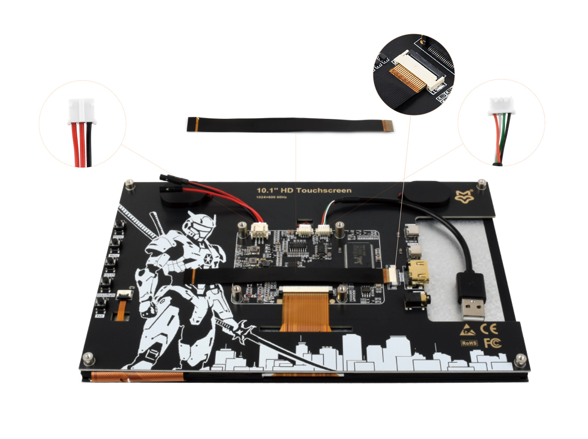
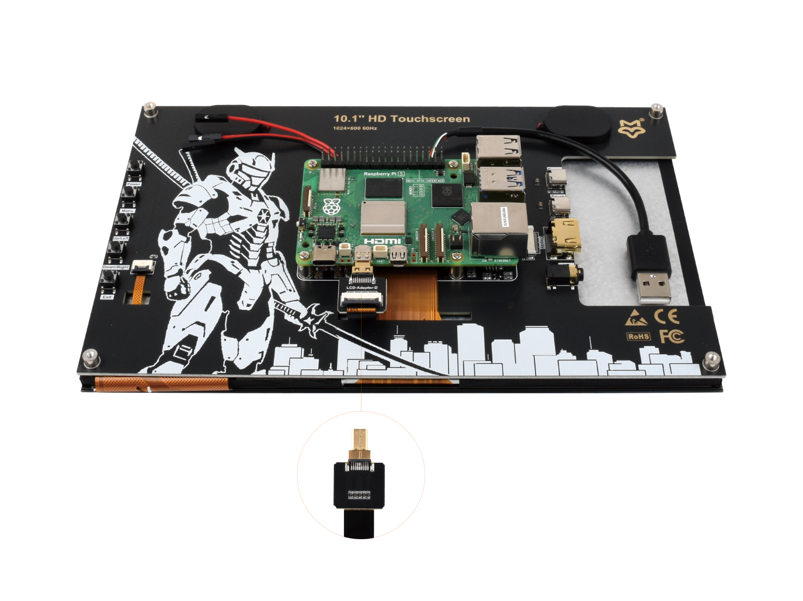
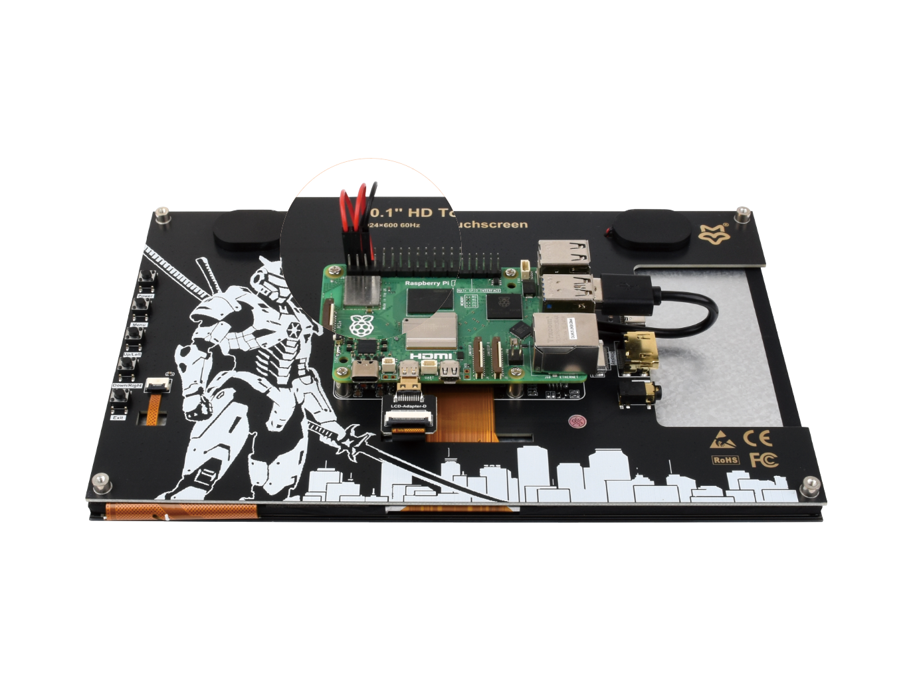
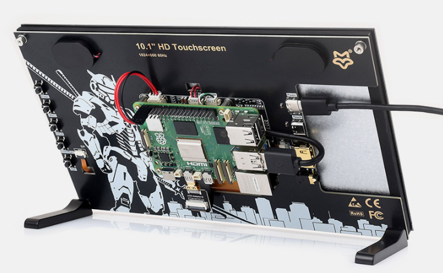
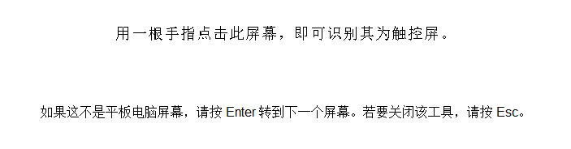
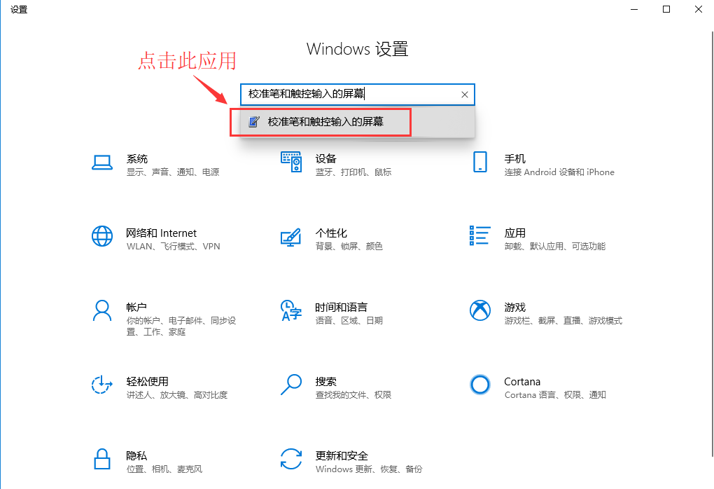
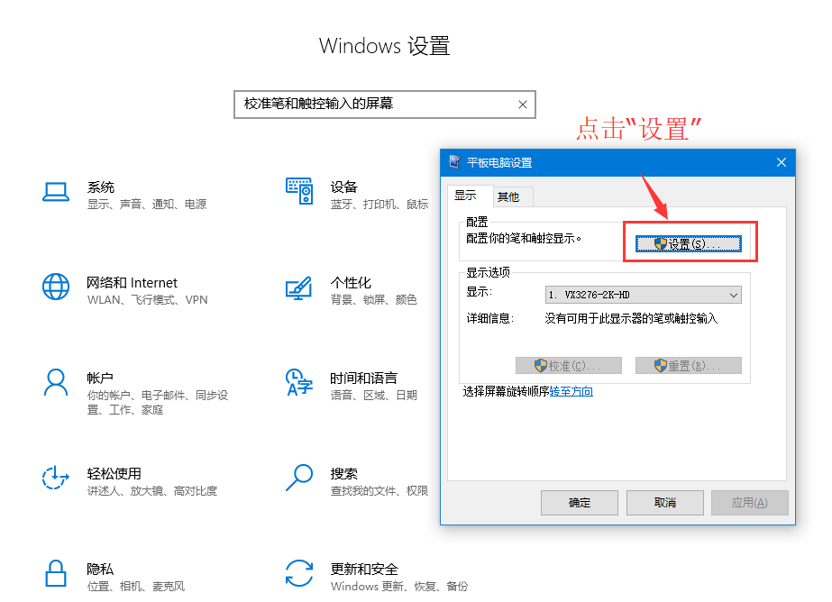

<div id="luckfox_model_mark" style={{display:'none'}}>10.1″ HD Touchscreen</div>

## 1. 介绍

 10.1'' HD Touchscreen是一款具有1024×600分辨率和170°广角视野的电容触摸屏，自带固定M2.5螺丝孔位和软排线，节省安装空间，并且兼容大多数标准HDMI设备，满足各种应用需求。

## 2. 产品参数

| **项目** | **描述**                | **单位** |
| -------- | ----------------------- | -------- |
| 产品型号 | 10.1'' HD Touchscreen   | /        |
| 尺寸     | 10.1                    | Inch     |
| 可视角度 | 170                     | Deg      |
| 分辨率   | 1024 × 600              | Pixels   |
| 产品尺寸 | 236.00 (H) × 144.00 (V) | mm       |
| 显示区域 | 223.72 (H) × 126.28 (V) | mm       |
| 色域     | 52%                     | NTSC     |
| 最大亮度 | 530                     | cd/m²    |
| 对比度   | 450：1                  | /        |
| 背光调节 | OSD菜单调节             | /        |
| 刷新率   | 60                      | Hz       |
| 显示接口 | 标准HDMI接口            | /        |
| 电源接口 | 5V供电                  | /        |
| 功耗     | 6.5                     | Watt     |

## 3. 搭配树莓派使用

### 3.1 硬件连接
1. 准备好下图的连接线，以下将以树莓派 Raspberry Pi4 作为连接演示<br/>

2. 将①②③号线材按图片所示连接到相应位置；<br/>

3. 将①号线材接入到⑤号 LCD 转接头 (视树莓派主板型号选择⑤或⑥)，连接到树莓派 micro HDMI 接口；<br/>

4. 将线材③连接到树莓派 USB 接口；将线材②连接到树莓派 5V GND 排针；<br/>

5. 线材全部连接完后如上图所示;确保连接无误后，接入 5V 电源进行使用；<br/>
### 3.2 软件设置

支持Raspberry Pi OS/Ubuntu/Kali 和 Retropie系统。

1. 将TF卡连接到PC。

2. 从[树莓派官网](https://www.raspberrypi.com/software/)下载安装 Raspberry Pi Imager。

3. 打开烧写器，选择要写入图像的 TF 卡(注意：最好移除其它U盘设备，以防将U盘文件擦除)。

4. 预先配置系统，按住 CTRL+SHIFT+X(或点击右下角小齿轮)，设置完成点击保存即可。

5. 单击烧录按钮，将数据写入TF卡。

6.  烧录完成后，打开/boot/firmware/目录下的config.txt文件，将以下语句添加到config.txt文件末尾，然后保存退出。

   ```bash
   hdmi_group=2
   hdmi_mode=87
   hdmi_cvt 1024 600 60 6 0 0 0
   ```
   
7.  将TF卡插入树莓派，给树莓派上电，正常等待几秒后可正常显示。

## 4. 搭配PC机使用
### 4.1 硬件连接
支持PC版Windows 11 / 10 / 8.1 / 8 / 7系统。

1. 将LCD的Touch接口连接到PC机的USB接口。稍等片刻，Windows会自动识别触摸功能。

2. 将LCD的HDMI接口连接到PC机的HDMI接口，大约等待几秒钟后可以看到LCD正常显示。


**注意事项1：当电脑同时连接多个显示器的时候，只能通过本LCD控制主显示器上的光标，因此建议把LCD设置为主显示器。**

**注意事项2：有些PC机的USB接口由于老化可能导致供电不足，此时可以使用PC机背面的USB接口或者接外部的5V 2A电源适配器。**

### 4.2 Windows指定触控屏
#### Windows11：

1. 进入系统的Windows设置 ，在搜索栏输入并点击" 控制面板 " （如下图所示）<br/>
2. 在弹出的“控制面板”界面中，选择“硬件与声音”<br/>
3. 选择“校准笔和触控输入的屏幕 ”中，在弹出的平板电脑设置中点击“设置”<br/>
4. 屏幕将会出现下图的文字提示，请用手指点击触摸板，电脑将会识别其为触控屏。<br/>
   ```bash
   PS：假如屏幕为空白，请按“Enter”回车键，文字提示将会切换屏幕。（文字提示对应的屏幕，将作为触控屏。）
   ```
#### Windows10：

1.进入系统的Windows设置 ，在搜索栏输入并点击" 校准笔和触控输入的屏幕 " （如下图所示）<br/>

2.在弹出的“平板电脑设置”界面中，点击“设置”<br/>

3.屏幕将会出现下图的文字提示，请用手指点击触摸板，电脑将会识别其为触控屏。<br/>
   ```bash
PS：假如屏幕为空白，请按“Enter”回车键，文字提示将会切换屏幕。（文字提示对应的屏幕，将作为触控屏。）
   ```

## 5. 资料
### 图纸
- [10.1'' HD Touchscreen 3D图纸](https://files.luckfox.com/wiki/Display/draw/10.1''%20HD%20Touchscreen.zip)

