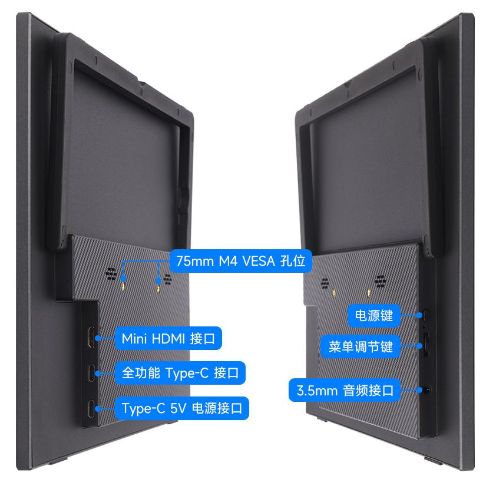
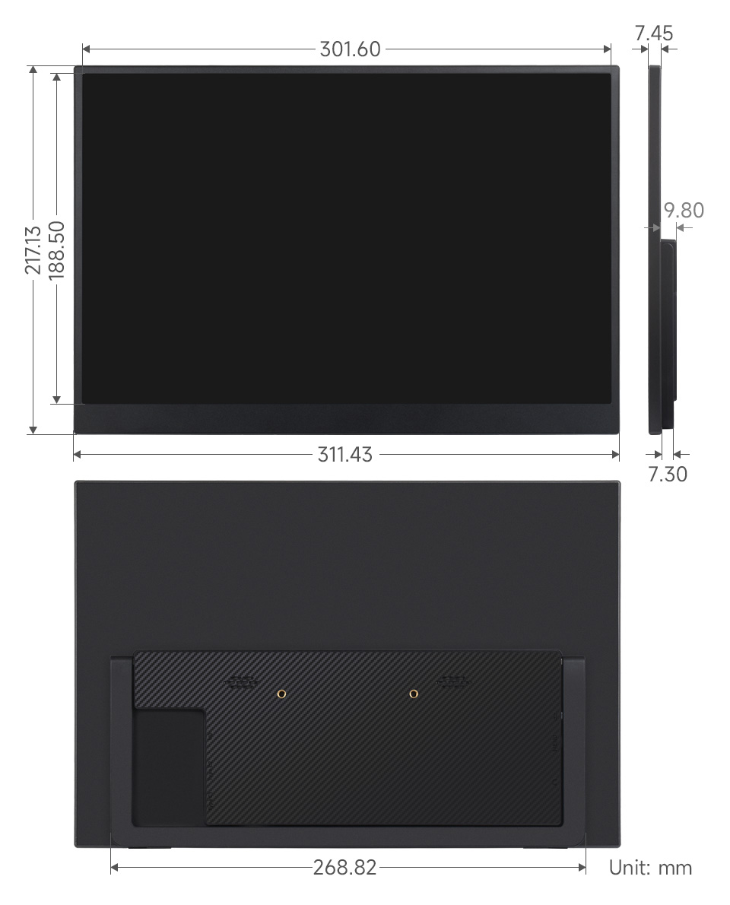

<div id="luckfox_model_mark" style={{display:'none'}}>14″ Portable Monitor</div>

## 1. 介绍

14″便携显示器配备1920×1200分辨率的100% sRGB高色域IPS面板，支持178°超广视角。产品带有75mm固定M4 VESA安装孔，节省安装空间，兼容大多数标准HDMI设备，适用于多种应用需求。

## 2. 产品参数

| **项目** | **描述**                | **单位** |
| -------- | ----------------------- | -------- |
| 产品型号 | 14″ Portable Monitor    | /        |
| 尺寸     | 14                      | Inch     |
| 可视角度 | 178                     | Deg      |
| 分辨率   | 1920×1200               | Pixels   |
| 产品尺寸 | 311.43 (H) × 217.13 (V) | mm       |
| 显示区域 | 301.60 (V) × 188.50 (H) | mm       |
| 色域     | 100%                    | sRGB     |
| 最大亮度 | 300                     | cd/m²    |
| 对比度   | 1500:1                  | /        |
| 背光调节 | OSD菜单调节             | /        |
| 刷新率   | 60                      | Hz       |
| 显示接口 | mini HDMI/Type-C        | /        |
| 电源输入 | 5V                      | /        |
| 功耗     | 4.6                     | Watt     |

## 3. 接口说明


## 4. 菜单按键说明
### 4.1 按键说明
**菜单调节按键（滚轮）**

> * 上滚：调节音量
> * 下滚：调节亮度
> * 按下：打开 OSD 主菜单 / 确认选项
> * 菜单中滚动：切换菜单项或调节数值

**电源键**

> * 短按（菜单外）：打开信号源选择面板（Auto / Type-C / HDMI）
> * 短按（菜单中）：退出菜单界面
> * 长按：开关背光

🔴 **提示：**一般情况下，屏幕上电后检测到有效信号会自动点亮，无需手动按键激活。
### 4.2 OSD 主菜单简介
按下滚轮进入 OSD 主菜单后，可进行如下设置：
> * 图像：亮度、对比度、暗部平衡、游戏模式
> * 高级：UltraHDRMode、护眼模式、3D声音、瞄准器
> * 设置：信号选择、语言、图像比例、音量
> * 色温：6500K / 9300K / 自定义
> * OSD 设置：位置、透明度、菜单时间
> * 颜色效果：饱和度、色调、锐利度增强
> * 信息显示：当前信号源、分辨率、行频率、像素时钟
> * 重置：恢复出厂设置

## 5. 搭配树莓派使用

### 5.1 软件配置

支持Raspberry Pi OS/Ubuntu/Kali 和 Retropie系统。

1. 将TF卡连接到PC。

2. 从[树莓派官网](https://www.raspberrypi.com/software/)下载安装 Raspberry Pi Imager。

3. 打开烧写器，选择要写入图像的 TF 卡(注意：最好移除其它U盘设备，以防将U盘文件擦除)。

4. 预先配置系统，按住 CTRL+SHIFT+X(或点击右下角小齿轮)，设置完成点击保存即可。

5. 单击烧录按钮，将数据写入TF卡。

6.  烧录完成后，打开/boot/firmware/目录下的config.txt文件，将以下语句添加到config.txt文件末尾，然后保存退出。

   ```bash
   hdmi_group=2
   hdmi_mode=87
   hdmi_force_hotplug=1 
   config_hdmi_boost=10
   hdmi_timings=1920 0 48 32 80 1200 0 3 6 26 0 0 0 60 0 154000000 0
   ```
   
7.  将TF卡插入树莓派。

### 5.2 硬件连接

1. 将LCD的Type-C接口连接到树莓派的USB接口。
2. 将LCD的HDMI接口连接到树莓派的HDMI接口，给树莓派上电，等待一段时间，即可正常显示。

## 6. 搭配PC机使用

支持PC版Windows 11 / 10 / 8.1 / 8 / 7系统。

1. 将LCD的Type-C接口连接到PC机的USB接口。

2. 将LCD的HDMI接口连接到PC机的HDMI接口，稍等片刻，即可正常显示。

**注意：有些PC机的USB接口由于老化可能导致供电不足，此时可以使用PC机背面的USB接口或者接外部的5V 3A电源适配器。**

## 7. 搭配一线通功能的设备使用

将LCD的全功能Type-C接口连接到设备的Type-C接口。稍等片刻，即可正常显示。

**注意：您的设备型号需支持全功能Type-C有线投屏才可使用Type-C显示功能。**

## 8. 外观尺寸



