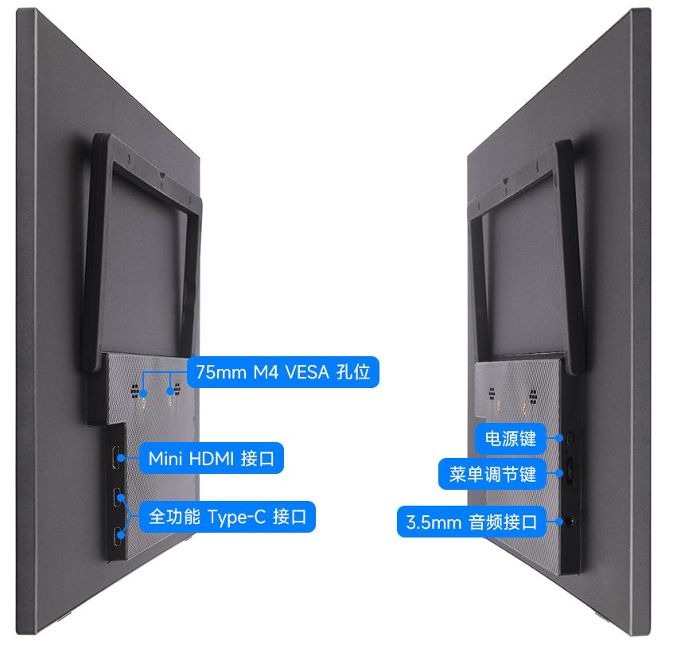
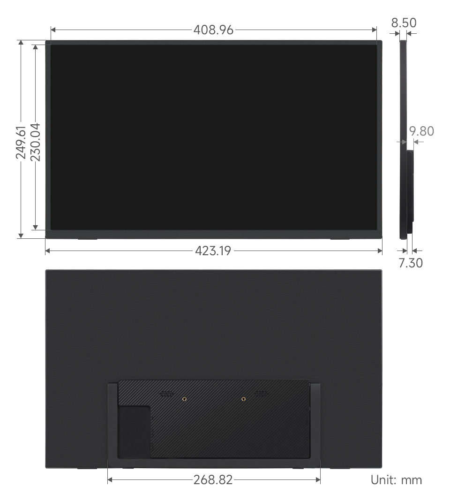
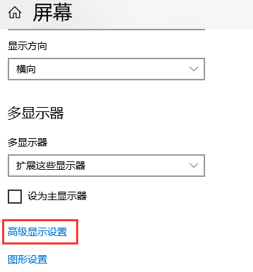
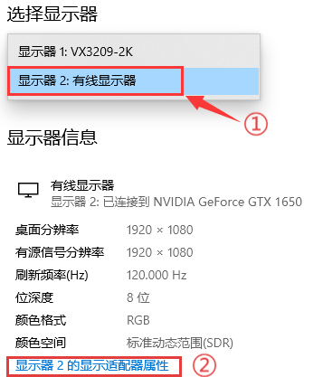
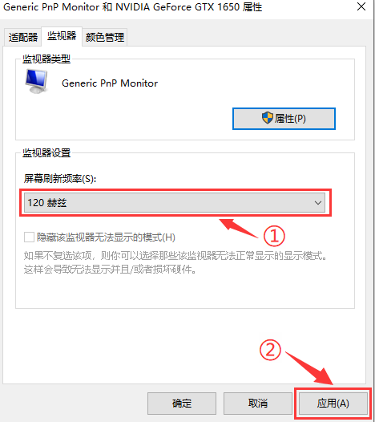

<div id="luckfox_model_mark" style={{display:'none'}}>18.5″ Portable Monitor</div>

## 1. 介绍

18.5″便携显示器配备1920×1080分辨率的100% sRGB高色域IPS面板，支持178°超广视角和最高120Hz刷新率。产品带有75mm固定M4 VESA安装孔，节省安装空间，兼容大多数标准HDMI设备，适用于多种应用需求。

## 2. 产品参数

| **项目** | **描述**                | **单位** |
| -------- | ----------------------- | -------- |
| 产品型号 | 18.5″ Portable Monitor  | /        |
| 尺寸     | 18.5                    | Inch     |
| 可视角度 | 178                     | Deg      |
| 分辨率   | 1920 × 1080             | Pixels   |
| 产品尺寸 | 423.19( H) × 249.61 (V) | mm       |
| 显示区域 | 408.96 (H) × 230.04 (V) | mm       |
| 色域     | 100%                    | sRGB     |
| 亮度     | 300                     | cd/m²    |
| 对比度   | 1000:1                  | /        |
| 背光调节 | OSD菜单调节             | /        |
| 刷新率   | 120                     | Hz       |
| 显示接口 | mini HDMI/Type-C        | /        |
| 电源输入 | 5V                      | /        |
| 功耗     | 10.5                    | Watt     |

## 3.接口说明<br/>

## 4. 菜单按键说明
### 4.1 按键说明
**菜单调节按键（滚轮）**

> * 上滚：调节音量
> * 下滚：调节亮度
> * 按下：打开 OSD 主菜单 / 确认选项
> * 菜单中滚动：切换菜单项或调节数值

**电源键**

> * 短按（菜单外）：打开信号源选择面板（Auto / Type-C / HDMI）
> * 短按（菜单中）：退出菜单界面
> * 长按：开关背光

🔴 **提示：**一般情况下，屏幕上电后检测到有效信号会自动点亮，无需手动按键激活。


### 4.2 OSD 主菜单简介
按下滚轮进入 OSD 主菜单后，可进行如下设置：
> * 图像：亮度、对比度、暗部平衡、游戏模式
> * 高级：UltraHDRMode、护眼模式、3D声音、瞄准器
> * 设置：信号选择、语言、图像比例、音量
> * 色温：6500K / 9300K / 自定义
> * OSD 设置：位置、透明度、菜单时间
> * 颜色效果：饱和度、色调、锐利度增强
> * 信息显示：当前信号源、分辨率、行频率、像素时钟
> * 重置：恢复出厂设置


## 5. 搭配树莓派使用

### 5.1 软件配置

支持Raspberry Pi OS/Ubuntu/Kali 和 Retropie系统。

1. 将TF卡连接到PC。

2. 从[树莓派官网](https://www.raspberrypi.com/software/)下载安装 Raspberry Pi Imager。

3. 打开烧写器，选择要写入图像的 TF 卡(注意：最好移除其它U盘设备，以防将U盘文件擦除)。

4. 预先配置系统，按住 CTRL+SHIFT+X(或点击右下角小齿轮)，设置完成点击保存即可。

5. 单击烧录按钮，将数据写入TF卡。

6.  烧录完成后，打开/boot/firmware/目录下的config.txt文件，将以下语句添加到config.txt文件末尾，然后保存退出。

   ```bash
   hdmi_group=2
   hdmi_mode=82
   hdmi_cvt 1920 1080 60 6 0 0 0
   ```
   
7. 将TF卡插入树莓派。

### 5.2 硬件连接

1. 将20W电源适配器连接到LCD的电源接口。
2. 将LCD的HDMI接口连接到树莓派的HDMI接口，给树莓派上电，稍等片刻，即可正常显示。

## 6. 搭配PC机使用
支持PC版Windows 11 / 10 / 8.1 / 8 / 7系统。

1. 将20W电源适配器连接到LCD的电源接口。

2. 将LCD的HDMI接口连接到PC机的HDMI接口，大约等待几秒钟后，LCD正常显示。

## 7. 搭配一线通功能的设备使用

1. 将20W电源适配器连接到LCD的电源接口。

2. 将LCD的全功能Type-C接口连接到设备的Type-C接口。稍等片刻，即可正常显示。

**注意：您的设备型号需支持全功能Type-C有线投屏才可使用Type-C显示功能。**

## 8. 外观尺寸<br/>

## FAQ
**Q:   如何在 Windows 系统中启用 120Hz 刷新率？**<br/>
💡:   一般情况下，Windows 系统会自动识别并设置显示器的最佳分辨率和刷新率。如果未能自动设置为 120Hz，请按照以下步骤手动调整：

**调整 Windows 显示设置：**

- 进入 Windows 显示设置，选择 高级显示设置。<br/>
- 在“选择显示器”下拉菜单中，选择 18.5" 便携显示器，点击显示适配器属性。<br/>
- 在弹出的窗口中，切换到 监视器 选项卡，在 屏幕刷新率 下拉菜单中选择 120Hz。点击 应用 并确认更改。<br/>

注： 如果高级显示设置未显示 120Hz 选项，请检查以下几个方面<br/>
> **确保您的设备支持 120Hz 刷新率：**
>    - 显卡需要支持 120Hz 输出，确保设备配置满足要求。如果问题仍然存在，尝试更新显卡驱动程序。
>
> **确认使用的连接线和接口版本支持 120Hz：**
>    - 使用支持高刷新率的连接线（如 HDMI 1.4 或更高版本，或支持 DisplayPort 的 Type-C）。
>
> **为显示器提供稳定的电力供应：**
>
>    - 为确保显示器在 120Hz 刷新率下正常运行，请使用配套的 20W 外接电源适配器。

