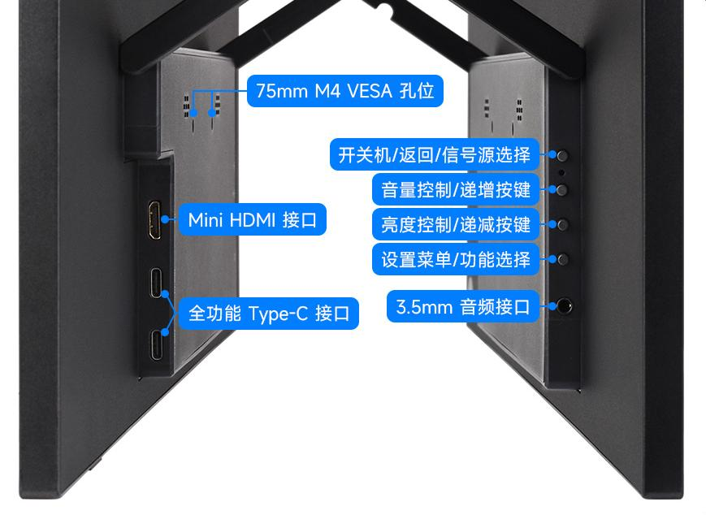
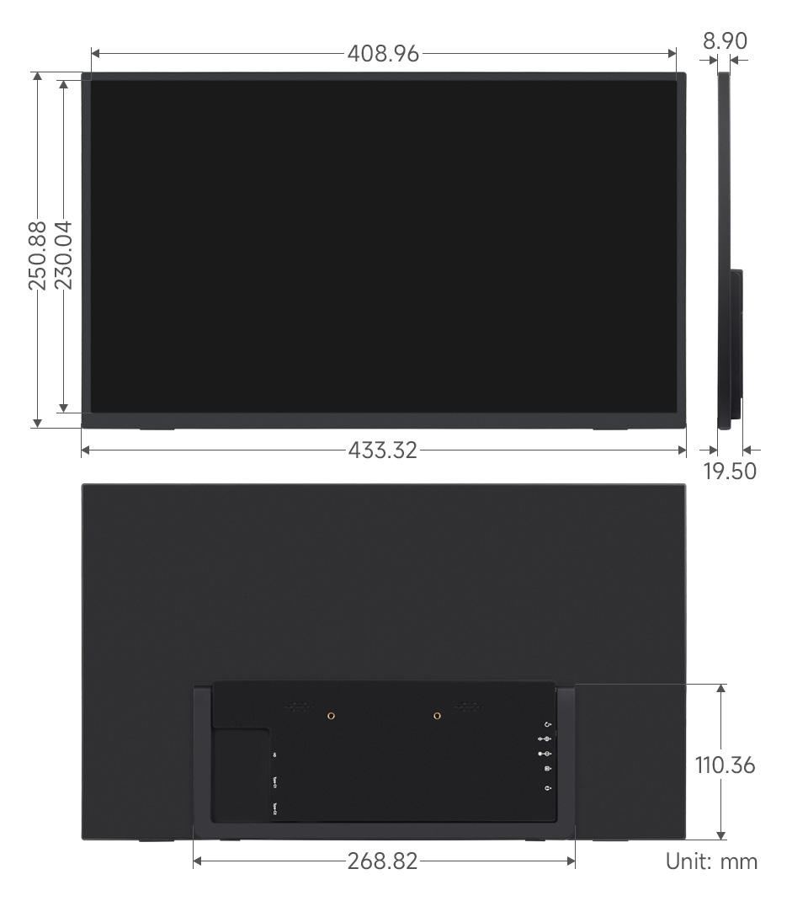

<div id="luckfox_model_mark" style={{display:'none'}}>18.5″ 4K Portable Monitor</div>

## 1. 介绍

18.5″便携显示器配备3840×2160分辨率的100% NTSC高色域IPS面板，支持178°超广视角和60Hz刷新率。产品带有75mm固定M4 VESA安装孔以及可折叠支架，节省安装空间，兼容大多数标准HDMI设备，适用于多种应用需求。

## 2. 产品参数

| **项目** | **描述**                  | **单位** |
| -------- | ------------------------- | -------- |
| 产品型号 | 18.5″ 4K Portable Monitor | /        |
| 尺寸     | 18.5                      | Inch     |
| 可视角度 | 178                       | Deg      |
| 分辨率   | 3840×2160                 | Pixels   |
| 产品尺寸 | 433.32 (H) × 250.88 (V)   | mm       |
| 显示区域 | 408.96 (H) × 230.04 (V)   | mm       |
| 色域     | 100%                      | NTSC     |
| 亮度     | 250                       | cd/m²    |
| 对比度   | 1000:1                    | /        |
| 背光调节 | OSD菜单调节               | /        |
| 刷新率   | 60                        | Hz       |
| 显示接口 | mini HDMI/Type-C          | /        |
| 电源输入 | USB-C (PD 20V⎓810mA)      | /        |
| 功耗     | 16.2                      | Watt     |

## 3.接口与按键功能说明<br/>

## 4. 搭配树莓派使用

### 4.1 软件配置

支持Raspberry Pi OS/Ubuntu/Kali 和 Retropie系统。

1. 将TF卡连接到PC。

2. 从[树莓派官网](https://www.raspberrypi.com/software/)下载安装 Raspberry Pi Imager。

3. 打开烧写器，选择要写入图像的 TF 卡(注意：最好移除其它U盘设备，以防将U盘文件擦除)。

4. 预先配置系统，按住 CTRL+SHIFT+X(或点击右下角小齿轮)，设置完成点击保存即可。

5. 单击烧录按钮，将数据写入TF卡。

6.  烧录完成后，打开/boot/firmware/目录下的config.txt文件，将以下语句添加到config.txt文件末尾，然后保存退出。

   ```bash
   hdmi_enable_4kp60=1
   hdmi_force_hotplug=1
   hdmi_group=2
   hdmi_mode=87
   hdmi_timings=3840 0 48 32 80 2160 0 3 5 54 0 0 0 60 0 300000000 3
   hdmi_drive=2
   config_hdmi_boost=10
   ```
   
   **注意：** 实际输出分辨率受主控性能限制。在 Raspberry Pi 3 和 Zero 等设备上，默认最大分辨率为 1080P@60Hz。
   
7. 将TF卡插入树莓派。

### 4.2 硬件连接

1. 将20W电源适配器连接到LCD的电源接口。
2. 将LCD的HDMI接口连接到树莓派的HDMI接口，给树莓派上电，稍等片刻，即可正常显示。

## 5. 搭配PC机使用
支持PC版Windows 11 / 10 / 8.1 / 8 / 7系统。

1. 将20W电源适配器连接到LCD的电源接口。

2. 将LCD的HDMI接口连接到PC机的HDMI接口，大约等待几秒钟后，LCD正常显示。

## 6. 搭配一线通功能的设备使用

1. 将20W电源适配器连接到LCD的电源接口。

2. 将LCD的全功能Type-C接口连接到设备的Type-C接口。稍等片刻，即可正常显示。

**注意：您的设备型号需支持全功能Type-C有线投屏才可使用Type-C显示功能。**

## 7. 外观尺寸<br/>


