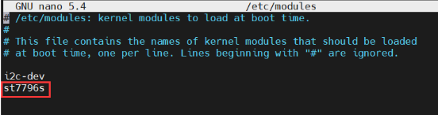
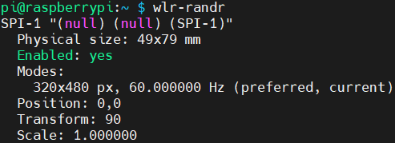

<div id="luckfox_model_mark" style={{display:'none'}}>3.5″ RPi LCD CTP</div>

## 1. 介绍

3.5″ RPi LCD CTP 是一款基于 SPI 和 I2C 接口通信的触摸显示模块，搭载 ST7796S 显示驱动与 GT911 触控芯片，具备 320×480 分辨率、IPS 高亮显示及灵敏电容触控，兼具稳定性与美观性。

## 2. 产品参数

### 📋 参数表

| **项目**     | **描述**                          |
| ------------ | --------------------------------- |
| **产品型号** | 3.5″ RPi LCD CTP                 |
| **盖板尺寸** | 61.00 (H) × 92.44 (V) mm          |
| **显示区域** | 49.36 (H) × 73.84 (V) mm          |
| **分辨率**   | 320 (H) x 480 (V)                 |
| **屏幕类型** | IPS                               |
| **触摸类型** | 电容                               |
| **可视角度** | 170°                              |
| **色域**     | 65% NTSC                          |
| **最大亮度** | 200cd/m²                          |
| **对比度**   | 1000:1                            |
| **背光调节** | PWM调光                           |
| **刷新率**   | 60Hz                              |
| **功耗**     | 0.8W                          |
| **供电电压** | 5V                                |
| **逻辑电压** | 3.3V                              |
| **通信接口** | Display：SPI  <br/>Touch：I2C      |
| **控制芯片** | Display：ST7796S <br/>Touch：GT911 |


## 3. 引脚定义 <br/>

| **引脚号** | **标识**     | **描述**                                                 |
|------------|--------------|--------------------------|
| 1          | NC           | 无连接      |
| 2, 4          | 5V           | 电源正极（5V）          |
| 3          | TP_SDA       | 触控芯片 I2C 数据引脚         |
| 5          | TP_SCL       | 触控芯片 I2C 时钟引脚      |
| 6, 9, 14, 20, 25          | GND          | 电源地  |
| 7          | TP_INT       | 触控芯片中断引脚  |
| 11         | TP_RST       | 触控芯片复位引脚（低电平有效） |
| 12         | LCD_PWM      | 背光 PWM 控制引脚     |
| 13         | LCD_RST      | 显示芯片复位引脚（低电平有效）  |
| 15         | LCD_DC       | 数据/命令控制引脚（高电平为数据，低电平为命令） |
| 19         | MOSI         | SPI 主输出/从输入  |
| 21         | MISO         | SPI 主输入/从输出 |
| 23         | SCLK         | SPI 时钟引脚     |
| 24         | CE0          | SPI 片选引脚（低电平有效） |
| 16–18, 8, 10, 22, 26       | NC           | 无连接 |

## 4. 产品尺寸<br/>
## 5. 硬件连接
1.  将模块 26 针插座对齐连接至 Raspberry Pi GPIO 40 排针。
2.  推荐使用铜柱固定，避免松动。<br/>
## 6.  软件设置
### 6.1. 开启SPI与I2C接口
打开终端，执行以下命令启用相关接口：
```
sudo raspi-config nonint do_spi 0
sudo raspi-config nonint do_i2c 0
```
### 6.2  安装依赖库
```
sudo apt-get update
sudo apt-get install python3-pip
sudo apt-get install python3-pil
sudo apt-get install python3-numpy
sudo apt-get install python3-spidev
sudo apt install python3-smbus2
```
### 6.3 示例程序
```
wget https://files.luckfox.com/wiki/Luckfox/Display/3inch5-RPi-LCD-CTP/3inch5-RPi-LCD-CTP-RPI-Demo.zip
unzip 3inch5-RPi-LCD-CTP-RPI-Demo.zip
cd 3inch5-RPi-LCD-CTP-RPI-Demo
sudo python ./main.py
```
## 7. Bookworm 系统桌面显示设置
### 方法一：配置设备树驱动屏幕（推荐）
```
wget https://files.luckfox.com/wiki/Luckfox/Display/3inch5-RPi-LCD-CTP/St7796s.zip
unzip St7796s.zip
sudo cp st7796s.bin /lib/firmware/
```
编辑 config.txt：
```
sudo nano /boot/firmware/config.txt
```
在 **[all]** 末尾添加以下语句:
```
dtparam=spi=on
dtoverlay=mipi-dbi-spi,speed=48000000
dtparam=compatible=st7796s\0panel-mipi-dbi-spi
dtparam=width=320,height=480,width-mm=49,height-mm=79
dtparam=reset-gpio=27,dc-gpio=22,backlight-gpio=18
dtoverlay=goodix,addr=0x5d
```
重启生效：
```
sudo reboot
```
### 方法二：安装内核模块与 DTBO 驱动
>📌 注意：Bookworm 系统需使用官方正式版本 6.6.51 及以上内核版本。

#### 安装驱动模块
1. 确定当前内核版本
```
uname -a
```
示例输出（Raspberry Pi 5）：

```
Linux raspberrypi 6.12.25+rpt-rpi-2712 #1 SMP PREEMPT Debian 1:6.12.25-1+rpt1 (2025-04-30) aarch64
```
说明：
* 内核版本号：**6.12.25+rpt-rpi-2712**

* 架构：**64位ARM（AArch64）**
2. 下载安装 st7796 驱动模块
```
# 下载并解压驱动文件
wget https://files.luckfox.com/wiki/Luckfox/Display/3inch5-RPi-LCD-CTP/Luckfox-st7796s.zip
unzip Luckfox-st7796s.zip
cd Luckfox-st7796s

# 进入对应内核版本的文件夹（以例子为准）
cd 6.12.25/64/rpi-2712-RPi5

# 复制内核模块
sudo cp st7796s.ko /lib/modules/$(uname -r)/kernel/drivers

# 添加模块到开机自动加载
sudo nano /etc/modules
# 在文件末尾添加：
st7796s
```
如下图:<br/>
处理内核模块依赖：

```
sudo depmod -a
```
3. 配置驱动设备树
```
cd
wget https://files.luckfox.com/wiki/Luckfox/Display/3inch5-RPi-LCD-CTP/Luckfox35CTP.dtbo
sudo cp Luckfox35CTP.dtbo /boot/overlays/
```
#### 对于 RPi4 & RPi5
1. 需要先参考前文步骤安装驱动模块
2. 编辑 config.txt 文件
```
sudo nano /boot/firmware/config.txt
```
注释掉双屏相关配置。<br/><br/>

在 **[all]** 末尾添加以下语句:
```
dtparam=i2c_arm=on
dtparam=i2c_arm_baudrate=50000
dtparam=spi=on
dtoverlay=Luckfox35CTP,fps=60,speed=48000000,rotate=90,ts_rotate_90
hdmi_force_hotplug=1
max_usb_current=1
hdmi_group=2
hdmi_mode=87
hdmi_cvt 480 320 60 6 0 0 0
hdmi_drive=2
```
3. 创建 X11 配置文件
```
sudo nano /etc/X11/xorg.conf.d/98-spi-screen.conf
```

添加以下内容：
```
Section "Device"
    Identifier "SPI Screen"
    Driver "fbdev"
    Option "fbdev" "/dev/fb0"
EndSection
```
> 🔧 整个流程操作完成之后。如果不显示，请尝试将 /dev/fb0 修改为 /dev/fb1，然后重启。
4. 切换到 X11 显示系统
```
sudo raspi-config nonint do_wayland W1
sudo reboot
```

#### 对于所有 Raspberry Pi 版本（需使用 Bookworm Lite）
>⚠️ 仅适用于以下版本：<br/>
>[64位 Lite](https://downloads.raspberrypi.com/raspios_lite_arm64/images/raspios_lite_arm64-2024-11-19/2024-11-19-raspios-bookworm-arm64-lite.img.xz)<br/>
>[32位 Lite](https://downloads.raspberrypi.com/raspios_lite_armhf/images/raspios_lite_armhf-2024-11-19/2024-11-19-raspios-bookworm-armhf-lite.img.xz)<br/>
1. 编辑 config.txt 文件

```
sudo nano /boot/firmware/config.txt
```
注释掉 KMS 及双屏配置。<br/><br/>
在 **[all]** 末尾添加以下语句:
```
dtparam=i2c_arm=on
dtparam=i2c_arm_baudrate=50000
dtparam=spi=on
dtoverlay=Luckfox35CTP,fps=60,speed=48000000,rotate=90,ts_rotate_90
hdmi_force_hotplug=1
max_usb_current=1
hdmi_group=2
hdmi_mode=87
hdmi_cvt 480 320 60 6 0 0 0
hdmi_drive=2
```
2. 安装必要软件
```
#X11 服务
sudo apt-get install --no-install-recommends xserver-xorg -y
sudo apt-get install --no-install-recommends xinit -y

#桌面管理器与 GUI
sudo apt install lightdm -y
sudo apt install raspberrypi-ui-mods -y

#Git 与浏览器（可选）
sudo apt install git -y
sudo apt install chromium-browser -y

#VLC 播放器（可选）
sudo apt install vlc -y
```
3. 下载运行驱动
```
sudo apt install libraspberrypi-dev -y
sudo apt-get install unzip -y
sudo apt-get install cmake -y

#下载并构建 fbcp
wget https://files.luckfox.com/wiki/Luckfox/Display/3inch5-RPi-LCD-CTP/Rpi-fbcp.zip
unzip ./Rpi-fbcp.zip
cd rpi-fbcp/
sudo rm -rf build
sudo mkdir -m 777 ./build
cd ./build
sudo cmake ..
sudo make -j4
sudo install fbcp /usr/local/bin/fbcp
```
4. 设置自启动startx与fbcp
* 修改 Bash Shell 文件
```
sudo nano ~/.bashrc
```
添加以下内容到末尾：
```
if [ "$(cat /proc/device-tree/model | cut -d ' ' -f 3)" = "5" ]; then
    # RPi 5B 配置
    export FRAMEBUFFER=/dev/fb1
    startx  2> /tmp/xorg_errors
else
    # 非 Pi5 配置
    export FRAMEBUFFER=/dev/fb0
    startx  2> /tmp/xorg_errors
fi
```
* 创建 fbcp systemd 服务
```
sudo nano /etc/systemd/system/fbcp.service
```
添加以下内容：
```
[Unit]
Description=Framebuffer Copy for Raspberry Pi
After=network.target

[Service]
ExecStartPre=/bin/sleep 20
ExecStart=/usr/local/bin/fbcp
Restart=always
User=root
Group=root

[Install]
WantedBy=multi-user.target
```
然后执行以下命令：
```
sudo systemctl daemon-reload
sudo systemctl enable fbcp.service
sudo systemctl start fbcp.service
```
5. 设置 CLI 自动登录
```
sudo raspi-config nonint do_boot_behaviour B2
sudo raspi-config nonint do_wayland W1
sudo reboot
```
> **注意事项**
> ⚠️ 用户名必须为 pi，否则自动登录将无法正常工作。<br/>
> 🚀 每次重启系统加载时间会变长，SSH 可用时间也会相应延后。

## 8. 屏幕旋转设置

### GUI 旋转

1. 打开 **Screen Configuration** 应用程序  <br/><br/>

2. 勾选 "Touchscreen"  <br/><br/><br/>

3. 进入Orientation，勾选需要旋转的角度。<br/><br/>

### 命令行旋转
>💡 推荐在 Wayland 环境下使用此命令方式，适用于 Raspberry Pi OS Bookworm 及以上系统版本。<br/>

1. 安装 `wlr-randr` 工具
```
sudo apt install wlr-randr
```
2. 查看可用输出名称
```
wlr-randr
```
输出示例（以 SPI-1 为例）：<br/><br/>
3. 执行旋转命令
```
wlr-randr --output SPI-1 --transform 90
```
> 📝 支持的旋转参数有：<br/>
> normal<br/>
> 90<br/>
> 180<br/>
> 270<br/>

## 9. 调节背光
### PWM调光
- 安装WiringPi
```
cd ~
git clone https://github.com/WiringPi/WiringPi.git
cd WiringPi
./build
gpio -v
```
安装成功会输出gpio version版本，如下所示:<br/><br/>
- 手动调节显示器PWM背光
```
gpio -g mode 18 pwm      	#占用管脚为PWM管脚
gpio pwmc 100   		    #设置 PWM 时钟分频器
gpio -g pwm 18 0         	#最暗
gpio -g pwm 18 1023      	#最亮
gpio -g mode 18 out      	#释放为输出
```
### Pinctrl调光
- 设置亮屏
```
 sudo pinctrl set 18 op dh
```
- 设置息屏
 ```
 sudo pinctrl set 18 op dl
 ```
## 10. 资料
### 原理图
* [原理图](/PDF/3inch5-RPi-LCD-CTP/3.5inch-RPi-LCD-luckfox.pdf)
### 示例程序
* [示例程序](https://files.luckfox.com/wiki/Luckfox/Display/3inch5-RPi-LCD-CTP/3inch5-RPi-LCD-CTP-RPI-Demo.zip)
### 数据手册
* [ST7796S 数据手册](/PDF/3inch5-RPi-LCD-RTP/ST7796S_Datasheet.pdf)
* [GT911 数据手册](/PDF/3inch5-RPi-LCD-CTP/GT911_Datasheet.pdf)
### 图纸
* [3D图纸-STP](https://files.luckfox.com/wiki/Luckfox/Display/3inch5-RPi-LCD-CTP/3.5inch-RPI-LCD_CTP-20250523.stp)
* [2D图纸-DXF](https://files.luckfox.com/wiki/Luckfox/Display/3inch5-RPi-LCD-CTP/3.5inch-RPI-LCD_CTP-20250523.dxf)
* [2D图纸-PDF](/PDF/3inch5-RPi-LCD-CTP/3.5inch-RPI-LCD_CTP-20250523.pdf)