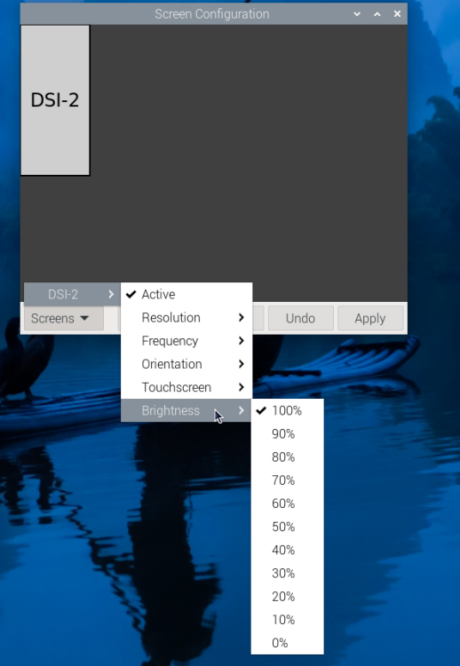
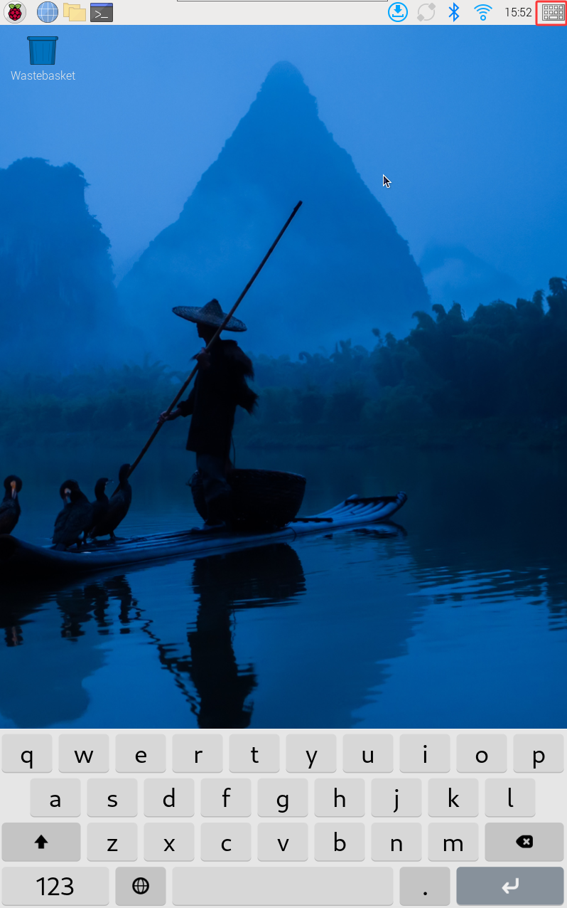

<div id="luckfox_model_mark" style={{display:'none'}}>7″ DSI Touchscreen</div>

## 1. 介绍

7'' DSI Touchscreen是一款具有800x480分辨率和170°广角视野的电容触摸屏，支持多种操作系统且无需驱动安装，满足各种应用需求。

## 2. 产品参数

| **项目** | **描述**                | **单位** |
| -------- | ----------------------- | -------- |
| 产品型号 | 7'' DSI Touchscreen     | /        |
| 尺寸     | 7.0                     | Inch     |
| 可视角度 | 170                     | Deg      |
| 分辨率   | 800x480                 | Pixels   |
| 产品尺寸 | 192.96 (H) × 110.76 (V) | mm       |
| 显示区域 | 154.88 (H) × 86.72 (V)  | mm       |
| 色域     | 50%                     | NTSC     |
| 最大亮度 | 350                     | cd/m²    |
| 对比度   | 1000:1                  | /        |
| 背光调节 | 软件调光                | /        |
| 刷新率   | 60                      | Hz       |
| 功耗     | 2.0                     | Watt     |

## 3. 搭配树莓派使用

### 3.1 硬件连接

1. 把排线安装在屏幕上。<br/>

2. 将树莓派用螺丝固定在屏幕上连接排线<br/>

3. 连接上电源线（标准版）<br/>

4. 装上外壳（带外壳版）<br/>

### 3.2 软件设置

支持Raspberry Pi OS/Ubuntu/Kali 和 Retropie系统。

1. 将TF卡连接到PC

2. 从[树莓派官网](https://www.raspberrypi.com/software/)下载安装 Raspberry Pi Imager

3. 打开烧写器，选择要写入图像的 TF 卡(注意：最好移除其它U盘设备，以防将U盘文件擦除)。

4. 预先配置系统，按住 CTRL+SHIFT+X(或点击右下角小齿轮)，设置完成点击保存即可。

5. 单击烧录按钮，将数据写入TF卡。

6. 烧录完成后，打开/boot/firmware/目录下的config.txt文件，将以下语句添加到config.txt文件末尾，然后保存退出。

   **注意：由于Pi5/CM5/CM4/CM3+/CM3具有两个mipi DSI接口，请注意使用正确的DSI接口和指令，默认推荐使用DSI1。**

   ```bash
   dtoverlay=vc4-kms-v3d
   #DSI1 Use
   dtoverlay=vc4-kms-dsi-7inch
   #DSI0 Use (Only Pi5/CM4)
   #dtoverlay=vc4-kms-dsi-7inch,dsi0
   ```

7. 将TF卡插入树莓派，给树莓派上电，正常等待几秒后可正常显示。

### 3.3 调节背光亮度
**GUI界面调光**
* 1.打开"Screen Configuration"应用程序；<br/>

* 2.进入"Screen"->"DSI-2"->"Brightness" ，勾选您需要设置的背光亮度，最后点击"Apply"，即可完成背光设置。<br/>

**命令行调光**
```
 echo X | sudo tee /sys/class/backlight/*/brightness
```
其中X表示0~255中的任意数字。0表示背光最暗，255表示背光最亮。例如：
```
echo 100 | sudo tee /sys/class/backlight/*/brightness
echo 0 | sudo tee /sys/class/backlight/*/brightness
echo 255 | sudo tee /sys/class/backlight/*/brightness
```
### 3.4 显示旋转

#### 在Bookworm系统上旋转

##### 图形界面旋转

1.打开"Screen Configuration"应用程序；<br/>

2.进入"Screen"->"DSI-1"->"Touchscreen"，勾选"6-0038 generic ft5x06(79)"<br/>

3.点击"Apply"，然后关闭当前窗口，根据弹窗提示进行Reboot，即可完成指定触摸屏；<br/><br/>

4.进入"Screen"->"DSI-1"->"Orientation" ，勾选您需要旋转的方向，最后点击"Apply"即可完成显示和触摸同步旋转。<br/>

##### 命令行旋转

1.打开cmdline.txt文件

```
sudo nano /boot/firmware/cmdline.txt
```

2.在cmdline.txt文件开头添加“显示旋转”对应角度的命令，保存重启即可生效。（注意需要添加在同一行）

```
#显示旋转90度
video=DSI-1:800x480M@60,rotate=90
#显示旋转180度
video=DSI-1:800x480M@60,rotate=180
#显示旋转270度
video=DSI-1:800x480M@60,rotate=270
```

> 注意：
> - 1.如果是使用Pi5/CM5，以实际识别到的DSI显示器编号为准，例如"DSI-2"。
> - 2.无法使用 cmdline.txt 将 DSI 显示器与 HDMI 显示器分开旋转。当您同时使用 DSI 和 HDMI 时，它们共享相同的旋转值。

#### Bullseye/Buster显示旋转

##### 图形界面旋转

1.打开"Screen Configuration"应用程序；<br/>

2.进入"Screen"->"DSI-1"->"Orientation" ，勾选您需要旋转的方向，最后点击"Apply"，即可完成显示旋转。<br/><br/>

##### 命令行旋转

1.打开cmdline.txt文件

```
sudo nano /boot/cmdline.txt
```

2.在cmdline.txt文件开头添加“显示旋转”对应角度的命令，保存重启即可生效。（注意需要添加在同一行）

```
#显示旋转90度
video=DSI-1:800x480M@60,rotate=90
#显示旋转180度
video=DSI-1:800x480M@60,rotate=180
#显示旋转270度
video=DSI-1:800x480M@60,rotate=270
```
> 注意：
> - 1.如果是使用CM4，以实际识别到的DSI显示器编号为准，例如"DSI-2"。
> - 2.无法使用 cmdline.txt 将 DSI 显示器与 HDMI 显示器分开旋转。当您同时使用 DSI 和 HDMI 时，它们共享相同的旋转值。

#### Stretch/Jessie显示旋转

**对于一些比较古老的系统，它们不使用vc4-kms-v3d 或 vc4-fkms-v3d 驱动模式，显示旋转方法如下**

1. 在config.txt文件中加入语句（config文件位于TF卡根目录，即/boot中）：

```
display_rotate=1 #1：90；2: 180； 3: 270
```

2. 保存后重启树莓派即可

```
sudo reboot
```

### 3.5 触摸旋转

#### **Bookworm触摸旋转**

如果用图形界面的旋转方法，可以在Screen Layout Editor窗口中勾选Touchscreen，即可同步旋转触摸。参考前文显示旋转的方法。命令行旋转的方法参考下文：

1.新建99-waveshare-touch.rules文件

```
sudo nano /etc/udev/rules.d/99-waveshare-touch.rules
```

2.添加以下代码

```bash
#90度：
ENV{ID_INPUT_TOUCHSCREEN}=="1", ENV{LIBINPUT_CALIBRATION_MATRIX}="0 -1 1 1 0 0"

#180度：
#ENV{ID_INPUT_TOUCHSCREEN}=="1", ENV{LIBINPUT_CALIBRATION_MATRIX}="-1 0 1 0 -1 1"

#270度：
#ENV{ID_INPUT_TOUCHSCREEN}=="1", ENV{LIBINPUT_CALIBRATION_MATRIX}="0 1 0 -1 0 1"
```

3. 保存后重启树莓派即可

```
sudo reboot
```

#### **Bullseye/Buster触摸旋转**

Bullseye/Buster以及其他部分系统显示旋转后，触摸方向不一致，需要按下文操作进行触摸旋转：

1. 安装libinput

   ```
   sudo apt-get install xserver-xorg-input-libinput
   ```

   如果你安装的是Ubuntu系统，或者是Jetson Nano。安装指令为

   ```
   sudo apt install xserver-xorg-input-synaptics
   ```

2. 在/etc/X11/下创建xorg.conf.d目录 (如果该目录已存在，则直接进行第3步)

   ```
   sudo mkdir /etc/X11/xorg.conf.d
   ```

3. 复制40-libinput-conf 文件到刚刚创建的目录下

   ```
   sudo cp /usr/share/X11/xorg.conf.d/40-libinput.conf /etc/X11/xorg.conf.d/
   ```

4. 编辑该文件

   ```
   sudo nano /etc/X11/xorg.conf.d/40-libinput.conf
   #找到 touchscreen的部分，在里面添加对应的旋转角度指令，然后保存即可
   #90°Right触摸旋转：
   Option "CalibrationMatrix" "0 1 0 -1 0 1 0 0 1"
   #180° Inverted触摸旋转： 
   #Option "CalibrationMatrix" "-1 0 1 0 -1 1 0 0 1"
   #270° Left旋转： 
   #Option "CalibrationMatrix" "0 -1 1 1 0 0 0 0 1"
   ```
   类似下图位置：<br/>

5. 保存并重启树莓派

   ```
   sudo reboot
   ```

   完成以上步骤后触摸将会进行旋转。
### 3.6 使用触摸屏虚拟键盘
从 Raspberry Pi OS Bookworm 版本开始，系统默认集成了 Squeekboard 屏幕键盘。
当连接触摸显示屏时，在可以输入文字的情况下，屏幕键盘会自动显示；而在无法输入文字的情况下，它会自动隐藏。<br/>
对于不支持自动检测文字输入的应用程序，可以使用任务栏最右侧的键盘图标手动显示或隐藏屏幕键盘。<br/><br/>
你也可以通过“Raspberry Pi Configuration”中的“Display”选项栏目，或通过 raspi-config 中的“Display”部分，来永久设置屏幕键盘的显示或隐藏。<br/>

> 提示：
> 在 Raspberry Pi OS 的 Bookworm 之前的版本中，请使用 matchbox-keyboard。如果你使用的是 wayfire 桌面合成器，请使用 wvkbd。
### 3.7 触摸模式选择
Bookworm系统支持两种触控模式，可在 Screen Configuration > Touchscreen 菜单中切换：<br/>
```
*1.Mouse Emulation（默认）
 单击 = 鼠标左键功能
 长按 = 鼠标右键功能
 支持双击
 不支持滑动页面和多点触摸功能
```
注：此模式适合需要鼠标操作的场景，如双击打开文件管理器，长按实现右键功能。<br/>

```
*2.Multitouch
 支持多点触摸功能
 支持滑动页面
 不支持双击和长按右键功能
```
注：此模式适合触控优化场景，如网页浏览、滚动列表。
## 资料
- [7'' DSI Touchscreen 图纸](https://files.luckfox.com/wiki/Display/draw/7inch-dsi-touchscreen.rar)

## FAQ

**Q:  这个屏幕会自动关闭吗，还是需要执行命令才能关闭？**<br/>

A: 这取决于系统。如果系统有休眠功能，屏幕会变黑。如果是Raspberry Pi的最新官方系统Bookworm，默认情况下没有休眠功能。

