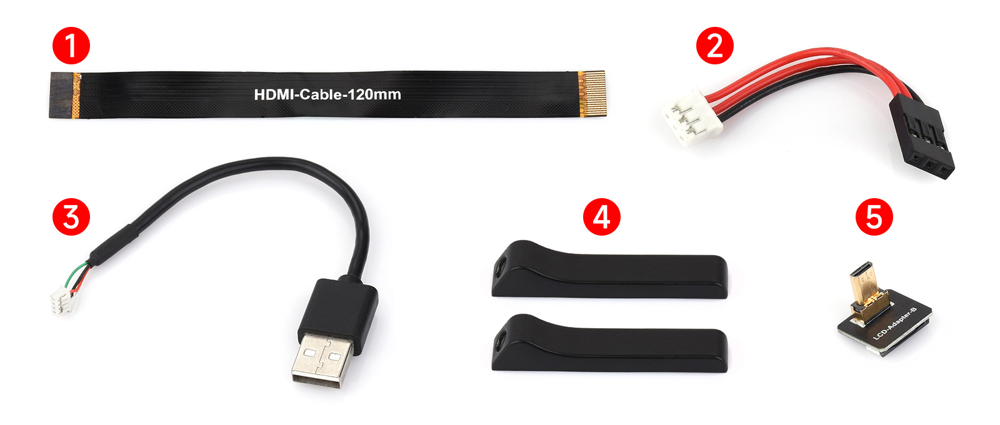
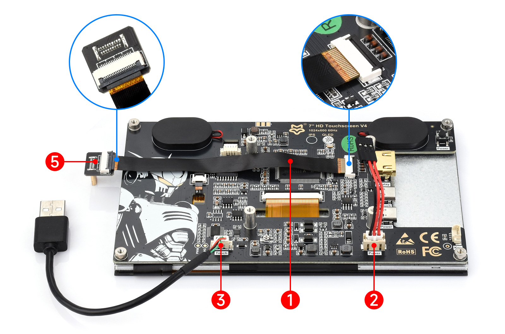
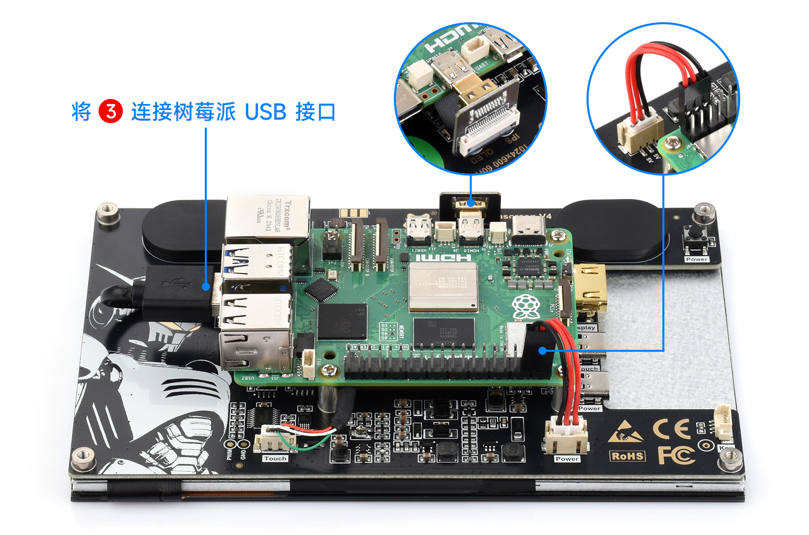
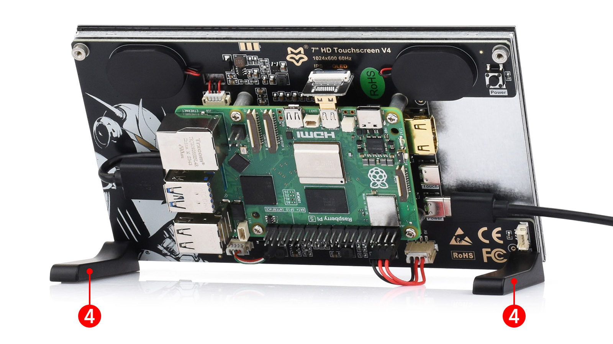

## 1. 介绍

 7'' HD Touchscreen V4是一款具备1024×600硬件分辨率（可通过软件配置，最高支持1920×1080）、5点电容触摸和钢化玻璃面板的显示屏，支持多系统兼容，内置双2W扬声器，并提供多国语言OSD菜单，适用于树莓派及各类标准HDMI设备。

## 2. 产品参数

| **项目** | **描述**               | **单位** |
| -------- | ---------------------- | -------- |
| 产品型号 | 7'' HD Touchscreen V4  | /        |
| 尺寸     | 7.0                    | Inch     |
| 可视角度 | 170                    | Deg      |
| 分辨率   | 1024×600               | Pixels   |
| 产品尺寸 | 164.28 (H) × 99.17 (V) | mm       |
| 显示区域 | 154.58 (H) × 86.42 (V) | mm       |
| 色域     | 50% (IPS) / 72% (QLED) | NTSC     |
| 最大亮度 | 380                    | cd/m²    |
| 对比度   | 800:1                  | /        |
| 背光调节 | OSD菜单调光            | /        |
| 刷新率   | 60                     | Hz       |
| 显示接口 | 标准HDMI接口           | /        |
| 电源接口 | 5V供电                 | /        |
| 功耗     | 3.25                   | Watt     |

## 3. 搭配树莓派使用

### 3.1 硬件连接

1. 准备好下图的连接线，以下将以树莓派 Raspberry Pi5 作为连接演示。<br/>

2. 将电缆①、②和③连接到下图所示的对应位置。将电缆①连接到 LCD 适配器⑤，然后将适配器插入树莓派的 micro HDMI 接口。<br/>

3. 将线缆 ③ 连接到 Raspberry Pi 的 USB 端口，并将线缆 ② 连接到 Raspberry Pi 的 5V 和 GND 引脚接。<br/>

4. 所有电缆连接完成后，请确认连接无误，然后使用 5V 电源为系统供电即可使用。；<br/>

### 3.2 软件设置

支持Raspberry Pi OS/Ubuntu/Kali 和 Retropie系统。

1. 将TF卡连接到PC。

2. 从[树莓派官网](https://www.raspberrypi.com/software/)下载安装 Raspberry Pi Imager。

3. 打开烧写器，选择要写入图像的 TF 卡(注意：最好移除其它U盘设备，以防将U盘文件擦除)。

4. 预先配置系统，按住 CTRL+SHIFT+X(或点击右下角小齿轮)，设置完成点击保存即可。

5. 单击烧录按钮，将数据写入TF卡。

6. 烧录完成后，打开/boot/firmware/目录下的config.txt文件，将以下语句添加到config.txt文件末尾，然后保存退出。

   ```bash
   hdmi_force_hotplug=1
   config_hdmi_boost=10
   hdmi_group=2
   hdmi_mode=87
   hdmi_cvt 1024 600 60 6 0 0 0
   ```

7.  将TF卡插入树莓派，给树莓派上电，正常等待几秒后可正常显示。

## 4. 搭配PC机使用
### 4.1 硬件连接
支持PC版Windows 11 / 10 / 8.1 / 8 / 7系统。

1. 将LCD的Touch接口连接到PC机的USB接口。稍等片刻，Windows会自动识别触摸功能。

2. 将LCD的HDMI接口连接到PC机的HDMI接口，大约等待几秒钟后可以看到LCD正常显示。


**注意事项1：当电脑同时连接多个显示器的时候，只能通过本LCD控制主显示器上的光标，因此建议把LCD设置为主显示器。**

**注意事项2：有些PC机的USB接口由于老化可能导致供电不足，此时可以使用PC机背面的USB接口或者接外部的5V 2A电源适配器。**

### 4.2 Windows指定触控屏
#### Windows11:

1. 进入系统的Windows设置 ，在搜索栏输入并点击" 控制面板 " （如下图所示）<br/>
2. 在弹出的“控制面板”界面中，选择“硬件与声音”<br/>
3. 选择“校准笔和触控输入的屏幕 ”中，在弹出的平板电脑设置中点击“设置”<br/>
4. 屏幕将会出现下图的文字提示，请用手指点击触摸板，电脑将会识别其为触控屏。<br/>
   ```bash
   PS：假如屏幕为空白，请按“Enter”回车键，文字提示将会切换屏幕。（文字提示对应的屏幕，将作为触控屏。）
   ```
#### Windows10：

1.进入系统的Windows设置 ，在搜索栏输入并点击" 校准笔和触控输入的屏幕 " （如下图所示）<br/>

2.在弹出的“平板电脑设置”界面中，点击“设置”<br/>

3.屏幕将会出现下图的文字提示，请用手指点击触摸板，电脑将会识别其为触控屏。<br/>
   ```bash
PS：假如屏幕为空白，请按“Enter”回车键，文字提示将会切换屏幕。（文字提示对应的屏幕，将作为触控屏。）
   ```
