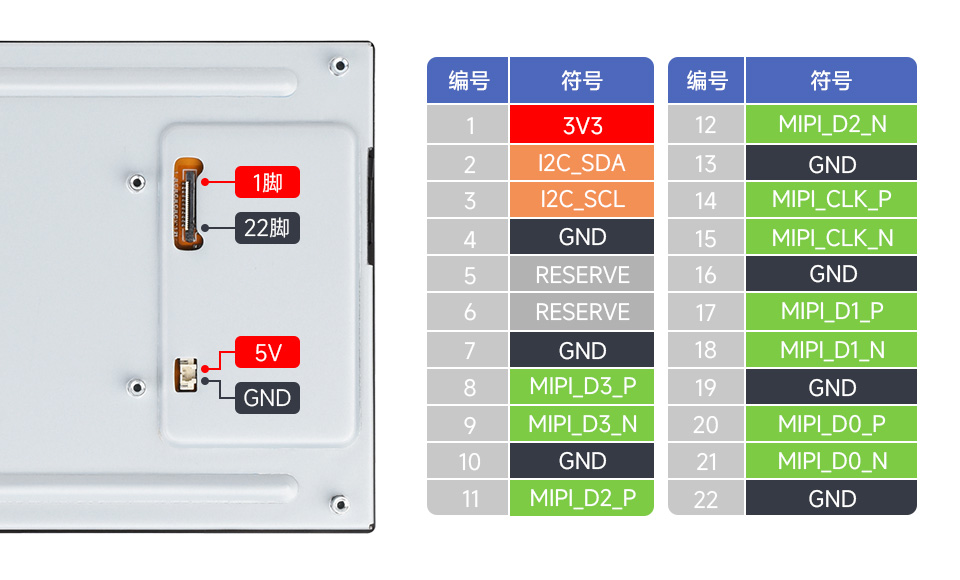
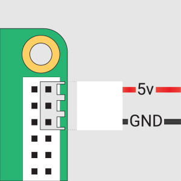
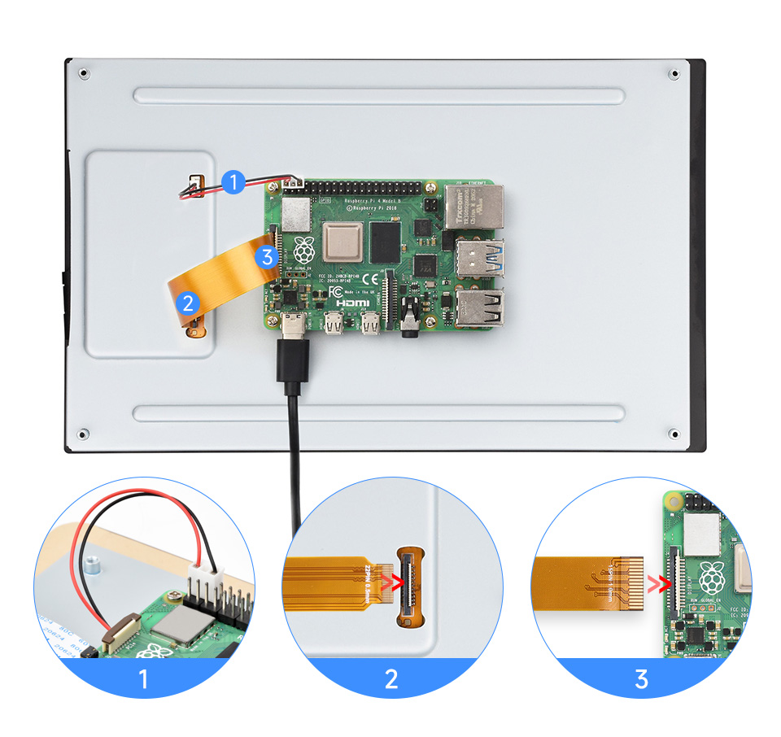
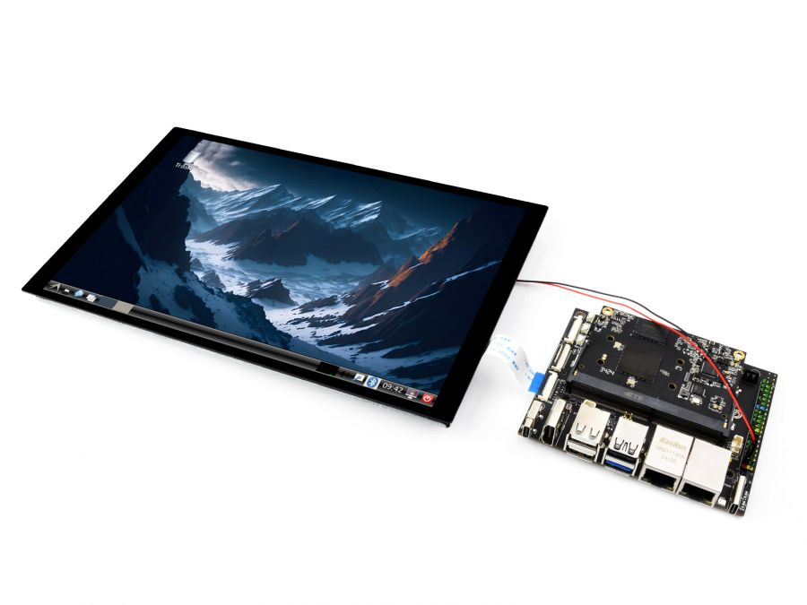
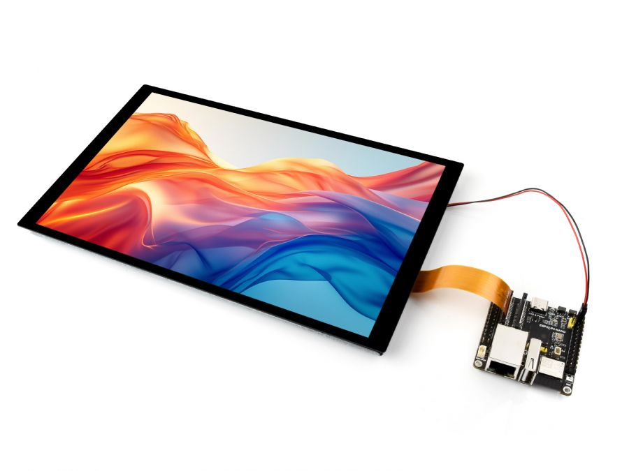

<div id="luckfox_model_mark" style={{display:'none'}}>8-DSI-TOUCH-A</div>

## 产品特性
- 8英寸DSI触控屏，电容式十点触摸控制
- IPS显示面板，硬件分辨率为800×1280
- 采用全贴合工艺，画质更清晰
- 钢化玻璃触摸盖板，硬度可达6H
- DSI接口驱动LCD，刷新率可达60Hz
- 支持通过软件控制背光亮度
- 铝合金背壳设计，纯被动散热设计

## 电气规格

| 参数     | 最小值 | 标准值 | 最大值 | 单位 | Note   |
| -------- | ------ | ------ | ------ | ---- | ------ |
| 输入电压 | 4.75   | 5.00   | 5.30   | V    | Note 1 |
| 输入电流 | -      | 0.8    | TBD    | A    | Note 2 |
| 工作温度 | 0      | 25     | 60     | ℃    | Note 3 |
| 存储温度 | -10    | 25     | 70     | ℃    | Note 3 |

**Note 1**：输入电压超过最大值或操作不当可能会对设备造成永久性损坏。 <br/>
**Note 2**：输入电流需≥0.8A，否则将导致启动失败或者显示异常，长时间处于异常状态可能会对设备造成永久性损坏。 <br/>
**Note 3**：请不要将显示屏长期置于高温高湿的存储环境，显示屏需在极限值范围内工作，否则将可能损坏显示屏。<br/>

## 接口简介<br/>

## Raspberry 使用说明
### Pi5/CM5/CM4/CM3+/CM3 硬件连接
1. 使用"FFC 线 22PIN 200mm (异向) "排线，将显示屏的DSI接口连接到树莓派主板的22PIN DSI接口。
2. 使用"GPIO 连接线"，将显示屏的电源接口连接到树莓派主板的5V GND排针。<br/> 
3. 用M2.5螺丝将树莓派固定到显示屏上。
**安装效果如下：** <br/> 
>**注意**：请确保 DSI 排线方向连接无误，并通过 GPIO 引脚提供 5V 电源。

### Pi4B/3B+/3B/3A+硬件连接
1. 使用"DSI-Cable-12cm"排线，将显示屏的DSI接口连接到树莓派主板的15PIN DSI接口。
2. 使用"GPIO 连接线"，将显示屏的电源接口连接到树莓派主板的5V GND排针。<br/> 
3. 用M2.5螺丝将树莓派固定到显示屏上。
**安装效果如下：**  <br/>

> **注意**：请确保 DSI 排线方向连接无误，并通过 GPIO 引脚提供 5V 电源。

### 软件设置
#### 方法一：烧录最新Bookworm系统
1. 将TF卡连接到PC，下载并使用 [Raspberry Pi Imager](https://www.raspberrypi.com/software) 进行烧录对应系统镜像。<br/>
2. 镜像烧写完成后，打开TF卡根目录的config.txt文件，在config.txt最后加入以下代码，保存并安全弹出TF卡。
> 注意：由于Pi5/CM5/CM4/CM3+/CM3具有两个mipi DSI接口，请注意使用正确的DSI接口和指令，默认推荐使用DSI1。
```
dtoverlay=vc4-kms-v3d
#DSI1 Use
dtoverlay=vc4-kms-dsi-waveshare-panel-v2,8_0_inch_a
#DSI0 Use
#dtoverlay=vc4-kms-dsi-waveshare-panel-v2,8_0_inch_a,dsi0
```
3. 将TF卡插入树莓派，给树莓派上电，正常等待30秒左右可以进入显示，系统启动后可以正常触摸。

#### 方法二：烧写预安装镜像
1. 选择预安装镜像，下载并解压为.img文件 
[8-DSI-TOUCH-A预安装镜像](https://pan.baidu.com/s/1xBMS9cbDOQZ7ROGdyxRJsQ?pwd=wxdz )  
2. 烧写完成后，将TF卡接入到树莓派上，并启动树莓派，等待30秒左右即可正常显示和触摸。

### 调节背光亮度
**GUI界面调光**
* 1.打开"Screen Configuration"应用程序；<br/>

* 2.进入"Screen"->"DSI-2"->"Brightness" ，勾选您需要设置的背光亮度，最后点击"Apply"，即可完成背光设置。<br/>

**命令行调光**
```
 echo X | sudo tee /sys/class/backlight/*/brightness
```
其中X表示0~255中的任意数字。0表示背光最暗，255表示背光最亮。例如：
```
echo 100 | sudo tee /sys/class/backlight/*/brightness
echo 0 | sudo tee /sys/class/backlight/*/brightness
echo 255 | sudo tee /sys/class/backlight/*/brightness
```
### Bookworm触摸屏旋转
1. 打开"Screen Configuration"应用程序；  <br/>
2. 进入"Screen"->"DSI-1"->"Touchscreen"，勾选"10-0014 Goodix Capacitive TouchScreen"  <br/>
   
3. 点击"Apply"，然后关闭当前窗口，根据弹窗提示进行Reboot，即可完成指定触摸屏；<br/><br/>
4. 进入"Screen"->"DSI-1"->"Orientation" ，勾选您需要旋转的方向，最后点击"Apply"即可完成显示和触摸同步旋转。 <br/><br/>

**注意**：仅Bookworm系统支持以上同步旋转方法。对于Bullseye和Butser系统，显示旋转后，需手动单独设置触摸旋转。

#### lite版本显示旋转 
```sh
sudo nano /boot/firmware/cmdline.txt
```
在`cmdline.txt`文件开头添加对应显示旋转角度的指令，保存重启后生效。
- 旋转指令
```sh
# 显示旋转90度
video=DSI-1:800x1280M@60,rotate=90

# 显示旋转270度
video=DSI-1:800x1280M@60,rotate=270

# 显示旋转180度
video=DSI-1:800x1280M@60,rotate=180
```
> 注意：
> - 1.如果是使用Pi5/CM5，以实际识别到的DSI显示器编号为准，例如"DSI-2"。
> - 2.无法使用 cmdline.txt 将 DSI 显示器与 HDMI 显示器分开旋转。当您同时使用 DSI 和 HDMI 时，它们共享相同的旋转值。

#### 触摸旋转 
```sh
sudo nano /etc/udev/rules.d/99-waveshare-touch.rules
```

在文件内设定触摸旋转角度的指令，重启后生效。

```sh
# 触摸旋转90度
ENV{ID_INPUT_TOUCHSCREEN}=="1", ENV{LIBINPUT_CALIBRATION_MATRIX}="0 -1 1 1 0 0"

# 触摸旋转270度
ENV{ID_INPUT_TOUCHSCREEN}=="1", ENV{LIBINPUT_CALIBRATION_MATRIX}="0 1 0 -1 0 1"

# 触摸旋转180度
ENV{ID_INPUT_TOUCHSCREEN}=="1", ENV{LIBINPUT_CALIBRATION_MATRIX}="-1 0 1 0 -1 1"

# 保存退出并重启：
sudo reboot
```
### 使用触摸屏虚拟键盘
从 Raspberry Pi OS Bookworm 版本开始，系统默认集成了 Squeekboard 屏幕键盘。
当连接触摸显示屏时，在可以输入文字的情况下，屏幕键盘会自动显示；而在无法输入文字的情况下，它会自动隐藏。<br/>
对于不支持自动检测文字输入的应用程序，可以使用任务栏最右侧的键盘图标手动显示或隐藏屏幕键盘。<br/><br/>
你也可以通过“Raspberry Pi Configuration”中的“Display”选项栏目，或通过 raspi-config 中的“Display”部分，来永久设置屏幕键盘的显示或隐藏。<br/>
> 提示：<br/>
> 在 Raspberry Pi OS 的 Bookworm 之前的版本中，请使用 matchbox-keyboard。如果你使用的是 wayfire 桌面合成器，请使用 wvkbd。

### 触摸模式选择
Bookworm系统支持两种触控模式，可在 Screen Configuration > Touchscreen 菜单中切换：<br/>
```
*1.Mouse Emulation（默认）
 单击 = 鼠标左键功能
 长按 = 鼠标右键功能
 支持双击
 不支持滑动页面和多点触摸功能
```
注：此模式适合需要鼠标操作的场景，如双击打开文件管理器，长按实现右键功能。<br/>

```
*2.Multitouch
 支持多点触摸功能
 支持滑动页面
 不支持双击和长按右键功能
```
注：此模式适合触控优化场景，如网页浏览、滚动列表。

## Luckfox-Omni3576 使用说明
### 硬件连接
1. 使用22PIN的FPC排线，将显示屏DSI接口连接到Omni3576主板的DSI接口。

2. 使用2PIN电源连接线，将显示屏的电源接口连接到Omni3576主板的40PIN GPIO接口。如下图所示：<br/>
### 软件设置
1. 下载并使用[幸狐官网的镜像文件](https://wiki.luckfox.com/zh/luckfox-Omni3576/Burn-image)进行烧录。
2. 接入5V电源，待系统启动后屏幕即可亮起。

### 查看屏幕信息

- 当前系统中可用的屏幕 ID 可通过以下命令查看：

```sh
sudo cat /sys/kernel/debug/dri/0/summary
```

- 正常会得到以下输出：
```sh
Video Port0: DISABLED
Video Port1: ACTIVE
    Connector:DSI-1     Encoder: DSI-203
        bus_format[100a]: RGB888_1X24
        overlay_mode[0] output_mode[0] SDR[0] color-encoding[BT.709] color-range[Full]
    Display mode: 800x1280p60
        clk[70000] real_clk[69883] type[48] flag[a]
        H: 800 840 860 880
        V: 1280 1300 1304 1324
        Fixed H: 800 840 860 880
        Fixed V: 1280 1300 1304 1324
    Esmart1-win0: ACTIVE
        win_id: 1
        format: XR24 little-endian (0x34325258) pixel_blend_mode[0] glb_alpha[0xff]
        color: SDR[0] color-encoding[BT.601] color-range[Limited]
        rotate: xmirror: 0 ymirror: 0 rotate_90: 0 rotate_270: 0
        csc: y2r[0] r2y[0] csc mode[0]
        zpos: 1
        src: pos[0, 0] rect[800 x 1280]
        dst: pos[0, 0] rect[800 x 1280]
        buf[0]: addr: 0x00000000fe44e000 pitch: 3200 offset: 0
Video Port2: DISABLED
```
### 显示旋转
- 旋转指令
```sh
# 旋转90度
xrandr -o left

# 旋转270度
xrandr -o right

# 旋转180度
xrandr -o inverted

# 旋转0度
xrandr -o normal
```
- 使用 xrandr 旋转的效果是一次性的，系统重启后屏幕显示方向会还原。 如果要开机自动旋转，则需要修改配置文件：
```sh
sudo vim  /etc/X11/xorg.conf.d/10-monitor.conf
```
- 添加以下语句：
```sh
### Valid values for rotation are "normal", "left", "right"
Section "Monitor"
#    Identifier "Default Monitor"
    Identifier  "DSI-1"
    Option      "Rotate" "left"
EndSection
```
### 触摸旋转
- 系统显示旋转后，触摸方向不一致，需要按下文操作进行触摸旋转：
```sh
sudo vim  /etc/udev/rules.d/99-luckfox-touch.rules
```
- 根据自己的旋转方向，加入对应的配置，保存后重启开发板。
```sh
90度：
ENV{ID_INPUT_TOUCHSCREEN}=="1", ENV{LIBINPUT_CALIBRATION_MATRIX}="0 -1 1 1 0 0"

180度：
ENV{ID_INPUT_TOUCHSCREEN}=="1", ENV{LIBINPUT_CALIBRATION_MATRIX}="-1 0 1 0 -1 1"

270度：
ENV{ID_INPUT_TOUCHSCREEN}=="1", ENV{LIBINPUT_CALIBRATION_MATRIX}="0 1 0 -1 0 1"
```
## Luckfox-Lyra 使用说明

### 硬件连接
1. 使用22PIN的FPC排线，将显示屏DSI接口连接到Luckfox-Lyra主板的DSI接口。
2. 使用MX1.25 2PIN 转 4PIN 连接线，将显示屏的电源接口连接到Luckfox-Lyra主板的USB MX1.25 4P接口。如下图所示
<br/>

### 软件设置
1. 下载并使用[幸狐官网的镜像文件](https://wiki.luckfox.com/zh/Luckfox-Lyra/Image-flashing)进行烧录。
2. 接入5V电源，待系统启动后屏幕即可亮起。

### 查看屏幕信息

- 当前系统中可用的屏幕 ID 可通过以下命令查看：

```sh
cat /sys/kernel/debug/dri/0/summary
```
- 正常会得到以下输出：
```sh
VOP [ff600000.vop]: ACTIVE
    Connector: DSI-1
        bus_format[100a]: RGB888_1X24
        overlay_mode[0] output_mode[0]color-encoding[1] color-range[1]
    Display mode: 800x1280p60
        dclk[70000 kHz] real_dclk[69475 kHz] aclk[294912 kHz] type[48] flag[a]
        H: 800 840 860 880
        V: 1280 1310 1314 1324
    win1-0: ACTIVE
        format: XR24 little-endian (0x34325258) SDR[0] color-encoding[0] color-range[0]
        csc: y2r[0] r2r[0] r2y[0] csc mode[0]
        zpos: 0
        src: pos[0x0] rect[800x1280]
        dst: pos[0x0] rect[800x1280]
        buf[0]: addr: 0x06100000 pitch: 3200 offset: 0
    post: sdr2hdr[0] hdr2sdr[0]
    pre : sdr2hdr[0]
    post CSC: r2y[0] y2r[0] CSC mode[2]
```
### 显示测试
- 彩条测试指令
```sh
#竖条测试
modetest -M rockchip -s 74@71:800x1280

#斜条测试
modetest -M rockchip -s 74@71:800x1280 -Ftiles
```
### 触摸测试
- 触摸测试指令
```sh
evtest
```
- 正常会得到以下输出：
```sh
No device specified, trying to scan all of /dev/input/event*
Available devices:
/dev/input/event0:      2-005d Goodix Capacitive TouchScreen
Select the device event number [0-0]:
```
- 输入“0”回车后触摸屏幕开始测试，终端会打印触摸操作触发的事件数值。

## ESP32-P4 使用说明
### 屏幕驱动<br/>

ESP32-P4-NANO通过`MIPI 2-lane`驱动该屏幕。<br/>  

1. 此屏幕驱动已封装为组件，组件位置位于[ESP Component Registry](https://components.espressif.com/components/waveshare/esp_lcd_jd9365_8)
   使用`idf.py add-dependency "waveshare/esp_lcd_jd9365_8"`来向你的ESP-IDF工程中添加组件。
2. 你也可以直接查看ESP32-P4-NANO驱动该屏幕的Wiki：[ESP32-P4-NANO_MIPI-DSI](https://www.waveshare.net/wiki/ESP32-P4-Nano-StartPage#MIPI-DSI.E7.82.B9.E5.B1.8F.E7.A4.BA.E4.BE.8B)

### 背光控制

使用配套FPC排线、供电线连接ESP32-P4-NANO后，通过ESP32-P4-NANO I2C 向屏幕**0x45**设备**0x86**寄存器写入0x00~0xFF（满亮度）即可控制背光

如果使用[ESP32-P4-NANO BSP组件](https://components.espressif.com/components/waveshare/esp32_p4_nano)，则可以通过下述函数直接控制

```c
bsp_display_brightness_init();   // 初始化背光
bsp_display_backlight_on();      // 开启背光，默认全亮
bsp_display_backlight_off();     // 关闭背光
bsp_display_brightness_set(95); // 设置具体背光亮度，0~100
```
如下图<br/>  

## 安全说明
为避免本产品发生故障或损坏，请遵守以下事项：
* 连接设备前，请关闭您的 Raspberry Pi 计算机并断开外部电源。
* 如果线缆脱落，请将连接器上的锁定装置向前拉，将带状线缆插入，金属触点朝向您，然后将锁定装置推回原位。
* 本设备应在 0–60°C 的干燥环境中操作。
* 操作时，请勿将设备暴露在水中或潮湿环境中，也不要将其放置在导电表面上。
* 请勿将其暴露在任何过热源的环境中。
* 应注意不要折叠或拉紧带状线缆。
* 拧入零件时应小心。螺纹错位可能会造成无法修复的损坏，并使保修失效。
* 搬运时请小心，避免对印刷电路板和连接器造成机械或电气损坏。
* 存放在阴凉干燥处。
* 避免温度急剧变化，否则会导致设备内积聚湿气。
* 显示屏表面易碎，有可能破碎。

