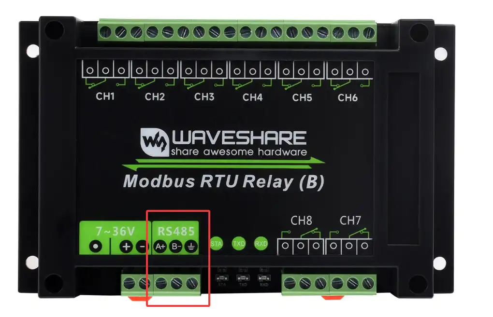
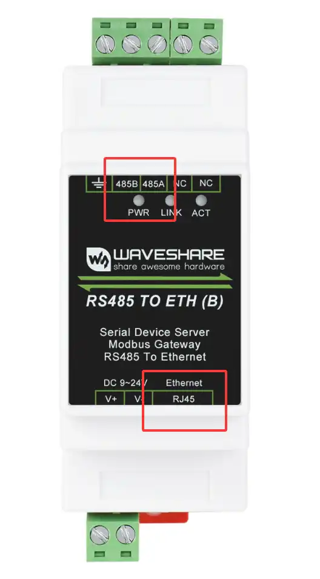
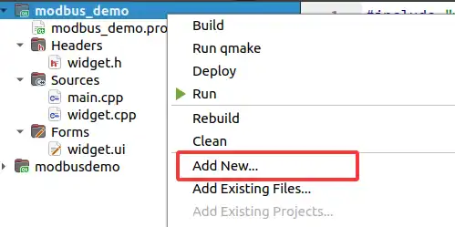
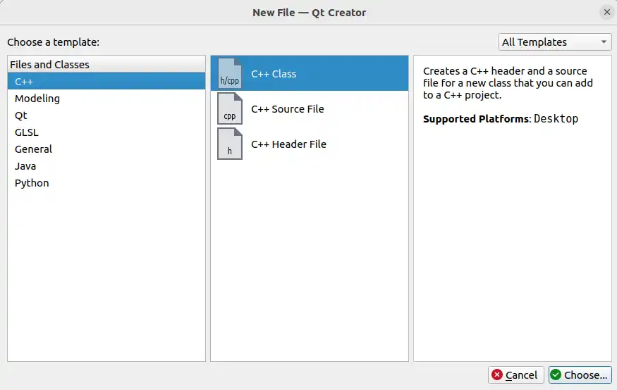
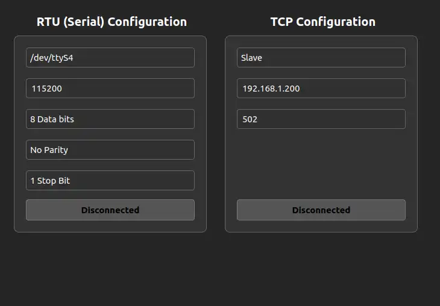
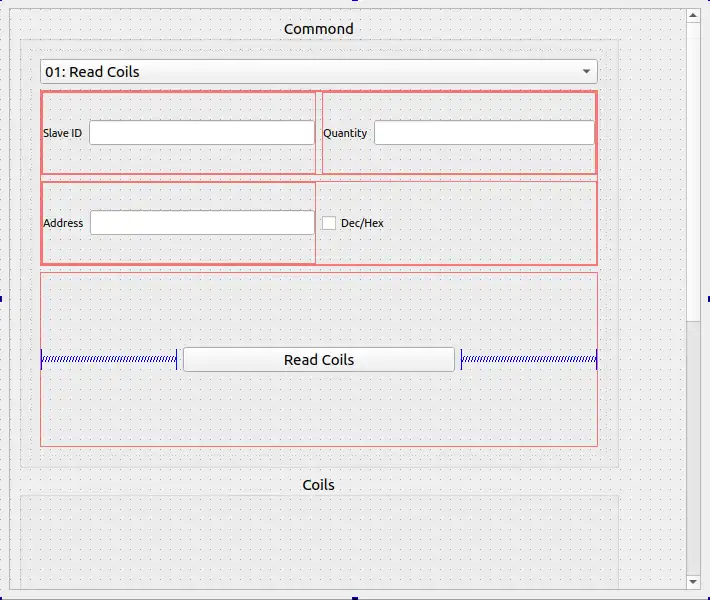
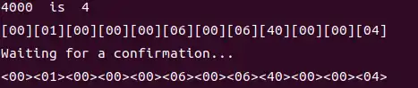
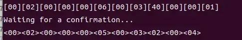
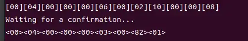
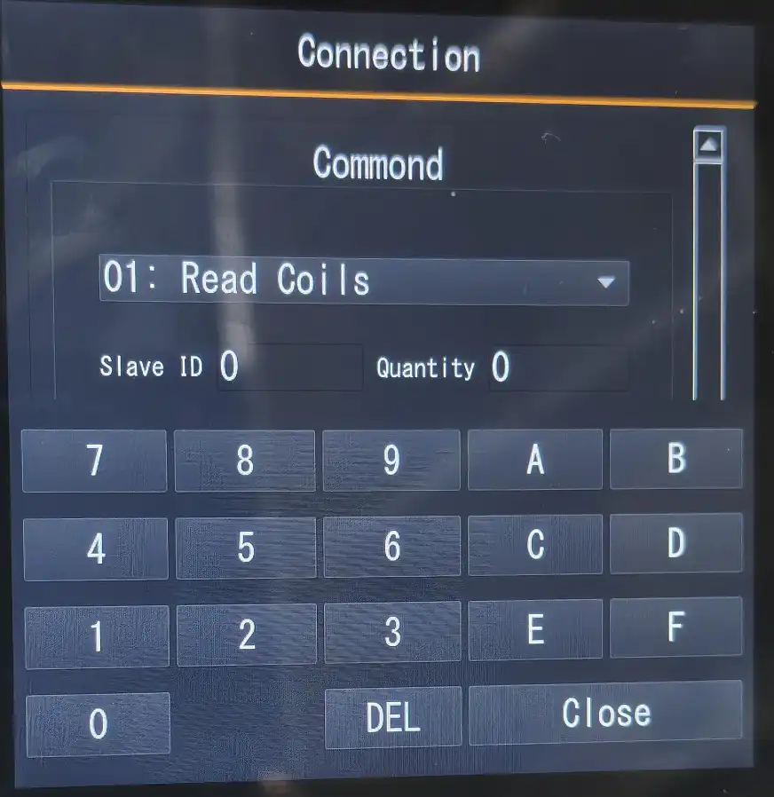

本教程利用QT实现86开发板通过Modbus协议控制硬件及读写寄存器，旨在搭建一个界面控制硬件的完整示例。
## 1.Modbus
在项目设计之前，我们需要对于Modbus有一个了解，方便后续逻辑的开发设计。
### Modbus协议概述
Modbus协议采用主从（Master-Slave）架构，通信总是由主设备发起，从设备响应。主设备可以单独与某个从设备通信，也可以广播消息给所有从设备。从设备对主设备的请求作出响应，但不会主动发起通信。
Modbus有两种传输模式：
1. **ASCII模式**：每个8位字节被拆分成两个ASCII字符发送，使用LRC（纵向冗余校验）校验。
2. **RTU模式**：每个字节作为一个8位二进制值发送，使用CRC（循环冗余校验）校验。RTU模式更常用。

此外，还有基于TCP/IP的Modbus TCP协议，它在以太网上运行，使用TCP端口502。
### Modbus数据模型
Modbus将数据组织成四个独立的数据块：
- **线圈（Coils）**：可读写，1位（bit）数据，通常用于控制数字输出。功能码：读（01），写单个（05），写多个（15）。
- **离散输入（Discrete Inputs）**：只读，1位数据，通常用于读取数字输入。功能码：读（02）。
- **输入寄存器（Input Registers）**：只读，16位（word）数据，通常用于读取模拟输入。功能码：读（04）。
- **保持寄存器（Holding Registers）**：可读写，16位数据，通常用于存储参数或控制模拟输出。功能码：读（03），写单个（06），写多个（16）。
- 
### Modbus RTU报文结构
一个Modbus RTU报文由以下部分组成：
1. **地址域**：1字节，从设备地址（0-247），0为广播地址。
2. **功能码**：1字节，指示操作类型（如读线圈、写寄存器等）。
3. **数据域**：可变长度，取决于功能码。
4. **校验码**：2字节，CRC校验。

### Modbus TCP报文结构
Modbus TCP在RTU的基础上添加了MBAP（Modbus Application Protocol）报文头：
```plaintext
[事务标识符] [2字节]：用于事务匹配，由客户端生成，服务器响应时复制。
[协议标识符] [2字节]：0表示Modbus协议。
[长度] [2字节]：后续字节数（包括单元标识符和数据域）。
[单元标识符] [1字节]：从站地址（在TCP中通常用于路由到后端设备，如果不需要则设为0）。
[功能码] [1字节]：同RTU模式。
[数据域] [可变]：同RTU模式。
```

### 总结
Modbus协议简单、开放、易于实现，因此被广泛采用。它支持串行和以太网通信，适用于各种工业自动化场景。在使用时，注意主从架构、数据模型、功能码定义以及错误处理。

## 2.项目整体概述
### 2.1界面概述

| 界面         | 功能                  | 描述                                                                                              |
| :----------- | :-------------------- | :------------------------------------------------------------------------------------------------ |
主界面|显示子界面和标签|显示链接界面和控制界面，并设计二者的切换。
链接界面|显示链接配置界面|显示RTU和TCP配置信息，提供用户修改配置及链接功能。
控制界面|显示命令界面及功能子界面|提供选择Modbus数据模型，功能按钮以及切换功能子界面。
功能子界面|显示线圈，离散输入，输入寄存器，保持寄存器功能界面|提供线圈控制，离散输入和输入寄存器读取，以及保持寄存器读取和写入功能。

### 2.2 所需硬件及连线
#### 2.2.1 86盒开发板
86开发板作为我们整体项目的控制核心，除了需要再触控面板上显示界面，我们还需要其与其他硬件连线，如下:<br/>
-   **RJ45接口**：通过网线链接对应硬件，实现Modbus TCP通信。
-   **RS485接口**:链接对应硬件，实现 Modbus RTU通信。**注意**：由于主控供电和宽电压供电隔离，在开发面板用type-c供电后，仍需要对上图电源接口供电。

#### 2.2 Modbus RTU Relay
86开发板通过RS485接口，与Modbus RTU Relay链接，如下：<br/>
链接之后，通过RS485控制8个继电器通道，以继电器状态来判断指令有没有发送成功。

#### 2.3RS485转RJ45以太网模块
为了测试Modbus TCP，我们需要将86开发板的RJ45网线接口接口与如下模块链接：<br/>
将RJ45网线接口与开发板链接，RS485接口与Modbus RTU Relay链接，通过该模块对二者的转换，并同样以继电器状态来判断指令有没有发送成功。

## 3.准备工作及创建工程
### 环境配置
由于项目需要用的Modbus的相关库函数，因此需要在SDK中选中相应选项，并将镜像烧录到开发板中。添加Modbus库：<br/>
编译SDK，并将output/image/目录下文件烧录到开发板中。

### 创建工程
打开QT并新建项目：<br/><br/><br/><br/><br/>
选择64位kit(方便预览)，以及86开发板SDK交叉编译环境kit。
新建项目完成后，整体工程如下：<br/>
widget作为项目的整体主界面，用于显示子界面等功能，具体设计后续会介绍，目前我们先着重于子界面的设计。

## 4.链接界面
### 4.1添加链接界面类
1. 右键工程，添加新文件。<br/>
2. 选择类文件。<br/>
3. 填入类名conncrtion,并选择继承与QWidget<br/>
添加完成后，会在工程中生成对应的源文件与头文件。

### 4.2界面具体设计

#### 4.2.1创建RTU组
```cpp
QGroupBox *connection::createRtuGroup()
{
    QGroupBox *groupBox = new QGroupBox("RTU (Serial) Configuration");
    QVBoxLayout *layout = new QVBoxLayout(groupBox);
    layout->setSpacing(15);
    // Serial port
    serialPortCombo = new QComboBox();
    serialPortCombo->addItems({"/dev/ttyS0", "/dev/ttyS1", "/dev/ttyS2", "/dev/ttyS3", "/dev/ttyS4"});
    serialPortCombo->setCurrentIndex(4);
    // Baud rate
    baudEdit = new QLineEdit("9600");
    // Data bits
    dataBitsCombo = new QComboBox();
    dataBitsCombo->addItems({"8 Data bits", "7 Data bits"});
    // Parity
    parityCombo = new QComboBox();
    parityCombo->addItems({"No Parity", "Odd Parity", "Even Parity"});
    // Stop bits
    stopBitsCombo = new QComboBox();
    stopBitsCombo->addItems({"1 Stop Bit", "2 Stop Bits"});
    // Connect button
    serialConnectBtn = new QPushButton("Disconnected");
    connect(serialConnectBtn, &QPushButton::clicked, this, &connection::onSerialConnectClicked);
    // Form layout
    QFormLayout *formLayout = new QFormLayout();
    formLayout->setSpacing(18);
    formLayout->addRow(serialPortCombo);
    formLayout->addRow(baudEdit);
    formLayout->addRow(dataBitsCombo);
    formLayout->addRow(parityCombo);
    formLayout->addRow(stopBitsCombo);
    layout->addLayout(formLayout);
    layout->addStretch();
    layout->addWidget(serialConnectBtn);
    return groupBox;
}
```

**代码功能分析：**

 | 配置项       | 控件类型     | 初始值/选项                                      | 默认值/选中项       |
 |--------------|--------------|--------------------------------------------------|---------------------|
 | 串口号       | QComboBox    | "/dev/ttyS0", "/dev/ttyS1", "/dev/ttyS2", "/dev/ttyS3", "/dev/ttyS4" | "/dev/ttyS4" (索引4) |
 | 波特率       | QLineEdit    |  "9600"                                        |             |
 | 数据位       | QComboBox    | "8 Data bits", "7 Data bits"                     | 第一项（8位）       |
 | 校验位       | QComboBox    | "No Parity", "Odd Parity", "Even Parity"         | 第一项（无校验）    |
 | 停止位       | QComboBox    | "1 Stop Bit", "2 Stop Bits"                      | 第一项（1位）       |
 | 连接按钮     | QPushButton  | "Disconnected"                                   |                     |

布局结构：
 - 组框使用垂直布局（QVBoxLayout）。
   - 首先添加表单布局（QFormLayout），表单布局中包含5行，每行一个配置项。
   - 然后添加一个伸缩项（addStretch），这样后面的按钮会位于底部。
   - 最后添加连接按钮。

信号连接：
   - 当连接按钮被点击时，会触发`connection::onSerialConnectClicked`槽函数。

#### 4.2.2创建TCP组
```cpp
QGroupBox *connection::createTcpGroup()
{
    QGroupBox *groupBox = new QGroupBox("TCP Configuration");
    QVBoxLayout *layout = new QVBoxLayout(groupBox);
    layout->setSpacing(15);
    // Mode selection
    modeCombo = new QComboBox();
    modeCombo->addItems({"Slave", "Master"});
    modeCombo->setCurrentIndex(0);
    // IP address
    ipEdit = new QLineEdit("192.168.1.200");
    // Port
    portEdit = new QLineEdit("502");
    // Connect button
    tcpConnectBtn = new QPushButton("Disconnected");
    connect(tcpConnectBtn, &QPushButton::clicked, this, &connection::onTcpConnectClicked);
    // Form layout
    QFormLayout *formLayout = new QFormLayout();
    formLayout->setSpacing(18);
    formLayout->addRow(modeCombo);
    formLayout->addRow(ipEdit);
    formLayout->addRow(portEdit);
    layout->addLayout(formLayout);
    layout->addStretch();
    layout->addWidget(tcpConnectBtn);
    return groupBox;
}
```
**代码功能分析：**

 | 配置项       | 控件类型     | 初始值/选项                                      | 默认值/选中项       |
 |--------------|--------------|--------------------------------------------------|---------------------|
 |工作模式	 | QComboBox	| "Slave", "Master"	"Slave" (索引0)	|选择设备作为主站或从站|
 |IP地址	|QLineEdit		|"192.168.1.200"	|TCP通信的目标IP地址|
 |端口号	|QLineEdit	    |"502"   	     |	Modbus TCP标准端口|
 |连接按钮	|QPushButton	|"Disconnected"		|控制TCP连接的按钮|


布局结构：
-   组框使用垂直布局（QVBoxLayout）。
    - 首先添加表单布局（QFormLayout），表单布局中包含3行，每行一个配置项。
    - 然后添加一个伸缩项（addStretch），这样后面的按钮会位于底部。
    - 添加链接按钮。

信号链接：
    - 当连接按钮被点击时，会触发`connection::onTcpConnectClicked`槽函数。

#### 4.2.3整体布局
```cpp
void connection::setupUI()
{
    QVBoxLayout *mainLayout = new QVBoxLayout(this);
    mainLayout->setSpacing(20);
    mainLayout->setContentsMargins(25, 25, 105, 25);
    // Horizontal layout for RTU and TCP sections
    QHBoxLayout *contentLayout = new QHBoxLayout();
    contentLayout->setSpacing(30);
    // RTU Section (left)
    QGroupBox *rtuGroup = createRtuGroup();
    contentLayout->addWidget(rtuGroup);
    // TCP Section (right)
    QGroupBox *tcpGroup = createTcpGroup();
    contentLayout->addWidget(tcpGroup);
    mainLayout->addLayout(contentLayout,2);

    // Status bar
    statusLabel = new QLabel(""); 
    statusLabel->setFrameShape(QFrame::NoFrame); 
    statusLabel->setStyleSheet("background-color: transparent;");
    statusLabel->setMinimumHeight(30);
    mainLayout->addWidget(statusLabel,1);
}
```
**代码功能分析：**
-   设定水平布局(QHBoxLayout),将RTU组与TCP组分别布局于整体界面的左右两侧.

至此，链接界面的界面UI便设计完毕，在链接界面类的构造函数调用setupUI(),并在主界面Widger中实例化链接界面对象，利用show()显示链接界面对象，预览效果如下:<br/>

### 4.3链接功能实现
#### 4.3.1 RTU链接功能实现
```cpp
void connection::serialModbusInit()
{
    QString port = serialPortCombo->currentText();
    if (port.isEmpty()) {
        qWarning() << "Serial port not selected";
        return;
    }
    bool baudOk;
    int baud = baudEdit->text().toInt(&baudOk);
    if (!baudOk || baud <= 0) {
        qWarning() << "Invalid baud rate, using default 9600";
        baud = 9600;
    }
    char parity = 'N'; 
    QString parityText = parityCombo->currentText();
    if (parityText.contains("Odd", Qt::CaseInsensitive)) {
        parity = 'O';
    } else if (parityText.contains("Even", Qt::CaseInsensitive)) {
        parity = 'E';
    }
    int dataBits = 8;
    QString dataBitsText = dataBitsCombo->currentText();
    QRegularExpression re("\\d+");
    QRegularExpressionMatch match = re.match(dataBitsText);
    if (match.hasMatch()) {
        dataBits = match.captured(0).toInt();
    }
    if (dataBits != 7 && dataBits != 8) {
        qWarning() << "Invalid data bits, using 8";
        dataBits = 8;
    }
    int stopbits = 1;
    QString stopBitsText = stopBitsCombo->currentText();
    if (stopBitsText.contains("2") ||
            stopBitsText.contains("Two", Qt::CaseInsensitive)) {
        stopbits = 2;
    }
    serial_mb = modbus_new_rtu(
                port.toUtf8().constData(),
                baud,
                parity,
                dataBits,
                stopbits
                );
    if (!serial_mb) {
        qCritical() << "Unable to create Modbus RTU context";
        return;
    }
    modbus_set_debug(serial_mb, 1);
}

int connection::serialModbusConnect(void){
    return  modbus_connect(serial_mb);
}

void connection::serialModbusDisconnect(void){
    modbus_close(serial_mb);
    modbus_free(serial_mb);
}

void connection::onSerialConnectClicked()
{
    serialModbusInit();

    if (serialConnectBtn->isChecked()) {
        if (serialModbusConnect() == 0) {
            serialConnectBtn->setText("Connected");
            emit modbusConnectionEstablished(static_cast<void*>(serial_mb));
        } else {
            qDebug() << "serial failed";
            serialConnectBtn->setChecked(false);
        }
    } else {
        serialModbusDisconnect();
        serialConnectBtn->setText("Disconnected");
        emit modbusDisconnected(static_cast<void*>(serial_mb));
    }
}
```

**代码功能分析：**
-   获取用户RTU配置，包括串口号，波特率，校验位，数据位，停止位。
-   `modbus_new_rtu`使用获取的参数创建 Modbus RTU 上下文，并设置调试模式。
-   处理串口连接按钮的点击事件，实现连接建立与断开的功能，通过`serialModbusConnect`判断创建是否成功，成功更新链接按钮文本位Connected表示已链接，否则保持原样，并且发送对应的信号。
  
#### 4.3.2 TCP链接功能实现
```cpp

int connection::tcpModbusConnect() {
    return modbus_connect(mb);
}

void connection::tcpModbusDisconnect() {
    modbus_close(mb);
}

void connection::onTcpConnectClicked()
{
    mb = modbus_new_tcp(ipEdit->text().toUtf8(), portEdit->text().toInt());
    modbus_set_debug(mb, 1);

    if (tcpConnectBtn->isChecked()) {
        if (tcpModbusConnect() == 0) {
            tcpConnectBtn->setText("Connected");
            emit modbusConnectionEstablished(static_cast<void*>(mb));
        } else {
            qDebug() << "connect tcp failed";
            tcpConnectBtn->setChecked(false); 
        }
    } else {
        tcpModbusDisconnect();
        tcpConnectBtn->setText("Disconnected");
        emit modbusDisconnected(static_cast<void*>(mb));
    }
}
```
**代码功能分析：**
- 获取ip及port，创建Modbus Tcp上下文。
- 调用`tcpModbusConnect`判断是否链接，链接成功发送`modbusConnectionEstablished`信号，再次点击触发断开链接处理。


## 5.控制界面
### 5.1添加控制界面类
与链接界面类似，在工程中添加名为mcontrol类作为控制界面，生成对应的源文件和头文件。
### 5.2控制界面设计
由于控制界面与包含的功能界面涉及的控件较多，为了方便访问，对于控制界面的UI设计，采用了QT Designer配合代码方式，如下:<br/><br/>

```cpp
mcontrol::mcontrol(QWidget *parent) :
    QWidget(parent),
    ui(new Ui::mcontrol),
    gridLayout(nullptr)
{
    ui->setupUi(this);

    ui->btn_control->setStyleSheet(
                "QPushButton {"
                "   background: qlineargradient(x1:0, y1:0, x2:0, y2:1,"
                "                   stop:0 rgba(255, 119, 0, 0.3),"
                "                   stop:1 rgba(255, 119, 0, 0.1));"
                "   border: 2px solid #FF7700;"
                "   border-radius: 10px;"
                "   color: white;"
                "   padding: 8px 16px;"
                "   font-weight: bold;"
                "   text-shadow: 1px 1px 2px rgba(0, 0, 0, 0.7);"
                "}"
                "QPushButton:hover {"
                "   background: qlineargradient(x1:0, y1:0, x2:0, y2:1,"
                "                   stop:0 rgba(255, 119, 0, 0.4),"
                "                   stop:1 rgba(255, 119, 0, 0.2));"
                "   border: 2px solid #FF9900;"
                "}"
                "QPushButton:pressed {"
                "   background: qlineargradient(x1:0, y1:0, x2:0, y2:1,"
                "                   stop:0 rgba(255, 85, 0, 0.5),"
                "                   stop:1 rgba(255, 85, 0, 0.3));"
                "   border: 2px solid #FF5500;"
                "}"
                );
    ui->btn_control->setText("Read Coils");
    ui->btn_control->setCheckable(true);
    ui->le_quantity->setText("0");
    ui->le_address->setText("0");
    ui->le_slaveid->setText("0");

    gridLayout = new QGridLayout(ui->Coilsbox);
    gridLayout->setSpacing(5);
    ui->Coilsbox->setLayout(gridLayout);
    resgistertable.tableWidget->hide();

    ....
}
```

**代码功能分析：**
-   初始化各控件显示样式及文本框内容，包括按钮的显示，按下松开样式，地址等文本框默认显示，设置功能显示区域。

预览界面如下：<br/>

### 5.3功能子界面设计
#### 5.3.1线圈界面
##### 创建线圈界面类

在工程项目中添加名为coilswidget类作为线圈界面。

```cpp
    CoilsContainer::CoilsContainer(QWidget *parent)
    : QWidget(parent), gridLayout(new QGridLayout(this))
{
    setLayout(gridLayout);
    gridLayout->setSpacing(10);
    gridLayout->setContentsMargins(5, 5, 5, 5);

    styleNormal = "QPushButton {"
                  "  border: 2px solid #FF8C00;"
                  "  border-radius: 10px;"
                  "  background-color: transparent;"
                  "}"
                  "QPushButton:hover {"
                  "  background-color: rgba(255, 140, 0, 0.1);"
                  "}";

    stylePressed = "QPushButton {"
                   "  border: 2px solid #FF8C00;"
                   "  border-radius: 10px;"
                   "  background-color: #FF8C00;"
                   "  color: white;"
                   "}";
 
    readOnlyOnStyle = "QPushButton {"
                      "  background-color: white;"
                      "  border: 2px solid #FF8C00;"
                      "  border-radius: 10px;"
                      "}";

    readOnlyOffStyle = "QPushButton {"
                       "  background-color: transparent;"
                       "  border: 2px solid #FF8C00;"
                       "  border-radius: 10px;"
                       "}";
}
```
**代码功能分析：**
- **线圈界面设计说明**
  - 构造函数功能
  - 仅完成**基础布局设计**
  - 设置**字符串样式类型**
  - **未实现**具体显示内容配置
- **设计原因**
  - 线圈界面作为**功能子界面**
  - 具体显示内容需由**控制界面**动态配置
- **接口需求**
  - 线圈界面类需**提供配置接口**
  - 供控制界面调用以实现：
    - 显示参数传递
    - 内容动态更新
##### 实现配置接口

```cpp
void CoilsContainer::setQuantity(int quantity) {
    if (quantity == buttons.size()) return;

    for (QPushButton *btn : buttons) {
        gridLayout->removeWidget(btn);
        delete btn;
    }
    buttons.clear();
    coilStates.clear();

    if (quantity <= 0) return;

    int cols = qMin(4, quantity);
    int rows = (quantity + cols - 1) / cols;

    for (int i = 0; i < quantity; ++i) {
        QPushButton *btn = new QPushButton(textFormat.arg(i + 1), this);
        btn->setCheckable(true);
        btn->setMinimumSize(80, 30);
        btn->setStyleSheet(styleNormal);

        int row = i / cols;
        int col = i % cols;
        gridLayout->addWidget(btn, row, col);

        connect(btn, &QPushButton::clicked, [this, btn]() {
            bool isChecked = btn->isChecked();
            coilStates[btn] = isChecked;
            if (isChecked) {
                btn->setStyleSheet(stylePressed);
            } else {
                btn->setStyleSheet(styleNormal);
            }
            int index = buttons.indexOf(btn);
            if (index != -1) {
                emit coilClicked(index, isChecked);
            }
        });
        buttons.append(btn);
        coilStates[btn] = false;
    }
}

//mcontrol.cpp
connect(ui->le_quantity, &QLineEdit::textChanged, [this](const QString &text) {
        bool ok;
        int quantity = text.toInt(&ok);
        if (ok && quantity > 0) {
            coilsContainer->setQuantity(quantity);
        }
});
```
**代码功能分析：**
根据设定的线圈数量（quantity）动态创建和排列按钮，每个按钮代表一个线圈状态。
- 逻辑步骤
  1. **检查数量是否变化**：如果新数量与当前按钮数量相同，则直接返回。
  2. **清理现有按钮**：从布局中移除并删除所有现有按钮，清空按钮列表和状态映射。
  3. **处理无效数量**：如果数量小于等于0，则直接返回（此时已清空界面）。
  4. **计算网格布局**：
     - 列数（cols）取4和数量中的较小值（即最多4列）。
     - 行数（rows）根据数量和列数计算（向上取整）。
  5. **创建新按钮**：
      - 循环创建`quantity`个按钮。
      - 按钮文本根据`textFormat`格式化（如"Coil %1"），参数为索引+1（从1开始）。
      - 设置按钮可选中（checkable），最小尺寸，以及初始样式（`styleNormal`）。
      - 根据计算的行列位置将按钮添加到网格布局（gridLayout）。
      - 为每个按钮连接点击信号：切换按钮状态（包括样式改变）并发出`coilClicked`信  号，传递线圈索引和状态。
      - 将按钮添加到按钮列表（buttons）并初始化状态映射（coilStates）为false。
- 与控制界面链接信号
  - 与ui->le_quantity绑定信号与槽，当数值变化的时候，调用setQuantity显示当前按钮数量。

##### 绑定coilClicked信号，实现控制
```cpp
connect(coilsContainer, &CoilsContainer::coilClicked,
            this, &mcontrol::onCoilButtonClicked1);

void mcontrol::onCoilButtonClicked1(int index, bool state)
{
    if (ui->comboBox->currentIndex() == 0) {
        return;
    }
    qDebug() << index << state;
    if(state)
    {
        if(ui->comboBox->currentIndex() == 4)
        {
            if(modbusContext != nullptr)
            {
                modbus_set_slave(modbusContext, ui->le_slaveid->text().toInt());
                modbus_write_bit(modbusContext,index,1);
            }
        }
    }else
    {
        if(ui->comboBox->currentIndex() == 4)
        {
            if(modbusContext != nullptr)
            {
                modbus_set_slave(modbusContext, ui->le_slaveid->text().toInt());
                modbus_write_bit(modbusContext,index,0);
            }
        }
    }
}
```
**代码功能分析：**
-  首先判断组合框（comboBox）的当前索引是否为0，如果是0则直接返回（可能是禁用状态）。
-  打印调试信息（线圈索引和状态）。
-  如果状态为true（置位）：
    - 判断组合框当前索引是否为4,即写入单个线圈界面。
    - 如果满足条件且modbusContext不为空（已连接），则设置从站ID，并执行写单个线圈操作（写1）。
-  如果状态为false（复位）：
    - 同样判断组合框索引是否为4且modbusContext不为空，然后执行写单个线圈操作（写0）。

并在组合框ui->comboBox->currentIndex()的currentIndexChanged(int)信号绑定的槽函数中，添加如下代码，显示线圈界面:
```cpp
void mcontrol::on_comboBox_currentIndexChanged(int index)
{
    ···
    else if(index == 4 || index == 6)
    {

        resgistertable.tableWidget->hide();
        registersContainer->hide();
        diTable->hide();
        coilsContainer->setReadOnlyMode(false);
        coilsContainer->resetToNormalStyles();
        ui->btn_control->setText("Write coils");
        ui->Coilsbox->setMinimumHeight(200);
        ui->Coilsbox->setMaximumHeight(200);
        coilsContainer->show();
    }
    ···
}
```
**代码功能分析：**
-   当组合框选中写单个线圈界面和写多个线圈界面时，显示线圈控制界面，以便于用户控制。

目前存在问题，链接界面新建的Modbus上下文还没有传递给控制界面，之前链接界面在创建成功后会发送modbusConnectionEstablished信号，那么我们可以对齐绑定并实现获取到对应的Modbus上下文。

- 在主界面窗口绑定信号与槽：
```cpp
connect(connectionWidget,&connection::modbusConnectionEstablished,
            controlwidget, &mcontrol::setModbusConnection);
```
- 获取Modbus上下文
```cpp
void mcontrol::setModbusConnection(void *mb)
{
    if (modbusContext) {
        modbus_close(modbusContext);
        modbus_free(modbusContext);
    }
    modbusContext = static_cast<modbus_t*>(mb);
}
```
将开发板与RS485转RJ45以太网模块链接，并且RS485转RJ45以太网模块再与Modbus RTU Relay链接，运行效果如下：<br/>
输出报文：<br/>
**报文分析：**
 - 示例报文1（发送）：
   - `[00][01][00][00][00][06][00][05][00][02][FF][00]`
 拆解：
 事务标识: 00 01 (通常每次通信递增，这里第一条是0001)
 协议标识: 00 00 (Modbus协议固定为0)
 长度: 00 06 (后面6个字节)
 单元标识: 00 (从站地址，这里是0，但实际在Modbus TCP中，这个字段通常被忽略，或者用作设备地址)
 功能码: 05 (写单个线圈)
 数据: 00 02 FF 00 (线圈地址为00 02 -> 2，值为FF 00 -> 表示ON)
 -  示例报文1（响应）：
    -  `<00><01><00><00><00><06><00><05><00><02><FF><00>`
 同样结构，事务标识相同，表示响应请求。
 同理其他报文。

至此，控制写入单个线圈功能已完成。

##### 写入多个线圈功能实现
```cpp
QVector<bool> CoilsContainer::getCoilStates() const {
    QVector<bool> states;
    for (QPushButton *btn : buttons) {
        states.append(coilStates.value(btn, false));
    }
    return states;
}

void mcontrol::on_btn_control_clicked()
{
    ...
    int quantity = ui->le_quantity->text().toInt();
    int startaddress = ui->le_address->text().toInt();
    QVector<bool> coilStates = coilsContainer->getCoilStates();
    uint8_t *writeData = new uint8_t[quantity];

    for(int i = 0;i < quantity;i++)
    {
        writeData[i] = coilStates.value(i,false) ? 1 : 0;
        if(coilStates.value(i,false)) coilCount++;
    }

    int res = -1;
    if(ui->comboBox->currentIndex() == 6)
    {
        res = modbus_write_bits(modbusContext, actualaddresss, quantity, writeData);
    }
    ...
}
```

**代码功能分析：**
-   通过getCoilStates遍历线圈按钮状态并记录，当点击控制界面的功能按钮ui->btn_control并且ui->comboBox->currentIndex()选中为写多个线圈功能时，调用modbus_write_bits一次性写入，实现控制多个线圈功能。

###### 读取线圈状态
```cpp
void CoilsContainer::setReadOnlyMode(bool readOnly)
{
    for (QPushButton *btn : buttons) {
        btn->setEnabled(!readOnly);
    }
}

void CoilsContainer::updateVisualState(const QVector<bool> &states)
{
    for (int i = 0; i < qMin(buttons.size(), states.size()); i++) {
        if (states[i]) {
            buttons[i]->setStyleSheet(readOnlyOnStyle);
        } else {
            buttons[i]->setStyleSheet(readOnlyOffStyle);
        }
    }
}

void mcontrol::on_btn_control_clicked()
{
    ...
    uint8_t *readData = new uint8_t[quantity];
    else if(ui->comboBox->currentIndex() == 0)
    {
        res = modbus_read_bits(modbusContext, actualaddresss, quantity, readData);
    }
    if(res == quantity)
    {
        ...
        else if(ui->comboBox->currentIndex() == 0)
        {
            for (int i = 0; i < quantity; i++) {
                states.append(readData[i] == 1);
            }          
            coilsContainer->setCoilStates(states);         
            if (ui->comboBox->currentIndex() == 0) {
                coilsContainer->setReadOnlyMode(true);
                coilsContainer->updateVisualState(states);
            }
        }
        ...
    }
    ...
}
```

**代码功能分析：**
-   同样时控制页面的功能按钮点击触发槽函数，并判断ui->comboBox->currentIndex()是否为读取线圈功能，显示线圈界面并且设置按钮为不可点击状态，并且设置样式表明读取结果。

运行效果如下：<br/>

#### 5.3.2寄存器界面

##### 创建寄存器信息组类
在项目中添加名为RegisterGroup类作为显示一组寄存器信息及功能按钮。
并初始化其布局和控件：
```cpp
RegisterGroup::RegisterGroup(QWidget *parent) : QWidget(parent),
    currentAddress(0)
{
    QVBoxLayout *layout = new QVBoxLayout(this);
    layout->setSpacing(5);
    layout->setContentsMargins(2, 2, 2, 2);

    labelAddress = new QLabel(this);
    labelAddress->setAlignment(Qt::AlignCenter);
    labelAddress->setStyleSheet("QLabel { font-weight: bold; }");
    layout->addWidget(labelAddress);

    lineEditValue = new QLineEdit(this);
    lineEditValue->setAlignment(Qt::AlignCenter);
    lineEditValue->setValidator(new QIntValidator(0, 65535, this));
    layout->addWidget(lineEditValue);

    btnSend = new QPushButton("Send", this);
    btnSend->setStyleSheet(
                "QPushButton {"
                "  background-color: #4CAF50;"
                "  color: white;"
                "  border-radius: 5px;"
                "  padding: 3px;"
                "}"
                "QPushButton:hover {"
                "  background-color: #45a049;"
                "}"
                "QPushButton:pressed {"
                "  background-color: #3d8b40;"
                "}"
                );
    layout->addWidget(btnSend);

     connect(btnSend, &QPushButton::clicked, this, &RegisterGroup::onSendClicked);

}
```
**代码功能分析：**
- 添加布局QVBoxLayout。
- 设置地址标签labelAddress。
- 设置数值输入框lineEditValue
- 发送按钮btnSend，链接信号与槽。

##### 创建寄存器界面类
在项目中添加名为registercontainer类作为功能界面显示寄存器信息组。
```cpp
void RegistersContainer::setQuantity(int quantity, int startAddress,bool hexMode)
{
    for (RegisterGroup *group : registerGroups) {
        gridLayout->removeWidget(group);
        delete group;
    }
    registerGroups.clear();

    if (quantity <= 0) return;

    int cols = qMin(4, quantity);
    int rows = (quantity + cols - 1) / cols;

    for (int i = 0; i < quantity; i++) {
        RegisterGroup *group = new RegisterGroup(this);

        int addr = startAddress + i;
        group->setAddress(addr, hexMode);
        group->setValue(4);

        connect(group, &RegisterGroup::sendClicked,
                this, &RegistersContainer::registerSendClicked);

        int row = i / cols;
        int col = i % cols;
        gridLayout->addWidget(group, row, col);
        registerGroups.append(group);
    }
}

```
**代码功能分析：**
-  与线圈界面类似，得到控制界面ui->le_quantity的数值创建对应的寄存器信息组。
-  计算行列，将对应的寄存器信息组放到对应布局。

##### 实现写入寄存器功能
```cpp
connect(registersContainer, &RegistersContainer::registerSendClicked,
            this, &mcontrol::onRegisterSendClicked);

void mcontrol::onRegisterSendClicked(int address, uint16_t value)
{
    if (!modbusContext) {
        qDebug() << "Modbus connection not established";
        return;
    }

    bool hexmode = ui->checkBox->isChecked();

    int actualaddresss = address;
    if(hexmode)
    {
        QString addstr = QString::number(address);
        bool ok;
        actualaddresss = addstr.toInt(&ok,16);
    }

    qDebug() << address << " is "<< value;
    modbus_set_slave(modbusContext, ui->le_slaveid->text().toInt());

    int result = modbus_write_register(modbusContext, actualaddresss, value);
}
```
**代码功能分析：**
-   链接信号与槽，当send按钮按下的时候，判断控制界面的进制切换checkBox是否勾选，并对与地址作出对应的进制转换，调用modbus_set_slave对寄存器进行写入操作。

实现效果：<br/>
-   设置ui->quatity为1，地址为4000，勾选checkbox，转换为16进制。(目前仅支持保持寄存器可成功写入和读取),点击send按钮。

观察报文：<br/>
**报文分析：**
 发送报文：00 01 00 00 00 06 00 06 40 00 00 04
   - 事务标识符: 00 01 (0x0001)
   - 协议标识符: 00 00 (0x0000，表示Modbus协议)
   - 长度: 00 06 (0x0006，表示后面还有6个字节)
   - 单元标识符: 00 (0x00)
   - 功能码: 06 (0x06，表示写单个保持寄存器)
   - 数据: 40 00 00 04 (共4个字节)
        - 寄存器地址: 40 00 (0x4000)
        - 寄存器值: 00 04 (0x0004)
 响应报文：00 01 00 00 00 06 00 06 40 00 00 04
   - 与请求报文完全一致，表示成功。

##### 读取保持寄存器实现
```cpp
void mcontrol::on_btn_control_clicked()
{
    ...
    uint16_t *readDatas = new uint16_t[quantity];
    else if(ui->comboBox->currentIndex() == 2)
    {
        res = modbus_read_registers(modbusContext,actualaddresss,quantity,readDatas);
    }
    ...

    if(res == quantity)
    {
        ...
        else if(ui->comboBox->currentIndex() == 2)
        {
            QVector<uint16_t> values;
            for (int i = 0; i < quantity; i++) {
                values.append(readDatas[i]);
            }

            registersContainer->setValues(values);
        }
        ...
    }
}
```
**代码功能分析：**
-   当选中读取保持寄存器的时候，点击控制页面功能按钮，调用modbus_read_registers读取，并保存到readDatas中，注意添加到对应的寄存器值框中。

报文分析：<br/>
- 请求报文分析（功能码03：读保持寄存器）
    - 事务标识符（Transaction Identifier）: 00 02 (2字节) -> 事务ID为2
    - 协议标识符（Protocol Identifier）: 00 00 (2字节) -> Modbus协议
    - 长度（Length）: 00 06 (2字节) -> 后面的单元标识符+功能码+数据共6字节
    - 单元标识符（Unit Identifier）: 00 (1字节) -> 从站地址0
    - 功能码（Function Code）: 03 (1字节) -> 读保持寄存器
    - 起始地址（Starting Address）: 40 00 (2字节) -> 0x4000（对应寄存器地址40001，因为Modbus寄存器地址从0开始，但人们通常用40001表示）
    - 寄存器数量（Quantity of Registers）: 00 01 (2字节) -> 读取1个寄存器
-   响应报文分析
    -   对应请求报文的响应，最后发送寄存器值（Register Value）: 00 04 -> 表示读取到的寄存器值为0x0004。

##### 读取离散输入和输入寄存器实现
由于Modbus RTU Relay并不支持离散输入和输入寄存器的读取，我们只能从输出日志分析是否发送正确，以读取离散输入为例：
```cpp
bool DITable::readFromDevice(modbus_t *ctx, int slaveId, int startAddress, int count)
{
    if (!ctx) {
        qWarning() << "No Modbus context available";
        return false;
    }

    if (count > m_maxPoints) {
        qDebug() << "Limiting DI read to max points:" << m_maxPoints;
        count = m_maxPoints;
    }

    uint8_t *data = new uint8_t[count];

    modbus_set_slave(ctx, slaveId);

    int result = modbus_read_input_bits(ctx, startAddress, count, data);

    if (result == count) {
        updateData(startAddress, data, count, m_hexMode);
        delete[] data;
        return true;
    } else {
        qWarning() << "Failed to read discrete inputs:" << modbus_strerror(errno);
        delete[] data;
        return false;
    }
}
```
**代码功能分析：**
- 创建DITable以表格形式显示离散输入。
- 获取Modbus上下文，modbus_read_input_bits读取离散输入。

报文分析：<br/>
- 请求报文（共12字节）：
   - 00 01: 事务标识符（Transaction Identifier）  0x0001
 00 00: 协议标识符（Protocol Identifier） - 0x0000 (Modbus)
 00 06: 长度域（Length） - 0x0006 (表示后面还有6个字节)
 00: 单元标识符（Unit Identifier） - 0x00 (可以认为是Slave ID)
 02: 功能码（Function Code） - 0x02 (读离散输入)
 40 00: 起始地址（Start Address） - 0x4000 (注意：Modbus寄存器地址是从0开始的，但这里用0x4000表示？)
 00 08: 寄存器数量（Quantity） - 0x0008 (8个离散输入)
- 返回报文为出错报文：
  -  00 01: 事务标识符 - 0x0001 (与请求匹配)
 00 00: 协议标识符 - 0x0000
 00 03: 长度域 - 0x0003 (后面还有3个字节)
 00: 单元标识符 - 0x00
 82: 功能码 - 0x82 (即0x80 | 0x02，表示是对功能码02的异常响应)
 01: 异常码 - 0x01 (非法功能)

## 6.虚拟键盘实现
在项目中添加名为virtualkeyboard类作为虚拟键盘的实现。用于记录用户输入，在链接配置中设置链接配置，在控制界面设置地址，寄存器值等设置。

### 6.1键盘界面
```cpp
void virtualkeyboard::setupUI()
{
    QGridLayout *layout = new QGridLayout(this);
    layout->setSpacing(5);
    layout->setContentsMargins(10, 10, 10, 10);

    for (int i = 0; i < 10; ++i) {
        QString text = QString::number(i);
        QPushButton *btn = new QPushButton(text);
        btn->setMinimumSize(60, 60);
        connect(btn, &QPushButton::clicked, this, &virtualkeyboard::handleButtonClick);
        m_buttons[text] = btn;
    }

    for (char c = 'A'; c <= 'F'; ++c) {
        QString text = QString(c);
        QPushButton *btn = new QPushButton(text);
        btn->setMinimumSize(60, 60);
        connect(btn, &QPushButton::clicked, this, &virtualkeyboard::handleButtonClick);
        m_buttons[text] = btn;
    }

    QPushButton *decimalBtn = new QPushButton(".");
    decimalBtn->setMinimumSize(60, 60);
    connect(decimalBtn, &QPushButton::clicked, this, &virtualkeyboard::handleButtonClick);
    m_buttons["."] = decimalBtn;

    QPushButton *delBtn = new QPushButton("DEL");
    delBtn->setMinimumSize(60, 60);
    connect(delBtn, &QPushButton::clicked, this, &virtualkeyboard::handleButtonClick);
    m_buttons["DEL"] = delBtn;

    QPushButton *closeBtn = new QPushButton("Close");
    closeBtn->setMinimumSize(60, 60);
    connect(closeBtn, &QPushButton::clicked, this, &virtualkeyboard::hideKeyboard);

    layout->addWidget(m_buttons["7"], 0, 0);
    layout->addWidget(m_buttons["8"], 0, 1);
    layout->addWidget(m_buttons["9"], 0, 2);

    layout->addWidget(m_buttons["4"], 1, 0);
    layout->addWidget(m_buttons["5"], 1, 1);
    layout->addWidget(m_buttons["6"], 1, 2);

    layout->addWidget(m_buttons["1"], 2, 0);
    layout->addWidget(m_buttons["2"], 2, 1);
    layout->addWidget(m_buttons["3"], 2, 2);

    layout->addWidget(m_buttons["0"], 3, 0);
    layout->addWidget(m_buttons["."], 3, 1);
    layout->addWidget(m_buttons["DEL"], 3, 2);

    layout->addWidget(m_buttons["A"], 0, 3);
    layout->addWidget(m_buttons["B"], 0, 4);
    layout->addWidget(m_buttons["C"], 1, 3);
    layout->addWidget(m_buttons["D"], 1, 4);
    layout->addWidget(m_buttons["E"], 2, 3);
    layout->addWidget(m_buttons["F"], 2, 4);
    layout->addWidget(closeBtn, 3, 3, 1, 2);
    updateButtonVisibility();
}

void virtualkeyboard::updateButtonVisibility()
{
    for (char c = 'A'; c <= 'F'; ++c) {
        m_buttons[QString(c)]->setVisible(m_hexMode);
    }
    m_buttons["."]->setVisible(!m_hexMode);
}
```
**代码功能分析：**
- 创建键盘UI界面，添加布局。
- 添加十进制与16进制基本数字，通过updateButtonVisibility切换显示状态。
- 链接按钮与槽函数。
- 添加功能按钮，包括小数点以及删除按钮。

### 6.2键盘输入功能实现
```cpp
void virtualkeyboard::handleButtonClick()
{
    if (!m_currentLineEdit) return;

    QPushButton *btn = qobject_cast<QPushButton*>(sender());
    if (!btn) return;

    QString text = btn->text();

    if (text == "DEL") {
        m_currentLineEdit->backspace();
    } else {
        m_currentLineEdit->insert(text);
    }
}
```

**代码功能分析：**
- `qobject_cast<QPushButton*>(sender())`获取信号触发对象。
- 判断是否为删除按钮按下，如果是对目标m_currentLineEdit删除一个字符，否则插入一个字符。

### 6.3键盘锁定输入对象
在输入功能中，我们对m_currentLineEdit成员进行操作，我们还需要对其增加接口，对项目中需要虚拟键盘输入的Lineedit进行绑定：
```cpp
void virtualkeyboard::registerLineEdit(QLineEdit *lineEdit)
{
    connect(lineEdit, &QLineEdit::selectionChanged, [this, lineEdit]() {
        m_currentLineEdit = lineEdit;
        show();
    });
}
```
**代码功能分析：**
- 绑定传参lineEdit的选择变换信号selectionChanged，给成员m_currentLineEdit指定对应的lineedit，并且显示.
- 在所需界面中添加虚拟键盘成员并绑定所需输入的Lineedit。

运行效果如下:<br/><br/>


## 7.主界面
### 7.1主界面显示框架
```cpp
void Widget::setupUI()
{
    QVBoxLayout *mainLayout = new QVBoxLayout(this);
    mainLayout->setSpacing(0);
    mainLayout->setContentsMargins(0, 0, 0, 0);

    QLabel *headerLabel = new QLabel("Connection");
    headerLabel->setAlignment(Qt::AlignCenter);
    headerLabel->setStyleSheet(
                "font-size: 35px;"
                "font-weight: bold;"
                "color: #ffffff;"
                "background-color: #1E1E1E;"  
                "padding: 20px 0;" 
                );
    mainLayout->addWidget(headerLabel,1);

    QFrame *separator = new QFrame();
    separator->setFixedHeight(3);
    separator->setStyleSheet("background-color: #FF8C00;");
    mainLayout->addWidget(separator);

    containerWidget = new QWidget(this);
    containerWidget->setObjectName("containerWidget");
    containerWidget->setSizePolicy(QSizePolicy::Expanding, QSizePolicy::Expanding);\


    QVBoxLayout *containerLayout = new QVBoxLayout(containerWidget);
    containerLayout->setContentsMargins(0, 0, 0, 0);

    connectionWidget = new connection(containerWidget);
    controlwidget = new mcontrol(containerWidget);

    connect(connectionWidget,&connection::modbusConnectionEstablished,
            controlwidget, &mcontrol::setModbusConnection);

    connect(connectionWidget, &connection::modbusDisconnected, [this](){
           controlwidget->setModbusConnection(nullptr);
       });

    connectionWidget->move(0, 0);
    controlwidget->move(width(), 0); 
    connectionWidget->move(0, 0);
    controlwidget->move(width(), 0); 

    mainLayout->addWidget(containerWidget,9); 

    setMaximumSize(720, 720);
}
```
**代码功能分析：**
- 使用分割线分开子界面区域，以及主界面标题。
- 创建链接界面对象及控制界面对象，并将控制界面移动到屏幕外，方便后续切换。
- 链接子界面Modbus上下文的信号与槽函数。
- 设置主界面大小。

### 7.2滑动切换功能实现
```cpp
void Widget::mousePressEvent(QMouseEvent *event)
{
    m_startPosX = event->x();
    QWidget::mousePressEvent(event);
}

void Widget::mouseMoveEvent(QMouseEvent *event)
{
    m_curPosX = event->x();
    int delta = m_curPosX - m_startPosX;
    if (delta > 30)
    {
        QPropertyAnimation *animation = new QPropertyAnimation(controlwidget, "pos");
        animation->setDuration(500);
        animation->setStartValue(QPoint(0, 0));
        animation->setEndValue(QPoint(width(), 0));
        animation->start(QAbstractAnimation::DeleteWhenStopped);
        QPropertyAnimation *animation2 = new QPropertyAnimation(connectionWidget, "pos");
        animation2->setDuration(500);
        animation2->setStartValue(QPoint(-width(), 0));
        animation2->setEndValue(QPoint(0, 0));
        animation2->start(QAbstractAnimation::DeleteWhenStopped);
    }
    else if (delta < -30)
    {
        QPropertyAnimation *animation = new QPropertyAnimation(connectionWidget, "pos");
        animation->setDuration(500);
        animation->setStartValue(QPoint(0, 0));
        animation->setEndValue(QPoint(-width(), 0));
        animation->start(QAbstractAnimation::DeleteWhenStopped);
        QPropertyAnimation *animation2 = new QPropertyAnimation(controlwidget, "pos");
        animation2->setDuration(500);
        animation2->setStartValue(QPoint(width(), 0));
        animation2->setEndValue(QPoint(0, 0));
        animation2->start(QAbstractAnimation::DeleteWhenStopped);
    }
    m_startPosX = m_curPosX;
    QWidget::mouseMoveEvent(event);
}

void Widget::mouseReleaseEvent(QMouseEvent *event)
{
    m_startPosX = 0;
    m_curPosX = 0;
    QWidget::mouseReleaseEvent(event);
}
```
**代码功能分析：**
- 重写主界面鼠标点击，松开，移动事件。
- **点击事件**：记录当前鼠标x坐标，之后默认处理。
- **移动事件**：
  - 得到移动后的坐标，计算位移差.
  - 设置两个动画，分别为左滑切换控制界面，以及右滑返回链接页面。
-  **松开事件**：清空新旧坐标，为下次滑动做准备。

最终主界面显示如下：<br/>

至此，Modbus demo项目设计已完成。
