在本教程中，我们将详细介绍如何利用QT进行实现简单控件，以及移植引用程序到Luckfox-Pico-86-Panel开发板上演示运行效果。

## 1. Qt 简介
Qt：一个跨平台的 C++ 开发库，主要用来开发图形用户界面程序。

**名字含义**：
字母 `Q` 作为所有类的前缀，是因为 Haavard觉得这个字母特别美观；
字母 `t` 代表 "toolkit"，灵感来源于 Xt (X Toolkit) 等工具包。

### 优势：
- **跨平台**：
  Qt 支持主流操作系统，包括 Windows 和 Linux。
  
- **开源**：
  提供完整源代码，便于开发者学习和定制。

- **丰富的 API**：
  - Qt 包含 500+ 个 C++ 类，覆盖以下领域：  
  - 基于模板的集合（collections）
  - 文件与 I/O 设备（file, I/O device）
  - 目录管理（directory management）
  - 日期/时间处理（date/time）
  - 正则表达式功能

- **图形渲染**：
  支持 2D/3D 图形渲染，集成 OpenGL 技术。

- **面向对象设计**：
  - 高模块化封装机制，提升代码可重用性  
  - 独创 **Signals/Slots** 机制：
    类型安全的回调替代方案，简化组件间协作。

- **QML 脚本开发**：
  - **QML 模块**：提供声明式脚本语言  
  - **Qt Quick 模块**：  
    - 提供可视化组件库
    - 支持模型-视图架构
    - 内置动画框架
    - 专注于动态用户界面构建


### 1.1Qt工程文件解析：

- pro文件：<br/>
  - **QT**：               指明Qt所使用的模块
  - **TARGET**：     生成应用程序或者库的名字
  - **TEMPLATE**： 生成工程类型，应用程序/库文件
  - **DEFINES**：    宏定义
  - **SOURCES**：  参与编译的cpp文件
  - **HEADERS**：   需要的头文件
  - **FORMS**：        UI文件列表，UI文件用于描述程序界面

注：若修改了.pro文件，需先执行qmake，让 .pro文件生效。


- widget.h和widget.cpp文件：<br/>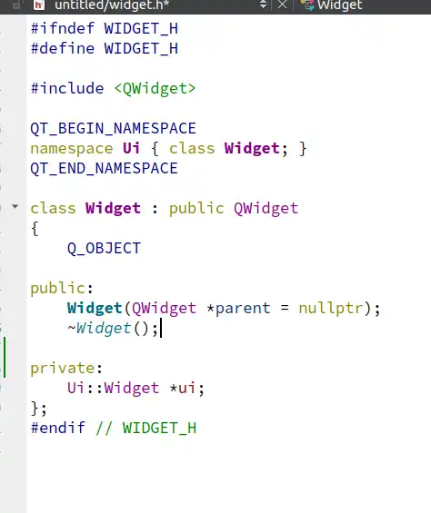<br/>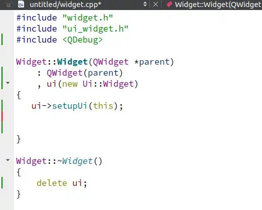
  - **Q_OBJECT宏:**
    必须出现在类定义的私有部分，该类定义声明自己的信号与槽，获取使用QT元对象系统提供的其他服务。
  - **定义了主界面的构造与析构函数:**
    explicit关键字修饰类的构造函数，被修饰的构造函数不能发生相应的隐式转换，只能显示的方式进行类型转换。
  - **widget.cpp:**
    为构造函数和析构函数的具体实现，以及设定了ui指针。

- main.cpp文件<br/>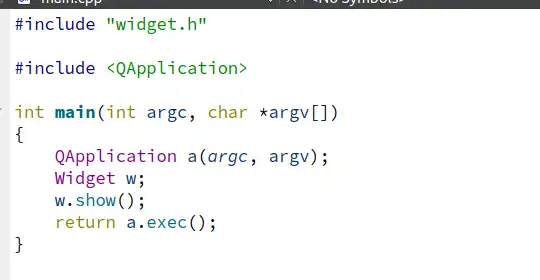
  - **QApplication:**
    管理图形用户揭秘那应用程序的控制流和主要设置，包含主事件循环，在其中来自窗口系统和其他资源的所有事件被处理和调度。
  - **a.exec():**
    开始事件循环。

## 2.QT安装 (PC Ubuntu22.04 环境)

### 2.1下载QT安装包
- 官网下载：https://download.qt.io/archive/qt/5.12/5.12.9/

- 如果官网无法访问，可以从网盘下载
  - 百度网盘：https://pan.baidu.com/s/1x2IIuymDogUaKXrKeNsNgg?pwd=ihim
  - 谷歌网盘：https://drive.google.com/drive/folders/1ycihPEtzDTh_rEFOhBa2HAxp5zxQ7NXX?usp=drive_link

### 2.2运行安装包
将下载的安装包传输到 Ubuntu 主机或者虚拟机上，如果未注册 Qt 登录账号，需要断开网络安装可以跳过账号登录。

```shell
chmod +x qt-opensource-linux-x64-5.12.9
./qt-opensource-linux-x64-5.12.9
```

### 2.3选择组件<br/>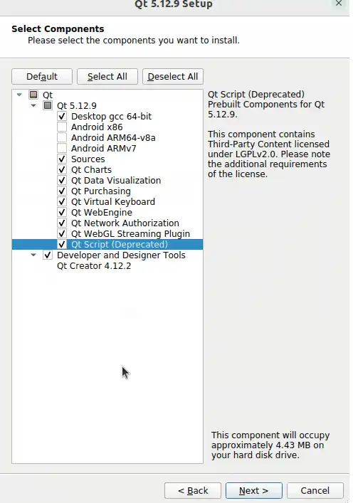

安装完成后，打开QT

### 2.4构建kits<br/><br/>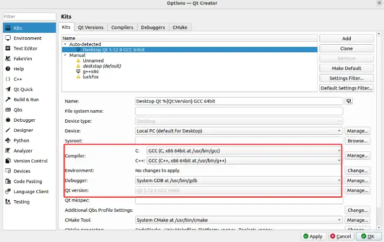
保证gcc与g++编译器为64位编译器，QT版本为64位。

### 2.5构建工程<br/>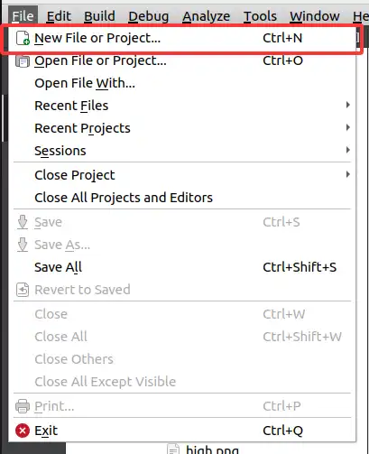<br/><br/>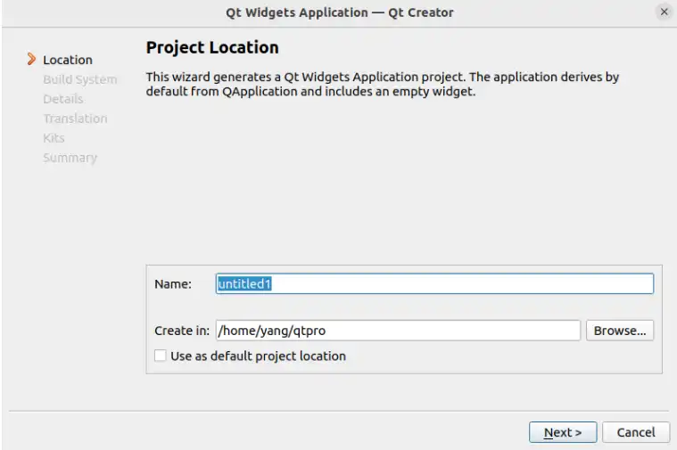<br/>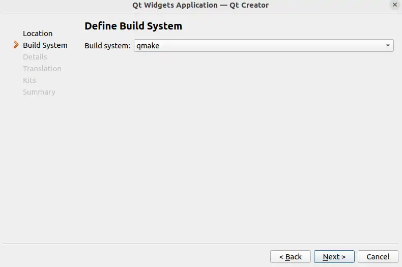<br/>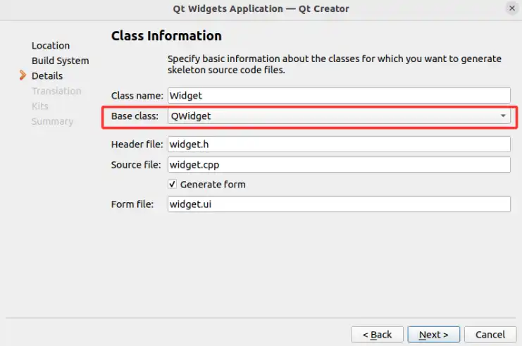<br/>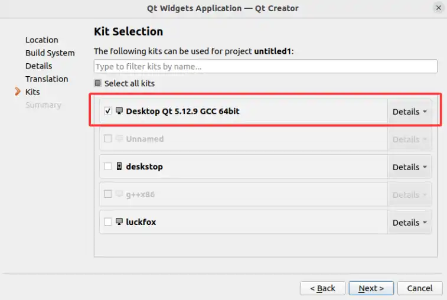

点击完成，构建工程完毕<br/>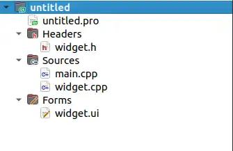

- **工程目录说明**
  - **Headers**:存放类的头文件
  - **Sources**:主函数及类的实现
  - **Forms**:Qt designer的UI文件，可以用于图形化界面设计

点击运行<br/>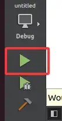

显示窗口<br/>

目前最基本的QT工程搭建完毕，接下来我们需要了解QT中最核心的信号与槽，以及熟悉一下基本控件。
  
## 3.信号与槽
Qt 的信号与槽机制是一种高级事件处理系统，用于对象间的通信。它替代了传统的回调机制，提供更灵活、类型安全的对象间通信方式。
### 3.1基本概念
- **信号（Signal）**：当对象的状态发生改变时，它可以发出一个信号。信号是一个函数声明，只需声明，不需要实现（由moc自动生成）。信号可以带有参数。
- **槽（Slot）**：槽是一个普通的成员函数，它可以被调用以响应特定信号的发射。槽函数可以有参数，并且可以像普通函数一样被调用。槽可以是public、protected或private，也可以声明为虚函数。
- **连接（Connect）**：使用`QObject::connect()`函数将信号与槽关联起来。当信号被发射时，与之连接的槽函数会被自动调用。

### 3.2信号与槽的特点
- **类型安全**：信号和槽的参数类型必须匹配，否则编译时或运行时（使用新的连接语法时）会报错。
- **松耦合**：信号发射者不需要知道谁接收信号，槽也不需要知道是谁发出的信号。通过connect连接，使得对象之间的依赖性降到最低。
- **支持多对多**：一个信号可以连接多个槽，一个槽也可以响应多个信号。
- **自动断开**：当对象被删除时，QT会自动断开与该对象相关的所有连接，避免野指针问题。
  
### 3.3信号与槽的声明
在类定义中，需要在头文件中使用`signals`和`slots`关键字声明信号和槽。注意：该类必须直接或间接继承自`QObject`，并且在类定义中声明`Q_OBJECT`宏。

### 3.4总结
信号与槽机制是QT实现对象间通信的强大工具，它通过元对象系统提供了一种类型安全、松耦合的通信方式。掌握信号与槽的使用，是高效开发QT应用程序的基础。

## 4.基础控件和布局

### 4.1QWidget
QWidget类是大部分用户界面对象的基类,在QT中基本大部分的基础控件，都继承于QWidget类。QWidget在QT设计中基本以窗口控件作为显示，作为显示效果的基本载体，其几何图形属性如图：<br/>
frameGeometry，frameSize，x，y，pos 是框架的几何区域和大小属性，框架是指窗口的最外层。 geometry，width，height，size，rect 是内部绘图区域的相关属性。

### 4.2QLabel
QLabel用于显示文本或图像，没有提供用户交互功能。
拖动QLabel到主窗口中：<br/>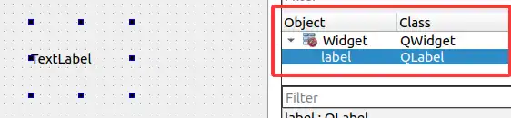
在构造函数中加入如下代码：
```
Widget::Widget(QWidget *parent)
    : QWidget(parent)
    , ui(new Ui::Widget)
{
    ui->setupUi(this);
    ui->label->setText("this is label");
}
```
运行效果如下：<br/>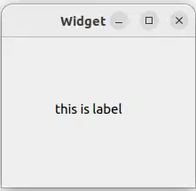

### 代码功能说明
  - setText设置了QLabel的当前显示文本，QLabel除了可以显示文本，通过setPixmap可以显示图片，setMovie显示gif文件，这些需要我们增加资源文件，后续在综合例程中会介绍。

### 4.3QPushButton
按钮或命令按钮可能是任何图形用户界面中最常用的窗口小部件。 按下（单击）按钮以命令计算机执行某些操作或回答问题，如我们经常看到的按钮：“确定”，“应用”，“取消”，“关闭”，“是”，“否”和“帮助”等。

拖动Push Button按钮组件到主界面下:<br/>
右键按钮对象，选择转到槽：<br/>

QPushButton继承自QAbstractButton，主要提供以下信号：

| 信号原型                                  | 触发条件                                     |
|------------------------------------------|---------------------------------------------|
| `clicked(bool checked = false)`          | 鼠标点击释放时触发（常用）                  |
| `pressed()`                              | 按钮被按下时触发                            |
| `released()`                             | 按钮被释放时触发                            |
| `toggled(bool checked)`                  | 按钮状态改变时触发（仅当checkable为true）   |
| `clicked()`                              | Qt5.15新增，不带参数的clicked信号           |

选择不带参数的clicked()信号，会在widget.h和widget.cpp中自动生成槽函数的声明和定义，在槽函数中加入如下代码:
```cpp
void Widget::on_pushButton_clicked()
{
    
    int red = QRandomGenerator::global()->bounded(256);
    int green = QRandomGenerator::global()->bounded(256);
    int blue = QRandomGenerator::global()->bounded(256);

    
    QString style = QString("background-color: rgb(%1, %2, %3);")
            .arg(red).arg(green).arg(blue);
    ui->label->setStyleSheet(style);
}
```
运行效果如下：<br/>

### 代码功能说明
- 在槽函数中，每次触发就会生成随机的颜色，利用setStyleSheet设置label属性background-color，改变label的背景颜色。

### 4.4QLineEdit
行编辑允许用户使用有用的编辑功能集合输入和编辑一行纯文本，包括撤消和重做，剪切和粘贴以及拖放.

拖动LineEdit组件到主窗口下：<br/>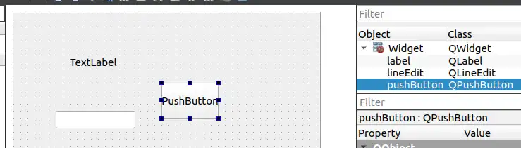
右键该组件，选择转到槽：<br/>

QLineEdit主要提供以下信号：

| 信号 | 触发条件 |
|------|----------|
| `textChanged(const QString &)` | 文本内容**任何改变**时触发 |
| `textEdited(const QString &)` | 用户**编辑**文本时触发（程序设置文本不会触发） |
| `returnPressed()` | 用户按下 Enter/Return 键时触发 |
| `editingFinished()` | 编辑结束（焦点移出或按 Enter）时触发 |
| `selectionChanged()` | 选中文本改变时触发 |
| `cursorPositionChanged(int, int)` | 光标位置改变时触发 |

我们在平常编辑文字的时候，大多数情况是使用回车作为本次编辑的结束，我们选择returnPressed()，并在槽函数中加上如下代码：
```cpp
void Widget::on_lineEdit_returnPressed()
{
    QString ret = ui->lineEdit->text();
    ui->label->setText(ret);
}
```
运行效果如下：<br/>

### 代码功能说明
- 在槽函数中，当回车条件触发时，通过text获得lineEdit当前的文本，并且setText显示在label上。

### 4.5QSlider
滑块是用于控制有界值的经典小部件。它使用户可以沿水平或垂直凹槽移动滑动手柄，并将手柄的位置转换为合法范围内的整数值。

拖动horizontal Slider滑动组件到主界面下:<br/>
右键该组件，选择转到槽：<br/>

QSlider主要提供以下信号：

| 信号 | 触发时机 | 参数说明 |
|------|----------|----------|
| `valueChanged(int)` | 滑块值改变时触发 | 传递当前滑块值 |
| `sliderMoved(int)` | 用户拖动滑块时**实时**触发 | 传递拖动中的滑块值 |
| `sliderPressed()` | 用户**按下**滑块时触发 | 无参数 |
| `sliderReleased()` | 用户**释放**滑块时触发 | 无参数 |
| `rangeChanged(int, int)` | 滑块范围改变时触发 | (最小值, 最大值) |
| `actionTriggered(int)` | 滑块被交互触发时 | 触发动作类型 |

我们选择valueChanged(int)信号，并在槽函数中加入如下代码：
```cpp
void Widget::on_horizontalSlider_valueChanged(int value)
{
    int alpha = static_cast<int>(value * 2.55);

    QColor newColor = ui->label->palette().color(QPalette::Window);
    newColor.setAlpha(alpha);

    QString styleSheet = QString("background-color: rgba(%1, %2, %3, %4);"
                                 "color: %5;"
                                 "font-size: 15px;"
                                 "padding: 0px;")
            .arg(newColor.red())
            .arg(newColor.green())
            .arg(newColor.blue())
            .arg(alpha)
            .arg(alpha > 127 ? "white" : "black");

    ui->label->setStyleSheet(styleSheet);

}
```
运行效果如下：<br/>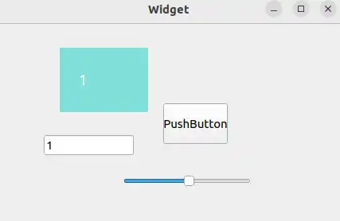

### 代码功能说明
- 在槽函数中，触发滑动模块valueChanged，通过调色盘palette获取当前label颜色，并且设置样式表，改变label当前颜色的透明度。


### 4.6布局管理
在Qt Designer，提供了窗口布局：Vertical Layout(垂直布局) ，Horizontal Layout(水平布局)，Grid Layout(栅格布局)，Form Layout(表单布局)等。 其中QHBoxLayout、QVBoxLayout继承自 QBoxLayout， QBoxLayout、QGridLayout继承自QLayout, QLayout继承自QObject和QLayoutItem。<br/>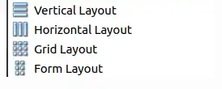

- **垂直布局:**
  选中所需控件，点击上方的垂直布局（UI设计器工具栏）<br/>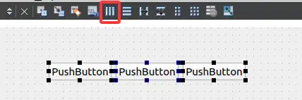
  垂直布局内的控件，将自动在垂直方向上分布。
- **水平布局：**
  选中所需控件，点击上方的水平布局（UI设计器工具栏）<br/>
  水平布局内的控件，将自动在水平方向上分布。
- **栅格布局：**
  选中所需控件，点击上方的栅格布局（UI设计器工具栏）<br/>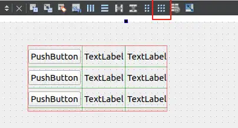
  栅格布局内的控件，将自动在网格方向上分布（划分行和列）
- **表单布局：**
  选中所需控件，点击上方的表单布局（UI设计器工具栏）<br/>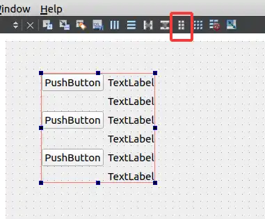
  和栅格布局类似，但只有最右侧的一列网格会改变大小。

## 5.综合例程
经过上一章对于基本控件和布局的了解，我们完成一个综合例程来加深理解。以下是综合例程最终的实现效果。<br/>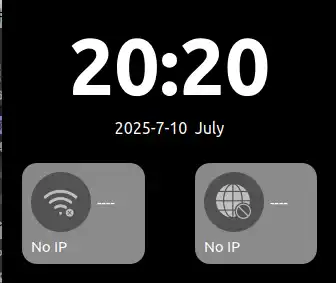

### 5.1分析页面
- **时间显示界面**
  - 两个垂直布局的QLabel。
- **网络界面**
  - 背景窗口为QWiget，带有图标的QPushButton和两个QLabel，QWiget需要对于QPushButton和QLabel进行水平布局和栅格布局。
- **整体界面**
  - 主界面中也需要栅格布局保证组件与主窗口缩放相同。

分析完页面之后，对于综合例程我们便知道具体需要哪些控件，在QT designer中拖动对应组件并布局，效果如下：<br/>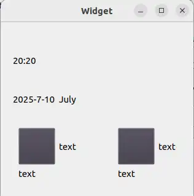
控件及布局如下：<br/>

### 5.2添加资源文件
在设计QT界面中，我们总需要设计一些图标控件或者放置图标显示，那么我们就需要为工程添加资源文件。
到工程目录下新建文件夹image，返回QT右键工程，选择"Add New"，在QT模板中选择资源文件<br/><br/>

找寻图标资源，通常我们在阿里巴巴矢量图标库找到我我们想要的图标，网址：https://www.iconfont.cn/
下载.png格式图标并且复制到虚拟机中QT项目下的image文件夹下。<br/>

添加资源文件并保存。
这样我们就获得了图标的资源文件，我们可以用代码设置控件的样式表，在构造函数中我们添加如下代码:
```cpp
// 2. 设置样式表，实现圆形效果
    ui->btn_wifi->setStyleSheet(R"(
                                QPushButton {
                                border-radius: 30px;
                                background-color: #515151;
                                color: white;
                                font-size: 14px;
                                border: none; /* 无边框 */
                                outline: none; /* 禁用焦点边框 */
                                }
                                QPushButton:hover {
                                background-color: #515151;
                                }
                                QPushButton:pressed {
                                background-color: #515151;
                                }
                                )");
    QPixmap pixmap(":/image/wifidis.png");
    // 调整图标为30x30像素（保持比例，平滑缩放）
    QPixmap scaledPixmap = pixmap.scaled(35, 35, Qt::KeepAspectRatio, Qt::SmoothTransformation);
    ui->btn_wifi->setIcon(QIcon(scaledPixmap));
    ui->btn_wifi->setIconSize(QSize(35, 35)); // 设置图标显示大小
```

- **代码功能说明**
  - ui->btn_wifi访问到我们ui文件下的按钮，通过setStyleSheet设置其样式表，设置其边框转折，背景颜色，字体颜色和大小，无边框，设置其选中hover，以及按下pressed的状态。
  - `QPixmap pixmap(":/image/wifidis.png");`，为我们在资源文件下的图标文件，利用setIcon设置图标文件，setIconSize设置图标的显示大小。

### 5.3页面整体设计
其他组件也是类似设计，设计其样式，图标等等，构造函数中完整代码如下：
```cpp
Widget::Widget(QWidget *parent)
    : QWidget(parent)
    , ui(new Ui::Widget)
{
    ui->setupUi(this);


    ui->labeltime->setFrameShape(QFrame::NoFrame);

    //ui_init
    QPalette palette = ui->labeltime->palette();
    palette.setColor(QPalette::WindowText,Qt::white);
    ui->labeltime->setPalette(palette);
    ui->lb_wifiname->setPalette(palette);
    ui->lb_wifiip->setPalette(palette);
    ui->label_netname->setPalette(palette);
    ui->label_netip->setPalette(palette);


    QFont font = ui->labeltime->font();
    font.setPointSize(60);
    font.setWeight(QFont::Black);
    ui->labeltime->setFont(font);

    ui->labeltime->setAlignment(Qt::AlignCenter);//字体居中

    ui->labeldate->setFrameShape(QFrame::NoFrame);

    palette = ui->labeldate->palette();
    palette.setColor(QPalette::WindowText,Qt::white);
    ui->labeldate->setPalette(palette);

    font = ui->labeldate->font();
    font.setPointSize(12);
    font.setBold(false);
    ui->labeldate->setFont(font);
    ui->labeldate->setAlignment(Qt::AlignCenter);
    ui->btn_wifi->setFixedSize(60, 60); // 宽高均为80px，可根据需要调整

    // 2. 设置样式表，实现圆形效果
    ui->btn_wifi->setStyleSheet(R"(
                                QPushButton {
                                border-radius: 30px;
                                background-color: #515151;
                                color: white;
                                font-size: 14px;
                                border: none; /* 无边框 */
                                outline: none; /* 禁用焦点边框 */
                                }
                                QPushButton:hover {
                                background-color: #515151;
                                }
                                QPushButton:pressed {
                                background-color: #515151;
                                }
                                )");
    QPixmap pixmap(":/image/wifidis.png");
    // 调整图标为30x30像素（保持比例，平滑缩放）
    QPixmap scaledPixmap = pixmap.scaled(35, 35, Qt::KeepAspectRatio, Qt::SmoothTransformation);
    ui->btn_wifi->setIcon(QIcon(scaledPixmap));
    ui->btn_wifi->setIconSize(QSize(35, 35)); // 设置图标显示大小

    ui->btn_net->setStyleSheet(R"(
                               QPushButton {
                               border-radius: 30px;
                               background-color: #515151;
                               color: white;
                               font-size: 14px;
                               border: none; /* 无边框 */
                               outline: none; /* 禁用焦点边框 */
                               }
                               QPushButton:hover {
                               background-color: #0b7dda;
                               }
                               QPushButton:pressed {
                               background-color: #0a69b7;
                               }
                               )");

    QPixmap pixmap2(":/image/internet-error-solid.png");
    // 调整图标为30x30像素（保持比例，平滑缩放）
    QPixmap scaledPixmap2 = pixmap2.scaled(35, 35, Qt::KeepAspectRatio, Qt::SmoothTransformation);
    ui->btn_net->setIcon(QIcon(scaledPixmap2));
    ui->btn_net->setIconSize(QSize(35, 35)); // 设置图标显示大小

    ui->lb_wifiname->setText("----");
    ui->lb_wifiname->setStyleSheet("color: #ffffff; background: transparent; border: none;");
    ui->lb_wifiip->setText("No IP");
    ui->lb_wifiip->setStyleSheet("color: #ffffff; background: transparent; border: none;");

    ui->label_netname->setText("----");
    ui->label_netip->setText("No IP");

    // 设置无边框窗口
    this->setWindowFlags(Qt::FramelessWindowHint);

    // 设置背景为黑色
    this->setStyleSheet("background-color: black;");

}
```
对各控件进行设计样式和美化便可以得到预期效果<br/>

### 4.4控件交互逻辑
#### 显示当前时间
在时间显示界面上的两个QLabel中需要显示当前的时间以及日期，有如下成员函数：
```cpp
void Widget::updatetimedisplay()
{
    // 获取 UTC 时间
    QDateTime utcDateTime = QDateTime::currentDateTimeUtc();

    // 转换为北京时间（UTC+8）
    QDateTime beijingDateTime = utcDateTime.addSecs(8 * 3600);

    QTime currenttime = beijingDateTime.time();
    QString timeStr = QString("%1:%2")
            .arg(currenttime.hour(), 2, 10, QChar('0'))
            .arg(currenttime.minute(), 2, 10, QChar('0'));

    ui->labeltime->setText(timeStr);

    QDate currentdate = beijingDateTime.date();
    QString dateStr = currentdate.toString("yyyy-MM-dd dddd");
    ui->labeldate->setText(dateStr);
}
```
- **代码功能说明**
  - 使用`QDateTime::currentDateTimeUtc()`获取当前的UTC时间。
  - 使用`addSecs(8 * 3600)`将UTC时间加上8小时（即28800秒）得到北京时间。
  - 使用`QDateTime::time()`获取时间部分，然后使用`QString::arg`将小时和分钟格式化为两位数（不足两位前面补0）。
  - 使用`QDateTime::date()`获取日期部分，然后使用`QDate::toString`按照指定格式输出字符串。其中"yyyy"代表四位数的年份，"MM"代表两位数的月份，"dd"代表两位数的日期，"dddd"代表星期几的全称（如Monday）。
  - 最后将格式化后的字符串设置到对应的UI标签上。

在构造函数中调用该成员函数，当程序运行时时间显示界面便会显示当前时间(北京时间),但我们需要实时刷新，可以借助定时器来实现:
```cpp
    timer = new QTimer(this);
    connect(timer,&QTimer::timeout,this,&Widget::updatetimedisplay);
    timer->start(1000);
    updatetimedisplay();
```
- **代码功能说明**
  - QTimer定时器通过connect链接定时信号与刷新时间界面成员函数链接，并设定为1秒刷新。

#### 按键切换功能
我们想要实现按键点击切换图标的效果，利用我们例程里所讲的信号与槽机制，右键btn_wifi组件，转到槽，选择clicked(bool checked)信号，在生成的槽函数中加入如下代码:

```cpp
void Widget::on_btn_wifi_clicked(bool checked)
{
    if(checked)
    {
        QPixmap pixmap(":/image/wifionline.png");

        QPixmap scaledPixmap = pixmap.scaled(35, 35, Qt::KeepAspectRatio, Qt::SmoothTransformation);
        ui->btn_wifi->setIcon(QIcon(scaledPixmap));
        ui->btn_wifi->setIconSize(QSize(35, 35)); // 设置图标显示大小
    }
    else
    {
        QPixmap pixmap(":/image/wifidis.png");
        QPixmap scaledPixmap = pixmap.scaled(35, 35, Qt::KeepAspectRatio, Qt::SmoothTransformation);
        ui->btn_wifi->setIcon(QIcon(scaledPixmap));
        ui->btn_wifi->setIconSize(QSize(35, 35)); // 设置图标显示大小
    }

}
```
并且需要在构造函数中加入如下代码，保证按钮btn_wifi的可切换状态：

```cpp
ui->btn_wifi->setCheckable(true); // 确保按钮可切换状态
```

- **代码功能说明**
  - clicked(bool checked)是按钮组件拥有切换状态的信号，通过标志位checked实现重复点击按钮的不同逻辑。
  - ":/image/wifionline.png"是新增的资源文件，实现切换图标功能。
  - `ui->btn_wifi->setCheckable(true);`目的是为了初始化按钮的可切换状态，否则checked标志位不会在触发信号后自动切换。

实现效果
- 首次点击:<br/>
- 再次点击:<br/>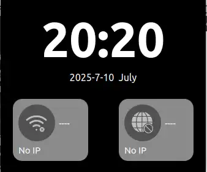


## 6.移植例程到开发板

### 6.1 SDK环境
1. Ubuntu22.04下配置环境

获取最新的SDK，中国用户推荐用Gitee。
```shell
git clone https://gitee.com/LuckfoxTECH/luckfox-pico.git
git clone https://github.com/LuckfoxTECH/luckfox-pico.git
```
关于SDK相关环境配置，请参考官网教程:[SDK环境部署](https://wiki.luckfox.com/zh/Luckfox-Pico/Luckfox-Pico-SDK)

### 6.2配置QT镜像

1. 配置qt，按下`\`搜索qt5

```shell
cd luckfox-pico
./build.sh lunch
./build.sh buildrootconfig
```
使用关键字"Qt5"进行搜索<br/><br/>

1. 安装opengl
```shell
Target packages
　　->Libraries
　　　　->Graphics
　　　　　　->libdrm
　　　　　　　　->etnaviv--支持的GPU驱动。
　　　　　　　　->Install test programs--libdrm测试程序。
    -> Graphic libraries and applications (graphic/text)
　　　　->mesa3d
　　　　　　->Gallium Etnaviv driver--Vivante GPU的Mesa驱动。
　　　　　　->Gallium swrast driver--基于Gallium3D架构实现的软件OpenGL。
　　　　　　->gbm--使能Generic Buffer Management。
　　　　　　->OpenGL EGL--EGL是OpenGL ES和底层Native平台视窗系统之间的接口。
　　　　　　->OpenGL ES--OpenGL ES (OpenGL for Embedded Systems)。
```
选择：<br/>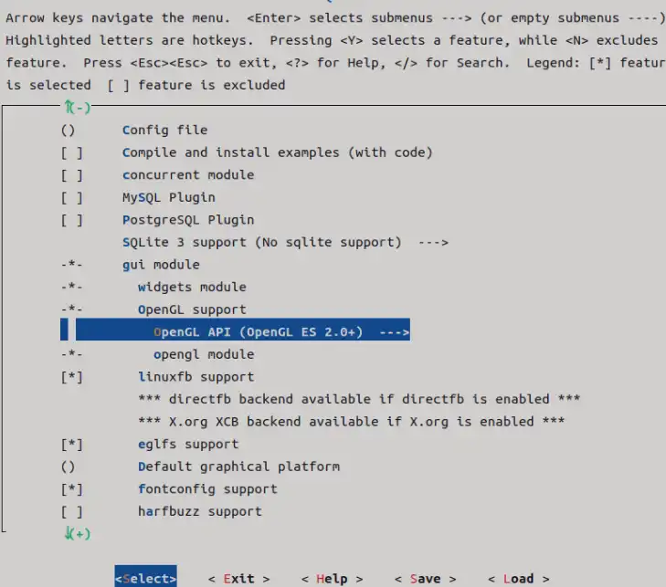

1. 保存配置，编译和烧录

```
echo 10 | ./build.sh lunch
./build.sh
```

使用官方工具烧录output/image到开发板上。

### 6.3QT 交叉编译环境配置

1. 添加字库到开发板/usr/share/fonts

链接：https://pan.baidu.com/s/1MorzYf0-3IT9byPAxWXCrg?pwd=ynwu
提取码：ynwu

如下：<br/>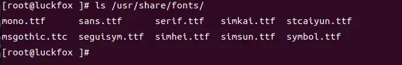

2. 配置kit
我们在安装QT的时候，勾选了QT源码组件选项，现在我们需要对其交叉编译环境进行配置，使QT可以运行在86开发板上。

g++路径：
```
luckfox-pico/sysdrv/source/buildroot/buildroot-2023.02.6/output/host/bin/arm-rockchip830-linux-uclibcgnueabihf-g++
```
gcc路径：
```
luckfox-pico/sysdrv/source/buildroot/buildroot-2023.02.6/output/host/bin/arm-rockchip830-linux-uclibcgnueabihf-gcc
```
添加编译器，修改名字：<br/>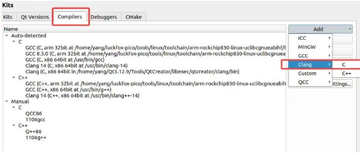
配置SDK编译器路径：<br/>

SDK的qmake路径:
```
luckfox-pico/sysdrv/source/buildroot/buildroot-2023.02.6/output/host/bin/qmake
```
添加QT版本：
<br/>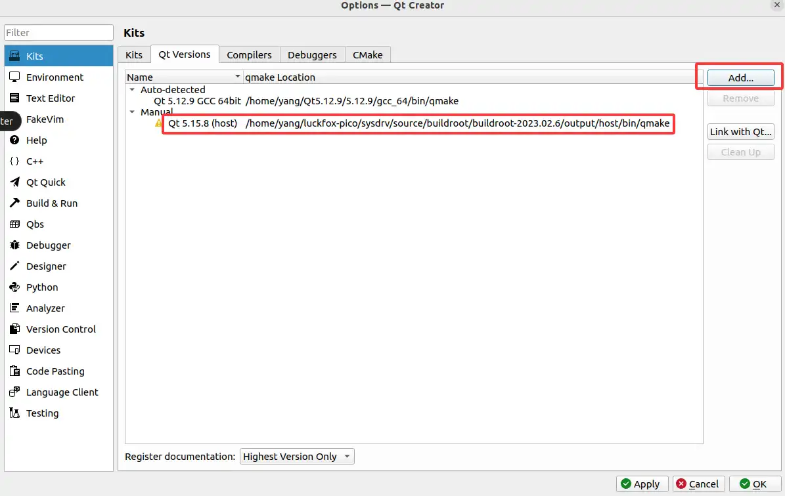
选择配置好的交叉编译器及QT版本的qmake<br/>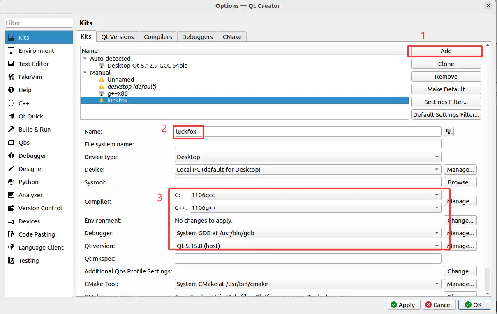

选择kit<br/>

构建综合示例程序，到项目目录下执行 `qmake && make`，将生成的可执行文件上传到开发板中，并运行。
```shell
./mydemo -platform linuxfb
```

### 6.4开发板运行效果<br/>
