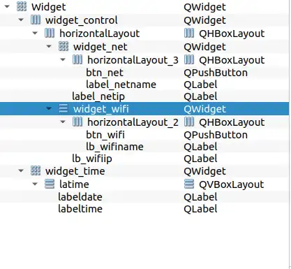
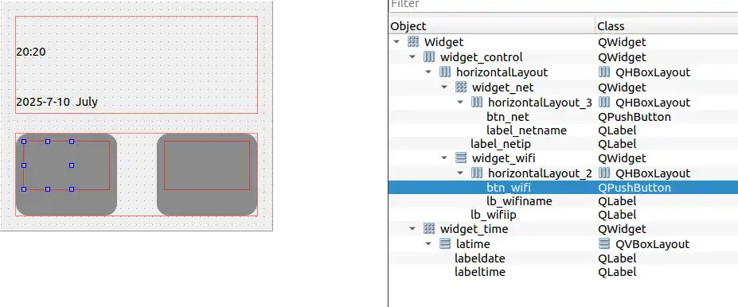
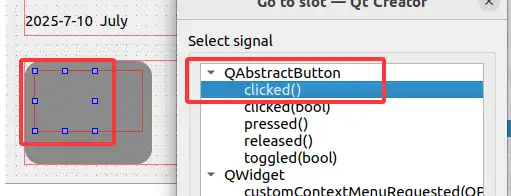
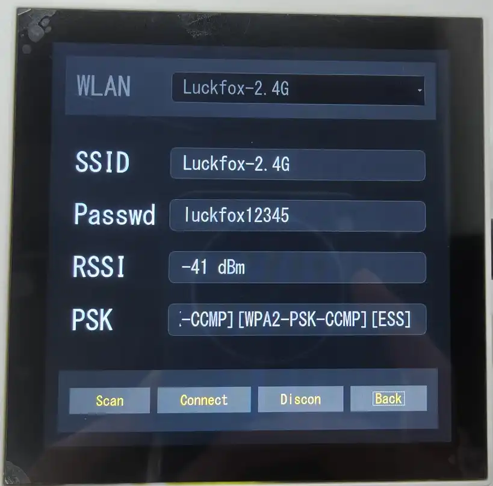
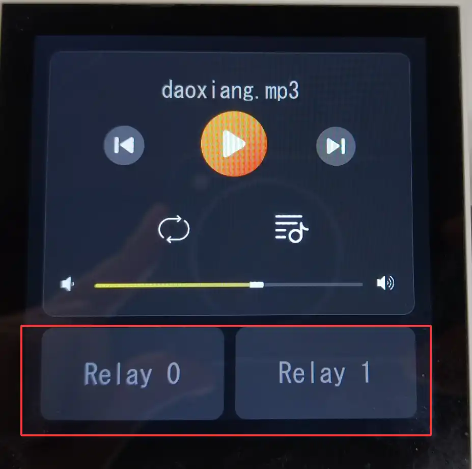
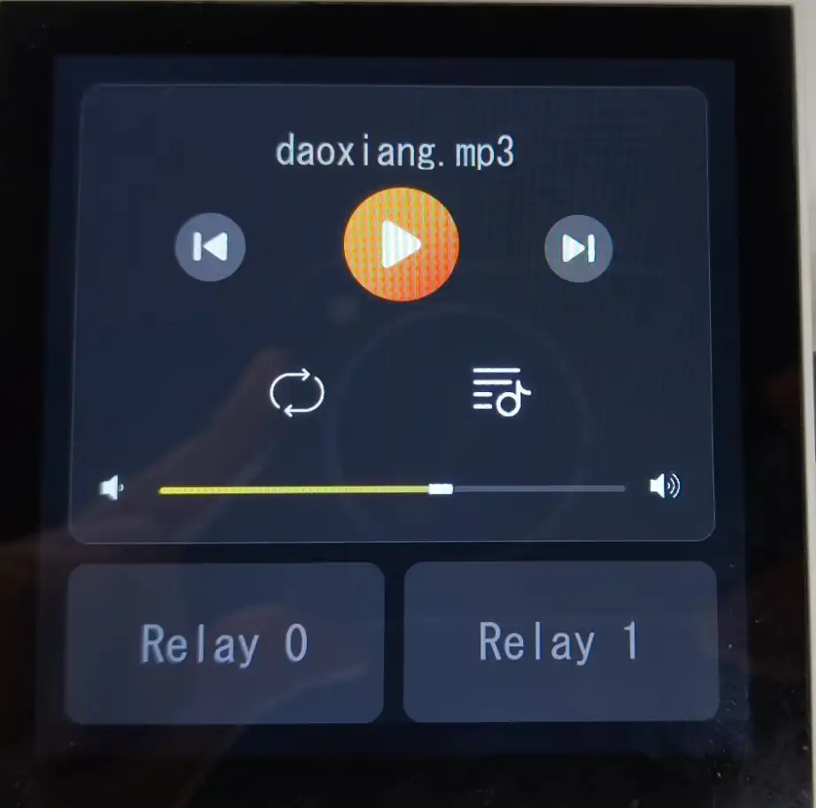
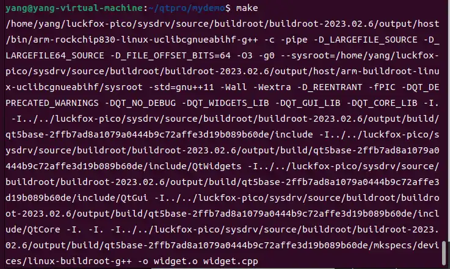

本教程利用QT5.12.9实现86面板的屏幕界面设计以及控件交互逻辑，旨在搭建一个完整的嵌入式GUI应用程序。

## 1.简介
86面板可运用在智能家具的控制层场景中，本设计的智能终端，总共包含三个界面，分别为主界面，wifi配置界面，副界面，其功能清单如下：

| 界面         | 功能                  | 描述                                                                                              |
| :----------- | :-------------------- | :------------------------------------------------------------------------------------------------ |
| 主界面       | 显示WIFI和ETH链接状态 | 显示当前的网络连接状态，包括 WIFI 和以太网（ETH）的 IP 地址信息。如果没有网络连接，显示默认的"--" |
| 主界面       | 显示时间              | 显示当前时间，通过QDateTime获取当前系统时间                                                       |
| 副界面       | 继电器开关            | 提供两个继电器开关，用户可以通过滑动开关控制继电器的开合。                                        |
| 副界面       | 音频播放器            | 提供音量调整功能，并支持播放/暂停控制。                                                           |
| WIFI配置界面 | 配置WIFI              | 用户可以输入 WiFi 的 SSID 和密码，支持保存和连接操作。                                            |
| WIFI配置界面 | WIFI控制界面          | 用户可以控制wifi链接或者断开，扫描附件wifi                                                        |

## 2.配置环境
对于QT安装及开发板QT环境搭建可参考另一篇教程《QT移植教程》。

本项目基于本项目设计是基于Ubuntu2204 linux下进行开发，QT打开项目文件夹下的.pro文件，并利用对应kits构建工程，构建成功之后，项目架构如下<br/>

在Headers目录下存放的是实例化类的头文件，Sources存放的是主函数以及实例化类的具体实现，Forms目录下存放的是通过Qt图形化界面设计的ui文件，Resources目录下存放的是资源文件，主要包括的是图标ICON。
## 3.主界面
### 3.1主界面UI设计
主界面采用的是图形化界面配合代码设计样式实现UI界面设计，在Widget.ui中可以看到如下组件：<br/>
预览ui界面如下<br/>
- **界面优化方向**
可以看出，虽然我在 QT Designer 上简单地做了一些界面效果，但目前设计的界面还十分简陋。我们可以通过设置组件的样式表来改变显示效果，本项目采用的是在构造函数中通过代码来对组件的样式进行设置。
- **特定组件分析（以 widget_wifi 为例）**
其中以 widget_wifi 为例，此 QWidget 包含着主界面显示 Wi-Fi 状态的组件。具体来说：
    - QLabel：用于显示 Wi-Fi 名字及 IP。
    - 按钮：实现自定义功能，在本设计中实现的是对于 Wi-Fi 配置界面的跳转。
- **其他组件情况**
其余组件与 widget_wifi 类似。

在Widget.cpp中的构造函数中有如下代码
````CPP
Widget::Widget(QWidget *parent)
    : QWidget(parent)
    , ui(new Ui::Widget),
      scrplayer(nullptr)
{
    ...
    ui->btn_wifi->setStyleSheet(R"(
                                QPushButton {
                                border-radius: 30px;
                                background-color: #515151;
                                color: white;
                                font-size: 14px;
                                border: none;
                                outline: none;
                                }
                                QPushButton:hover {
                                background-color: #515151;
                                }
                                QPushButton:pressed {
                                background-color: #515151;
                                }
                                )");
    QPixmap pixmap(":/image/wifidis.png");）
    QPixmap scaledPixmap = pixmap.scaled(35, 35, Qt::KeepAspectRatio, Qt::SmoothTransformation);
    ui->btn_wifi->setIcon(QIcon(scaledPixmap));
    ui->btn_wifi->setIconSize(QSize(35, 35));
    ...   
}
````

- **代码说明:**
    - **设置样式表:** 使用setStyleSheet设置了一个圆形按钮且背景颜色为灰色(#515151)，无边框(border: none)，取消聚焦(outline: none),松开状态(QPushButton:hover),按下状态(QPushButton:hover)等。
    - **设置按钮图标:** 通过QPixmap，得到图标文件，该文件保存在工程文件夹下的image文件夹下，并添加到资源文件夹下，后续可通过此种方式增加图标资源。然后通过setIcon设置按钮图标。

其他主界面组件设计与本例类似。
### 3.2显示WIFI状态
1.在主界面Widget.ui中有如下控件:widget_wifi,btn_wifi,lb_wifiname,lb_wifiip,用于显示wifi状态，在构造函数对其初始化样式也有设置。作为主界面ETH状态的显示容器。通过类中成员函数updateWifiStatus更新状态组件，其代码如下:
````CPP
void Widget::updateWifiStatus(QLabel* lb_wifiname, QLabel* lb_wifiip)
{
    // 执行wpa_cli status命令
    QProcess process;
    process.start("wpa_cli", QStringList() << "status");
    if (!process.waitForStarted() || !process.waitForFinished(3000)) {
        qWarning() << "Failed to run wpa_cli command";
        return;
    }
    // 解析命令输出
    QString output = process.readAllStandardOutput();
    QStringList lines = output.split('\n');

    QString ssid;
    QString ip;
    bool scanning = false;

    for (const QString& line : lines) {
        if (line.contains("wpa_state=SCANNING")) {
            scanning = true;
            break;
        }
        else if (line.startsWith("ssid=")) {
            ssid = line.section('=', 1).trimmed();
        }
        else if (line.startsWith("ip_address=")) {
            ip = line.section('=', 1).trimmed();
        }
    }
    // 更新UI
    QFont normalFont = lb_wifiname->font();
    if (scanning || ssid.isEmpty()) {
        // 未连接状态
        lb_wifiname->setText("----");

        lb_wifiname->setStyleSheet("color: #ffffff; background: transparent; border: none;");

        lb_wifiip->setText("No IP");

        lb_wifiip->setStyleSheet("color: #ffffff; background: transparent; border: none;");
        ui->btn_wifi->setIcon(QIcon(":/image/wifidis.png"));
        ui->widget_wifi->setStyleSheet(
                    "QWidget#widget_wifi {"
                    "   background-color: #8a8a8a;"
                    "   border: 2px solid #8a8a8a;"
                    "   border-radius: 15px;"
                    "}");
    } else {
        // 已连接状态
        lb_wifiname->setText(ssid);
        lb_wifiname->setStyleSheet("color: #f4ea2a; background: transparent; border: none;");
        ui->btn_wifi->setIcon(QIcon(":/image/wifionline.png"));
        if (ip.isEmpty()) {
            lb_wifiip->setText("No IP");
            lb_wifiip->setStyleSheet("color: #f4ea2a; background: transparent; border: none;");
        } else {
            lb_wifiip->setText(ip);
            lb_wifiip->setFont(normalFont);
            lb_wifiip->setStyleSheet("color: #f4ea2a; background: transparent; border: none;");
        }
        ui->widget_wifi->setStyleSheet(
                    "QWidget#widget_wifi {"
                    "   background-color: #8a8a8a;"
                    "   border: 2px solid #f4ea2a;"
                    "   border-radius: 15px;"
                    "}");
    }
}
````
updateWifiStatus函数负责获取当前Wi-Fi连接的状态（SSID和IP地址），并更新WIFI状态组件。
- **代码步骤说明**
    - **执行wpa_cli status命令:** 构造出"wpa_cli status"字符串，通过QProcess执行命令，并且对进程无法正确进行和超时进行错误处理
    - **解析命令输出:**
      -    如果找到包含 wpa_state=SCANNING 的行，表示设备正在扫描可用网络，此时直接跳出循环。
      -    如果找到包含 ssid= 的行，则提取出SSID名称。
      -    如果找到包含 ip_address= 的行，则提取出IP地址。
   - **更新状态组件:** 处理 WiFi 连接和未连接时的 UI 显示标识。  

2.更新WIFI状态理应实时更新，本设计采用了QTimer定时器，计时刷新，在Wdiget.hpp中有如下成员变量：
```cpp
    QTimer *networkTimer;
```
在构造函数中对其初始化和链接定时触发函数
```cpp
    networkTimer = new QTimer(this);
    connect(networkTimer, &QTimer::timeout, this, &Widget::checkNetworkStatus);
    networkTimer->start(3000); // 每3秒检查一次
    update_eth_status();
```

在定时触发函数中调用updateWifiStatus，便实现定时刷新主界面WIFI状态。

自此，显示WIFI状态部分完成，运行图像如下:<br/>

### 3.3显示ETH状态
1.在主界面Widget.ui中有如下控件:widget_net,btn_net,lb_netname,lb_netip,用于显示wifi状态，在构造函数对其初始化样式也有设置。作为主界面WIFI状态的显示容器。通过类中成员函数updateWifiStatus更新状态组件，其代码如下:
````cpp
/*****eth******/
void Widget::update_eth_status(void)
{
    static int last_carrier_state = -1;
    int current_carrier_state = 0;

    // 1. 检测以太网物理连接状态
    FILE *carrier_file = fopen("/sys/class/net/eth0/carrier", "r");
    if (carrier_file != NULL) {
        fscanf(carrier_file, "%d", &current_carrier_state);
        fclose(carrier_file);
    }
    // 2. 处理连接状态变化
    if (current_carrier_state != last_carrier_state) {
        if (current_carrier_state == 1) {  // 连接状态
            // 如果已有 udhcpc 运行则杀死
            if (system("pgrep udhcpc") == 0) {
                system("killall udhcpc");
            }
            // 启动新的 DHCP 客户端
            system("udhcpc -i eth0 > /tmp/udhcpc.log 2>&1 &");
        }else if (last_carrier_state == 1) {  // 连接断开
            qDebug() << "Ethernet disconnected. Stopping DHCP...";
            // 停止 DHCP 客户端
            if (system("pgrep udhcpc") == 0) {
                system("killall udhcpc");
            }
            // 立即清除IP显示
            ui->label_netname->setText("----");
            ui->label_netip->setText("Disconnected");
        }

        last_carrier_state = current_carrier_state;
    }
    // 3. 如果连接断开，直接显示断开状态
    if (current_carrier_state == 0) {
        ui->btn_net->setIcon(QIcon(":/image/internet-error-solid.png"));
        ui->label_netname->setText("----");
        ui->label_netip->setText("No IP");
        ui->label_netname->setStyleSheet("color: #ffffff; background: transparent; border: none;");
        ui->label_netip->setStyleSheet("color: #ffffff; background: transparent; border: none;");
        ui->widget_net->setStyleSheet(
                    "QWidget#widget_net {"
                    "   background-color: #8a8a8a;"
                    "   border: 2px solid #8a8a8a;"
                    "   border-radius: 15px;"
                    "}");
        return; // 不需要继续检查IP
    }
    // 4. 获取网络接口信息
    FILE *fp;
    char command[MAX_LINE_LEN];
    char result[MAX_LINE_LEN];
    char eth_name[MAX_LINE_LEN] = {0};
    char eth_ip_address[MAX_LINE_LEN] = {0};
    strcpy(command, "ifconfig");
    // 执行 ifconfig 命令
    fp = popen(command, "r");
    if (fp == NULL) {
        printf("Failed to run command\n");
        return;
    }
    // 5. 解析 ifconfig 输出
    int in_eth_block = 0;
    static int has_ip = 0;
    while (fgets(result, sizeof(result) - 1, fp) != NULL)
    {
        // 查找 eth0 接口
        if (strstr(result, "eth0")) {
            in_eth_block = 1;
            sscanf(result, "%s", eth_name);
            //lv_label_set_text(ui_LabelEth, eth_name);
            ui->label_netname->setText(QString(eth_name));
            qDebug() << "ethname " << eth_name;
            continue;
        }
        // 检测接口块结束
        if (in_eth_block && result[0] == '\n') {
            in_eth_block = 0;
            break;
        }
        // 提取 IP 地址
        if (in_eth_block && strstr(result, "inet addr:")) {
            char *ip_start = strstr(result, "inet addr:");
            if (ip_start) {
                ip_start += 10; // 跳过 "inet addr:"
                char *ip_end = strchr(ip_start, ' ');
                if (ip_end) {
                    *ip_end = '\0';
                }
                strncpy(eth_ip_address, ip_start, MAX_LINE_LEN - 1);
                eth_ip_address[MAX_LINE_LEN - 1] = '\0';
                has_ip = 1;
            }
            break;
        }
    }
    pclose(fp);
    if(has_ip)
    {
        ui->btn_net->setIcon(QIcon(":/image/neton.png"));
        ui->label_netip->setText(QString(eth_ip_address));
        ui->label_netname->setStyleSheet("color: #f4ea2a; background: transparent; border: none;");
        ui->label_netip->setStyleSheet("color: #f4ea2a; background: transparent; border: none;");
        ui->widget_net->setStyleSheet(
                    "QWidget#widget_net {"
                    "   background-color: #8a8a8a;"
                    "   border: 2px solid #f4ea2a;"
                    "   border-radius: 15px;"
                    "}");
    }
    else
    {
        ui->label_netname->setText("-------");
        ui->label_netip->setText("No IP");
        ui->label_netname->setStyleSheet("color: #ffffff; background: transparent; border: none;");
        ui->label_netip->setStyleSheet("color: #ffffff; background: transparent; border: none;");
        ui->widget_net->setStyleSheet(
                    "QWidget#widget_net {"
                    "   background-color: #8a8a8a;"
                    "   border: 2px solid #8a8a8a;"
                    "   border-radius: 15px;"
                    "}");
    }
}
````
- **代码步骤说明:**
  - **物理连接检测:**
    -  读取/sys/class/net/eth0/carrier文件判断物理连接状态（0=断开，1=连接）
    -  使用last_carrier_state静态变量跟踪状态变化
   - **DHCP客户端管理:**
      -   当物理连接建立时：杀死已有udhcpc进程并启动新进程
      -   当物理连接断开时：杀死udhcpc进程
      -   使用system("pgrep udhcpc")检测进程存在性
  - **UI状态更新:**
      - 连接断开时：显示灰色断开状态
      - 连接建立时：解析ifconfig输出获取IP地址
        - 如果发现包含 "eth0" 的行，设置 in_eth_block 为1，并尝试从该行中提取eth0接口
的名称。
        - 如果在eth0信息块内遇到空行，认为eth0接口的信息已经结束，退出循环。
        - 如果在eth0信息块内并且行中包含 "inet addr:" ，则进一步解析出IP地址，并设置has_ip 为1。
    - 根据IP获取结果更新界面样式（黄色连接/灰色断开）
  
2.与更新显示wifi状态一样，更新显示ETH状态也需要定时器定时刷新状态，本设计ETH与wifi用的是同一个定时器，这样可以同步更新二者状态，定时器触发函数如下：
```cpp
void Widget::checkNetworkStatus()
{
    update_eth_status();
    updateWifiStatus(ui->lb_wifiname, ui->lb_wifiip);
}
```

至此，显示ETH状态部分完成，运行图像如下：<br/>

### 3.4显示时间

1.在主界面Widget.ui中有如下控件:widget_time,labeltime,labeldate用于显示当前时间，在构造函数对其初始化样式也有设置。作为主界面当前时间的显示容器。以下是更新当前时间状态的代码：
```cpp
void Widget::updatetimedisplay()
{
    // 获取 UTC 时间
    QDateTime utcDateTime = QDateTime::currentDateTimeUtc();

    // 转换为北京时间（UTC+8）
    QDateTime beijingDateTime = utcDateTime.addSecs(8 * 3600);

    QTime currenttime = beijingDateTime.time();
    QString timeStr = QString("%1:%2")
            .arg(currenttime.hour(), 2, 10, QChar('0'))
            .arg(currenttime.minute(), 2, 10, QChar('0'));

    ui->labeltime->setText(timeStr);

    QDate currentdate = beijingDateTime.date();
    QString dateStr = currentdate.toString("yyyy-MM-dd dddd");
    ui->labeldate->setText(dateStr);
}
```

- **代码功能说明**
  - 使用`QDateTime::currentDateTimeUtc()`获取当前的UTC时间。
  - 使用`addSecs(8 * 3600)`将UTC时间加上8小时（即28800秒）得到北京时间。
  - 使用`QDateTime::time()`获取时间部分，然后使用`QString::arg`将小时和分钟格式化为两位数（不足两位前面补0）。
  - 使用`QDateTime::date()`获取日期部分，然后使用`QDate::toString`按照指定格式输出字符串。其中"yyyy"代表四位数的年份，"MM"代表两位数的月份，"dd"代表两位数的日期，"dddd"代表星期几的全称（如Monday）。
  - 最后将格式化后的字符串设置到对应的UI标签上。

2.更新当前时间需要时效性，所有并没有将更新时间与wifi和eth更新一同更新，而是定义了另外的定时器，单独为更新时间计时:
```cpp
//widget.h
    QTimer *timer;
//widget.cpp
    Widget::Widget(QWidget *parent)
    : QWidget(parent)
    , ui(new Ui::Widget),
      scrplayer(nullptr)
{
    ...
    //time
    timer = new QTimer(this);
    connect(timer,&QTimer::timeout,this,&Widget::updatetimedisplay);
    timer->start(1000);
    updatetimedisplay();
    ...
}
```
定时器每一秒检测当前时间并更新UI状态。
至此，显示时间部分完成，运行图像如下：<br/>

### 3.5页面切换功能
本项目中总共有三个界面，主界面分别设计了两种切换页面的方式：按钮触发信号与槽切换页面，滑动触发事件处理切换页面，以下是两种方式的具体介绍。
#### 3.5.1 切换wifi界面
本项目，将主界面与wifi配置界面的切换，以btn_wifi的单击事件实现，在widget.ui中右键btn_wifi,选择转到槽，并选择单击clicked(),如图:<br/>
便会在wiget.h中声明该槽函数:
```cpp
private slots:
    void on_btn_wifi_clicked();
```
实现槽函数:
```cpp
void Widget::on_btn_wifi_clicked()
{
    wifi.show();
    this->hide();
}
```
其中，wifi是wifi配置界面类实例化的对象，通过调用显示函数show(),以及将主界面隐藏，以实现页面切换功能。

#### 3.5.2切换副界面
本项目，主界面与副界面切换实现为滑动屏幕触发切换动画的效果，原理为重写鼠标点击和移动的事件，以下是实现步骤:
1.在wiget.h中声明三个事件函数:
```cpp
protected:
    void mousePressEvent(QMouseEvent *event);
    void mouseMoveEvent(QMouseEvent *event);
    void mouseReleaseEvent(QMouseEvent *event);
```
这三个事件分别为鼠标按下，移动，松开事件。
2.在widget.cpp中对三个事件进行重写：
鼠标按下事件:
```cpp
void Widget::mousePressEvent(QMouseEvent *event)
{
    m_startcoly = event->y();
    //qDebug() << "old y is " << m_startcoly;
    QWidget::mousePressEvent(event);
}
```
当鼠标按下事件触发时，获取当前鼠标所在位置的坐标y值。
鼠标松开事件:
```cpp
void Widget::mouseReleaseEvent(QMouseEvent *event)
{
    m_curcoly = event->y();
    //qDebug() << "new y is " << m_curcoly;
    QWidget::mousePressEvent(event);
}
```
同样在鼠标松开事件触发时，获取当前鼠标所在位置的坐标y值。

鼠标移动事件：

```cpp
void Widget::cancelAnimations()
{
    // 停止并删除所有进行中的动画
    QList<QPropertyAnimation*> anims = findChildren<QPropertyAnimation*>();
    foreach(QPropertyAnimation* anim, anims) {
        if(anim->state() == QPropertyAnimation::Running) {
            anim->stop();
            anim->deleteLater();
        }
    }
    m_isAnimating = false;
}
void Widget::mouseMoveEvent(QMouseEvent *event)
{
    if (m_isAnimating)
    {
        int reverseDelta = event->y() - m_curcoly;
        if (reverseDelta < -10) { // 反向滑动阈值
            cancelAnimations();
        }
        return;
    }
    m_curcoly = event->y();
    int delta = m_curcoly - m_startcoly;
    if(delta > 30)
    {
        m_isAnimating = true;
        setEnabled(false); // 禁用交互防止打断
        if (!scrplayer) {
            scrplayer = new ScreenPlayer(this,nullptr);
        }
        // 确保位置正确
        scrplayer->move(0, -height());
        if (!scrplayer->isVisible()) {
            scrplayer->setWindowModality(Qt::ApplicationModal);
            scrplayer->show();
        }
        QPropertyAnimation *animation = new QPropertyAnimation(this, "pos");
        animation->setDuration(500);
        animation->setStartValue(pos());
        animation->setEndValue(QPoint(0, height()));
        QPropertyAnimation *animation2 = new QPropertyAnimation(scrplayer, "pos");
        animation2->setDuration(500);
        animation2->setStartValue(scrplayer->pos());
        animation2->setEndValue(QPoint(0, 0));
        // 使用安全连接
        connect(animation, &QPropertyAnimation::finished, this, [=](){
            animation->deleteLater();
            onAnimationFinished();
        });
        connect(animation2, &QPropertyAnimation::finished, this, [=](){
            animation2->deleteLater();
        });
        animation->start();
        animation2->start();
    }
    m_startcoly = m_curcoly;
    QWidget::mouseMoveEvent(event);
}
```
- **代码步骤说明:**
  -  delta记录最终位置y值-起始位置y值，一旦delta大于30，即为下滑操作，触发切换逻辑。
  -  **动画创建:**
     - 通过QPropertyAnimation实现切换动画，总共为两个动画，主界面移动到屏幕底部，副界面对象移动到屏幕顶部，实现切换动画。
  -  **动画生命周期管理:**
     - 利用动画完成时的finish信号实现删除完成的动画对象。
  -  **反向滑动检测**
     - 当用户在切换界面时突然反向滑动，对此情况进行暂停当前动画，并播放反向滑动的动画逻辑。 

至此，切换页面逻辑已实现完毕。

## 4.WIFI配置界面

### 4.1WIFI配置页面UI
本项目中，WIFI的配置界面并没有与主界面一样配合Qt Designer与代码一起实现，而是以纯代码为主，在wifiset.h中可以看到:<br/>

其中大多数为WIFI配置界面的显示组件，跟Qt Designer不同的是，我们可以在头文件看到组件的声明，而组件的实例化和样式也需要我们自己实现，在WIFI配置界面的构造函数有调用uiinit成员函数，其为配置界面的初始化函数，代码如下：
```cpp
void wifiset::uiinit()
{
    // 设置主窗口背景颜色
    setStyleSheet("background-color: #0D0D0D;");
    // 创建主布局
    QVBoxLayout *mainLayout = new QVBoxLayout(this);
    // 创建列表面板
    QWidget *panelList = new QWidget(this);
    panelList->setStyleSheet("background-color: #1F1F1F;");
    QHBoxLayout *listLayout = new QHBoxLayout(panelList);
    // 创建WLAN标签
    QLabel *labelWLAN = new QLabel("WLAN", panelList);
    labelWLAN->setStyleSheet("color: #545454; font-size: 48px;");
    listLayout->addWidget(labelWLAN,1);
    // 创建SSID下拉菜单
    m_dropdownSSID = new QComboBox(panelList);
    m_dropdownSSID->addItems({"---", "---", "---", "---", "---", "---"});
    m_dropdownSSID->setStyleSheet("color: #545454; font-size: 32px; background-color: #000000; border: 1px solid #333333; padding: 10px 20px;border-radius: 10px;");
    connect(m_dropdownSSID, SIGNAL(currentIndexChanged(int)), this, SLOT(onDropdownSSIDChanged(int)));
    listLayout->addWidget(m_dropdownSSID,3);
    mainLayout->addWidget(panelList,1);
    // 创建信息标签和文本框
    QWidget *infoWidget = new QWidget(this);
    QVBoxLayout *infoLayout = new QVBoxLayout(infoWidget);
    // SSID信息
    QHBoxLayout *ssidLayout = new QHBoxLayout();
    QLabel *labelSSID = new QLabel("SSID", infoWidget);
    labelSSID->setStyleSheet("color: #FFFFFF; font-size: 48px;");
    m_textAreaSSID = new QLineEdit("---", infoWidget);
    m_textAreaSSID->setFocusPolicy(Qt::NoFocus);
    m_textAreaSSID->setStyleSheet("color: #A9A8A8; font-size: 32px; background-color: rgba(255, 255, 255, 15); border: 1px solid rgba(255, 255, 255, 25); padding: 10px 20px;border-radius: 10px;");
    ssidLayout->addWidget(labelSSID, 1); // 标签占1份空间
    ssidLayout->addWidget(m_textAreaSSID, 3); // 输入框占3份空间
    infoLayout->addLayout(ssidLayout);
    // Passwd信息
    QHBoxLayout *pwLayout = new QHBoxLayout();
    QLabel *labelPW = new QLabel("Passwd", infoWidget);
    labelPW->setStyleSheet("color: #FFFFFF; font-size: 48px;");
    m_textAreaPW = new QLineEdit("waveshare0755", infoWidget);
    m_textAreaPW->setStyleSheet("color: #A9A8A8; font-size: 32px; background-color: rgba(255, 255, 255, 15); border: 1px solid rgba(255, 255, 255, 25); padding: 10px 20px;border-radius: 10px;");
    pwLayout->addWidget(labelPW,1);
    pwLayout->addWidget(m_textAreaPW,3);
    infoLayout->addLayout(pwLayout);
    connect(m_textAreaPW, &QLineEdit::selectionChanged, this, &wifiset::onLineEditClicked);
    // RSSI信息
    QHBoxLayout *rssiLayout = new QHBoxLayout();
    QLabel *labelRSSI = new QLabel("RSSI", infoWidget);
    labelRSSI->setStyleSheet("color: #FFFFFF; font-size: 48px;");
    m_textAreaRSSI = new QLineEdit("--dbm", infoWidget);
    m_textAreaRSSI->setStyleSheet("color: #A9A8A8; font-size: 32px; background-color: rgba(255, 255, 255, 15); border: 1px solid rgba(255, 255, 255, 25); padding: 10px 20px;border-radius: 10px;");
    m_textAreaRSSI->setReadOnly(true);
    rssiLayout->addWidget(labelRSSI,1);
    rssiLayout->addWidget(m_textAreaRSSI,3);
    infoLayout->addLayout(rssiLayout);
    // MGMT信息
    QHBoxLayout *mgmtLayout = new QHBoxLayout();
    QLabel *labelMGMT = new QLabel("PSK", infoWidget);
    labelMGMT->setStyleSheet("color: #FFFFFF; font-size: 48px;");
    m_textAreaMgnt = new QLineEdit("------", infoWidget);
    m_textAreaMgnt->setStyleSheet("color: #A9A8A8; font-size: 32px; background-color: rgba(255, 255, 255, 15); border: 1px solid rgba(255, 255, 255, 25);padding: 10px 20px;border-radius: 10px;");
    m_textAreaMgnt->setReadOnly(true);
    mgmtLayout->addWidget(labelMGMT,1);
    mgmtLayout->addWidget(m_textAreaMgnt,3);
    infoLayout->addLayout(mgmtLayout);
    mainLayout->addWidget(infoWidget,4);
    QString buttonStyle =
            "background-color: #404040;"
            "border-radius: 80px;"  // 增加圆角半径，使按钮更加圆润
            "color: rgb(227, 181, 5);"  // 烫金色字体
            "font-size: 24px;"
            "padding: 10px 40px;";  // 增加左右内边距，使按钮宽度增加

    // 创建按钮面板
    QWidget *panelBtn = new QWidget(this);
    panelBtn->setStyleSheet("background-color: #1F1F1F;");
    QHBoxLayout *btnLayout = new QHBoxLayout(panelBtn);
    // 创建扫描按钮
    QPushButton *buttonScan = new QPushButton("Scan", panelBtn);
    buttonScan->setStyleSheet(buttonStyle);
    connect(buttonScan, SIGNAL(clicked()), this, SLOT(onButtonScanClicked()));
    btnLayout->addWidget(buttonScan);
    // 创建连接按钮
    m_buttonConnect = new QPushButton("Connect", panelBtn);
    m_buttonConnect->setStyleSheet(buttonStyle);
    connect(m_buttonConnect, SIGNAL(clicked()), this, SLOT(onButtonConnectClicked()));
    btnLayout->addWidget(m_buttonConnect);
    // 创建断开连接按钮
    QPushButton *m_buttonDiscon = new QPushButton("Discon", panelBtn);
    m_buttonDiscon->setStyleSheet(buttonStyle);
    connect(m_buttonDiscon, SIGNAL(clicked()), this, SLOT(onButtonDisconClicked()));
    btnLayout->addWidget(m_buttonDiscon);
    // 创建返回按钮
    QPushButton *buttonBack = new QPushButton("Back", panelBtn);
    buttonBack->setStyleSheet(buttonStyle);
    connect(buttonBack, SIGNAL(clicked()), this, SLOT(on_btn_back_clicked()));
    btnLayout->addWidget(buttonBack);
    mainLayout->addWidget(panelBtn,1);
}
```
- **代码结构说明**
  - **整体布局：**
    - 主布局：垂直布局（QVBoxLayout）
    - 三部分组件按比例分配：顶部面板(1) + 中间信息面板(4) + 底部按钮面板(1)
  - **顶部面板：**
    - WLAN标签 + SSID下拉框
    - 下拉框初始填充6个"---"占位符
    - 下拉框选择变化信号连接到onDropdownSSIDChanged
  - **中间信息面板：**
    - 垂直布局包含4个信息项（SSID、Passwd、RSSI、PSK）
    - 每个信息项使用水平布局：标签(1) + 文本框(3)
    - 密码框添加点击信号连接onLineEditClicked
  - **底部按钮面板：**
    - 四个功能按钮：Scan、Connect、Discon、Back
    - 按钮使用统一的自定义样式
    - 每个按钮连接对应的槽函数

自此，wifi配置页面UI设计代码已完成，效果如下：<br/>

### 4.2WIFI搜索功能
1.为搜索按钮链接并实现单击槽函数
```cpp
void wifiset::onButtonScanClicked()
{
    m_dropdownSSID->clear();
    m_dropdownSSID->addItem("Scanning...");

    // 记录当前时间，用于超时判断
    m_scanStartTime = QDateTime::currentDateTime();

    m_wifiScanProcess = new QProcess(this);
    connect(m_wifiScanProcess, &QProcess::readyReadStandardOutput, this, &wifiset::onScanOutputReady);
    connect(m_wifiScanProcess, &QProcess::readyReadStandardError, this, &wifiset::onScanErrorReady);
    connect(m_wifiScanProcess, QOverload<int, QProcess::ExitStatus>::of(&QProcess::finished),this,&wifiset::scanFinished);

    m_wifiScanProcess->start("wpa_cli", QStringList() << "-i" << "wlan0" << "scan");
}
```
- **代码功能说明**
  - 通过QProcess建立WIFI搜索线程，并连接readyReadStandardOutput，readyReadStandardError，finished信号与槽函数，前二者读取标准输出和标准错误，以便在获取搜索信息或者错误，finished信号代表进程完成，链接对于逻辑处理函数，调用start实行"wpa_cli -i wlan0 scan"搜索命令。

2.实现scanFinished处理函数
```cpp
void wifiset::scanFinished(int exitCode, QProcess::ExitStatus exitStatus)
{
    if (exitStatus == QProcess::NormalExit && exitCode == 0) {
        // 扫描命令成功，等待一段时间后获取结果
        QTimer::singleShot(3000, this, [this]() {
            // 执行scan_results命令获取扫描结果
            QProcess *resultsProcess = new QProcess(this);
            connect(resultsProcess, QOverload<int, QProcess::ExitStatus>::of(&QProcess::finished),
                    this, &wifiset::onResultsFinished);
            connect(resultsProcess, &QProcess::readyReadStandardOutput, this, [resultsProcess, this]() {
                m_scanResults += resultsProcess->readAllStandardOutput();
            });

            resultsProcess->start("wpa_cli", QStringList() << "-i" << "wlan0" << "scan_results");
        });
    } else {
        // 扫描命令失败
        m_dropdownSSID->clear();
        m_dropdownSSID->addItem("Scan failed (exit code: " + QString::number(exitCode) + ")");
    }
}
```
- **代码功能说明**
  - 当搜索进程正常退出后，等待一段时间获取结果，创建新的进程执行"wpa_cli -i wlan0 scan_results"命令以获取搜索结果，并且同样链接进程完成信号与槽函数，并且将搜索结果追加到m_scanResults成员变量中，方便后续解析搜索结果并显示。
  - 如果搜索失败，将在下拉列表中显示Scan failed等字样。
  
3.实现解析搜索结果函数
```cpp

struct WifiNetwork {
    QString ssid;
    int signalLevel;
    QString flags;
};

void wifiset::onResultsFinished(int exitCode, QProcess::ExitStatus exitStatus)
{
    if (exitStatus == QProcess::NormalExit && exitCode == 0) {
        // 解析扫描结果
        parseScanResults(m_scanResults);
    } else {
        m_dropdownSSID->clear();
        m_dropdownSSID->addItem("Failed to get results (exit code: " + QString::number(exitCode) + ")");
    }

    m_scanResults.clear();
}

void wifiset::parseScanResults(const QString &results)
{
    m_wifiNetworks.clear();

    // 按行分割结果
    QStringList lines = results.split('\n');

    // 跳过标题行
    if (lines.size() > 1) {
        for (int i = 1; i < lines.size(); i++) {
            QString line = lines[i].trimmed();
            if (line.isEmpty()) continue;

            // 按制表符分割每行数据
            QStringList fields = line.split('\t', QString::SkipEmptyParts);
            if (fields.size() >= 5) {
                WifiNetwork network;
                network.ssid = fields[4];
                network.signalLevel = fields[2].toInt();
                network.flags = fields[3];

                // 过滤空SSID
                if (!network.ssid.isEmpty()) {
                    m_wifiNetworks.append(network);
                }
            }
        }
    }
}
```

- **代码步骤说明**
  - 等待搜索结果进程正常退出，执行解析扫描结果函数
  - 按行分割结果
  - 跳过标题行，以制表符分隔数据，将对于数据保存在自定义结构体WifiNetwork，并追加到顶部面板中的下拉列表，方便用户查看搜索结果

4.更新信息
链接下拉列表选中，更新wifi显示组件以显示选中wifi信息
```cpp
//构造函数中链接信号与槽
connect(m_dropdownSSID, QOverload<int>::of(&QComboBox::currentIndexChanged),
            this, &wifiset::onDropdownSSIDChanged);
//槽函数实现
void wifiset::onDropdownSSIDChanged(int index)
{
    if (index >= 0 && index < m_wifiNetworks.size()) {
        // 获取选中的WiFi网络信息
        const WifiNetwork &network = m_wifiNetworks[index];

        // 更新文本框显示SSID
        m_textAreaSSID->setText(network.ssid);
        m_textAreaRSSI->setText(QString::number(network.signalLevel) + " dBm");
        m_textAreaMgnt->setText(network.flags);
    } else {
        // 未选择有效网络时清空文本框
        m_textAreaSSID->clear();
        m_textAreaRSSI->clear();
        m_textAreaMgnt->clear();
    }
}
```
- **代码功能说明说明**
  - 获取选中的WIFI信息更新UI，未选择有效网络时清空文本框。

至此WIFI搜索功能实现完毕，运行图像如下：<br/>

### 4.3虚拟键盘实现
在 wifi 配置界面时，需要获得用户输入的WIFI密码以及WIIF的SSID来配置信息，本项目中自定义了一个类，用来描绘出一个虚拟键盘以及记录用户输入并追加到文本框。

1.实现虚拟键盘类的构造函数
```cpp
VirtualKeyboard::VirtualKeyboard(QWidget *parent) : QWidget(parent) {
    m_targetLineEdit = nullptr;

    // 设置键盘样式
    setStyleSheet("background-color: #1F1F1F; border-radius: 10px;");
    setWindowFlags(Qt::Dialog | Qt::FramelessWindowHint);
    setAttribute(Qt::WA_TranslucentBackground);

    // 创建主布局
    QVBoxLayout *mainLayout = new QVBoxLayout(this);

    // 创建键盘按钮
    QString keys = "1234567890qwertyuiopasdfghjklzxcvbnm";
    QList<QString> keyRows;
    keyRows << "1234567890" << "qwertyuiop" << "asdfghjkl" << "_-zxcvbnm,.";

    for (const QString &row : keyRows) {
        QHBoxLayout *rowLayout = new QHBoxLayout();
        for (QChar c : row) {
            QPushButton *button = new QPushButton(c, this);
            button->setStyleSheet(
                        "background-color: #404040;"
                        "border-radius: 10px;"
                        "color: rgb(227, 181, 5);"
                        "font-size: 24px;"
                        "padding: 10px;"
                        );
            button->setFocusPolicy(Qt::NoFocus); // 取消焦点
            connect(button, &QPushButton::clicked, this, &VirtualKeyboard::onKeyClicked);
            rowLayout->addWidget(button);
            m_keyButtons.append(button);
        }
        mainLayout->addLayout(rowLayout);
    }

    // 创建功能按钮行
    QHBoxLayout *funcLayout = new QHBoxLayout();

    QPushButton *backspaceBtn = new QPushButton("", this);
    backspaceBtn->setIcon(QIcon(":/image/DEL.png")); // 设置图标路径
    backspaceBtn->setIconSize(QSize(30, 30)); // 设置图标大小
    backspaceBtn->setStyleSheet(
                "background-color: #f0f0f0;"
                "border-radius: 10px;"
                "font-size: 24px;"
                "padding: 10px;"
                );
    backspaceBtn->setFocusPolicy(Qt::NoFocus); // 取消焦点
    connect(backspaceBtn, &QPushButton::clicked, this, &VirtualKeyboard::onBackspaceClicked);
    funcLayout->addWidget(backspaceBtn);

    QPushButton *spaceBtn = new QPushButton("Space", this);
    spaceBtn->setStyleSheet(
                "background-color: #f0f0f0;"
                "border-radius: 10px;"
                "color: rgb(0, 0, 0);"
                "font-size: 24px;"
                "padding: 10px;"
                );
    spaceBtn->setFocusPolicy(Qt::NoFocus); // 取消焦点
    connect(spaceBtn, &QPushButton::clicked, this, &VirtualKeyboard::onSpaceClicked);
    funcLayout->addWidget(spaceBtn);

    QPushButton *enterBtn = new QPushButton("Enter", this);
    enterBtn->setStyleSheet(
                "background-color: #f0f0f0;"
                "border-radius: 10px;"
                "color: rgb(0, 0, 0);"
                "font-size: 24px;"
                "padding: 10px;"
                );
    enterBtn->setFocusPolicy(Qt::NoFocus); // 取消焦点
    connect(enterBtn, &QPushButton::clicked, this, &VirtualKeyboard::onEnterClicked);
    funcLayout->addWidget(enterBtn);

    QPushButton *closeBtn = new QPushButton("Close", this);
    closeBtn->setStyleSheet(
                "background-color: #f0f0f0;"
                "border-radius: 10px;"
                "color: rgb(0, 0, 0);"
                "font-size: 24px;"
                "padding: 10px;"
                );
    closeBtn->setFocusPolicy(Qt::NoFocus); // 取消焦点
    connect(closeBtn, &QPushButton::clicked, this, &VirtualKeyboard::onCloseClicked);
    funcLayout->addWidget(closeBtn);

    mainLayout->addLayout(funcLayout);

    // 计算屏幕尺寸并设置键盘大小为屏幕宽度的一半
    QScreen *screen = QGuiApplication::primaryScreen();

    QRect screenGeometry = screen->geometry();
    int keyboardWidth = screenGeometry.width();
    int keyboardHeight = 350; // 设置键盘高度

    // 设置键盘固定大小
    setFixedSize(keyboardWidth, keyboardHeight);
}

void VirtualKeyboard::setTargetLineEdit(QLineEdit *target) {
    m_targetLineEdit = target;
}
```
- **代码步骤说明**
  - 创建键盘整体样式以及布局。
  - 创建键盘按钮样式，数字按钮以及英文字母按钮，并且逐行布局以及添加到主布局中。
  - 创建功能按键样式，分别为删除，空格，回车，关闭按钮，添加到主布局中。
  - 计算屏幕尺寸并规定键盘显示为屏幕的一半。
  
2.实现虚拟键盘基本逻辑函数
```cpp
void VirtualKeyboard::setTargetLineEdit(QLineEdit *target) {
    m_targetLineEdit = target;
}
void VirtualKeyboard::onKeyClicked() {
    if (!m_targetLineEdit) return;

    QPushButton *button = qobject_cast<QPushButton*>(sender());
    if (button) {
        QString text = button->text();
        m_targetLineEdit->insert(text);
    }
}

void VirtualKeyboard::onBackspaceClicked() {
    if (m_targetLineEdit) {
        m_targetLineEdit->backspace();
    }
}

void VirtualKeyboard::onSpaceClicked() {
    if (m_targetLineEdit) {
        m_targetLineEdit->insert(" ");
    }
}

void VirtualKeyboard::onEnterClicked() {
    if (m_targetLineEdit) {
        m_targetLineEdit->returnPressed();
        emit closed();
    }
}

void VirtualKeyboard::onCloseClicked() {
    emit closed();
}
```
- **代码功能说明**
  - setTargetLineEdit为虚拟键盘聚焦输入对象QLineEdit。
  - onKeyClicked键盘按钮输入其对应文本，追加到输入目标m_targetLineEdit。
  - onBackspaceClicked 键盘删除，实现删除一个字符功能。
  - onSpaceClicked 输入空格
  - onEnterClicked 输入回车，确认输入，并发送键盘关闭信号
  - onCloseClicked 键盘关闭
  
3.WIFI配置页面实例化虚拟键盘对象
```cpp
m_virtualKeyboard = new VirtualKeyboard(this);
    m_virtualKeyboard->hide();
    connect(m_virtualKeyboard, &VirtualKeyboard::closed, m_virtualKeyboard, &QWidget::hide);
```
4.链接WIFI配置界面m_textAreaPW触发显示键盘
```cpp
//构造函数中链接信号与槽
connect(m_textAreaPW, &QLineEdit::selectionChanged, this, &wifiset::onLineEditClicked);

//void wifiset::onLineEditClicked()
{
    QLineEdit *lineEdit = qobject_cast<QLineEdit*>(sender());
    if (lineEdit) {
        // 设置当前目标LineEdit
        m_virtualKeyboard->setTargetLineEdit(lineEdit);

        // 计算屏幕尺寸
        QScreen *screen = QGuiApplication::primaryScreen();
        QRect screenGeometry = screen->geometry();

        // 计算键盘位置（屏幕底部中央）
        int keyboardWidth = m_virtualKeyboard->width();
        int keyboardHeight = m_virtualKeyboard->height();
        int x = (screenGeometry.width() - keyboardWidth) / 2;
        int y = screenGeometry.height() - keyboardHeight;

        // 将坐标转换为相对于当前窗口的坐标
        QPoint pos = mapFromGlobal(QPoint(x, y));
        m_virtualKeyboard->move(pos);

        // 显示键盘
        m_virtualKeyboard->show();
    }
}
```
至此，虚拟键盘功能已实现，当用户点击密码的输入框，虚拟键盘便会显示并输入用户输入，实现效果如下：<br/>

### 4.4WIFI链接功能
1.实现Connect按钮单击槽函数
```cpp
void wifiset::onButtonConnectClicked()
{
    int index = m_dropdownSSID->currentIndex();
    if(index < 0 || index >= m_wifiNetworks.size())
    {
        qDebug() << "connect failed";
        return;
    }

    m_currentSSID = m_wifiNetworks[index].ssid;
    QString passwd = m_textAreaPW->text();

    if (passwd.isEmpty() && !m_wifiNetworks[index].flags.contains("open", Qt::CaseInsensitive)) {
        qDebug() << "input passwd";
        return;
    }

    if(!m_currentSSID.isEmpty() &&
            passwd.length() >= 8 &&
            passwd.length() < 64)
    {
        wifi_connect_info_t *wifi = (wifi_connect_info_t *)malloc(sizeof(wifi_connect_info_t));
        ::strcpy(wifi->ssid, m_currentSSID.toUtf8().constData());
        ::strcpy(wifi->passwd, passwd.toUtf8().constData());

        pthread_t wifi_connect_thread;
        pthread_create(&wifi_connect_thread, NULL, wifi_connect_thread_handler, wifi);
        pthread_detach(wifi_connect_thread);
        qDebug() << "passwd is" << passwd;
    }


}
```
在链接按钮点下后，获取当前选中WIFI并获取其SSID和密码，验证wifi密码有效性，然后创建线程并链接wifi_connect_thread_handler回调函数，处理链接WIFI逻辑。

2.实现WIFI链接
```cpp
static void *wifi_connect_thread_handler(void *arg)
{
    wifi_connect_info_t *wifi = (wifi_connect_info_t *)arg;

    wificonnect(wifi->ssid, wifi->passwd);
    free(wifi);

    return NULL;
}

void wificonnect(const char* ssid, const char* password)
{
    qDebug() << "ssid" << ssid << " " << "password"<< password;
    FILE *wpa_supplicant_pipe;
    char buffer[MAX_CONF_LEN];

    // open wpa_supplicant pipe
    wpa_supplicant_pipe = popen("wpa_cli", "w");
    if (wpa_supplicant_pipe == NULL) {
        perror("popen");
        exit(1);
    }
    printf("connect test\n");
    // set network ssid adn psk
    memset(buffer,0,MAX_CONF_LEN);
    snprintf(buffer, MAX_CONF_LEN, "set_network 0 ssid \"%s\"\n", ssid);
    fputs(buffer, wpa_supplicant_pipe);

    memset(buffer,0,MAX_CONF_LEN);
    snprintf(buffer, MAX_CONF_LEN, "set_network 0 psk \"%s\"\n", password);
    fputs(buffer, wpa_supplicant_pipe);

    // save wifi conf
    fputs("save_config\n", wpa_supplicant_pipe);
    pclose(wpa_supplicant_pipe);

    // save wifi conf to /etc/wpa_supplicant.conf
    FILE *file = fopen(WPA_FILE_PATH, "r");
    if (file == NULL) {
        printf("Failed to open file.\n");
        return ;
    }

    FILE *temp_file = fopen("temp_wpa_supplicant.conf", "w");
    if (temp_file == NULL) {
        printf("Failed to create temporary file.\n");
        fclose(file);
        return ;
    }

    char line[MAX_LINE_LEN];
    int inside_network_block = 0;

    while (fgets(line, MAX_LINE_LEN, file)) {
        // Enter network={} block
        if (strstr(line, "network={")) {
            inside_network_block = 1;
            fputs(line, temp_file);
            continue;
        }
        // Exit network={} block
        if (strstr(line, "}")) {
            inside_network_block = 0;
        }
        // Inside network={} block
        if (inside_network_block) {
            if (strstr(line, "ssid=")) {
                memset(buffer,0,MAX_CONF_LEN);
                sprintf(buffer, "        ssid=\"%s\"\n",ssid);
                fputs(buffer, temp_file);
            }
            else if (strstr(line, "psk=")) {
                memset(buffer,0,MAX_CONF_LEN);
                sprintf(buffer, "        psk=\"%s\"\n",password);
                fputs(buffer, temp_file);
            }
            else {
                fputs(line, temp_file);
            }
        }
        else {
            fputs(line, temp_file);
        }
    }

    fclose(file);
    fclose(temp_file);

    remove(WPA_FILE_PATH);
    rename("temp_wpa_supplicant.conf", WPA_FILE_PATH);
    //printf("SSID and PSK replaced successfully.\n");

    // reconnect wifi
    // system("killall -9 wpa_cli");
    system("killall -9 wpa_supplicant");
    system("killall -9 udhcpc");

    QThread::sleep(1);
    system("wpa_supplicant -B -i wlan0 -c /etc/wpa_supplicant.conf");
    QThread::sleep(1);
    system("wpa_cli reconfigure &");
    QThread::sleep(5);
    system("udhcpc -i wlan0 &");
    return ;
}
```
- **代码功能分析**
  - **配置wpa_supplicant：**
    - 通过wpa_cli管道设置SSID和PSK
    - 发送save_config命令保存配置
  - **更新配置文件：**
    - 手动编辑/etc/wpa_supplicant.conf
    - 定位第一个network={}块，替换其中的SSID和PSK
    - 使用临时文件实现原子更新
  - **重启网络服务：**
    - 杀死wpa_supplicant和udhcpc进程
    - 重启wpa_supplicant和udhcpc
    - 添加休眠等待服务启动

### 4.5WIFI断开功能
1.实现Discon按钮单击槽函数
```cpp
void wifiset::onButtonDisconClicked()
{
    char command[128];
    snprintf(command, sizeof(command), "wpa_cli -i %s disconnect", "wlan0");
    int ret = system(command);
    if (ret == -1) {
        perror("system");
        return;
    }

    snprintf(command, sizeof(command), "ifconfig %s 0.0.0.0", "wlan0");
    ret = system(command);
    if (ret == -1) {
        perror("system");
        return;
    }

    return;
}
```
- **代码功能分析**
    - 断开WiFi连接，发送断开命令到wpa_supplicant。
    - 清除IP地址，将网络接口的IP地址设为0，清除网络配置。


### 4.6返回主界面功能
1.实现close按钮单击槽函数
```cpp
//在头文件中定义信号
signals:
    void returnToMain();

void wifiset::on_btn_back_clicked()
{
    emit returnToMain();
}
```
在关闭按钮点击后发送自定义信号
2.在主界面链接信号
```cpp
connect(&wifi,&wifiset::returnToMain,this,&Widget::onWifiWidgetClosed);
```

至此WIFL配置界面功能及设计已完成，整体运行效果如下：<br/>

## 5.副界面

### 5.1继电器控制功能
1.初始化继电器控制面板
```cpp
// 初始化继电器面板（对应ui_PanelRelay0、ui_PanelRelay1）
void ScreenPlayer::initRelayPanels()
{
    // 继电器面板通用样式
    auto initRelayPanel = [this](QFrame*& panel, QLabel*& label, int x, int y, const QString& text) {
        panel = new QFrame(this);
        panel->setGeometry(x, y, 320, 160); // 位置(x,y)，大小320x160
        panel->setStyleSheet(R"(
                             QFrame {
                             background-color: #1F1F1F; /* 深灰色背景 */
                             border-radius: 20px;      /* 圆角20 */
                             border: none;             /* 无边框 */
                             }
                             )");

        // 继电器标签（对应ui_LabelRelay0/1）
        label = new QLabel(text, panel);
        label->setGeometry(0, 0, 320, 160); // 填充面板
        label->setAlignment(Qt::AlignCenter);
        // 字体：Montserrat 48pt，灰色#696969
        QFont font("Montserrat", 16);
        label->setFont(font);
        label->setStyleSheet("color: #696969;");

        // 设置面板可点击
        panel->setAttribute(Qt::WA_TransparentForMouseEvents, false);
        panel->setMouseTracking(true);

        // 使用QObject属性存储状态
        panel->setProperty("isActive", false);

        // 使用事件过滤器处理鼠标点击
        panel->installEventFilter(this);
    };

    // 创建Relay0（x=30, y=530）
    initRelayPanel(panelRelay0, labelRelay0, 30, 530, "Relay 0");
    // 创建Relay1（x=370, y=530）
    initRelayPanel(panelRelay1, labelRelay1, 370, 530, "Relay 1");
}
```
- **代码功能说明**
  - 通过Qlabel定义一个通用模板，设置样式以及标签，设置面板可点击，以便后续实现点击控制功能，安装事件过滤器。
  - 通过模板初始化两个继电器模板，分别是Relay0和Relay1.

2.对于事件过滤逻辑实现
```cpp
bool ScreenPlayer::eventFilter(QObject *obj, QEvent *event)
{
    ...
    // 检查事件类型是否为鼠标按下
    if (event->type() == QEvent::MouseButtonPress) {
        // 检查对象是否为继电器面板
        QFrame* panel = qobject_cast<QFrame*>(obj);
        if (panel && panel->property("isActive").isValid()) {
            // 获取当前状态
            bool isActive = panel->property("isActive").toBool();
            // 切换状态
            isActive = !isActive;
            panel->setProperty("isActive", isActive);
            // 获取面板上的标签
            QLabel* label = panel->findChild<QLabel*>();
            if (label) {
                if (isActive) {
                    // 激活状态 - 橙色渐变
                    panel->setStyleSheet(R"(
                                         QFrame {
                                         background: qlineargradient(x1:0, y1:0, x2:1, y2:1,
                                         stop:0 #FFA500,
                                         stop:0.5 #FF8C00,
                                         stop:1 #FF4500);
                                         border-radius: 20px;
                                         border: none;
                                         }
                                         )");
                    label->setStyleSheet("color: #FFFFFF;"); 
                } else {
                    // 正常状态 - 深灰色
                    panel->setStyleSheet(R"(
                                         QFrame {
                                         background-color: #1F1F1F;
                                         border-radius: 20px;
                                         border: none;
                                         }
                                         )");
                    label->setStyleSheet("color: #696969;"); 
                }
            }

            if(panel == panelRelay0)
            {
                if(isActive)
                {
                    set_gpio(32, 1);
                }
                else
                {
                    set_gpio(32, 0);
                }
            }
            else if(panel == panelRelay1)
            {
                if(isActive)
                {
                    set_gpio(33, 1);
                }
                else
                {
                    set_gpio(33, 0);
                }
            }
            // 事件已处理
            return true;
        }
    }
    // 其他事件交给默认处理
    return QWidget::eventFilter(obj, event);
}
```
- **代码步骤说明**
  - 检测是否为鼠标按下且对象为继电器控制面板。
  - 获取当前状态并为下一次反转状态，对不同状态的继电器面板设置不同的样式。
  - 判断具体时那个继电器面板并调用set_gpio实现对于继电器控制，如果打开设置为1，关闭则设置为0。
  - 其余实现默认处理

3.实现GPIO控制
```cpp
int ScreenPlayer::set_gpio(int gpio_pin, int val)
{
    int len;
    char buff[10];
    char filename[64];
    int ret = 0;
    int result = 0;

    memset(filename, 0x0, sizeof(filename));
    sprintf(filename, "/sys/class/gpio/gpio%d/value", gpio_pin);
    FILE *value_file = fopen(filename, "w");
    if (value_file == NULL)
    {
        ret = gpio_export(gpio_pin);
        if (ret < 0)
        {
            return ret;
        }
        else
        {
            result = gpio_out_direction(gpio_pin);
            if(result < 0)
                return result;
            if (value_file == NULL)
                return ret;
        }
    }
    memset(buff, 0x0, sizeof(buff));
    len = sprintf(buff, "%s", val ? "1" : "0");
    fprintf(value_file,"%s",buff);
    if (ret != len)
    {
        fclose(value_file);
        return ret;
    }
    fclose(value_file);
    return 0;
}
```
- **代码功能说明**
  - 构建sysfs路径。
  - 尝试打开value文件：
    - 如果文件不存在（GPIO未导出），则调用gpio_export()导出GPIO，调用gpio_out_direction()设置输出方向。
  - 写入电平值。

至此，实现继电器面板控制继电器，实现效果如下：<br/>

### 5.2音乐播放器UI
音乐播放需要将.mp3文件放到/music目录下

1.初始化音乐播放器UI
```cpp
// 初始化音乐播放器面板（对应ui_PanelMusicPlayer）
void ScreenPlayer::initMusicPlayerPanel()
{
    // 音乐播放器面板（660x480，x=30, y=30）
    panelMusicPlayer = new QFrame(this);
    panelMusicPlayer->setGeometry(30, 30, 660, 480);
    panelMusicPlayer->setStyleSheet(R"(
                                    QFrame {
                                    background-color: rgba(255, 255, 255, 15); /* 白色透明度15 */
                                    border-radius: 20px;                      /* 圆角20 */
                                    border: 1px solid rgba(255, 255, 255, 30); /* 边框白色透明度30 */
                                    }
                                    )");
    ...
}
```
- **代码功能说明**
  - initMusicPlayerPanel对于整体音乐播放器控件进行了初始化，包括暂停播放按钮，音量滑动模块等控件的设置样式。

2.初始化音乐列表UI
```cpp
// 初始化音乐列表面板（对应ui_PanelBoard）
void ScreenPlayer::initMusicListPanel()
{
    // 列表面板（720x720，居中，初始隐藏）
    panelBoard = new QFrame(this);
    panelBoard->setGeometry(0, 0, 720, 720); // 居中覆盖主窗口
    panelBoard->setStyleSheet("background-color: #0D0D0D;"); // 深灰黑色
    panelBoard->setVisible(false); // 初始隐藏

    // 1. 列表标题（对应ui_LabelMusicList）
    labelMusicList = new QLabel("Music List", panelBoard);
    labelMusicList->setGeometry(0, 50, 720, 180);
    labelMusicList->setAlignment(Qt::AlignCenter);
    QFont font = QFont("Montserrat", 30);
    labelMusicList->setFont(font);
    labelMusicList->setStyleSheet("color: #545454;"); // 灰色

    // 2. 音乐列表（对应ui_RollerMusic）
    // 创建一个容器Widget，占据整个屏幕
    QWidget *musicListContainer = new QWidget(panelBoard);
    musicListContainer->setGeometry(0, 0, 720, 720); // 假设屏幕高度为1080px

    //黑色背景区域
    blackBackground = new QWidget(musicListContainer);
    blackBackground->setGeometry(0, 0, 720, 200); // 高度为360px (1080*1/3)
    blackBackground->setStyleSheet("background-color: #000000;"); // 纯黑色背景

    // 为黑色背景区域安装事件过滤器，处理点击事件
    blackBackground->installEventFilter(this);

    //音乐列表
    listMusic = new QListWidget(musicListContainer);
    listMusic->setGeometry(0, 200, 720, 520); // 高度为720px (1080*2/3)
    listMusic->setStyleSheet(R"(
                             QListWidget {
                             background-color: #1F1F1F; /* 面板深灰 */
                             border-radius: 10px;
                             color: white; /* 文字白色 */
                             font-family: 'Montserrat';
                             font-size: 30px;
                             }
                             QListWidget::item:selected {
                             color: #FFA300; /* 选中项橙色 */
                             background-color: rgba(255, 255, 255, 25); /* 白色透明度25 */
                             }
                             )");

}
```
- **代码功能说明**
  - initMusicListPanel初始化了音乐列表的显示，将音乐列表按钮btnList链接槽函数，显示音乐列表。
  - blackBackground为音乐列表的黑色背景区域，设置样式，并安装事件过滤器。

3.读取音乐文件，更新音乐列表
```cpp
void ScreenPlayer::scanMusicFiles()
{
    // 1. 清除现有列表
    listMusic->clear();
    musicFiles.clear();

    // 2. 检查目录是否存在
    QDir musicDir(MUSIC_DIR_PATH);
    if (!musicDir.exists()) {
        listMusic->addItem("NOT FOUND");
        labelMusicList->setText("Music List(0)");
        return;
    }

    // 3. 扫描MP3文件
    QStringList filters;
    filters << "*.mp3";
    QFileInfoList fileList = musicDir.entryInfoList(filters, QDir::Files | QDir::NoDotAndDotDot);

    // 4. 处理扫描结果
    if (fileList.isEmpty()) {
        listMusic->addItem("NOT FOUND");
        labelMusicList->setText("Music List(0)");
        return;
    }

    // 5. 按文件名排序
    std::sort(fileList.begin(), fileList.end(), [](const QFileInfo &a, const QFileInfo &b) {
        return a.fileName().compare(b.fileName(), Qt::CaseInsensitive) < 0;
    });

    // 6. 添加到列表
    for (const QFileInfo &fileInfo : fileList) {
        QString fileName = fileInfo.fileName();
        musicFiles.append(fileInfo.absoluteFilePath());
        listMusic->addItem(fileName);
    }

    // 7. 更新标题显示
    labelMusicList->setText(QString("Music List(%1)").arg(fileList.size()));

    //8. 可选：自动选择第一首
    if (listMusic->count() > 0) {
        listMusic->setCurrentRow(0);
    }
}
```
- **代码功能说明**
    - 清理状态：清除现有列表和文件路径缓存。
    - 目录检查：验证音乐目录是否存在。
    - 文件扫描：查找目录中所有MP3文件。
    - 结果处理：
      - 空目录：显示"NOT FOUND"。
      - 有文件：按文件名排序后添加到列表。
    - UI更新：更新列表标题显示文件数量，自动选择第一个文件。

4.事件过滤，实现音乐列表切换音乐界面功能
```cpp
bool ScreenPlayer::eventFilter(QObject *obj, QEvent *event)
{
    if (obj == blackBackground && event->type() == QEvent::MouseButtonPress) {
        // 处理点击事件，关闭音乐列表
        updateMusicTitle();
        onBtnListClicked(); // 调用关闭音乐列表的函数

        return true;
    }
    ...
}

void ScreenPlayer::updateMusicTitle()
{
    // 获取当前选中的项目
    QListWidgetItem *selectedItem = listMusic->currentItem();
    if (!selectedItem) {
        labelMusic->setText("---------");
        return;
    }
    // 获取选中的行号和文件路径
    int row = listMusic->currentRow();
    if (row < 0 || row >= musicFiles.size()) {
        labelMusic->setText("---------");
        return;
    }
    QString fileName = selectedItem->text();

    newFilePath = musicFiles.at(row);
    // 设置标题文本
    labelMusic->setText(fileName);

    if(currentFilePath != newFilePath)
    {
        currentFilePath = newFilePath;
        if(isfirsttime)
        {
            btnPlay->setEnabled(true);
            btnPrev->setEnabled(true);
            btnNext->setEnabled(true);
            isfirsttime = false;
            return;
        }
        playCurrentMusic();
    }
}

// 显示/隐藏音乐列表
void ScreenPlayer::onBtnListClicked()
{
    bool wasVisible = panelBoard->isVisible();
    panelBoard->setVisible(!wasVisible);

    // 仅在显示面板时刷新列表
    if (!wasVisible) {
        scanMusicFiles();

        // 添加延迟确保列表已渲染
        QTimer::singleShot(50, this, [=]() {
            if (listMusic->count() > 0) {
                listMusic->setCurrentRow(0);
                //updateMusicTitle(); // 手动更新标题
            }
        });
    }
}
```
- **代码功能说明**
  - 判断点击对象是否为黑色背景，触发关闭音乐列表函数，并且更新选中音乐到音乐播放器的歌曲名字显示控件上。
  - updateMusicTitle选中的音乐，并更新到歌曲名字显示控件。
  - onBtnListClicked按钮点击槽函数，刷新音乐列表，并且显示/隐藏音乐列表

至此，音乐列表逻辑已完成，将.mp3文件放在开发板的`/music`目录下，效果如下:<br/>

### 5.3音乐播放器逻辑功能
1.运行MPV
```cpp
bool ScreenPlayer::initMusicPlayer()
{
    if (isPlayerInitialized) {
        return true; // 已经初始化
    }

    // 创建子进程运行 MPV
    music_pid = vfork();
    if (music_pid == 0) { // 子进程
        prctl(PR_SET_PDEATHSIG, SIGKILL);
        execlp("mpv", "mpv", "--quiet", "--no-terminal", "--no-video",
               "--idle=yes", "--term-status-msg=",
               "--input-ipc-server=/tmp/mpvsocket", NULL);
        _exit(EXIT_FAILURE); // 如果 execlp 失败
    }
    else if (music_pid > 0) { // 父进程
        // 等待 MPV 启动
        QElapsedTimer timer;
        timer.start();

        // 创建套接字
        struct sockaddr_un music_addr;
        music_addr.sun_family = AF_UNIX;
        strcpy(music_addr.sun_path, "/tmp/mpvsocket");

        fd_mpv = socket(AF_UNIX, SOCK_STREAM, 0);
        if (fd_mpv == -1) {
            perror("Create socket failed");
            return false;
        }

        // 尝试连接，最多等待 2 秒
        bool connected = false;
        while (timer.elapsed() < 2000) {
            if (::connect(fd_mpv, (struct sockaddr *)&music_addr, sizeof(music_addr)) == 0) {
                connected = true;
                break;
            }
            usleep(100000); // 等待 100ms
        }

        if (!connected) {
            perror("Cannot connect to socket");
            ::close(fd_mpv);
            fd_mpv = -1;
            return false;
        }

        isPlayerInitialized = true;
        return true;
    }
    else {
        perror("fork error");
        return false;
    }
}
```
- **代码步骤说明**
  - 播放器初始化，使用vfork()创建MPV子进程，启动音乐播放器。
  - 设置--input-ipc-server启用IPC通信。
  - 父进程通过Unix域套接字连接MPV。
  - 设置超时机制，确保启动可靠性。

2.实现对mpv发送命令
```cpp
// 发送命令到 MPV
bool ScreenPlayer::sendMpvCommand(const QString &jsonCmd)
{
    if (fd_mpv < 0) {
        qWarning() << "MPV not initialized";
        return false;
    }

    QByteArray cmdData = jsonCmd.toUtf8() + '\n';
    ssize_t bytesWritten = write(fd_mpv, cmdData.constData(), cmdData.size());

    if (bytesWritten < 0) {
        perror("Failed to write to MPV");
        return false;
    }
    return true;
}
```

- **代码功能说明**
  - 通过socket发送JSON-RPC命令，每条命令以换行符终止。

3.播放当前音乐
```cpp
// 播放当前选中的音乐
void ScreenPlayer::playCurrentMusic()
{
    int currentIndex = listMusic->currentRow();
    if (currentIndex >= 0 && currentIndex < musicFiles.size()) {
        QString filePath = musicFiles.at(currentIndex);

        // 发送播放命令
        QString cmd = QString(
                    "{ \"command\": [\"loadfile\", \"%1\", \"replace\"] }"
                    ).arg(currentFilePath);

        if (sendMpvCommand(cmd)) {
            //updatePlaybackStatus(true);
        }
    }
}
```
调用发送命令函数sendMpvCommand发送命令，播放当前选中音乐。

4.暂停播放
```cpp
// 暂停音乐
void ScreenPlayer::pauseMusic()
{
    // 发送暂停命令
    QString cmd = "{ \"command\": [\"set_property\", \"pause\", true] }";

    if (sendMpvCommand(cmd)) {
        //updatePlaybackStatus(false);

        isPaused = true;
    }
}
```
5.恢复播放
```cpp
// 恢复播放
void ScreenPlayer::resumeMusic()
{
    // 发送恢复命令
    QString cmd = "{ \"command\": [\"set_property\", \"pause\", false] }";

    if (sendMpvCommand(cmd)) {
        //updatePlaybackStatus(true);
    }
}
```
6.播放按钮单击槽函数实现
```cpp
// 播放/暂停按钮点击（切换图标）
void ScreenPlayer::onBtnPlayClicked()
{
    // 确保播放器已初始化
    if (!isPlayerInitialized && !initMusicPlayer()) {
        qWarning() << "Failed to initialize music player";
        return;
    }

    // 切换播放状态
    isPlaying = !isPlaying;


    // 根据状态更新图标
    if (isPlaying) {
        // 播放状态：显示暂停图标
        btnPlay->setIcon(QIcon(":/image/pause.png"));

        if(isPaused)
        {
            resumeMusic();
            return;
        }
        // 开始播放当前音乐
        playCurrentMusic();
    }
    else {
        // 暂停状态：显示播放图标
        btnPlay->setIcon(QIcon(":/image/play.png"));

        // 暂停音乐
        pauseMusic();
    }
}
```
根据播放状态，切换按钮图标，如果暂停音乐，调用resumeMusic恢复播放。

7.单曲循环按钮实现
```cpp
// 播放模式切换（循环所有→循环单曲）
void ScreenPlayer::onBtnModeClicked()
{
    if (btnMode->isChecked()) {
        // 选中状态：循环单曲图标
        btnMode->setIcon(QIcon(":/image/cycle1.png"));
        cycleflag = true;
    } else {
        // 未选中：循环所有图标
        btnMode->setIcon(QIcon(":/image/cycle.png"));
        cycleflag = false;
    }
}
```
点击更新图标并且切换成员cycleflag状态。

8.下一首/上一首功能实现
```cpp
void ScreenPlayer::onBtnNextClicked()
{
    int row = listMusic->currentRow();
    if(cycleflag)
    {

    }
    else
    {
        row++;
        if(row > musicFiles.size() - 1)
        {
            row = 0;
        }
    }
    currentFilePath = musicFiles.at(row);

    playCurrentMusic();
    listMusic->setCurrentRow(row);
    QListWidgetItem *selectedItem = listMusic->currentItem();

    QString fileName = selectedItem->text();
    labelMusic->setText(fileName);
}

void ScreenPlayer::onBtnPrevClicked()
{
    int row = listMusic->currentRow();
    if(cycleflag)
    {

    }
    else
    {
        row--;
        if(row < 0)
        {
            row = musicFiles.size() - 1;
        }
    }

    currentFilePath = musicFiles.at(row);

    playCurrentMusic();
    listMusic->setCurrentRow(row);
    // 获取当前选中的项目
    QListWidgetItem *selectedItem = listMusic->currentItem();

    QString fileName = selectedItem->text();
    labelMusic->setText(fileName);
}
```
若是单曲循环，则不做处理播放当前歌曲，否则setCurrentRow选中上/下一个歌曲并播放。

9.音量控制

链接音量滑动模块值变动信号并实现槽函数
```cpp

connect(sliderVolume, &QSlider::valueChanged, this, &ScreenPlayer::onSliderVolumeValueChanged);

// 音量滑块值变化时触发
void ScreenPlayer::onSliderVolumeValueChanged(int value)
{
    // 直接调用C语言的music_set_volume函数，传入当前滑块值
    music_set_volume(value);
}

// voice
void ScreenPlayer::music_set_volume(int value)
{
    char cmd[256];
    sprintf(cmd, "{ \"command\": [\"set_property\", \"volume\", %d] }\n",value);
    //printf("%s\n", cmd);
    write(fd_mpv, cmd, strlen(cmd));
}
```

至此，音乐播放器的逻辑已完成，效果如下：<br/>


### 5.4返回主界面功能
与主界面切换副界面逻辑类似处理，捕获鼠标点击，移动，松开事件。
```cpp
void ScreenPlayer::mouseMoveEvent(QMouseEvent *event)
{
    ...
     if(delta < -30)
    {
        m_isAnimating = true;
        setEnabled(false); // 禁用交互

        // 确保主界面位置正确
        m_mainWidget->move(0, height());

        QPropertyAnimation *animation = new QPropertyAnimation(this, "pos");
        animation->setDuration(500);
        animation->setStartValue(pos());
        animation->setEndValue(QPoint(0, -height()));

        QPropertyAnimation *animation2 = new QPropertyAnimation(m_mainWidget, "pos");
        animation2->setDuration(500);
        animation2->setStartValue(m_mainWidget->pos());
        animation2->setEndValue(QPoint(0, 0));

        // 安全连接
        connect(animation, &QPropertyAnimation::finished, this, [=](){
            animation->deleteLater();
            hide(); // 动画完成后隐藏
            onAnimationFinished();
        });

        connect(animation2, &QPropertyAnimation::finished, this, [=](){
            animation2->deleteLater();
            m_mainWidget->setEnabled(true); // 启用主界面
        });

        animation->start();
        animation2->start();
    }
    ...
}
```
当delta < -30时，即用户上滑，触发切换动画。

## 6.编译运行
选择交叉编译的kits，此kits与开发板环境配置中搭载交叉编译的kits一样。<br/>

点击构建<br/>

到工程目录下，输入make命令<br/>

将生成的可执行文件上传到开发版并运行


